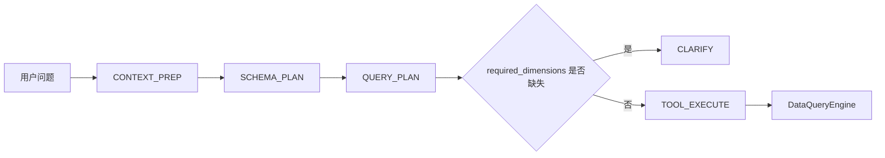
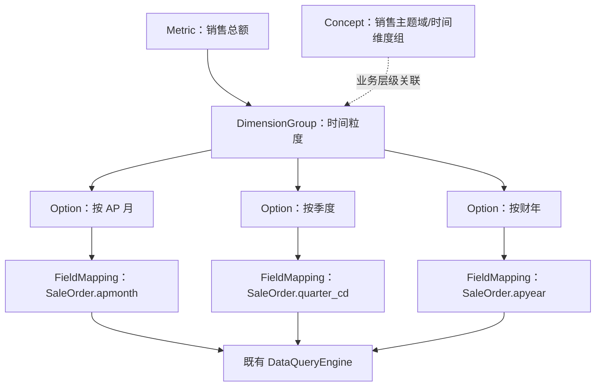
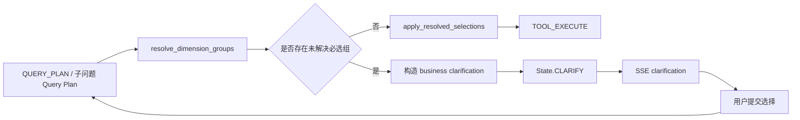

# ChatBI 分析维度组管理与 ClarifyAgent 集成可行性报告

> **日期**：2026-07-14  
> **依据**：
> - 《ChatBI 维度抽象澄清与 Concept 深度追因分析技术方案报告_0713》
> - 《ChatBI 维度抽象澄清与 Concept 深度追因分析技术方案报告(DP)_0713》
> - 《ChatBI_Dimension_Clarity_Concept_Analysis_Design_0713》
> **范围**：本报告优先落地“业务维度抽象 + ClarifyAgent 集成”；Concept 驱动归因作为后续复用该能力的扩展项。

---

## 1. 结论摘要

三份报告的核心判断一致：不应让指标和用户直接面对 `apmonth`、`quarter_cd` 等物理字段；应引入独立、可治理的**分析维度组（DimensionGroup）**，把“业务分析视角”与“可执行字段映射”分离。

结合当前 Chat V3 实现，建议采用以下可落地方案：

1. **DimensionGroup 是一级语义资产，不等同于 Concept。**  
   Concept 负责业务树、主题域和分析路径；DimensionGroup 负责选项、默认值、物理字段映射和执行解析。二者可通过 `concept_id` 关联，但不要把可执行映射塞入当前通用的 `concepts` 表。
2. **Metric 只引用维度组，不再将字段级 `required_dimensions` 作为主要治理入口。**  
   增加 `analysis_dimension_groups`；保留原字段作为迁移期兼容回退，避免一次性改动全部已有指标。
3. **ClarifyAgent 保持确定性，不引入 LLM 判断。**  
   在现有查询规划完成、执行前的统一拦截点，按“显式参数 → 意图解析 → 指标默认 → 维度组默认 → 发起澄清”的顺序决策；只有仍无法决策的必选维度组才向用户提问。
4. **维度组选择必须先解析为物理字段，查询引擎无需理解业务组 ID。**  
   新增服务端 `resolve_dimension_selection()`，在调用既有 `DataQueryEngine` 前产出 `dimensions`、`filters` 等现有参数，避免侵入 SQL 编译逻辑。
5. **采用“先管理、后澄清、再生成”的渐进路线。**  
   P0 完成持久化、管理接口、运行时 API 与 ClarifyAgent；P1 将组摘要加入检索和规划上下文；P2 才将 Concept 树用于归因分析和多级下钻。

这样能够同时解决用户体验、指标维护成本和未来归因分析的基础数据问题，且复用当前 Chat V3 的状态机和 SSE 契约，改造风险可控。

---

## 2. 当前实现与问题定位

### 2.1 当前链路

目前 Chat V3 的查询主路径为：



当前 `ClarifyAgent.find_missing_required_dimensions()` 仅将 `query_plan.dimensions` 与每个指标的 `required_dimensions` 作字段名比对。若缺失，`build_required_dimension_question()` 只对第一项物理字段生成问题，并通过时间字段名关键词推断“本期 / 上期 / 指定范围”等通用选项。

该逻辑的优点是确定、简单，且在单查询与 Plan-Execute 子问题中都由同一拦截函数调用；但存在以下不足：

| 问题 | 当前表现 | 影响 |
|---|---|---|
| 字段直接暴露 | “请确认 apmonth” | 用户和 LLM 需要理解实现细节 |
| 指标耦合字段 | 每个 Metric 配置 `required_dimensions` | 表字段变更需要批量改指标 |
| 无业务选项 | 由字段名关键词生成固定选项 | 无法表达“按 AP 月 / 季度 / 财年” |
| 无默认决策 | 所有缺失均进入澄清 | 对话被无谓打断 |
| 仅看 `dimensions` | 过滤条件、已解析选择尚未纳入完整语义 | 可能误判或无法复用选择结果 |
| Concept 未参与 | `concepts` 已载入运行时 schema，但未参与检索、规划或澄清 | 无法复用已有业务层级资产 |

### 2.2 可复用的既有集成点

不需要新建第二套对话流程。现有实现已具备适合的接入位置：

- `ChatEngineV3._handle_query_plan()`：单查询生成并校验 `query_plan` 后、构造执行参数前调用统一澄清拦截。
- `ChatEngineV3._execute_metric_subquestion()`：Plan-Execute 子问题走同一拦截，保证复杂问题与普通问题规则一致。
- `ChatEngineV3._prepare_required_dimension_clarification()`：当前唯一的“字段级必选维度”汇聚点，应升级为“维度组决策与澄清准备”入口。
- `State.CLARIFY` 和现有 SSE `clarification` 事件：可保留状态流转，只扩展 payload。
- `OntologyEngine`：已加载 `metrics`、`concepts`、`classes`，适合作为维度组读取、映射解析和可执行性校验的统一入口。

---

## 3. 目标架构与职责边界

### 3.1 三层模型



| 层级 | 资产 | 负责什么 | 不负责什么 |
|---|---|---|---|
| 业务组织层 | `Concept` | `subject_domain → dimension_group / fact_group → entity / kpi` 的层级、归因范围、下钻路径 | 物理字段和 SQL 选择 |
| 分析语义层 | `DimensionGroup` | 业务名、选项、必选性、默认策略、字段映射、可用范围 | 指标公式和数据查询 |
| 执行层 | Metric / Class / DataQueryEngine | 指标口径、Join、字段解析、SQL | 面向用户的维度措辞 |

**关键原则**：Concept 中的 `dimension_group` 仍可表示“区域”“品类”“时间”等业务节点；新增的执行型 `DimensionGroup` 用 `concept_id` 与之关联。这样既能支撑 ClarifyAgent，也能为后续 AnalysisAgent 提供稳定的“业务概念 → 可执行维度”桥梁。

### 3.2 推荐数据模型

建议新增四个模型，避免用自由格式 `dict` 承载关键治理规则：

```python
class FieldMapping(BaseModel):
    class_id: str
    field_name: str              # 逻辑字段名；由引擎转换为物理字段
    display_name: str = ""
    priority: int = 0
    availability_condition: dict = Field(default_factory=dict)

class DimensionOption(BaseModel):
    value: str                   # 稳定 option ID，例如 ap_month
    label: str                   # 业务展示，例如“按 AP 月（如 2026AP03）”
    mapping_refs: list[str] = Field(default_factory=list)
    is_default: bool = False
    aliases: list[str] = Field(default_factory=list)

class DimensionGroup(BaseModel):
    id: str
    name: str
    description: str = ""
    group_type: Literal["time", "categorical", "hierarchy"] = "categorical"
    concept_id: str | None = None
    field_mappings: list[FieldMapping] = Field(default_factory=list)
    options: list[DimensionOption] = Field(default_factory=list)
    is_required: bool = False
    default_option: str | None = None
    clarification_policy: Literal["auto_fill", "ask_when_ambiguous", "always_ask"] = "ask_when_ambiguous"
    status: Literal["draft", "approved", "deprecated"] = "draft"

class MetricDimensionBinding(BaseModel):
    group_id: str
    required: bool = False
    default_option: str | None = None
    allowed_options: list[str] = Field(default_factory=list)
```

`MetricOptimization` 推荐增加 `analysis_dimension_groups: list[MetricDimensionBinding]`。这比只保存 `list[str]` 更适合表达“同一全局组在不同指标下是否必选、默认什么粒度、允许哪些选项”。

### 3.3 配置示例

```json
{
  "id": "time_granularity",
  "name": "时间粒度",
  "group_type": "time",
  "concept_id": "sales_time_dimension",
  "is_required": true,
  "default_option": "ap_month",
  "clarification_policy": "auto_fill",
  "field_mappings": [
    {"class_id": "SaleOrder", "field_name": "apmonth", "display_name": "AP月", "priority": 10},
    {"class_id": "SaleOrder", "field_name": "quarter_cd", "display_name": "季度", "priority": 20},
    {"class_id": "SaleOrder", "field_name": "apyear", "display_name": "财年", "priority": 30}
  ],
  "options": [
    {"value": "ap_month", "label": "按 AP 月（如 2026AP03）", "mapping_refs": ["SaleOrder.apmonth"], "is_default": true, "aliases": ["按月", "本月", "上月", "环比"]},
    {"value": "quarter", "label": "按季度（如 2026Q1）", "mapping_refs": ["SaleOrder.quarter_cd"], "aliases": ["季度", "本季度"]},
    {"value": "fiscal_year", "label": "按财年（如 2026）", "mapping_refs": ["SaleOrder.apyear"], "aliases": ["财年", "年度", "今年"]}
  ]
}
```

指标绑定示例：

```json
{
  "id": "total_sales",
  "name": "销售总额",
  "analysis_dimension_groups": [
    {
      "group_id": "time_granularity",
      "required": true,
      "default_option": "ap_month",
      "allowed_options": ["ap_month", "quarter", "fiscal_year"]
    },
    {
      "group_id": "region",
      "required": false
    }
  ],
  "dimensions": ["apmonth", "quarter_cd", "apyear"]
}
```

迁移期内继续保留 `dimensions`：它仍是查询引擎允许的字段白名单；`required_dimensions` 仅作未迁移指标的兼容回退，不再作为新建指标的主配置。

---

## 4. 维度组如何管理与维护

### 4.1 持久化建议

建议新增独立的、按 `scenario_id` 隔离的数据表，而不是把 JSON 大字段写进 Metric 或 Concept：

| 表 | 关键字段 | 用途 |
|---|---|---|
| `dimension_groups` | `id, scenario_id, name, group_type, concept_id, is_required, default_option, clarification_policy, status, version` | 维度组主数据及生命周期 |
| `dimension_group_options` | `group_id, value, label, is_default, aliases, sort_order, status` | 面向用户的业务选项 |
| `dimension_field_mappings` | `group_id, option_value, class_id, field_name, display_name, priority, availability_condition` | 选项到可执行字段的多表映射 |
| `metric_dimension_bindings` | `metric_id, group_id, required, default_option, allowed_options` | 指标与维度组的关系 |

若第一期需要快速验证，可先将组配置存为 scenario schema 中的 `dimension_groups` 段；但必须由 `OntologyEngine` 统一加载，且预留独立表迁移路径。由于当前运行时是数据库优先，生产方案应直接采用独立表，避免只改静态 `schema.json` 而运行时不可用。

### 4.2 管理工作台能力

管理端需要新增“分析维度组”配置页或在 Schema 管理中增加专属 tab，至少支持：

1. **创建与编辑**：名称、说明、类型、Concept 关联、必选性、默认策略。
2. **选项维护**：业务标签、同义词、推荐标识、排序、启停；`value` 一经发布不可随意变更。
3. **字段映射维护**：按 Class 绑定逻辑字段，展示字段类型、数据样例、字段有效性和优先级。
4. **指标绑定**：显示被哪些 Metric 使用；配置“该指标必选 / 覆盖默认值 / 允许选项”。
5. **影响分析**：字段、选项或组变更前，列出受影响指标、澄清规则和 Concept 归因路径。
6. **审批与版本**：`draft → approved → deprecated`；仅 `approved` 资产进入 Chat V3 运行时。已发布组选项不得删除，应停用并保留历史解析能力。
7. **预览与回放**：输入示例问题，展示“识别到的选项、自动填充结果、是否触发澄清、最终解析字段”。

### 4.3 维护规范

- **命名稳定**：`group_id`、`option.value` 为机器稳定 ID；中文名称和标签可修改。不得把物理字段名直接作为 option ID。
- **映射可验证**：每一条映射必须引用已审核的 Class 和逻辑字段；映射字段必须属于该 Metric 的可执行 Join 范围或明确声明可达路径。
- **最小必选原则**：只有不指定就会改变指标口径、时间窗口或结果解释的组标记为 `required`。区域、品类等仅在用户明确要求分组或筛选时才需补充，避免过度澄清。
- **默认可解释**：所有 `auto_fill` 产生的默认选择必须写入计划元数据，并在最终回答中可披露，例如“已按默认 AP 月聚合”。
- **跨指标合并**：同一查询涉及多个 Metric 时，对同一个 `group_id` 合并为一个问题；若默认值或允许选项冲突，必须升级为澄清，不能静默任选。
- **数据驱动的维护**：记录解析命中率、自动填充后用户修改率、澄清放弃率和字段映射失败率；将高频手工修正转为别名、默认规则或映射修复。

---

## 5. ClarifyAgent 集成方案

### 5.1 职责调整

ClarifyAgent 的职责应从“发现缺失字段”调整为“解析并解决指标所需的业务维度组”。它仍是确定性策略组件：

- 输入：`query_plan`、用户原问题、已选 Metric、`OntologyEngine`、会话中已有维度选择。
- 输出：
  - `resolved_selections`：已决定的组、选项、字段、来源；
  - `unresolved_groups`：确实需要问用户的组；
  - `clarification`：前端可直接渲染的业务问题；
  - `audit`：每项选择的决策依据。

建议新增以下方法：

```python
class ClarifyAgent:
    def resolve_dimension_groups(
        self,
        query_plan: dict,
        user_message: str,
        ontology_engine,
        session_selections: dict[str, dict],
    ) -> DimensionResolution:
        ...

    def build_dimension_group_question(
        self,
        unresolved_groups: list[dict],
    ) -> dict:
        ...
```

原 `find_missing_required_dimensions()` 保留为兼容函数：仅当 Metric 没有 `analysis_dimension_groups` 绑定时，继续走旧字段级检查。

### 5.2 决策优先级

对每个“本次 Metric 集合要求的维度组”，按以下顺序处理：

1. **计划已显式覆盖**：`query_plan.dimensions` 或 `filters` 中已出现该组任一映射字段，反向识别为对应 option。
2. **会话中已选择**：用户刚刚回答过该组，且选项对当前所有 Metric 都可用时复用。
3. **用户语义匹配**：基于 option 的 `aliases`、时间解析器和业务词典确定选项。示例：“本季度”命中 `quarter`；“今年”命中 `fiscal_year`。
4. **指标级默认**：若各 Metric 对该组给出的默认选项一致，采用该默认。
5. **维度组默认**：在允许的 `clarification_policy` 下使用 `DimensionGroup.default_option`。
6. **发起澄清**：仅对仍未解决且 `required=True` 的组生成业务问题。
7. **旧字段回退**：未绑定组的老 Metric 使用原有 `required_dimensions` 逻辑，保障迁移期间不中断。

在任何一步，如果多个候选 option 同时命中、跨指标默认冲突、映射不可达或字段已废弃，应停止自动填充并要求澄清或返回受控错误。

### 5.3 解析与执行的边界

ClarifyAgent 不直接改写 SQL；由 `OntologyEngine` 负责把选择解析为当前查询范围可执行的字段：

```python
resolved = engine.resolve_dimension_selection(
    group_id="time_granularity",
    option_value="quarter",
    target_class=query_scope["target_class"],
    join_classes=query_scope["join_classes"],
    metric_ids=query_plan["metrics"],
)
# 结果：{"field": "quarter_cd", "class_id": "SaleOrder", "option_value": "quarter"}
```

随后一个纯函数将结果补入既有 `query_plan`：

- 分析粒度选择：追加到 `dimensions`；
- 时间范围 / 成员选择：构造到 `filters`；
- 选择记录：写入 `query_plan.dimension_selections`，供审计和回答说明；
- 最终传给 `DataQueryEngine` 的仍是既有字段和过滤条件。

因此，SQL 执行器、Join 求解和指标公式都不需要认识 `DimensionGroup`。

### 5.4 现有状态机的最小改造



最小改造建议：

1. 将 `_prepare_required_dimension_clarification()` 更名为 `_prepare_dimension_group_resolution()`。
2. 在该函数内部先调用新 `ClarifyAgent.resolve_dimension_groups()`；无未解决组时把解析结果回写 `state.query_plan` 并继续执行。
3. 有未解决组时写入 `state.clarification` 和新的 `state.missing_dimension_groups`，返回 `State.CLARIFY`。
4. 继续由现有 `_handle_clarify()` 派发 SSE，日志字段从 `field` 改为 `group_id`；兼容期同时保留 `field`（若可确定）。
5. 单查询与 `_execute_metric_subquestion()` 已使用同一准备函数，因此不应分别实现两套逻辑。

### 5.5 SSE 契约

建议以兼容扩展方式发布，而不是直接移除旧字段：

```json
{
  "type": "clarification",
  "query_id": "...",
  "data": {
    "version": 2,
    "reason": "missing_dimension_groups",
    "question": "为保证销售总额的统计口径一致，请选择时间粒度。",
    "questions": [
      {
        "group_id": "time_granularity",
        "group_name": "时间粒度",
        "group_type": "time",
        "metric_ids": ["total_sales"],
        "required": true,
        "options": [
          {"value": "ap_month", "label": "按 AP 月（如 2026AP03）", "is_default": true},
          {"value": "quarter", "label": "按季度（如 2026Q1）", "is_default": false},
          {"value": "fiscal_year", "label": "按财年（如 2026）", "is_default": false}
        ]
      }
    ],
    "multi_select": false
  }
}
```

前端提交建议使用稳定 ID，而非中文 label 或字段名：

```json
{
  "clarification_answers": [
    {"group_id": "time_granularity", "option_value": "quarter"}
  ]
}
```

后端校验 `group_id`、`option_value` 是否仍为当前指标集合允许的已批准选项，再调用解析器。不得信任客户端回传的物理字段。

---

## 6. 关键业务场景与预期行为

| 用户问题 | 解析结果 | 是否澄清 | 预期行为 |
|---|---|---|---|
| “销售额是多少？” | 未显式时间；Metric 默认 `ap_month` | 否 | 按默认 AP 月执行，并在结果说明默认口径 |
| “本季度销售额是多少？” | 命中 `time_granularity=quarter` | 否 | 解析为 `quarter_cd` 并补全本季度过滤 |
| “销售额按月还是季度看？” | 同时表达多个候选，未明确选择 | 是 | 询问“时间粒度”，展示月/季/财年业务标签 |
| “华东区今年销售额” | `region` 与 `fiscal_year` 均命中 | 否 | region 作为筛选、财年作为时间选项解析 |
| “销售额和订单数”且两个指标时间默认冲突 | 合并后无唯一默认 | 是 | 只问一次“时间粒度”，选项为交集 |
| 老指标未迁移组绑定 | 无 `analysis_dimension_groups` | 视旧配置 | 使用原字段级逻辑，保障兼容 |
| 映射字段不在可达 Join 范围 | option 不能执行 | 是/报错 | 不自动选择；配置错误记录审计并阻止执行 |

---

## 7. 落地计划

### P0：语义资产与运行时基础（建议 1–2 周）

1. 定义 `DimensionGroup`、`DimensionOption`、`FieldMapping`、`MetricDimensionBinding` Pydantic 模型。
2. 增加数据库迁移、CRUD、审批状态和审计字段。
3. 扩展 `OntologyEngine`：
   - `get_dimension_group(group_id)`；
   - `list_dimension_groups(metric_ids, class_ids)`；
   - `resolve_dimension_selection(...)`；
   - 资产有效性、Class/字段/选项可达性校验。
4. 给高频时间指标配置首批 `time_granularity`，并完成旧字段与组选项的映射清单。
5. 保留 `required_dimensions`，不做破坏性删除。

**验收标准**：可在管理端维护一个审批通过的时间粒度组；引擎能按目标 Class 稳定解析 `ap_month / quarter / fiscal_year` 到字段。

### P1：ClarifyAgent 集成（建议 1 周）

1. 以 `resolve_dimension_groups()` 替换当前字段比较主逻辑。
2. 实现“显式计划、会话答案、语义匹配、指标默认、组默认、澄清、旧字段回退”的优先级。
3. 扩展 `AgentState` 的组解析审计信息和 SSE v2 payload。
4. 前端渲染 `questions[]`，并按 `group_id + option_value` 回传答案。
5. 在单查询和 Plan-Execute 子问题上执行同一组解析函数。

**验收标准**：上述第 6 节的七类核心场景均可自动化回归；用户不会再看到 `apmonth` 作为主问题文本。

### P2：检索、规划与运营闭环（建议 1–2 周）

1. SchemaRetriever 按候选 Metric 和 Class 返回精简的维度组上下文。
2. 查询规划提示词要求 LLM 输出业务选择引用或至少优先使用已识别的组选项；服务端仍做最终解析与校验。
3. 管理端支持影响分析、使用统计和预览回放。
4. 收集默认覆盖率、澄清率、澄清完成率、用户修正率和映射失败率，优化同义词与默认规则。

**验收标准**：默认填充可解释、可审计；组配置的变更可定位影响到具体指标和会话。

### P3：复用到 Concept 驱动归因（后续）

在 P0/P1 数据模型稳定后，再实现 AnalysisAgent：

1. 从目标 Metric 找到绑定组，再通过 `concept_id` 定位所属 `subject_domain`。
2. 仅选择同一主题域下、已批准且可解析为 Join 可达字段的维度组作为归因候选。
3. 按当前期 / 对比期生成多路子查询，复用 Plan-Execute 的预算、去重、SSE 进度和证据账本。
4. 用贡献度结果形成归因报告；不要把“归因”误称为严格因果，输出应标注为数据驱动的贡献拆解。

---

## 8. 风险、约束与控制措施

| 风险 | 说明 | 控制措施 |
|---|---|---|
| 维度组与 Concept 混用 | 把执行映射写进树节点会使模型含义模糊、难校验 | 分层建模，以 `concept_id` 关联 |
| 默认值掩盖用户意图 | 无时间条件时静默按月可能与用户预期不一致 | 仅对 `auto_fill` 组启用；记录来源；答案披露；允许用户一键改选 |
| 多指标冲突 | 两个 Metric 对同组支持范围或默认不同 | 取交集；无唯一解时只问一个合并问题 |
| 多表字段不可达 | 同名维度在不同 Class 的映射可能无法 Join | 解析器必须验证目标 Class、Join 路径和字段状态 |
| 配置质量不足 | LLM 抽取的映射可能不真实 | 草稿/审批流程、资产校验、数据样例预览和回归测试 |
| 前端协议升级 | 原页面只支持单字段 `field` | SSE versioning；保留兼容字段；灰度切换 |
| 澄清过多 | 所有组都标必选会降低会话完成率 | 最小必选原则，优先自动解析和默认填充 |

---

## 9. 测试清单

必须新增自动化测试，至少覆盖：

1. 计划中已选映射字段时，必选组被正确视为已满足。
2. `filters` 中的映射字段也能满足相应组。
3. 用户说“本季度 / 环比 / 今年”时，解析为正确时间 option。
4. 指标默认与组默认的优先级正确，且写入审计来源。
5. 两个 Metric 共享同组时只生成一个问题。
6. 两个 Metric 默认冲突或选项无交集时，不能自动填充。
7. 映射字段不存在、未审批或 Join 不可达时，解析失败且不执行查询。
8. 老 Metric 未绑定维度组时，字段级 `required_dimensions` 回退仍可用。
9. 单查询和 Plan-Execute 子问题经过同一行为验证。
10. SSE v2 能被前端正确渲染并将 `group_id + option_value` 回传；非法 option 被拒绝。

---

## 10. 最终建议

建议立即启动 P0 与 P1，但限定首批范围为**时间粒度维度组**和一批高频销售指标。时间维度的业务收益最高、字段映射最清晰，也能验证“默认填充 + 业务级澄清 + 后端解析”的完整闭环。

实施时应坚持以下边界：

- 管理资产与运行时解析由后端确定性逻辑负责；
- LLM 只辅助识别用户语义与生成查询计划，不能绕过维度组校验；
- Concept 用于组织和发现，DimensionGroup 用于执行和交互；
- 先保持现有执行引擎的字段契约，再逐步扩展智能分析能力。

该方案以较小的状态机改动，建立可复用的语义维度治理层；后续无论是 ClarifyAgent、趋势分析、对比分析还是 Concept 驱动归因，都将使用同一套受治理的维度资产。
