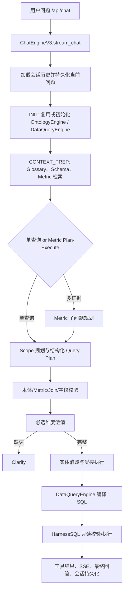
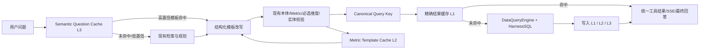

# ChatEngineV3 Cache 服务设计：语义复用、Metric 模板改写与受控 SQL 执行

> 状态：方案设计（未实施）  
> 日期：2026-07-15  
> 范围：`/api/chat` 所使用的 `ChatEngineV3`、本体 Metric 查询、Plan-Execute 多证据查询

## 1. 结论摘要

当前 ChatEngineV3 具备 Schema/Metric 检索、结构化查询计划校验、实体消歧、受控 SQL 编译及只读 SQL Harness 等关键能力，但没有面向查询结果、查询模板或语义相似问题的缓存服务。

推荐新增一个**以结构化查询计划为核心**的 Cache 服务，采用“三层复用”策略：

1. **L1：精确结果缓存（Result Cache）**  
   仅当当前请求在完成最新的计划校验、必选维度检查、实体值标准化后，与已缓存的受控结构化查询完全一致时，直接复用已缓存结果；不重新执行 SQL。
2. **L2：Metric 查询模板缓存（Metric Template Cache）**  
   当命中相同 Metric（含 V2 输出）但时间、筛选、维度或排序不同，复用已验证的查询模板/结构化参数骨架，补齐或改写可变槽位后，重新经过现有校验与 SQL 编译执行。
3. **L3：语义问题缓存（Semantic Question Cache）**  
   对相同或高度相似的问题，复用“意图 + Metric + 结构化查询模板”，而不是直接复用原始 SQL 或原始结果。高置信度且最终结构化参数一致时才降级为 L1 直接结果命中；否则走受约束改写。

**不建议将原始 SQL 作为主要缓存和改写对象。** SQL 是在本体、字段映射、关系、连接和数据源上下文下生成的派生物；安全、可审计且更稳定的复用对象应是**已验证的结构化查询参数**。如果因性能需要保留 SQL，只应作为诊断和二次校验材料，不能绕过 `DataQueryEngine`、`HarnessSQL`、实体消歧、权限与新鲜度检查。

---

## 2. 现状分析

### 2.1 ChatEngineV3 当前查询链路



已验证的关键事实：

- `stream_chat()` 会加载历史消息、持久化当前用户问题，并驱动状态机；历史会改变追问语义，因此不能只基于孤立文本跨会话命中缓存。
- `init_prompt()` 按场景缓存 `OntologyEngine`、`DataQueryEngine` 和系统提示词；这是**运行时元数据/连接缓存**，不是查询结果缓存。
- 单查询和 Plan-Execute 都会在执行前产生结构化参数：`target_class`、`join_classes`、`metrics`、`dimensions`、`filters`、`having`、`order_by`。
- Plan-Execute 已有请求内 `_metric_query_fingerprint()`，用于跳过同一轮中结构化参数完全重复的子问题，但不会跨请求复用结果。
- `DataQueryEngine` 从受治理的 Class、Metric 和关系定义编译 SQL；`HarnessSQL` 限制只读 `SELECT`/`WITH`，拒绝多语句及 DDL/DML，并使用 `EXPLAIN` 校验。
- 会话表保存了 `answer_datasets`、`steps` 和已生成 SQL，但缺少缓存键、版本、新鲜度、授权范围、TTL 和失效状态，不宜直接作为缓存表。

### 2.2 已有缓存与缺口

| 能力 | 现状 | 是否满足查询缓存 |
|---|---|---|
| OntologyEngine | 按场景进程内复用 | 否，仅避免反复加载本体 |
| DataQueryEngine | 按场景进程内复用 | 否，仅复用连接和表元数据 |
| 表字段/表名 | `DataQueryEngine` 内存缓存 | 否，仅减少元数据查询 |
| 实体候选 | 预处理过程内短暂缓存 | 否，无法跨请求共享 |
| Plan-Execute 重复查询 | 单请求内 fingerprint 去重 | 部分满足，不跨请求 |
| 对话消息 | 持久化 SQL、结果与步骤 | 否，缺版本和安全边界 |
| 语义问题缓存 | 不存在 | 缺失 |
| 结构化模板缓存 | 不存在 | 缺失 |
| 查询结果缓存 | 不存在 | 缺失 |
| 数据/本体变更失效 | `reset_engine()` 只清理引擎/提示词 | 缺失 |

另外，`SSE_CACHE_TTL_SECONDS` 已定义但当前未被 `ChatEngineV3` 使用，不能视为已具备 SSE 或查询结果缓存。

---

## 3. 对问题 1 的回答：相同或近似用户问题能否直接走 Cache？

### 3.1 相同问题：可以，但“问题文本相同”不是充分条件

相同文本可以作为候选命中条件，但只有下列上下文都一致或经过重新校验后一致，才能直接复用结果：

- 场景、租户、用户数据权限/行级权限范围；
- 数据连接及数据快照版本；
- Schema、关系、Metric、维度组定义版本；
- 当前解析的相对时间锚点，例如“本月”“上周”“去年同期”；
- 目标类、Join 路径、Metric（包括 V2 选择的输出）、维度、筛选、HAVING、排序；
- 实体消歧后的标准值，例如“江苏”最终对应的物理枚举值；
- 会话上下文。比如“那上个月呢”必须与上一轮所指 Metric/筛选绑定。

因此正确顺序为：

```text
原问题/语义命中
  → 使用候选模板
  → 按当前上下文解析相对时间、实体与省略信息
  → 运行现有 Scope / Metric / 必选维度 校验
  → 形成 canonical structured query
  → 查询 L1 精确结果缓存
  → 命中才跳过 SQL 执行
```

不能在刚收到相同问题文本时就直接返回旧结果。

### 3.2 非常近似问题：应采用“结构化改写”，不是原始 SQL 改写

示例：

| 历史问题 | 新问题 | 合理复用方式 |
|---|---|---|
| 查询江苏本月销售额 | 查询浙江本月销售额 | 复用 Metric/维度/时间模板，仅替换地区实体槽位 |
| 查询江苏本月销售额 | 查询江苏上月销售额 | 复用模板，重新解析时间槽位 |
| 查询江苏本月销售额 | 按省份看本月销售额 | 复用 Metric 和时间，改变投影维度，重新执行 |
| 查询销售额 | 为什么销售额下降 | 不直接复用；可能切换到 Plan-Execute，需要归因证据 |

推荐把“改写”限定为受控的结构化槽位填充：

```json
{
  "target_class": "MainHospitalInfoMonthlyStats",
  "metrics": ["actual_sales_amount"],
  "dimensions": ["province_name"],
  "filters": [
    {"field": "province_name", "operator": "=", "value": "${region}"},
    {"field": "ap_month", "operator": "=", "value": "${period}"}
  ],
  "having": [],
  "order_by": ""
}
```

- `${region}`、`${period}` 是模板显式声明的可变槽位。
- 新问题只允许更新白名单槽位；不得让模型编辑原始 SQL 字符串。
- 修改后必须调用现有的 `OntologyAgent` 校验、`ClarifyAgent`、`EntityDisambiguatorAgent`、`DataQueryEngine` 和 `HarnessSQL`。

### 3.3 是否可以直接执行旧 SQL？

仅在极严格的受控条件下可以作为**优化实现细节**，不应作为主策略：

1. 先由结构化参数的规范键确认是 L1 精确命中；
2. Schema/Metric/关系/数据连接/数据版本/授权范围完全一致；
3. SQL 仍通过 `HarnessSQL` 只读校验；
4. 旧 SQL 只作为对应结构化计划的可复用编译产物，不接受模型或用户文本改写；
5. 对支持数据快照版本的数据源，版本必须一致；对未知新鲜度的数据源，仅允许短 TTL。

即使满足这些条件，直接返回**缓存结果**通常比重新执行旧 SQL 更有价值；重执行 SQL 并不能消除数据变更风险。

---

## 4. 对问题 2 的回答：同一 Metric 能否复用和改写？

可以。Metric 是最稳定的复用锚点之一，但“同一 Metric”只能说明**计算口径相同**，不能说明查询结果相同。

### 4.1 必须进入 Metric 签名的内容

Metric 签名至少应包括：

- 父 Metric ID；
- V2 Metric 的 output ID/output name；
- `definition` 内容哈希，包括输入来源 Class、字段、固定过滤、聚合、表达式、`offset`；
- `anchor_class` 与源 Class；
- 关联的必选维度与维度组；
- Metric 所在场景、本体版本。

同一 Metric 以下维度不同，不能直接复用 L1 结果：

- 时间范围；
- 查询维度/聚合粒度；
- 用户筛选条件；
- HAVING、排序、比较基准；
- 输出选择（特别是 V2 并列输出）；
- 数据权限或数据连接；
- 当前数据快照。

### 4.2 同 Metric 的三种命中级别

| 命中级别 | 条件 | 行为 |
|---|---|---|
| 精确结果命中 | Metric 签名 + canonical query + 版本/权限/新鲜度完全一致 | 返回 L1 缓存结果 |
| 模板命中 | Metric 签名一致，但时间/筛选/维度等槽位不同 | 复用模板并改写结构化参数，重新校验和执行 |
| 仅 Metric 候选命中 | 只识别同 Metric，业务意图仍不充分或涉及归因/对比 | 作为规划提示；重新做路由、澄清和计划 |

### 4.3 推荐的改写边界

**可以改写的槽位：**

- 时间条件；
- 地域、产品、客户等实体筛选；
- 允许的维度投影；
- 排序方向与数量限制；
- 已定义的 V2 输出选择。

**不能自动改写的内容：**

- Metric 的计算定义、固定 KPI 过滤、输入字段、聚合方式；
- 关系 Join 键；
- 新增未被模板定义的跨表路径；
- 由“查询”升级到“为什么/归因/诊断”的执行模式；
- 超过权限范围的类、字段或实体。

---

## 5. 推荐架构



### 5.1 服务职责

建议新增 `QueryCacheService`，不把缓存逻辑分散到 Engine、ToolExecutor 和 DataQueryEngine：

```text
core/ontology/query_cache.py
  - canonicalize_query_arguments()
  - build_query_result_key()
  - build_metric_signature()
  - lookup_result()
  - store_result()
  - lookup_metric_template()
  - store_metric_template()
  - lookup_semantic_template()
  - store_semantic_template()
  - invalidate_scenario()
  - invalidate_by_metric()
```

职责分层：

| 组件 | 应承担职责 |
|---|---|
| `ChatEngineV3` | 在正确状态点查询/写入缓存；发出可观测事件 |
| `QueryCacheService` | 键规范化、命中策略、TTL、版本验证、存取、失效 |
| `OntologyAgent` | 继续做 Scope/Metric/字段/Join 校验 |
| `ClarifyAgent` | 继续做必选维度澄清，缓存不能绕过 |
| `EntityDisambiguatorAgent` | 继续解析实体标准值，缓存键使用解析后的值 |
| `DataQueryEngine` | 继续基于治理模型编译 SQL |
| `HarnessSQL` | 继续执行只读与 SQL 安全校验 |

### 5.2 推荐存储模型

第一期可放在现有业务数据库中；如未来多节点部署或高并发，再替换为 Redis + PostgreSQL/对象存储，应用层接口保持不变。

#### `query_cache_entries`

```sql
CREATE TABLE query_cache_entries (
    cache_key TEXT PRIMARY KEY,
    scenario_id TEXT NOT NULL,
    cache_kind TEXT NOT NULL,              -- result | metric_template | semantic_template
    auth_scope_hash TEXT NOT NULL,
    ontology_revision TEXT NOT NULL,
    data_revision TEXT NOT NULL,
    connection_fingerprint TEXT NOT NULL,
    metric_signature TEXT DEFAULT '',
    question_fingerprint TEXT DEFAULT '',
    semantic_embedding TEXT DEFAULT '',    -- 首期可为空
    canonical_arguments TEXT NOT NULL,
    template_slots TEXT DEFAULT '[]',
    compiled_sql TEXT DEFAULT '',
    result_payload TEXT DEFAULT '',
    result_summary TEXT DEFAULT '',
    row_count INTEGER DEFAULT 0,
    provenance TEXT DEFAULT '{}',
    created_at TIMESTAMP DEFAULT CURRENT_TIMESTAMP,
    expires_at TIMESTAMP NOT NULL,
    last_hit_at TIMESTAMP DEFAULT CURRENT_TIMESTAMP,
    hit_count INTEGER DEFAULT 0
);

CREATE INDEX idx_query_cache_lookup
  ON query_cache_entries (scenario_id, cache_kind, metric_signature, expires_at);
CREATE INDEX idx_query_cache_question
  ON query_cache_entries (scenario_id, question_fingerprint, expires_at);
```

#### `scenario_cache_revisions`

```sql
CREATE TABLE scenario_cache_revisions (
    scenario_id TEXT PRIMARY KEY,
    ontology_revision TEXT NOT NULL,
    data_revision TEXT NOT NULL,
    policy_revision TEXT NOT NULL DEFAULT '1',
    updated_at TIMESTAMP DEFAULT CURRENT_TIMESTAMP
);
```

**建议：**

- `canonical_arguments`、`result_payload` 保存 JSON；
- `compiled_sql` 只用于审计和诊断，不用于语义改写；
- `auth_scope_hash` 必须存在，避免跨用户/跨角色泄露；
- 大结果集不直接存数据库字段：可只存前 N 行、聚合结果，或存对象存储引用；
- 为每条缓存保存 `provenance`，标记生成版本、是否实体消歧、SQL Harness 状态、命中来源。

### 5.3 Canonical Query Key

L1 的 key 不能直接使用用户原问题，应使用完成校验后的不可变对象：

```json
{
  "scenario_id": "pfizer",
  "auth_scope_hash": "sha256(...) ",
  "ontology_revision": "ontology:42",
  "data_revision": "data:2026-07-15T10:00:00Z",
  "connection_fingerprint": "sha256(connection-id + database + schema)",
  "query": {
    "target_class": "MainHospitalInfoMonthlyStats",
    "join_classes": ["..."],
    "metrics": ["monthly_sales", "monthly_sales:actual"],
    "dimensions": ["province_name"],
    "filters": [{"field": "ap_month", "operator": "=", "value": "2026-07"}],
    "having": [],
    "order_by": "monthly_sales DESC"
  }
}
```

使用稳定 JSON 序列化（键排序、数组按语义规则排序、标准化空值和操作符大小写）后再 SHA-256。

以下内容必须规范化：

- Metric 引用必须解析为父 Metric ID + V2 output ID；
- 字段必须解析为实际受治理名称；
- `IN`/`NOT IN` 值集合按稳定顺序排序；
- 空列表、缺失字段和默认值统一表达；
- 相对时间必须解析为绝对范围再参与 key；
- 实体别名必须转为消歧后的标准值；
- 多表 Join 类应按稳定顺序表达，但不可丢失 Join 路径语义。

### 5.4 Semantic Cache 的匹配流程

第一期不要求立即接入向量数据库，可以先采用两段式策略：

1. **精确问题规范化匹配**：大小写、空白、全半角、同义词规范化后计算 hash；
2. **候选检索 + LLM/规则复核**：在同一场景、权限、版本范围内按词项/embedding 取 Top-K；只将其用作模板候选；
3. **语义等价判定**：要求相同的意图类型、Metric 集合、比较语义、时间解析策略；
4. **当前请求重放校验**：必须重新生成当前 canonical arguments；
5. **只有 canonical key 相同才命中 L1**，否则进入模板改写并执行。

建议阈值分级：

| 等级 | 参考阈值 | 行为 |
|---|---:|---|
| Exact | 规范化 question hash 相同 | 直接尝试 L1 |
| High | 语义相似度 ≥ 0.95 且意图/Metric/时间类型一致 | 使用模板候选，仍重放校验 |
| Medium | 0.85–0.95 | 向规划器提供候选模板，不自动复用 |
| Low | < 0.85 | 不使用缓存模板 |

阈值必须用真实问题集离线评估，不应直接视为生产最终参数。

---

## 6. ChatEngineV3 集成点

### 6.1 L1 精确结果缓存

#### 单查询路径

在 `_execute_validated_query_plan()` 内，`executor.execute("query_ontology_data", ...)` 前插入：

```python
canonical = cache_service.canonicalize(
    arguments=arguments,
    scenario_id=state.agent_id,
    auth_scope=auth_scope,
    ontology_revision=revisions.ontology,
    data_revision=revisions.data,
    connection_fingerprint=connection_fingerprint,
)
hit = cache_service.lookup_result(canonical)
if hit:
    result = hit.result_payload
    cache_hit_type = "exact_result"
else:
    result = await executor.execute("query_ontology_data", arguments, query_engine, engine)
    cache_service.store_result(canonical, result, ttl_seconds=ttl_for(arguments))
    cache_hit_type = "miss"
```

但记录工具步骤和 SSE 的逻辑不能分叉：命中与未命中均必须写入 `state.tool_call_records`、`state.all_tool_results` 和 `state.sse_events`，其中增加：

```json
"cache": {
  "hit": true,
  "kind": "exact_result",
  "cache_key": "...",
  "created_at": "...",
  "expires_at": "..."
}
```

#### Plan-Execute 子问题路径

在子问题已经完成 `query_validation`、构建 `arguments`、计算现有 `fingerprint` 后插入。不能在子问题规划阶段提前命中，因为子问题仍可能缺失必选维度或含不合法实体值。

### 6.2 L2 Metric 模板缓存

在 `plan_query_details` 完成并经过 `query_validation` 后：

1. 解析 `metric_signature`；
2. 查询同场景、同版本、同权限的模板；
3. 根据当前问题抽取允许改变的槽位；
4. 只对模板声明的槽位进行值替换；
5. 再次运行 `OntologyAgent` 校验和 `ClarifyAgent`；
6. 生成 canonical key 并查 L1；
7. 未命中时正常执行并回写模板使用统计。

### 6.3 L3 语义问题模板缓存

建议在 `_handle_context_prep()` 完成 glossary/Schema/Metric 检索后、执行模式路由和 LLM 规划前插入：

```text
当前检索上下文
  → semantic template candidate lookup
  → 候选与当前可用 Metric/Schema 交集校验
  → 若高置信：将模板作为“受约束规划候选”注入 planner
  → planner/validator 仍可拒绝或修正候选
```

不要在 `stream_chat()` 一开始直接短路返回，因为此时：

- 未建立当前会话上下文；
- 未解析相对时间；
- 未获取当前本体版本、数据版本和权限范围；
- 未完成实体消歧和必选维度检查。

---

## 7. TTL、新鲜度与失效设计

### 7.1 建议 TTL

| 缓存类型 | 建议 TTL | 原因 |
|---|---:|---|
| 精确聚合结果（历史封存数据） | 1–24 小时 | 取决于 ETL 更新频率 |
| 精确结果（实时/未知更新） | 1–5 分钟 | 优先正确性 |
| 含“今天/本周/本月/当前”等相对时间 | 1–5 分钟，并含绝对时间锚点 | 时间边界变化快 |
| Metric 模板 | 7–30 天，受本体版本失效 | 模板不含结果，稳定性较高 |
| 语义问题模板 | 7–30 天，受本体/词表版本失效 | 仅做规划加速 |
| Plan-Execute 子问题结果 | 与 L1 一致 | 仍是普通受控查询结果 |

### 7.2 强制失效事件

下列任一事件发生时，至少失效对应 `scenario_id` 的查询结果与模板：

- Schema Class/字段/物理映射更新；
- Relationship 或 Join key 更新；
- Metric、Metric definition、V2 output、维度组、必选维度更新；
- 词表/实体别名映射更新；
- 数据连接变更；
- ETL、CSV 替换、数据同步完成或数据快照更新；
- 行级权限/角色/数据策略变更；
- `reset_engine(scenario_id)` 调用。

建议为 `reset_engine()` 增加 `query_cache_service.invalidate_scenario(scenario_id)`，或更优地递增 `scenario_cache_revisions`；版本不一致即可自然失效，避免大规模物理删除。

---

## 8. 风险与控制措施

| 风险 | 控制措施 |
|---|---|
| 近似问题被错误视作等价 | 语义缓存只返回模板候选；最终以 canonical query key 决定结果命中 |
| SQL 注入或 SQL 改写失控 | 不做自然语言→SQL 文本改写；只改结构化白名单槽位，并继续走 HarnessSQL |
| Schema/Metric 改造后命中旧缓存 | 将本体版本、Metric definition hash 纳入 key，事件驱动失效 |
| 数据已变更但旧结果仍返回 | 数据版本/刷新时间纳入 key，按数据类型设置 TTL |
| 跨用户/租户数据泄露 | 将 `auth_scope_hash`、租户/场景作为 key 的强制部分；缓存查询前重新校验权限 |
| “本月/上周”语义过期 | 相对时间先落为绝对区间，纳入 canonical key，使用短 TTL |
| 大结果缓存内存/数据库膨胀 | 限制行数/字节数，聚合优先，使用对象存储引用或仅缓存结构化结果摘要 |
| 坏查询被缓存 | 仅缓存 Harness 成功、无 `error`、无不可信 Join 回退标记的结果 |
| 缓存命中后不可审计 | SSE、工具记录、会话 steps 写入 cache provenance 与命中类型 |

特别注意：若关系 Join 编译发生 `1=1` 回退或没有可验证连接键，结果不得提升为可跨请求复用的高可信缓存项。

---

## 9. 分阶段实施计划

### Phase 0：治理前置（必须先完成）

- 定义场景本体版本、数据版本、连接标识和授权范围哈希；
- 明确数据刷新通知点；
- 定义缓存结果大小上限和 TTL 默认值；
- 在工具步骤/SSE/审计日志中定义统一 `cache` 元数据结构。

### Phase 1：L1 精确结构化查询结果缓存

- 新增 `QueryCacheService` 和 `query_cache_entries`；
- 对单查询和 Plan-Execute 子问题在受控执行边界接入；
- 用现有 `_metric_query_fingerprint()` 作为初始参考，但扩展为带版本、权限和实体标准值的 canonical key；
- 只缓存成功且可信的结果；
- 实现 `reset_engine()` 对缓存版本的失效；
- 指标：命中率、P50/P95 延迟、节省 SQL 次数、缓存结果字节数、错误命中数（目标为 0）。

### Phase 2：L2 Metric 查询模板缓存

- 建立 Metric signature；
- 保存可变槽位和模板参数；
- 先支持时间、实体筛选和维度投影三类槽位；
- 所有改写仍回到现有 validator；
- 指标：模板复用率、改写后校验通过率、改写后执行成功率、澄清率变化。

### Phase 3：L3 语义问题缓存

- 引入 embedding 或可替换的语义检索接口；
- 建立高/中/低置信分级；
- 高置信仅用于模板候选，不默认直接给结果；
- 建立离线评测集，包括同义句、时间变化、实体变化、追问、否定、比较和归因问题；
- 指标：Top-1 模板正确率、错误候选率、缓存引入后的端到端正确率。

### Phase 4：运营化

- 增加缓存管理页面或管理 API：查看命中、手动失效、按场景失效、按 Metric 失效；
- 建立缓存灰度开关：`disabled` / `observe` / `template_only` / `result_enabled`；
- `observe` 模式只记录“若启用缓存是否会命中”，不改变响应，用于验证；
- 建立异常回退：任何缓存读取/反序列化/版本校验异常都回到现有无缓存链路。

---

## 10. 验收测试矩阵

| 测试类别 | 用例 | 预期 |
|---|---|---|
| 精确命中 | 同场景、同权限、同参数重复提问 | 第二次无 SQL 执行，结果一致，SSE 标注 `exact_result` |
| 近似问题 | 江苏→浙江 | 命中模板，实体替换后重新校验并执行，不直接返回江苏结果 |
| 时间改写 | 本月→上月 | 解析为不同绝对时间，L1 不命中，模板可复用 |
| 同 Metric 不同维度 | 总销售额→按省份销售额 | 结果缓存不命中，模板改写后执行 |
| 同 Metric V2 输出变化 | 50mg 输出→100mg 输出 | 必须视为不同 Metric output signature |
| 相对时间边界 | 月末前后“本月” | canonical key/TTL 变化，不能误用旧时间结果 |
| 本体变更 | 修改 Metric definition | 对应 Metric 缓存立即失效或版本不匹配 |
| 数据更新 | CSV/ETL 刷新 | 结果缓存失效；模板可保留 |
| 权限变化 | 两个角色访问同 Metric | 不共享结果缓存 |
| 必选维度 | 缺少必选时间维度 | 必须进入 Clarify，不允许缓存绕过 |
| SQL 安全 | 恶意文本/字段 | 不能写入/命中绕过 SQL Harness |
| Plan-Execute | 多子问题同参数 | 当前请求内去重仍生效，跨请求命中 L1 |
| 故障回退 | Cache 服务不可用 | 正常走当前无缓存查询路径 |

---

## 11. 最终建议

1. 先实现 L1 精确结构化查询结果缓存，收益高、风险最低；
2. 将“SQL 改写”替换为“**结构化查询模板改写**”作为设计原则；
3. 同 Metric 优先做 L2 模板缓存，而不是复用旧结果；
4. L3 语义缓存只作为受约束的规划加速器，不能绕过现有治理和安全链路；
5. 将版本、数据新鲜度、权限范围和实体标准化值视作缓存正确性的硬约束，而不是可选优化；
6. 首先以 `observe` 模式收集真实命中分布，再逐步开启模板复用和结果复用。

这样可以在不破坏 ChatEngineV3 当前“LLM 只规划、确定性组件校验与执行”的架构原则下，显著降低重复 LLM 规划和重复 SQL 执行成本，同时避免近似问题、数据变化和权限差异造成的错误复用。
