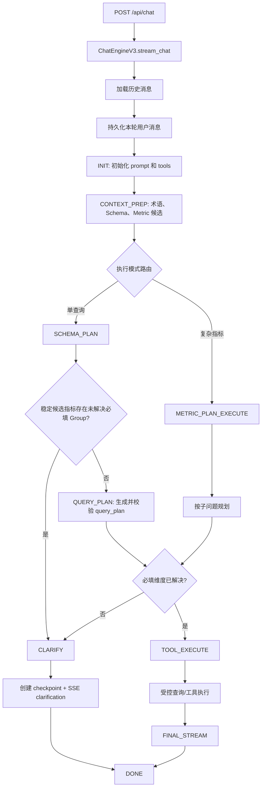
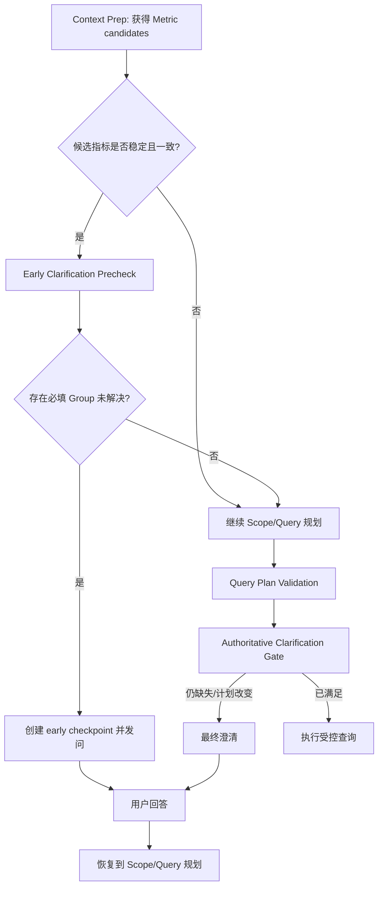

# Chat V3 问题澄清接口实现与前置优化评估报告

> 评估日期：2026-07-28  
> 范围：Chat V3 的 HTTP/SSE 接口、状态机、问题澄清、检查点续跑、会话历史及前端卡片交互。  
> 结论：当前“计划完成后、执行前”的澄清门禁能够保障口径正确性；可以前移，但不应直接把现有门禁搬到最早阶段。建议采用“候选指标稳定后的早期阻断 + 现有最终门禁保底”的两层方案。

## 实施状态（2026-07-28）

- 已实施单查询路径的两层门禁：Schema Scope 校验完成后进行早期门禁，Query Plan 校验完成后继续执行原有最终门禁。
- 早期门禁仅在候选指标的必填 Dimension Group 完全一致、所有批准选项都能映射到已验证 Scope、且当前文本/会话选择尚未解决时阻断。
- 早期 checkpoint 恢复后回到 `QUERY_PLAN`，不会使用尚未生成的查询计划直接执行；最终门禁仍会以实际命中指标再次校验。
- Complex Metric Plan-Execute 仍使用原有的子问题最终门禁，避免在子问题指标尚未稳定时进行误问；其聚合前置澄清作为后续优化项。

## 1. 执行摘要

`POST /api/chat` 是唯一的流式入口。接口接收会话、场景、自然语言问题和可选的澄清续跑参数，随后由 `ChatEngineV3` 驱动状态机：准备上下文、决定执行模式、规划查询范围、生成并校验查询计划、检查指标所需的 Dimension Group，最后才执行查询。

当前澄清是一个**确定性治理门禁**，而不是让 LLM 自由追问：

- 仅对查询计划中实际选中的指标生效；
- 仅检查已批准且绑定到指标的必填 Dimension Group；
- 时间类 Group 必须同时选择粒度并填写符合格式的期间；
- 未完成澄清时保存状态快照（checkpoint），通过 SSE 返回卡片；
- 用户选择后提交 checkpoint 与结构化答案，服务端原子领取 checkpoint 并从已验证计划续跑；
- 澄清题、已选项和输入值均会持久化在会话消息中，刷新页面后可恢复展示。

目前的核心缺口不在“是否可以澄清”，而在于：接口契约约束较弱、检查点的可观测性/过期策略不足、旧版 required-dimensions 兼容链路与新版 Dimension Group 链路并存，以及 Complex Metric Plan-Execute 尚未提供聚合式前置澄清。

---

## 2. 接口与调用链

### 2.1 HTTP 接口

| 项目 | 当前实现 |
| --- | --- |
| 路由 | `POST /api/chat` |
| 路由函数 | `chat_v3(req)` |
| 请求模型 | `ChatRequest` |
| 返回类型 | `text/event-stream; charset=utf-8` |
| 查询标识 | 路由层使用 `chat_<shortuuid>` 覆盖/补充 `query_id` |
| 引擎入口 | `ChatEngineV3().stream_chat(req)` |

实际应用已在 `main.py` 中注册该聊天路由。`views.py` 中“仅供本地调试、未注册”的注释与实际注册状态不一致，属于文档/注释漂移。

### 2.2 `ChatRequest` 关键字段

| 字段 | 用途 |
| --- | --- |
| `session_id` | 会话 ID，同时作为消息和 checkpoint 的归属标识 |
| `agent_id` | 场景/本体 ID；checkpoint 续跑时必须匹配 |
| `message` | 当前用户文本；澄清续跑时前端会传原始问题文本 |
| `language` | 前端浏览器语言 |
| `options.clarification_checkpoint_id` | 已保存澄清快照的 ID |
| `options.clarification_answers` | 结构化答案数组：`group_id`、`option_value`、`selection_value` |
| `options.clarification_display` | 用户消息历史中展示的文本，如“已确认维度条件，继续查询。” |

当前 `options` 是通用 `dict[str, Any]`，因此灵活但缺少 Pydantic 级字段校验、默认值和 OpenAPI 文档。

### 2.3 一次普通查询的状态机路径

复杂指标模式会逐个处理子问题。任一子问题发现必填维度未解决时标记为 `needs_clarification`，等待用户回答后只恢复该暂停子问题，已完成的证据账本不重复执行。

---

## 3. 当前问题澄清实现逻辑

### 3.1 触发位置

单查询模式有两层澄清门禁：

1. Schema Scope 校验完成后调用 `_prepare_early_dimension_group_clarification()`；仅在候选 Metric 的必填 Group 完全一致、全部批准选项均能映射到已验证 Scope、且当前文本/会话选择无法解析时提前发问。
2. `QUERY_PLAN` 已生成并校验后调用 `_prepare_required_dimension_clarification()`；该门禁以最终实际命中指标为准，仍是执行前的权威校验。

复杂指标模式在每个子问题的查询计划已生成并校验后调用同一方法。

单查询模式当前顺序是：

1. 已完成候选指标检索；
2. 已确定 Schema Scope；
3. 在满足严格准入条件时，提前确定缺少的治理维度并发问；
4. 用户回答后恢复至 `QUERY_PLAN`，生成并校验详细计划；
5. 再执行最终权威门禁；
6. **不会在缺少必填维度时执行查询。**

### 3.2 判定规则

`ClarifyAgent.resolve_dimension_groups()` 按以下顺序处理：

1. 从 `query_plan.metrics` 解析真正命中的指标；
2. 从指标 `dimension_group_ids` 取已绑定且已批准的 Dimension Group；
3. 仅保留 `is_required=true` 的 Group；
4. 依次尝试从 query plan 的 filter、当前 session 的答案、用户原始文本别名、允许自动填充的默认值中解析；
5. 若仍无法解析，则加入 `unresolved_groups`；
6. 若指标没有 Group 绑定，则走遗留的 `metric.required_dimensions` 检查。

时间 Group 有额外约束：不能仅靠文本别名或默认值推断；必须提交已批准的粒度（如 `month`）以及合法期间，例如月度为 `YYYYAPMM`、季度为 `YYYYQn`、年度为 `YYYY`。

### 3.3 澄清事件、检查点与续跑

当存在未解决维度时：

1. `_handle_clarify()` 调用 `_create_clarification_checkpoint()`；
2. 保存经过验证但尚未执行的关键 `AgentState` 字段到 `chat_clarification_checkpoints.state_json`；
3. 在 `clarification` payload 中补充 `checkpoint_id`；
4. 发送 SSE `clarification` 事件；
5. 将助手澄清消息（含 payload）持久化到 `messages.clarification`；
6. 状态机进入 `DONE`，不执行任何查询。

用户继续时：

1. 前端提交 `clarification_checkpoint_id` 和 `clarification_answers`；
2. 服务端以 `checkpoint_id + session_id + agent_id + pending` 读取并消费 checkpoint；
3. 将答案转换为 `state.dimension_selections`；
4. 将 `submitted_answers`、`status=submitted` 回写原始助手澄清消息；
5. `_resume_after_clarification()` 重新应用治理映射；
6. 单查询直接进入执行，复杂指标模式仅恢复暂停子问题。

### 3.4 前端展示与刷新恢复

`page.tsx` 接收 SSE `clarification` 事件后，把 payload 绑定到对应助手消息；`ClarificationCard` 按 Version 2 的 `questions` 展示单选项和必要的值输入框。

会话刷新时：

1. 会话消息接口读取 `messages`；
2. 解析 `clarification` JSON；
3. 前端 hydration 还原 `Message.clarification`；
4. 卡片用 `submitted_answers` 初始化选项/输入框；
5. 状态为 `submitted` 的卡片显示“已确认”并禁用重复提交。

---

## 4. 已覆盖能力与缺口清单

### 4.1 已覆盖

- [x] SSE 返回带 checkpoint 的结构化澄清卡片。
- [x] 通过 session、agent 和 pending 状态防止跨会话/重复续跑。
- [x] 时间粒度和期间值的服务端格式校验。
- [x] 用户回答不会直接提交物理字段；由后端根据受治理的 `field_mappings` 应用字段和过滤条件。
- [x] 单查询和复杂指标子问题均能暂停、澄清、续跑。
- [x] 原始澄清卡片、用户选项与输入值可在会话刷新后恢复。
- [x] 对旧版 `required_dimensions` 保留兼容分支。
- [x] `core/db/sqlite_db.py` 已改为兼容门面，统一委托 `db_provider` 创建和迁移数据库 Schema。
- [x] `views.py` 聊天路由注释已与 `main.py` 的实际注册方式保持一致。
- [x] 消息已持久化 `query_id`，历史加载会按 `exclude_query_id` 排除当前查询的消息。
- [x] 单查询已在 Schema Scope 后实施严格的早期澄清门禁，并保留 Query Plan 后的最终权威门禁。

### 4.2 功能与工程遗漏/风险

| 优先级 | 项目 | 影响 | 建议 |
| --- | --- | --- | --- |
| 中 | `options` 是弱类型字典 | 无法在入口统一校验答案结构、空值、重复 group、未知字段 | 新增强类型 `ClarificationOptions`/`ClarificationAnswerInput` 请求模型 |
| 中 | checkpoint 无 TTL、无取消/失效策略 | 用户长期不操作将累积 pending 快照；治理规则变化后可能按旧快照续跑 | 添加 `expires_at`、清理任务、显式 cancel，以及过期 SSE/HTTP 错误码 |
| 中 | checkpoint 原子领取的 UPDATE 条件弱于 SELECT 条件 | UPDATE 仅按 `id`、`pending` 更新，虽因 ID 唯一风险较低，但与前置校验不完全对称 | UPDATE 同时带 `session_id` 和 `agent_id` |
| 中 | 旧 `required_dimensions` 与 Dimension Group 双轨并存 | 两种问题 payload/交互能力不一致；旧模式不能提供与 Group 相同的治理映射能力 | 制定迁移完成标准，逐步将指标迁至 Dimension Group，再弃用 legacy 分支 |
| 中 | 测试覆盖偏薄 | checkpoint 创建/领取/恢复、消息回写、刷新显示等容易回归 | 增加第 6 节用例 |
| 低 | 用户消息历史只保留泛化展示文本 | 审计/复现时看不到结构化用户选择 | 在 user message 中增加结构化 metadata 或单独 audit 表（注意不要破坏 LLM 历史文本） |
| 低 | 卡片已提交后只读 | 可避免重复执行，但用户无法纠正输入 | 可设计“修改条件”创建新 checkpoint，而不是复用已消费 checkpoint |

---

## 5. 能否把问题澄清移到前面

### 5.1 结论

**可以前移，但不能无条件前移到请求入口。**

原因是澄清问题的权威来源是“此次查询实际会使用哪些 Metric，以及这些 Metric 绑定了哪些必填 Dimension Group”。在请求刚进入时，尚未完成候选 Metric 检索，直接按关键词、全部指标或全局 Group 发问会产生：

- 误问：用户最终不会使用的指标也要求选择时间/维度；
- 漏问：早期候选不完整，详细计划才识别出真正的指标；
- 重复问：前置和后置逻辑不一致，用户可能被二次打断；
- 治理绕过：如果前置选择未与后续真实 Metric 集合重新校验，选择可能不适用于最终计划。

最合理的目标不是“把当前检查完全搬到最前”，而是：**在 Metric 候选集合足够稳定时尽早发问，同时保留查询计划后的最终权威校验。**

### 5.2 可选落点对比

| 落点 | 位置 | 延迟 | 准确性 | 结论 |
| --- | --- | --- | --- | --- |
| A. 请求入口 | `stream_chat()` 创建状态后 | 最低 | 最低 | 不推荐作为阻断门禁；只能做提示 |
| B. Context Prep 后 | `schema_agent.retrieve()` 已得到 `metric_candidates` 后 | 低 | 中等 | 推荐作为候选早期门禁，但需要严格置信条件 |
| C. Schema Scope 后 | Scope 已验证、尚未生成 detailed query plan | 中低 | 较高 | 推荐的首个阻断落点，平衡较好 |
| D. 当前 Query Plan 后 | 已校验 `query_plan` 后 | 高 | 最高 | 必须保留为最终兜底门禁 |

### 5.3 推荐架构：两层澄清门禁

#### 早期门禁的严格准入条件

仅同时满足以下条件才允许阻断式前置澄清：

1. 候选 Metric 去重后只有一个，或候选指标绑定的必填 Group 集合完全一致；
2. 候选 Metric 均来自已批准的治理定义；
3. 每个必填 Group 都具备已批准选项和可映射的 `field_mappings`；
4. 当前文本、已有 session 选择和合法默认值均无法解决该 Group；
5. 不存在低置信度路由、候选 Metric 为空、或候选跨多个相互冲突的目标实体；
6. 对时间 Group，仍必须要求用户输入有效期间，不能推断。

只要任意一项不满足，就不阻断，继续当前流程，并由最终门禁决定是否发问。

### 5.4 实现建议（后续实施时）

> 本报告仅给出设计，不修改当前代码。

#### 方案一：先做早期“预判”，但不阻断（第一阶段）

目标：采集命中率，验证候选稳定性，不改变用户体验主路径。

- 在 `CONTEXT_PREP` 完成 `metric_candidates` 后运行 `ClarifyAgent` 的新方法，例如 `precheck_metric_candidates()`；
- 仅记录：候选指标、必填 Group、是否解析、置信理由、若提问预计的问题；
- 不创建 checkpoint、不发 SSE 卡片、不改变状态机；
- 在日志/审计中计算：预判与最终 `query_plan.metrics` 的一致率、预判缺失与最终缺失的一致率。

优势：零行为风险，能量化前移是否值得。

#### 方案二：Schema Scope 后的早期阻断（第二阶段，推荐默认实施目标）

目标：减少 detailed query plan 前的无效等待，同时比 Context Prep 有更强实体依据。

- Schema Scope 校验成功且 `_align_scope_to_metric_candidates()` 完成后，调用新方法 `prepare_early_dimension_group_clarification()`；
- 输入为 `metric_candidates + query_scope + user_message + session selections`，而非未生成的 `query_plan`；
- 只在“严格准入条件”满足时构造 Version 2 澄清 payload；
- checkpoint 需保存可恢复到 `QUERY_PLAN` 的状态，恢复后继续详细计划；
- 在最终 `_prepare_required_dimension_clarification()` 中再次检查真实 `query_plan.metrics`，并对比早期选择：
  - 若 Group 相同：复用答案；
  - 若 Group 新增：只询问新增项；
  - 若早期候选与最终 Metric 不一致：记录审计原因，不把早期选择错误地映射到无关字段。

#### 方案三：Complex Metric Plan-Execute 的特殊处理

复杂指标模式不能简单在全局 Context Prep 后阻断，因为子问题会各自选择不同 Metric 和 Scope。

建议：

- 当 `metric_plan` 已生成、但尚未开始子问题详细 query plan 时，汇总各子问题的 candidate Metric；
- 仅对所有子问题共同且确定的必填 Group 做一次合并澄清；
- 子问题特有的 Group 仍保留现有“子问题计划后、执行前”的澄清；
- payload 中应增加适用范围（如 `applicable_subquestion_ids`），以方便审计和后续 UI 提示。

### 5.5 需要抽象的领域接口

为了避免早期/最终两套规则漂移，建议将 `ClarifyAgent` 拆出可复用的纯函数层：

| 建议能力 | 输入 | 输出 |
| --- | --- | --- |
| `collect_required_groups(metric_refs, engine)` | Metric 引用集合 | 标准化 required groups 与 Metric 来源 |
| `resolve_groups(groups, context)` | Group、文本、session 选择、计划 filters | resolved / unresolved / audit |
| `build_question(unresolved, stage)` | 未解析 Group、阶段 | Version 2 payload，含 `stage=early/final` |
| `validate_submitted_answers(question, answers)` | payload、答案 | 已批准选项、时间格式、缺失项校验结果 |

当前 `resolve_dimension_groups()` 已具备大部分基础，但输入被绑定为完整 `query_plan`。抽象后，早期和最终阶段才能使用同一套解析、审批和时间校验规则。

---

## 6. 后续测试与观测建议

### 6.1 必测后端用例

1. 单查询：一个确定 Metric 的必填时间 Group 在早期门禁触发，且不会执行 query tool。
2. 候选 Metric 不确定：早期门禁不触发，最终门禁按真实 query plan 决定。
3. 早期选择与最终 query plan 的 Group 相同：只问一次并正常执行。
4. 最终计划发现新增 Group：只补问新增 Group，不丢失原答案。
5. 时间答案：错误期间格式被拒绝；合法 `month + YYYYAPMM` 可恢复。
6. checkpoint：首次领取成功，重复领取失败，跨 session/agent 领取失败，过期后失败。
7. 复杂指标：只恢复 `needs_clarification` 的子问题，不重复查询已完成子问题。
8. 会话历史：澄清题、提交答案、输入值可通过消息接口完整返回。
9. 数据库初始化：主 `db_provider` 与备用 SQLite 初始化后的 `messages` 列一致。

### 6.2 前端用例

1. SSE `clarification` 事件显示卡片。
2. 已选择的选项和输入值在当前页面立即冻结为“已确认”。
3. 刷新后从会话历史回填选项和输入值。
4. 卡片提交请求包含 `clarification_checkpoint_id` 与完整 `clarification_answers`。
5. checkpoint 已失效时，清晰展示重新发起查询的可操作提示。

### 6.3 建议指标

| 指标 | 目的 |
| --- | --- |
| `clarification_stage`（early/final） | 评估前移贡献 |
| `clarification_candidate_match_rate` | 早期候选与最终 Metric 的一致率 |
| `clarification_reask_rate` | 前置后仍需二次询问的比例 |
| `clarification_latency_ms` | 从请求到首张澄清卡片的耗时 |
| `checkpoint_resume_success_rate` | 续跑成功率 |
| `checkpoint_expired_count` | TTL/清理策略有效性 |
| `clarification_abandon_rate` | 用户看到卡片后未继续的比例 |

---

## 7. 推荐优先级与实施顺序

1. **先补观测与回归测试**：明确当前最终门禁的耗时、命中和恢复成功率。
2. **统一数据库初始化路径**：消除 `messages.clarification` 的潜在 schema 漂移。
3. **强类型化澄清请求 options**：在入口校验 checkpoint、答案数组与时间值。
4. **实施非阻断早期预判**：验证 Metric candidates 的稳定性。
5. **实施 Schema Scope 后的严格早期门禁**：只处理置信度足够高的单 Metric/一致 Group 场景。
6. **保留并强化 Query Plan 后最终门禁**：它仍是执行前的正确性边界。
7. **最后处理 legacy required_dimensions 迁移与 checkpoint TTL/取消能力**。

## 8. 结论

当前设计的正确性边界是合理的：**澄清发生在受控查询执行之前，且通过治理元数据而非自由文本直接映射物理字段。**

为了改善交互速度，应将“提早询问”理解为一层基于稳定 Metric 候选的优化，而不是替代最终查询计划校验。采用“早期严格门禁 + 最终权威门禁”的两层机制，可以在不牺牲治理正确性的前提下缩短用户等待时间，并使复杂指标、多子问题和后续治理规则演进保持可控。
