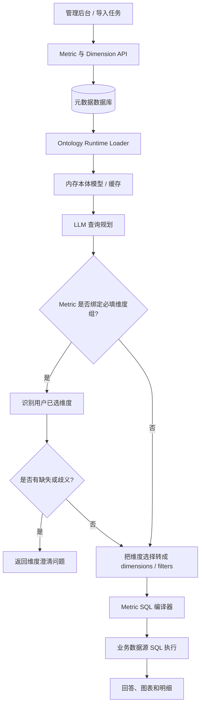
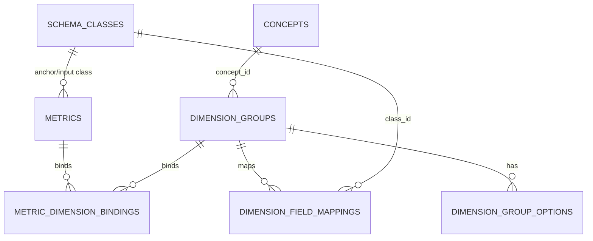

# Metric 与 Dimension 功能重建说明

> **目的**：本文不是“复制源代码”的迁移指南，而是对当前版本 Metric 和 Dimension 功能的拆解说明。目标系统应按本文的业务能力、数据契约、运行时规则和验收用例重新实现。
>
> **范围**：仅覆盖指标（Metric）、分析维度组（Dimension Group）及它们不可缺少的 Schema/Concept 依赖；不覆盖场景管理、文件上传、通用用户权限、图表规则等无直接功能依赖的部分。

---

## 1. 先明确要重建的能力

当前系统的 Metric / Dimension 并不是单纯的两组后台 CRUD，而是由以下六类能力共同构成：

| 编号 | 功能能力 | 是否影响 ChatBI 查询结果 | 重建优先级 |
| --- | --- | --- | --- |
| F1 | Schema 字段语义与物理字段映射 | 是 | P0 |
| F2 | Metric 定义、校验与版本化 | 是 | P0 |
| F3 | Metric SQL 编译与执行 | 是 | P0 |
| F4 | Dimension Group 治理、选项和字段映射 | 是 | P0 |
| F5 | 根据 Metric 强制维度澄清并把选择写入查询计划 | 是 | P0 |
| F6 | Metric / Dimension 的管理后台 | 间接 | P1 |
| F7 | DB → 本体运行时缓存 → Prompt/Agent 刷新 | 是 | P0 |
| F8 | 抽取/优化结果导入 Metric、Dimension | 间接 | P2 |

建议按 **P0 → P1 → P2** 实施。只迁移后台页面和表结构而未实现 F3、F5、F7 时，指标和维度组不会真正约束 ChatBI 查询。

---

## 2. 总体运行链路



### 2.1 关键结论

1. **Metric 是受治理的计算定义，不是数据表字段。** 查询计划里的 `metrics` 只能引用已定义的 Metric 或并列输出名称。
2. **Dimension Group 是“查询语义约束”。** 它由“选项、别名、字段映射、澄清策略、关联指标”组成；不是普通的维度字段列表。
3. **Schema 是前置依赖。** Metric 输入字段和 Dimension 字段映射都必须能映射到合法的业务数据字段。
4. **数据库写入后必须刷新运行时本体缓存。** 否则后台保存成功，但 Agent 仍使用旧的 Metric / Dimension。

---

## 3. 领域模型与最小 DDL

### 3.1 必须重建的表

只列出 Metric / Dimension 直接所需的表。`scenario_id` 是租户/业务场景隔离键；若目标系统已有等价隔离键，应统一替换。




### 3.3 推荐的完整性约束和索引

源系统未定义外键，由 API 手动清理。重建版本建议增加外键和索引，避免悬挂绑定；如历史数据不干净，先完成第 10 节数据检查。

```sql
ALTER TABLE dimension_groups
  ADD CONSTRAINT fk_dimension_group_concept
  FOREIGN KEY (concept_id, scenario_id)
  REFERENCES concepts (id, scenario_id)
  DEFERRABLE INITIALLY DEFERRED;

ALTER TABLE dimension_group_options
  ADD CONSTRAINT fk_dimension_option_group
  FOREIGN KEY (group_id, scenario_id)
  REFERENCES dimension_groups (id, scenario_id)
  ON DELETE CASCADE;

ALTER TABLE metric_dimension_bindings
  ADD CONSTRAINT fk_binding_metric
  FOREIGN KEY (metric_id, scenario_id)
  REFERENCES metrics (id, scenario_id)
  ON DELETE CASCADE,
  ADD CONSTRAINT fk_binding_group
  FOREIGN KEY (group_id, scenario_id)
  REFERENCES dimension_groups (id, scenario_id)
  ON DELETE CASCADE;

```

> 注意：`concept_id` 在当前设计中允许为空。PostgreSQL 中包含空字符串的行不会被 SQL `NULL` 外键忽略，因此新系统应将“未关联概念”统一存为 `NULL`，或不为该字段添加外键。

### 3.4 字段的业务含义

#### `schema_classes`

| 字段 | 功能用途 |
| --- | --- |
| `id` | Metric 的 `anchor_class`、`inputs[].class_id` 与字段映射的 `class_id` |
| `fields` | JSON 数组；每项至少要有 `name`、`physical_name`、`type` |
| `properties` | 旧格式字段名数组；兼容无 `fields` 的历史数据 |
| `csv_file` / `primary_key` | CSV / 数据库表映射和 Join 执行支持 |
| `review_status` | 被拒绝的 Class 不应给 Agent 或 Metric 使用 |

`fields` 项的推荐结构：

```json
{
  "name": "销售金额",
  "physical_name": "sales_amount",
  "type": "numeric",
  "description": "含税销售额",
  "is_primary_key": false,
  "is_foreign_key": false
}
```

#### `metrics_v2`

| 字段 | 功能用途 |
| --- | --- |
| `id` / `name` | 查询计划可使用 ID 或名称引用 |
| `target_class` | 冗余存储的锚点类，便于筛选和 Prompt 展示；应与 `definition.anchor_class` 一致 |
| `definition` | 唯一的可执行计算定义，见第 4 节 |
| `dimensions` | 历史/展示维度列表，当前可保留 |
| `required_dimensions` | 旧版必填维度逻辑；未绑定 Dimension Group 时的兼容回退 |
| `chart_type` | UI 图表推荐，不参与 SQL 计算 |
| `review_status` | `rejected` Metric 不进入运行时可用列表 |

#### `dimension_groups` 和子表

| 表/字段 | 功能用途 |
| --- | --- |
| `dimension_groups.group_type` | `time` / `categorical` / `hierarchy`，主要供配置和理解 |
| `is_required` | 是否要求用户补充维度 |
| `clarification_policy` | `auto_fill`、`ask_when_ambiguous`、`always_ask` |
| `status` | 仅 `approved` 的组应参与运行时澄清 |
| `dimension_group_options.value` | 稳定机器值，映射与会话保存应使用它 |
| `label` / `aliases` | 用户可读名称和匹配同义词 |
| `is_default` | 无歧义且策略允许时的默认选择 |
| `dimension_field_mappings` | 将选项翻译成 query plan 的 `dimensions` 或 `filters` |
| `metric_dimension_bindings` | 确定某个 Metric 需要哪些受治理维度 |

---

## 4. Metric 定义协议：必须保持兼容的核心

### 4.1 输入项 `MetricInput`

```ts
type MetricInput = {
  id: string;
  class_id: string;
  source_shape: "wide" | "long";
  field: string;                  // 必须是物理字段名
  aggregation: "SUM" | "AVG" | "MIN" | "MAX" | "COUNT" | "COUNT_DISTINCT";
  filters: Array<{
    field: string;                // 必须是当前 class 的物理字段名
    operator: "=" | "!=" | "IN" | "NOT IN" | "IS NULL" | "IS NOT NULL";
    value?: string | string[] | null;
  }>;
};
```

### 4.2 V1：单个计算输出

```ts
type MetricDefinitionV1 = {
  version: 1;
  anchor_class: string;
  expression_operator: "ADD" | "SUBTRACT" | "MULTIPLY" | "DIVIDE" | "CONCAT";
  offset?: number;
  inputs: MetricInput[];
};
```

示例：销售额 / 患者数。

```json
{
  "version": 1,
  "anchor_class": "hospital",
  "expression_operator": "DIVIDE",
  "offset": 0,
  "inputs": [
    {
      "id": "sales",
      "class_id": "hospital_monthly_stats",
      "source_shape": "wide",
      "field": "sales_amount",
      "aggregation": "SUM",
      "filters": []
    },
    {
      "id": "patients",
      "class_id": "hospital_monthly_stats",
      "source_shape": "wide",
      "field": "patient_count",
      "aggregation": "SUM",
      "filters": []
    }
  ]
}
```

### 4.3 V2：并列输出

```ts
type MetricOutput = {
  id: string;
  output_name: string;
  expression_operator: "ADD" | "SUBTRACT" | "MULTIPLY" | "DIVIDE";
  offset?: number;
  inputs: MetricInput[];
};

type MetricDefinitionV2 = {
  version: 2;
  anchor_class: string;
  outputs: MetricOutput[];
};
```

查询计划可引用：父 Metric ID/名称（得到所有输出）或单个 `output.id` / `output_name`（只计算一个输出）。

### 4.4 后端必须做的定义校验

1. `version` 只能为 `1` 或 `2`。
2. `anchor_class` 必填且在当前场景 `schema_classes` 中存在。
3. V1 的运算符必须在允许集合中；`CONCAT` 不允许非零 `offset`。
4. V2 至少一个输出，输出 `output_name` 必填且去重；`DIVIDE` 固定为两个输入。
5. 每一个输入的 `class_id`、`field` 都必须存在。
6. 输入字段、过滤字段应先从业务逻辑名映射为 `physical_name` 再持久化。
7. `aggregation` 仅允许定义的六种聚合。
8. `source_shape=long` 时必须配置至少一个固定 `filters`，防止把窄表的不同指标行混合汇总。
9. `IS NULL` 和 `IS NOT NULL` 不要求 `value`；其他操作符必须有值。
10. `offset` 必须为有限数字，禁止注入表达式或字符串 SQL。

---

## 5. 运行时重建：加载、规划、澄清、SQL

这是迁移中最容易遗漏、但真正影响查询结果的部分。

### F7. 本体运行时加载与缓存失效

**输入**：当前 `scenario_id` 下的 Class、Relationship、Metric、Concept、Dimension Group、Option、Mapping、Binding。

**输出**：内存中的 Ontology Runtime，至少包含：

```ts
type RuntimeMetric = Metric & {
  dimension_group_ids: string[];
};

type RuntimeOntology = {
  classes: Record<string, SchemaClass>;
  relationships: SchemaRelationship[];
  metrics: RuntimeMetric[];
  dimension_groups: RuntimeDimensionGroup[];
};
```

**规则**：

- 读取时组装 `metric_dimension_bindings`，为每个 Metric 补充 `dimension_group_ids`。
- 过滤 `review_status=rejected` 的 Metric/Class；运行时 Dimension Group 过滤 `status != approved`。
- 建立 Class 关系图，供 Metric 输入 Class 与锚点 Class 之间查找 Join 路径。
- Metric、Dimension Group、Schema Class、Concept 发生写入后，必须使 해당 `scenario_id` 的 Ontology Runtime、Query Engine、Prompt 缓存失效。
- 如目标系统依然导出 `schema.json`，其只能是 DB 的派生副本，不能成为第二个可编辑事实来源。

**源实现参考**：[运行时数据库加载](src/backend/core/ontology/ontology_engine.py#L61)、[指标可用性过滤](src/backend/core/ontology/ontology_engine.py#L335)、[本体文件同步](src/backend/modules/schema.py#L439)。

### F2. 查询规划中的 Metric 识别与 Scope 对齐

LLM 或规则规划器生成的聚合查询至少应包含：

```json
{
  "query_mode": "aggregate",
  "target_class": "hospital",
  "metrics": ["人均销售额"],
  "dimensions": ["省份"],
  "filters": [],
  "having": [],
  "order_by": []
}
```

必须实现：

1. `metrics` 只能来自当前可用 Metric 列表，不能把普通字段名当 Metric。
2. 支持用 Metric `id`、`name`、V2 输出 `id`、V2 输出 `output_name` 做引用解析。
3. 当候选 Metric 的锚点类唯一时，自动将 `target_class` 对齐到该锚点类，避免规划器选错实体。
4. `having.field` 也只允许引用 Metric；普通字段筛选应放入 `filters`。
5. 被拒绝或锚点类不可用的 Metric 不应暴露给 Prompt/规划器。

**源实现参考**：[Metric 引用解析](src/backend/agents/ontology_chatbi/helper.py#L117)、[查询计划校验](src/backend/agents/ontology_chatbi/node/ontology_agent.py#L182)、[锚点 Scope 对齐](src/backend/agents/ontology_chatbi/engine.py#L1537)。

### F5. Dimension Group 澄清与查询计划补全

#### 运行规则

1. 找出查询计划中每个 Metric 绑定的、`status=approved` 的 Dimension Group。
2. 对 `is_required=true` 的维度组，从用户原话、已保存会话选择、选项 `label` 和 `aliases` 中识别已选 `option.value`。
3. 根据 `clarification_policy` 决定：
   - `auto_fill`：有默认选项时自动选择；
   - `ask_when_ambiguous`：信息不足或命中多个选项时提问；
   - `always_ask`：即使有默认值也应提问。
4. 若仍缺少必填组选项，返回澄清问题，不执行 SQL。
5. 用户回答后，将 `option.value` 保存到会话，并通过 `dimension_field_mappings` 转成查询计划的 `dimensions` / `filters`。
6. 没有绑定 Dimension Group 的旧 Metric，使用 `metrics.required_dimensions` 执行兼容澄清。


### F3. Metric SQL 编译器

Metric SQL 编译器的职责是把受治理的 `definition` 转为安全 SQL 片段，不能由 LLM 直接生成 Metric 计算 SQL。

#### 需要支持的能力

| 子能力 | 规则 |
| --- | --- |
| 输入聚合 | 将每个 Input 编译为 `SUM`、`AVG`、`MIN`、`MAX`、`COUNT`、`COUNT(DISTINCT ...)` |
| 固定条件 | 把 Input 的 `filters` 固化在聚合表达式/子查询中 |
| 表形态 | `wide` 直接聚合指标字段；`long` 必须连同固定条件聚合 |
| 运算表达式 | V1/V2 输出按照 `ADD`、`SUBTRACT`、`MULTIPLY`、`DIVIDE`、`CONCAT` 组合 |
| 除零保护 | `DIVIDE` 使用 `NULLIF(denominator, 0)` 或目标数据库等价写法 |
| `offset` | 在表达式结果之后应用数值偏移 |
| V2 | 父 Metric 输出全部 Output；指定输出仅输出该 Output |
| Join | 根据锚点 Class、Input Class、Dimension/Filter Class 自动查找最短有效关系路径 |
| Having | 对 Metric 的聚合结果构造 `HAVING`，而不是 `WHERE` |
| 冲突检查 | 用户筛选与 Metric 固定筛选作用于同一字段且语义冲突时，拒绝查询并提示 |

**重要安全要求**：Class、字段、Metric、操作符均只能取自已校验元数据；值必须参数化；不能将用户字符串直接拼入 SQL 标识符或条件。

**源实现参考**：[查询执行入口](src/backend/core/ontology/data_query.py#L910)、[Metric 引用与表达式](src/backend/core/ontology/data_query.py#L507)、[固定条件与冲突检查](src/backend/core/ontology/data_query.py#L852)。

---

## 6. 写入 API：建议按功能重建

路径可以按目标系统规范调整；以下是建议保持的请求/响应含义。

### 6.1 Metric API

| 方法 | 建议路径 | 功能 | 关键副作用 |
| --- | --- | --- | --- |
| GET | `/api/scenarios/{scenarioId}/metrics` | 列表，返回已组装 `dimension_group_ids` | 读取运行元数据 |
| POST | `/api/scenarios/{scenarioId}/metrics` | 创建 Metric | 校验定义、写 Metric 与 Binding、失效运行时缓存 |
| PUT | `/api/scenarios/{scenarioId}/metrics/{metricId}` | 更新 Metric | 重校验、替换 Binding、失效缓存 |
| DELETE | `/api/scenarios/{scenarioId}/metrics/{metricId}` | 删除 Metric | 删除 Binding、失效缓存 |
| POST | `/api/scenarios/{scenarioId}/metrics/batch-delete` | 批量删除 | 同上 |
| GET | `/api/scenarios/{scenarioId}/metrics/field-values` | Metric 编辑器字段值候选 | 校验 Class/Field 后查询去重值 |

创建请求核心：

```json
{
  "id": "sales_per_patient",
  "name": "人均销售额",
  "description": "销售额除以患者数",
  "category": "销售",
  "definition": {"version": 1, "anchor_class": "hospital", "expression_operator": "DIVIDE", "inputs": []},
  "dimensions": [],
  "required_dimensions": [],
  "dimension_group_ids": ["sales_channel"],
  "chart_type": "bar",
  "sort_order": 0,
  "review_status": "approved"
}
```

### 6.2 Dimension Group API

| 方法 | 建议路径 | 功能 | 关键副作用 |
| --- | --- | --- | --- |
| GET | `/api/scenarios/{scenarioId}/dimension-groups` | 返回 Group、Option、Mapping、Metric ID | 组装子表 |
| POST | `/api/scenarios/{scenarioId}/dimension-groups` | 创建 Group | 校验并写入四张表，失效缓存 |
| PUT | `/api/scenarios/{scenarioId}/dimension-groups/{groupId}` | 更新 Group | 原子替换 Option/Mapping/Binding，失效缓存 |
| DELETE | `/api/scenarios/{scenarioId}/dimension-groups/{groupId}` | 删除 Group | 级联/显式删除子记录，失效缓存 |

创建请求核心：

```json
{
  "id": "sales_channel",
  "name": "销售渠道",
  "description": "统计口径使用的销售渠道",
  "group_type": "categorical",
  "concept_id": "",
  "is_required": true,
  "default_option": "in_hospital",
  "clarification_policy": "ask_when_ambiguous",
  "status": "approved",
  "options": [
    {
      "value": "in_hospital",
      "label": "院内",
      "aliases": ["院内渠道"],
      "is_default": true,
      "sort_order": 0,
      "status": "approved"
    }
  ],
  "field_mappings": [
    {
      "option_value": "in_hospital",
      "class_id": "hospital_monthly_stats",
      "field_name": "channel",
      "display_name": "销售渠道",
      "priority": 0
    }
  ],
  "metric_ids": ["sales_per_patient"]
}
```

### 6.3 依赖 API

这两类 API 不属于 Metric/Dimension 本体，但没有它们无法配置和验证：

| API | 必要原因 |
| --- | --- |
| Schema Class / Relationship CRUD | Metric 输入字段、锚点类、字段映射、Join 路径均依赖它 |
| Concept CRUD | Dimension Group 的 `concept_id` 可选依赖 |

---

## 7. 管理后台功能清单

目标系统绝大多数代码应重写，但需要复现以下用户能力。

### F6-1. Metric 管理页

| 功能 | 必须实现的行为 |
| --- | --- |
| Metric 列表 | 按名称、分类、锚点类、审核状态筛选；按名称/分类/更新时间排序 |
| 新建/编辑 | 维护名称、描述、分类、图表类型、审核状态、锚点 Class |
| V1 编辑器 | 维护表达式运算符、多个 Input、聚合、固定条件、Offset |
| V2 编辑器 | 维护多个 Output 和各自的 Input |
| Input 字段选择 | 先选 Class，再从其 Schema Fields 中选物理字段 |
| 固定条件候选值 | 调用字段候选值接口，辅助填写过滤值 |
| 维度组绑定 | 只能选择 `approved` Dimension Group |
| 删除 | 单删、批量删除，并同步清理 Binding |

### F6-2. Dimension Group 管理页

| 功能 | 必须实现的行为 |
| --- | --- |
| Group 列表 | 展示名称、类型、策略、选项数、映射数、影响 Metric、状态 |
| Group 基础信息 | 名称、类型、Concept、是否必填、默认项、澄清策略、状态 |
| Option 编辑 | 维护机器值、展示名、别名、默认项、排序、状态 |
| Field Mapping 编辑 | 选择已有 Option、Class 和 Field，维护优先级 |
| Metric 绑定 | 勾选受该 Group 影响的 Metric |
| 删除 | 删除 Group 后删除 Options、Mappings、Bindings |

### F6-3. 前端状态规则

- 缓存键至少按 `scenarioId` 隔离：`schema`、`metrics`、`dimension-groups`、`concepts`。
- 切换场景必须清理上述缓存，禁止显示其他场景元数据。
- Metric 保存后应同时刷新 Metric 列表与 Dimension Group 中的关联 Metric；Group 保存后反之亦然。
- 后端是最终校验方；前端只做必填和可用性提示。

**源实现参考**：[Metric 管理页](src/admin/src/components/MetricManager.tsx#L153)、[Dimension Group 管理页](src/admin/src/components/DimensionGroupManager.tsx#L62)、[前端类型](src/admin/src/lib/types.ts#L51)。

---

## 8. 需要一并处理的变更传播

以下不是独立页面功能，但重建系统时必须覆盖，否则会产生失效 Metric。

| 变更 | 必须传播到的对象 |
| --- | --- |
| Schema Class 改 ID | Relationship 的 `source/target`、Metric `target_class`、V1 `inputs[].class_id`、V2 `outputs[].inputs[].class_id`、Concept `related_class`、字段映射 `class_id` |
| Schema Field 改物理名 | 所有 Metric Input `field`、Input Filter `field`、字段映射 `field_name` |
| 删除 Schema Class | 阻止删除并展示依赖，或事务性删除/下线所有依赖 Metric、Mapping、Relationship、Concept |
| Dimension Group 由 `approved` 改为其他状态 | 运行时不再纳入澄清；需提示已绑定 Metric 的行为变化 |
| 删除 Metric | 删除所有 `metric_dimension_bindings` |
| 删除 Dimension Group | 删除 Options、Mappings、Bindings |
| Metric / Group / Schema 写入 | 刷新该场景 Ontology Runtime、Query Engine、Prompt 缓存 |

> 源版本对 V2 Metric 的 Class 改名/删除扫描不完整，只处理了 `definition.inputs`，没有完整处理 `definition.outputs[].inputs`。目标重建时应修复，不应照搬该缺陷。

---

## 9. 已知源实现边界：重建时的决策建议

| 问题 | 当前行为 | 新系统建议 |
| --- | --- | --- |
| 旧 `required_dimensions` | 仅在没有解析到 Group Binding 时回退使用 | 保留兼容期；新建 Metric 统一使用 Dimension Group Binding |
| JSON 字段 | DB 中使用 `TEXT` + `json.loads` | PostgreSQL 可用 `JSONB`，但需维持 API 契约 |
| 外键 | 未定义，靠 API 手动清理 | 增加复合外键与级联删除，并改为事务写入 |
| 自动抽取导入 V2 Metric | 当前同步链路只保留 `definition.version == 1` | 必须完整支持 V1/V2，或明确产品禁用 V2 |
| Class 改名/删除 | V2 Input 引用未完整更新/扫描 | 递归遍历 V1 与 V2 的全部 Input |
| SQLite 旧初始化器 | 缺少 Dimension Group 相关表 | 删除旧初始化器或将 DDL 统一到唯一迁移框架 |
| Option 状态 | 抽取导入时可能写成 `draft` | 将“抽取草稿”和“审核可用”状态明确分层 |

---

## 10. 上线前数据与功能验收

### 10.1 数据一致性 SQL

把 `$1` 换为待检查的 `scenario_id`。

```sql
-- 绑定了不存在 Metric 或 Dimension Group 的记录。
SELECT b.metric_id, b.group_id
FROM metric_dimension_bindings b
LEFT JOIN metrics m
  ON m.scenario_id = b.scenario_id AND m.id = b.metric_id
LEFT JOIN dimension_groups g
  ON g.scenario_id = b.scenario_id AND g.id = b.group_id
WHERE b.scenario_id = $1 AND (m.id IS NULL OR g.id IS NULL);

-- 已批准 Group 没有任何选项。
SELECT g.id, g.name
FROM dimension_groups g
LEFT JOIN dimension_group_options o
  ON o.scenario_id = g.scenario_id AND o.group_id = g.id
WHERE g.scenario_id = $1 AND g.status = 'approved'
GROUP BY g.id, g.name
HAVING COUNT(o.value) = 0;

-- Mapping 引用了不存在的 Option。
SELECT fm.group_id, fm.option_value, fm.class_id, fm.field_name
FROM dimension_field_mappings fm
LEFT JOIN dimension_group_options o
  ON o.scenario_id = fm.scenario_id
 AND o.group_id = fm.group_id
 AND o.value = fm.option_value
WHERE fm.scenario_id = $1 AND o.value IS NULL;

-- Metric 的锚点 Class 不存在。
SELECT m.id, m.name, m.target_class
FROM metrics m
LEFT JOIN schema_classes c
  ON c.scenario_id = m.scenario_id AND c.id = m.target_class
WHERE m.scenario_id = $1 AND m.target_class <> '' AND c.id IS NULL;

-- 空定义不能进入运行时。
SELECT id, name
FROM metrics
WHERE scenario_id = $1 AND (definition IS NULL OR BTRIM(definition) IN ('', '{}'));
```

### 10.2 必须自动化的功能用例

| 用例 | 预期结果 |
| --- | --- |
| 创建 V1 SUM Metric | 成功保存；运行时可引用；生成正确聚合 SQL |
| 创建 V1 DIVIDE Metric | 分母为 0 时不抛数据库异常 |
| 创建 V2 Metric 并指定一个 Output | 仅返回被指定输出 |
| Long 表 Input 不含 Filter | API 拒绝保存 |
| Metric Input 使用不存在字段 | API 拒绝保存 |
| Metric 绑定草稿 Group | API 拒绝保存 |
| 已绑定必填 Group 的 Metric 查询且用户未提供维度 | 返回澄清问题，不执行 SQL |
| 用户回答别名 | 解析为对应 `option.value` 并应用 Mapping |
| Group 默认项 + `auto_fill` | 无歧义时自动写入查询计划 |
| 固定 Metric 条件和用户筛选冲突 | 查询前返回可解释错误 |
| Schema Class 改名 | V1/V2 Input、Anchor、Mapping 等引用全部更新 |
| 删除 Metric / Group | Binding 不残留；运行时缓存刷新 |

---

## 11. 源代码功能定位（用于理解，而非复制）

| 功能 | 源位置 |
| --- | --- |
| Metric API、定义校验、Binding 替换 | [src/backend/modules/metrics.py](src/backend/modules/metrics.py) |
| Dimension Group API、子表重写 | [src/backend/modules/dimension_groups.py](src/backend/modules/dimension_groups.py) |
| Schema 变更传播、DB → JSON 同步 | [src/backend/modules/schema.py](src/backend/modules/schema.py) |
| DDL 和历史兼容迁移 | [src/backend/core/db/db_provider.py](src/backend/core/db/db_provider.py) |
| DB 加载到运行时本体 | [src/backend/core/ontology/ontology_engine.py](src/backend/core/ontology/ontology_engine.py) |
| Metric SQL 编译与执行 | [src/backend/core/ontology/data_query.py](src/backend/core/ontology/data_query.py) |
| Metric / Dimension 查询规划与澄清入口 | [src/backend/agents/ontology_chatbi/engine.py](src/backend/agents/ontology_chatbi/engine.py) |
| Dimension Group 澄清算法 | [src/backend/agents/ontology_chatbi/node/clarify_agent.py](src/backend/agents/ontology_chatbi/node/clarify_agent.py) |
| 查询计划 Metric 校验 | [src/backend/agents/ontology_chatbi/node/ontology_agent.py](src/backend/agents/ontology_chatbi/node/ontology_agent.py) |
| 管理端 Metric 页面 | [src/admin/src/components/MetricManager.tsx](src/admin/src/components/MetricManager.tsx) |
| 管理端 Dimension Group 页面 | [src/admin/src/components/DimensionGroupManager.tsx](src/admin/src/components/DimensionGroupManager.tsx) |
