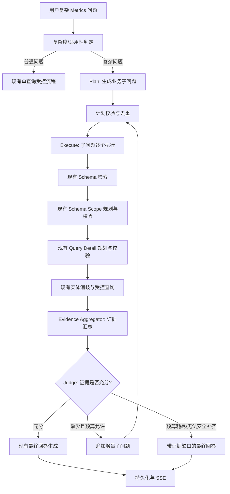
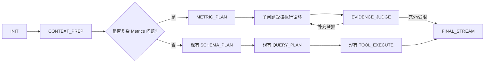
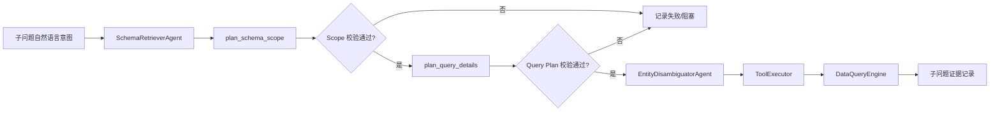

# Chat V3 Plan-Execute 指标分析机制设计报告

> 目标：为复杂的 Metrics 类问题增加一个**受控、可迭代、可追溯**的 Plan-Execute 工作流。
>
> 基础说明：本方案基于现有的 [Chat V3 完整逻辑报告](chat_v3_complete_logic_report.md)，并记录首版实现的架构边界与后续演进建议。

> 实施状态（2026-07-11）：已完成首版后端实现。复杂 Metrics 问题会在 `CONTEXT_PREP` 后进入受限的顺序 Plan-Execute 流程；计划器和充分性审核器均接收企业 Glossary 匹配结果。每个子问题仍复用既有的 Schema Scope、Query Detail、实体消歧和受控查询边界。前端沿用工具步骤时间线展示计划、查询和审核结果。

> SSE 进度：Plan-Execute 每次状态机推进只处理“生成计划、执行一个子问题、或审核一轮证据”中的一项；该项产生的 `tools.step` 会在本次状态处理结束后立即下发。前端会实时追加步骤，并在 `done.steps` 到达时以服务端权威记录校准最终显示。

## 1. 结论

这个方向是可行且值得推进的。

现有 Chat V3 已经具备该能力最关键的基础：每次数据查询都会经历 Schema 范围校验、指标/字段/条件校验、实体消歧、受控查询执行及工具结果持久化。因此不应另建一套“自由规划后直接查数据”的链路，而应在当前受控查询能力之外增加一个上层的 **Plan-Execute 编排层**。

推荐的原则是：

1. **计划只拆业务证据问题，不产生 SQL 或查询参数。**
2. **每个子问题都复用现有两阶段规划与受控查询链路。**
3. **汇总层以可追溯的证据包为输入，不让模型自行拼接或臆测跨查询指标。**
4. **由独立的充分性判定器判断证据是否足够，并且只允许有限次数的增量扩展。**
5. **严格限制子问题数、迭代数、查询数、耗时、上下文大小和重复计划。**

这样可以让系统处理“进度为什么落后”“同比环比变化由什么构成”“哪些区域/品类贡献了变化”“多个指标是否达成”等复杂 Metrics 问题，同时保留当前本体校验和 SQL 安全边界。

---

## 2. 解决的问题与适用范围

### 2.1 当前单查询链路的边界

现有流程为用户问题生成一个已验证的 `query_ontology_data` 查询；结果足够时直接回答，否则只允许调用 `python_analyze` 做后续计算。

这一机制适合：

- 单一指标查询。
- 指定维度、时间、筛选条件下的汇总或明细。
- 已能通过一条查询获得完整对比证据的问题。
- 基于同一查询结果做排序、Top N、占比、差值等 Python 再计算的问题。

但对复杂问题，答案往往需要来自不同粒度、不同时间窗口、不同指标或不同实体的多份证据。例如：

- “华东区本月销售达成为什么低于目标，主要受哪些品类影响？”
- “解释 GMV 同比下滑的原因，并判断是价格、销量还是渠道结构造成的。”
- “本季度库存周转是否健康，结合销售、库存、缺货和补货周期给出判断。”
- “哪些区域拉低了整体利润率，和去年同期相比变化在哪里？”

此类问题不能把“原因”交给模型直接推断，而需要先规划并取得一组可验证的数据证据。

### 2.2 首期适用条件

建议只在识别为复杂 Metrics 问题时进入 Plan-Execute 模式。初期可由确定性规则和轻量分类组合触发，特征包括：

- 同时要求多个指标或多个业务证据。
- 包含归因、驱动、原因、贡献、拆解、结构变化等意图。
- 包含同比、环比、预算/目标对比，并要求解释变化。
- 需要跨时间窗口、区域、品类、渠道等多个维度交叉分析。
- 要求健康度诊断、综合评价或行动建议。

当前首版实现采用“复杂意图关键词 + 企业指标证据”的确定性门控：问题必须具有归因、拆解、贡献、诊断、同比/环比等复杂分析意图，并且 Glossary 命中项能够关联场景内指标，或 Schema 检索已找到相关候选指标。Glossary 命中会同时传给子问题计划器与每个子问题的受控规划器，作为业务术语和口径约束。

以下情况继续走当前单查询流程：

- 用户明确请求一个指标、一个时间范围或一个分组。
- 仅需对单条查询结果排序、过滤、计算占比。
- 只是查询定义、指标口径或样本明细。

应将该模式设计为可配置能力，例如由请求 `options` 中的开关、场景配置或问题复杂度分类结果共同控制；首期默认建议关闭或只对白名单场景开放。

---

## 3. 目标架构

### 3.1 分层职责



新增层与现有层的边界如下：

| 层 | 职责 | 禁止事项 |
| --- | --- | --- |
| 复杂度判定 | 决定是否需要多证据机制 | 不生成字段、表、SQL |
| Plan | 把原始问题拆为业务证据子问题 | 不生成 `target_class`、指标 ID、过滤器、Join、SQL |
| Execute | 对每个子问题调用现有受控链路 | 不绕过 Schema/Query 校验 |
| Evidence Aggregator | 标准化与压缩成功/失败证据，保留来源 | 不让 LLM 执行隐式跨粒度运算 |
| Sufficiency Judge | 判断证据覆盖度并提出增量需求 | 不直接查询、不产生 SQL/参数 |
| Final Answer | 基于完整证据给结论，明确局限 | 不编造缺失证据 |

### 3.2 与现有流程的关系

Plan-Execute 应位于 `CONTEXT_PREP` 之后、现有 `SCHEMA_PLAN` 之前：



关键点：**Plan-Execute 不替代现有 `SCHEMA_PLAN → QUERY_PLAN → TOOL_EXECUTE`，只负责多次调度它。**

---

## 4. 计划（Plan）设计

### 4.1 计划的输入与输出

计划器的输入应包括：

- 原始用户问题。
- 当前场景 ID。
- 术语匹配结果。
- Schema/Metric 候选摘要。
- 会话上下文中与本题相关的约束。
- 已完成子问题及现有证据摘要（仅在扩展迭代时）。

计划器输出必须是严格 JSON，只能包含业务层表达：

```json
{
  "plan_id": "metric-plan-001",
  "objective": "解释华东区本月销售达成落后的主要驱动因素",
  "answer_type": "metric_diagnosis",
  "coverage_requirements": [
    "实际值、目标值和达成差距",
    "与可比期间的变化",
    "区域内主要品类或渠道的贡献分解"
  ],
  "subquestions": [
    {
      "id": "sq-1",
      "intent": "查询华东区本月实际销售额、目标销售额及达成差距",
      "expected_evidence": "确认当前缺口规模",
      "priority": 1
    },
    {
      "id": "sq-2",
      "intent": "比较华东区本月与上月或去年同期的销售变化",
      "expected_evidence": "确认变化方向与幅度",
      "priority": 2
    },
    {
      "id": "sq-3",
      "intent": "按品类或渠道拆分华东区销售缺口的贡献",
      "expected_evidence": "定位主要负向贡献来源",
      "priority": 3
    }
  ]
}
```

### 4.2 计划器约束

计划器必须遵守：

1. 每个子问题只表达“需要什么业务证据”，不能给出任何表名、字段名、SQL、Join、公式或查询参数。
2. 首轮最多生成 3 个子问题，按优先级排序。
3. 子问题应具有互补性；不得把同一问题换一种说法重复拆分。
4. 每一个子问题必须说明其对最终结论的证据价值。
5. 子问题应尽量可独立查询，避免依赖上一个子问题的自然语言结论。
6. 对需要用户业务选择才能继续的问题，优先标记为 `blocked` 或提出澄清，而不是假设业务口径。

### 4.3 计划校验与去重

在执行前，需要程序化校验：

- 子问题数量、内容、优先级是否有效。
- `id` 是否唯一。
- 是否包含受禁止的 SQL/字段/表名模式。
- 是否与当前计划或历史迭代的语义目标重复。
- 是否已被同一查询指纹覆盖。

查询指纹应在子问题完成“受控查询计划”后生成，至少覆盖：

- 场景 ID。
- `target_class`。
- 指标、维度。
- 过滤条件、Having、排序。
- Join 类。

即使自然语言表述不同，只要最终受控查询参数等价，也应标记为重复并跳过。

---

## 5. 执行（Execute）设计

### 5.1 单子问题执行单元

每一个子问题应成为一个独立执行记录，并走完整的现有能力链：



建议抽取一个内部协程，例如：

```text
execute_validated_subquestion(original_question, subquestion, plan_context) -> SubquestionExecutionRecord
```

该协程应复用现有的：

- Schema 检索。
- `OntologyAgent.plan_schema_scope()`。
- `OntologyAgent.plan_query_details()`。
- `ToolExecutor.execute('query_ontology_data', ...)`。
- 实体消歧、自动参数校正和查询引擎。

它不应直接调用 SQL 或跳过任一现有校验。

### 5.2 首期采用顺序执行

首期建议顺序执行而不是并行执行：

- 容易保持当前 SSE 工具事件的顺序。
- 有利于控制 LLM、数据库和数据源压力。
- 后续子问题可基于前序失败/结果被跳过，减少无效查询。
- 更容易实现预算、取消和错误追踪。

独立子问题并行是后续性能优化项，前提是明确查询引擎连接、并发限制、事件排序和取消策略。

### 5.3 子问题失败策略

某个子问题失败不应立刻导致整个请求失败。每条子问题应处于以下状态之一：

- `pending`：待执行。
- `planning`：正在检索和规划。
- `validated`：受控查询参数已通过校验。
- `executing`：正在执行查询。
- `completed`：已得到可用数据证据。
- `failed`：校验或查询失败。
- `skipped`：与已有证据重复或优先级不足。
- `blocked`：缺少用户澄清或无法安全确定口径。

如果剩余成功证据仍可满足最终问题，则继续进入充分性判定；否则在最终回答中明确未取得的证据和结论边界。

---

## 6. 证据汇总与充分性判定

### 6.1 Evidence Aggregator

所有子问题完成一轮后，先由确定性程序生成证据包，而不是直接把所有原始查询结果塞给模型。

每条证据至少包含：

```json
{
  "subquestion_id": "sq-1",
  "intent": "查询华东区本月实际销售额、目标销售额及达成差距",
  "status": "completed",
  "approved_query": {
    "target_class": "...",
    "metrics": ["..."],
    "dimensions": ["..."],
    "filters": []
  },
  "result_summary": {
    "row_count": 3,
    "columns": ["..."],
    "rows": [],
    "data_sources": [],
    "table_descriptions": []
  },
  "evidence_for": "确认当前缺口规模"
}
```

汇总器的职责：

- 统一结果格式并清理不可 JSON 化的数据。
- 记录每份结果的数据来源、表说明、查询口径和时间范围。
- 根据行数和字段压缩原始数据，避免超出上下文窗口。
- 明确每条结果的粒度、过滤范围与状态。
- 汇总错误、跳过和阻塞信息。

汇总器不应：

- 在不明确口径的情况下跨子问题相加、相除或比较。
- 隐式合并不同时间范围、货币单位、统计粒度或数据源的指标。
- 让 LLM 将不兼容的数据自行“对齐”。

若需要跨查询计算，应由确定性逻辑或 `python_analyze` 明确执行，并将计算公式、输入证据和输出一起记录。

### 6.2 Sufficiency Judge

充分性判定器使用单独的、低温度、JSON-only 的 LLM 调用。其职责不是回答用户，而是对照计划目标判断证据覆盖情况。

输入：

- 原始问题。
- 计划目标和 `coverage_requirements`。
- 已完成子问题的紧凑证据包。
- 失败、跳过、阻塞子问题说明。
- 当前迭代和剩余预算。

推荐输出：

```json
{
  "decision": "sufficient",
  "coverage": [
    {
      "requirement": "实际值、目标值和达成差距",
      "status": "covered",
      "evidence_ids": ["sq-1"]
    }
  ],
  "missing_evidence": [],
  "additional_subquestions": [],
  "limitation": "",
  "confidence": "high",
  "rationale": "已取得缺口规模、同比变化和品类贡献证据。"
}
```

仅允许三类决策：

| 决策 | 含义 | 后续动作 |
| --- | --- | --- |
| `sufficient` | 证据已覆盖问题所需维度 | 进入最终回答 |
| `add` | 存在清晰、可查询且有价值的缺口 | 追加有限子问题，进入下一轮执行 |
| `limited` | 无法安全补齐、预算耗尽或问题需澄清 | 以当前证据和局限进入最终回答或澄清 |

### 6.3 判定器安全约束

必须程序化验证判定器输出：

1. 追加项只能是自然语言业务子问题，禁止 SQL、字段、表名、原始查询参数和指标公式。
2. 每个追加项必须关联明确的 `missing_evidence`。
3. 追加项必须通过重复检测和预算检查。
4. 同一缺口不能连续两轮以等价方式重复追加。
5. 判定器即使认为不充分，也不能突破最大迭代、查询和耗时上限。
6. 无法补齐时必须生成清晰的 `limitation`，供最终回答直接引用。

---

## 7. 状态与数据模型建议

### 7.1 `AgentState` 扩展方向

当前状态以单个 `query_scope`、`query_plan`、`planned_query_args` 和 `query_executed` 为中心。Plan-Execute 需要一个计划账本，而不是简单放开 `query_executed`。

建议新增概念字段：

| 字段 | 说明 |
| --- | --- |
| `execution_mode` | `single_query` 或 `metric_plan_execute` |
| `metric_plan` | 计划目标、覆盖要求、初始子问题 |
| `plan_id` | 本次计划的稳定 ID |
| `plan_iteration` | 当前迭代轮次 |
| `subquestions` | 子问题执行记录列表/映射 |
| `active_subquestion_id` | 当前正在处理的子问题 |
| `evidence_packet` | 聚合后的紧凑证据 |
| `judge_history` | 每轮充分性判定结果 |
| `plan_terminal_reason` | `sufficient`、`budget_exhausted`、`no_progress`、`blocked` 等 |
| `execution_budget` | 查询数、轮次、LLM 调用数、耗时、上下文大小等计数 |

每个子问题记录建议包含：

- `id`、`plan_id`、`iteration`、`priority`。
- `intent`、`expected_evidence`、`added_reason`。
- 当前状态、开始/结束时间、错误和重试次数。
- Schema 检索结果、Scope 校验结果、Query Plan 校验结果。
- 已批准的查询参数与查询指纹。
- 查询结果引用和压缩后的证据摘要。
- 是否被最终回答引用。

### 7.2 状态机集成选项

有两种可选实现：

#### 方案 A：显式新增状态（推荐）

新增：

- `METRIC_PLAN`
- `SUBQUESTION_PREP`
- `SUBQUESTION_SCHEMA_PLAN`
- `SUBQUESTION_QUERY_PLAN`
- `SUBQUESTION_EXECUTE`
- `EVIDENCE_JUDGE`

优点：可观测性、重放、错误定位和后续断点恢复更好。

缺点：状态枚举和路由表改动更大。

#### 方案 B：单协调器状态（MVP 可选）

仅增加 `METRIC_PLAN_EXECUTE`，其内部顺序调用现有规划和执行能力。

优点：初期侵入性低。

缺点：长协程内状态细节弱，SSE 事件与中断恢复更难管理。

**建议**：生产设计采用方案 A；为了尽快验证业务价值，可以先以方案 B 实现受限 MVP，但需把每个子问题执行记录结构化保存。

---

## 8. SSE、前端与持久化

### 8.1 事件设计

当前 `tools.step`、`done.steps` 和数据库 `messages.steps` 已共享统一结构，因此新流程可直接沿用该协议。

建议新增逻辑步骤名称：

| 步骤名 | 用途 |
| --- | --- |
| `metric_plan` | 生成与校验初始计划 |
| `subquestion_scope` | 子问题实体范围规划完成 |
| `subquestion_query_plan` | 子问题查询细节规划完成 |
| `query_ontology_data` | 子问题受控查询执行完成 |
| `evidence_judgment` | 充分性判定完成 |
| `metric_plan_complete` | 计划终止原因与覆盖总结 |

每条步骤的 `args` 和 `result` 应加入：

- `plan_id`
- `subquestion_id`（适用时）
- `iteration`
- `intent`
- `expected_evidence`
- `status`
- `coverage` 或 `gap`

这样即使前端首期不做特殊卡片，也能通过既有工具时间线展示完整过程，并在历史加载时恢复一致状态。

### 8.2 前端演进建议

首期不需要改动核心 SSE 消费逻辑，因为现有页面已经能够显示未知步骤名和多份支持数据集。

后续体验优化可包括：

- 按子问题分组展示工具步骤。
- 显示计划目标、已覆盖证据和待补充缺口。
- 对已失败/跳过/阻塞的子问题提供可展开说明。
- 将多份数据集按子问题标签展示，而非只按查询顺序排列。
- 在最终回答附近显示“证据覆盖状态”和“结论局限”。

### 8.3 持久化建议

现有助手消息的 `steps` 和 `answer_datasets` 已可承载首期数据，无需立即做数据库迁移。

为方便后续查询、回放和运营分析，可以在后续阶段考虑：

- 单独的计划执行记录表。
- 子问题和查询的关联 ID。
- 可检索的计划版本、覆盖率、耗时和失败原因。

首期仍建议优先复用现有 `messages.steps`，以控制改造范围。

---

## 9. 强制预算与停止条件

这是避免 Plan-Execute 演变为无穷 Agent Loop 的核心。

建议 MVP 的硬限制：

| 维度 | 建议上限 | 说明 |
| --- | --- | --- |
| 首轮子问题 | 3 | 控制初始并发/时延与成本 |
| 追加迭代 | 1 | 首期最多再补一轮 |
| 总查询尝试数 | 5 | 包含失败的查询尝试 |
| 单子问题规划修复 | 2 | 与现有工具执行自动纠正分层统计 |
| 全链路 LLM 调用数 | 可配置 | 需包括计划、每个子问题两阶段规划、判定和最终回答 |
| 单请求墙钟时间 | 可配置 | 达到后停止扩展并输出已知证据 |
| 总证据上下文大小 | 可配置 | 防止最终 Prompt 膨胀 |
| 无进展扩展次数 | 1 | 连续重复/未补齐缺口时终止 |

终止原因建议标准化为：

- `sufficient`：证据充分。
- `budget_exhausted`：达到查询、轮次、耗时或上下文预算。
- `no_progress`：追加子问题与已有证据重复，或未带来新覆盖。
- `blocked`：需要用户澄清，无法安全确定业务口径。
- `partial_failure`：关键证据查询失败且无安全替代路径。

最终回答必须收到该终止原因，并在非 `sufficient` 时显式陈述数据缺口和结论边界。

---

## 10. 最终回答的证据约束

最终回答 Prompt 应新增 Plan-Execute 上下文：

- 计划目标。
- 已完成的覆盖要求与关联证据 ID。
- 未覆盖要求、查询失败和终止原因。
- 每份证据的查询口径、来源、表说明、粒度和时间范围。
- 可安全引用的确定性派生计算。

回答策略：

1. 先回答问题，但仅以证据包中已覆盖的事实为依据。
2. 遇到跨子问题比较时，先检查数据源、时间、粒度和过滤口径是否兼容。
3. 不把“相关性”表述为“因果性”；原因类回答应使用“数据表明/主要关联因素/贡献来源”等审慎表达。
4. 证据不足时明确说“当前数据支持到什么程度”，并列出未补齐的关键维度。
5. 当终止原因是预算或阻塞时，不能用笼统结论掩盖证据不足。

---

## 11. 分阶段实施路线

### 阶段 1：建立可验证的基础设施

目标：先形成稳定的计划账本与子问题执行单元。

- 扩展状态结构，新增计划、子问题、预算与判定历史。
- 从当前单查询处理器中抽取“执行一个经过两阶段验证的子问题”的复用方法。
- 增加计划输出校验、子问题去重、查询指纹和停止条件。
- 建立自动化测试：计划 JSON 校验、重复检测、状态迁移、局部失败、预算耗尽和最终证据包。

### 阶段 2：受限的顺序 Plan-Execute MVP

目标：验证复杂 Metrics 问题拆解是否提升答案质量。

- 通过 `options` 或场景白名单开启。
- 仅对明确复杂的问题生成最多 3 个初始子问题。
- 所有子问题顺序走现有受控查询链路。
- 首期不做增量扩展，直接根据初始证据生成最终回答，并如实标注缺口。
- 将每个子问题步骤与数据集持久化。

### 阶段 3：增加充分性判定与一次扩展

目标：实现用户提出的“数据不足时继续追加子问题”。

- 引入严格 JSON 的 Sufficiency Judge。
- 最多允许一轮增量子问题。
- 加入覆盖需求、缺口、去重、无进展检测和预算收敛机制。
- 将判定结论、终止原因和覆盖状态写入 SSE 与历史步骤。

### 阶段 4：产品化与运营控制

目标：提升可解释性、稳定性与性能。

- 前端按子问题展示计划和证据覆盖进度。
- 监控拆解率、平均子问题数、扩展率、重复率、查询失败率、充分率、请求耗时、LLM 调用量和 token 成本。
- 建立复杂 Metrics 问题基准集，人工评估“计划质量、查询正确性、证据覆盖度、回答可信度”。
- 在连接并发、取消语义和资源隔离验证后，再评估并行执行独立子问题。

---

## 12. 主要风险与缓解措施

| 风险 | 影响 | 缓解措施 |
| --- | --- | --- |
| 子问题膨胀 | 延迟、成本、数据源压力升高 | 强制子问题/迭代/查询/耗时预算 |
| 重复查询 | 无效调用、错误循环 | 查询指纹、语义去重、无进展终止 |
| LLM 越权生成查询细节 | 本体/口径不一致 | Plan/Judge 禁止输出参数，所有查询复用现有验证器 |
| 多数据集口径不兼容 | 错误归因或错误计算 | 证据包保留来源、粒度、时间、过滤条件；确定性兼容性检查 |
| 单个子问题失败导致整体无答 | 体验不稳定 | 子问题级失败隔离，充分性判定和局限性最终回答 |
| 最终 Prompt 过大 | 成本和截断风险 | 行采样、证据压缩、总大小预算、只传递必要元数据 |
| “原因”回答被误解为因果 | 业务风险 | 使用贡献/关联表达；缺少实验或因果证据时明确限制 |
| 前端过程难理解 | 用户无法信任多步执行 | 计划分组、证据覆盖、失败原因和终止理由可视化 |

---

## 13. 建议的验收标准

在进入生产默认路径前，至少满足：

1. 所有子问题均经过现有 Schema Scope 和 Query Detail 校验，没有绕过本体边界。
2. 每个执行过的子问题都有可追溯的计划 ID、子问题 ID、批准查询参数、数据来源和结果状态。
3. 实时 SSE 展示与会话重载后的步骤、数据集和状态保持一致。
4. 任意计划在查询数、迭代数、LLM 调用数、墙钟耗时和上下文大小上都可收敛。
5. 重复或无进展的追加子问题能被稳定拒绝。
6. 子问题局部失败时，系统能够给出部分结论和明确的证据缺口，而不是编造结果。
7. 在复杂 Metrics 基准问题上，相比单查询路径，证据覆盖率和人工可信度有可量化提升，且延迟/成本在可接受范围内。

---

## 14. 最终建议

建议采用“**受控计划 + 子问题复用现有查询链路 + 证据充分性判定 + 强预算收敛**”的方案。

不建议：

- 让规划模型直接输出多条 SQL 或原始查询参数。
- 在首次查询后简单放开 `query_ontology_data`，允许通用 LLM 随意反复查询。
- 让最终回答模型从多份原始数据中自行推断计算关系和数据口径。
- 在没有预算、去重和无进展检测的情况下持续追加子问题。

先完成受限顺序 MVP，验证复杂指标问题的实际收益；确认计划质量、查询正确性、证据覆盖与成本可控后，再开启一次增量扩展与更丰富的前端计划可视化。
