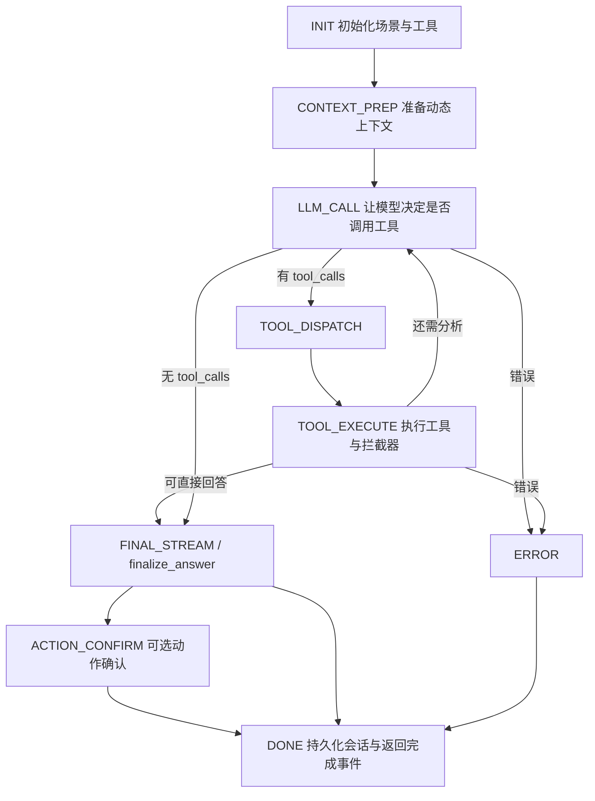

# Agent 实现逻辑与查询准确率提升分析

> 日期：2026-07-03  
> 范围：当前 `src/backend/agents/ontology_chatbi` 的 ChatBI Agent、`prompts/prompt.py`、`core/ontology` 查询链路，并结合 `docs/AI_Agent_技术发展方向调研报告.md`、`docs/Chat_V3.md`、`docs/chat_v3_technical_flow.md`。

## 1. 当前 Agent 的实现逻辑

当前 `/api/chat` 已经从早期的 ReAct 式单循环，演进为“状态机 Orchestrator + 无状态子 Agent + 确定性查询拦截器”的混合架构。整体方向与文档中强调的“确定性管道 + LLM 生成”是一致的。

### 1.1 主流程

入口为 `agents/ontology_chatbi/views.py`，每次请求创建 `ChatEngineV3` 并返回 SSE 流。

核心状态机在 `agents/ontology_chatbi/engine.py` 中，状态流转为：



每个状态只返回下一个状态，主控负责读写 `AgentState`。子 Agent 不保存全局会话状态，便于测试和替换。

### 1.2 上下文准备阶段

`CONTEXT_PREP` 目前做了四类动态注入：

1. `SchemaRetrieverAgent`：用正则关键词从 ontology 中召回相关 class、metric、relationship，构造精简 schema 上下文。
2. `GlossaryMatcherAgent`：从管理库匹配专用术语、别名、标准名。
3. `SkillRouterAgent`：用一次 LLM 调用选择相关技能包，再注入技能内容。
4. `EntityDisambiguatorAgent`：对相关 class 的 text 字段做模糊值搜索，给 LLM 注入“用户说法 -> 数据库标准值”的提示。

最后通过 `ContextCompressorAgent` 做头尾保留式压缩，避免 prompt 过长。

### 1.3 LLM 工具空间

`prompts/prompt.py` 当前只暴露两个工具：

| 工具 | 职责 | 当前定位 |
| --- | --- | --- |
| `query_ontology_data` | 按 target_class、metrics、dimensions、filters、having、order_by 查询数据 | LLM 唯一的数据查询出口 |
| `python_analyze` | 对查询结果做二次聚合、比较、排序、占比等计算 | 大结果或复杂比较时的计算出口 |

文档中提到的 `get_field_types`、`get_join_path`、`fuzzy_search_values`、`get_class_sample` 等元数据工具，当前已经基本“退幕”，由系统内部调用。这符合 `Chat_V3.md` 中的确定性拦截器设计。

### 1.4 工具执行与确定性拦截

`ToolExecutor` 在执行 `query_ontology_data` 前做了前置处理：

- 如果 filter 字段是 metric，自动挪到 `having`。
- 按 ontology field_type 对 numeric / boolean 做基础类型转换。
- 对 text filter value 调用 `fuzzy_search_values`，尝试对齐数据库标准值。
- 忽略 LLM 传入的 `limit`，避免为了展示截断业务数据。

`DataQueryEngine` 继续做 SQL 构造：

- 根据 dimensions / metrics / filters / having / order_by 自动发现依赖 class。
- 通过 `OntologyEngine.get_join_path` 自动推导多跳 JOIN 路径。
- 用 field_map 将逻辑字段映射为物理字段。
- 对指标公式、HAVING、ORDER BY、维度分组分别构建 SQL。
- 返回 `columns / rows / row_count / sql / target_class`。

如果查询结果较大，或比较类问题涉及多个大结果集，`ChatEngineV3` 会强制要求先调用 `python_analyze`，再生成最终答复。

### 1.5 最终答复与前端数据

最终答复不是直接使用 tool call 轮次中的草稿，而是再走一次轻量 final answer prompt：

- 只基于用户问题、工具结果摘要、模型草稿回答。
- 不再传 tools，降低模型继续“想调用工具”的概率。
- 对小结果集生成 `answer_datasets`，并推断 table / bar / line / pie / gauge 等图表类型。
- 完成后异步持久化 user / assistant 消息、工具步骤和 action_confirm。

## 2. 与 docs 目录文档的对应关系

### 2.1 已经落地的设计

当前实现已经落地了文档里的关键方向：

- `AI_Agent_技术发展方向调研报告.md` 强调的“确定性管道 + LLM 生成”已经成为主架构。
- `Chat_V3.md` 提出的元数据工具内化已经基本完成，LLM 只看见核心业务工具。
- `chat_v3_technical_flow.md` 描述的 schema -> logical field -> physical column -> SQL 的主链路已经存在。
- JOIN 的表达能力比旧文档更进一步，当前 `DataQueryEngine` 已支持 `key_pairs / join_keys / keys` 结构，也兼容 `source_key / target_key` 和旧的逗号拼接格式。
- prompt 初始化已使用 `threading.RLock`，外部数据库模式下 `_register_csv` 也会跳过 CSV 注册，说明一部分历史报告中的并发/连接问题已被修复。

### 2.2 文档与代码不一致的地方

需要特别注意以下差异：

1. `chat_v3_technical_flow.md` 中提到 `target_class` 为空时 `_infer_target_class` 会自动推断，但当前 `DataQueryEngine` 中没有看到该方法，`prompt.py` 的 tool schema 仍要求 `target_class`。
2. `Chat_V3.md` 中把 `execute_action` 列为显性工具，但当前 `_build_tools()` 没有暴露 `execute_action`，`ToolExecutor` 中对应分支也被注释。现在只能在最终答复后做 `find_matching_actions` 并触发确认，无法由 Agent 主动执行动作闭环。
3. `State.CLARIFY`、`State.FINAL_STREAM`、`State.ACTION_EXECUTE` 已定义，但当前处理函数基本是空壳或直接 DONE，主动澄清、流式分段输出、确认后动作执行还没有完整落地。
4. `docs` 中多处强调 Guardrail / HITL / 评估基准，但当前代码更偏执行链路，缺少系统化的输入输出校验、离线评测和线上质量反馈闭环。

## 3. 当前架构的主要不足

### 3.1 Schema 召回仍然偏规则，容易漏召回

`SchemaRetrieverAgent` 主要依赖正则提取关键词，再用字符串包含匹配 class、字段、metric。这个方式成本低，但在业务问法变化时容易失效：

- 同义词、简称、英文缩写、别名没有统一进入 schema 召回评分。
- 字段只看属性名，缺少字段描述、示例值、指标口径、业务场景的混合召回。
- 多个 class 含有同名字段时，当前 `find_class_by_field` 返回第一个命中，缺少候选集评分。
- 只召回相邻 relationship，复杂问题可能需要先推理业务主题再扩展多跳 schema。

影响：LLM 得不到正确实体/指标上下文时，后续工具参数再怎么纠错也只能局部修补。

### 3.2 target_class 强依赖 LLM，一旦选错会整体偏航

当前 `query_ontology_data` 要求 LLM 必须给 `target_class`。底层虽然会自动发现关联 class，但主表仍由 LLM 决定。

风险包括：

- 指标属于 A 表、维度属于 B 表时，LLM 选错主表会导致 JOIN 路径、字段归属、指标公式上下文都偏。
- 对“销售”“进度”“达成率”这类宽泛问题，多个实体都可能看起来相关，需要确定性投票或澄清。
- 文档中期望的 `_infer_target_class` 不存在，说明这个准确率关键点尚未闭环。

### 3.3 实体消歧是有用兜底，但覆盖面和精度有限

当前实体消歧流程是：抽取用户消息中的连续中文/英文/数字片段，对相关 class 的 text 字段做 LIKE 模糊搜索，再用字符集合相似度和后缀剥离规则打分。

不足：

- 只在 schema 召回到的 class 内查值，如果 schema 召回漏了，实体值也无法补救。
- `LIKE '%keyword%'` 对大表性能较差，也难以处理拼音、错别字、简称、行政区层级、品牌/医院/门店别名。
- 字符集合相似度对中文短词容易误判，缺少编辑距离、拼音、别名字典、字段先验权重。
- 没有把“消歧失败但候选接近”的情况转为主动澄清。

### 3.4 SQL 构造仍是字符串拼接，参数化不完整

当前已做 identifier quote、operator allowlist 和单引号转义，安全性比裸拼接更好。但 filter value、LIKE keyword、HAVING value 仍然进入 SQL 字符串。

这会带来两类问题：

- 安全风险：复杂数据库方言、转义边界、日期/数组/特殊字符场景仍可能出问题。
- 准确率风险：日期、时间范围、百分比、金额单位、IN/BETWEEN 等类型在字符串层处理，容易出现隐性类型不匹配。

### 3.5 缺少 QueryPlan 级别的结构化验证

目前 LLM 直接生成工具参数，系统边执行边修补。缺少一个显式的中间层，例如：

```text
用户问题 -> QueryPlan 草案 -> schema/metric/field/value 解析评分 -> 确定性校验/补全 -> SQL
```

没有 QueryPlan 会导致：

- 参数缺失、字段歧义、时间范围缺失时难以集中判断。
- 每个阶段的置信度不可观测，无法决定“执行、澄清、重写、拒答”。
- 离线评测只能看最终答案，很难定位错误发生在 schema 召回、字段选择、值对齐还是 SQL 执行。

### 3.6 主动澄清和 HITL 状态没有真正使用

状态机定义了 `CLARIFY`，但当前没有清晰的触发条件和澄清问题生成逻辑。对于 ChatBI，很多问题应该先问清楚：

- “最近”到底是近 7 天、本月、最近一个有数月份，还是业务周期？
- “表现不好”用销售额、达成率、同比、环比、客单价还是转化率衡量？
- “华东”在当前场景里是组织大区、行政区域，还是销售区域？
- 多个 class 都能回答时，应选择哪个业务口径？

现在模型倾向于直接猜测并查询，这会损害准确率。

### 3.7 指标治理信息还不够驱动查询

`MetricCreate` 已包含 `target_class`、`formula`、`dimensions`、`required_dimensions`、`filters_hint`、`chart_type` 等字段，但当前查询链路主要使用 target_class/formula/chart_type。仍缺少更强的指标治理：

- required_dimensions 没有用于校验用户问题是否缺维度。
- filters_hint 没有转化为默认过滤或候选提示。
- 指标粒度、时间粒度、可累加性、单位、同比/环比口径没有显式建模。
- 指标之间的派生关系和同义词没有统一检索。

### 3.8 `python_analyze` 可用，但缺少结果契约

`python_analyze` 已具备 AST 捕获最后表达式、DataFrame 解包、列名自愈和超时控制。但输出仍主要是文本 `result` 加 `data_preview`，最终回答再由 LLM 摘要。

不足：

- 没有强制要求返回结构化 `summary / table / chart / evidence`。
- 复杂计算后 `answer_datasets` 仍主要来自原始 query 结果，而不是 python 产出的最终聚合结果。
- 对同比/环比/占比等高频分析，没有内置确定性模板，依赖 LLM 写 Python。

### 3.9 图表规则、告警、动作、工作流与 Chat Agent 的联动不足

后台已有 chart_rules、alert_rules、actions、workflow_engine 等模块，但当前 Chat Agent 只做了很轻的动作匹配确认：

- 图表选择主要靠简单启发式和 metric.chart_type，没有使用 chart_rules。
- 告警规则没有成为回答中的可解释风险判断或订阅建议。
- 动作执行工具未开放，确认后的 `ACTION_EXECUTE` 也未完成。
- 工作流没有纳入 Agent 可控的 HITL 闭环。

这意味着系统目前更像“查询问答 Agent”，还不是完整的“分析 + 决策 + 行动 Agent”。

### 3.10 缺少评测闭环和线上学习

当前日志较多，transition_log 也已经有基础记录，但缺少以下能力：

- 标准问法集与 golden SQL / golden answer。
- 查询准确率、字段命中率、指标命中率、值对齐成功率的自动评测。
- 用户反馈“答案不对”后定位到 schema、metric、glossary、skill、SQL 的修复入口。
- 失败案例沉淀为回归测试、技能包或术语库增量。

没有评测闭环，就很难持续提升准确率。

## 4. 可能遗漏的关键功能

| 功能 | 当前状态 | 建议 |
| --- | --- | --- |
| 主实体自动推断 | 文档提到，但代码未看到完整实现 | 用指标/字段/实体/历史上下文投票推断 target_class |
| 字段/指标候选评分 | 主要字符串包含和首个命中 | 返回 Top-K 候选、置信度、歧义原因 |
| 主动澄清 | 状态存在但未实质使用 | 低置信度、多口径、多时间范围时触发 |
| 参数化 SQL | 目前以 quote + escape 为主 | 改为 SQLAlchemy bind params 或 SQL AST builder |
| 时间语义解析 | 基础类型转换，没有业务日历 | 支持最近、本月、季度、同比、环比、财年等 |
| 指标口径治理 | 有元数据字段但利用不足 | 加粒度、单位、可累加性、默认过滤、口径说明 |
| 结构化 QueryPlan | 暂无 | 用 Pydantic 定义计划、校验、重写和可观测字段 |
| 结构化分析结果 | python 输出偏文本 | 约束为 `summary/table/chart/evidence` |
| chart_rules 集成 | 未接入 Chat | 用规则优先级覆盖启发式图表推断 |
| action 执行闭环 | confirm 有，execute 未完成 | 补齐确认后执行、审计、回滚/重试策略 |
| 质量评测平台 | 暂无 | 建 golden set、自动回归、线上反馈修复流 |

## 5. 如何提升查询准确率

查询准确率不是单点 prompt 能解决的，应按“召回准确 -> 计划准确 -> 参数准确 -> SQL 准确 -> 结果可信 -> 答复忠实”六层提升。

### 5.1 第一层：提升 schema / metric / field 召回

建议把 `SchemaRetrieverAgent` 从纯关键词包含升级为混合召回：

1. 关键词召回：保留当前正则，作为低成本基础召回。
2. 术语/别名召回：把 glossary、metric name/name_cn/id、field aliases、class aliases 合并成统一词典。
3. 向量召回：对 class 描述、字段描述、指标口径、技能内容建 embedding。
4. 图扩展：召回一个 class 后，按 relationship 扩展一跳或按问题需要扩展多跳。
5. 评分合并：输出 Top-K class / metric / field，并带置信度和命中理由。

目标是让 LLM 看到的上下文既小，又更可能包含正确口径。

### 5.2 第二层：增加 QueryPlan 中间表示

建议在 LLM tool call 前后引入统一 QueryPlan：

```text
QueryPlan
- intent: trend / compare / rank / detail / attribution / alert / action
- target_class_candidates: [{class_id, score, reason}]
- metrics: [{name, metric_id, score, required_dimensions}]
- dimensions: [{field, class_id, score}]
- filters: [{field, operator, value, class_id, value_match_score}]
- time_range: {raw_text, start, end, granularity, confidence}
- analysis_required: boolean
- ambiguity: [{type, candidates, question}]
```

执行前先校验 QueryPlan：

- `target_class` 缺失则根据指标/字段/实体/历史上下文投票补全。
- 字段多 class 命中则选最高分，低置信度触发澄清。
- metric required_dimensions 未满足时自动补默认维度，或询问用户。
- 时间范围缺失但问题依赖时间时，选择业务默认周期并在回答中说明，或澄清。

### 5.3 第三层：强化实体值对齐

实体消歧建议从“LIKE + 字符集合相似度”升级为多策略融合：

- 为高频 text 字段建立值索引，缓存 distinct values 和 Top-N 热值。
- 支持拼音、简称、编辑距离、行政区归一化、品牌/机构别名。
- 按字段重要性加权，例如医院名、门店名、区域名比普通备注字段权重更高。
- 对候选差距小的情况触发澄清，而不是硬替换。
- 把命中结果写入可观测日志，便于发现错误别名并反哺 glossary。

### 5.4 第四层：让 SQL 生成更确定、更安全

建议逐步把 SQL 字符串拼接改为结构化 builder：

- 所有 filter/having value 使用 bind params。
- LIKE keyword 使用参数绑定，避免转义边界问题。
- 日期、数字、布尔、列表、BETWEEN 走类型化序列化。
- SQL 执行前做 dry-run / EXPLAIN 或 `LIMIT 0` 校验列存在性。
- 对 `1=1` JOIN fallback 设置高危告警，不能静默扩大结果集。
- 对 row_count 异常膨胀、全空结果、重复行暴增进行结果质量检查。

### 5.5 第五层：把高频分析变成确定性模板

不要让 LLM 每次都写 Python 处理常见 BI 分析。建议内置模板：

| 分析类型 | 确定性模板 |
| --- | --- |
| 排名 Top N | sort + head + 占比 |
| 同比/环比 | 时间对齐 + 差值 + 增长率 |
| 达成率 | actual / target + 阈值分层 |
| 结构占比 | group sum + total + percent |
| 异常下钻 | 指标变化贡献度分解 |
| 明细追因 | 维度逐层 drill-down |

LLM 只负责选择模板和解释结果，模板负责计算，准确率会明显高于自由 Python。

### 5.6 第六层：最终答复做忠实性校验

最终答复前建议增加轻量 verifier：

- 答复中的数值必须能在 tool result 或 python result 中找到来源。
- 没有数据时必须说明“未查询到/口径受限”，不能补数。
- 对使用默认时间范围、默认指标口径的地方明确说明。
- 对异常结论保留证据字段，例如维度、指标值、对比基准。

这可以减少“SQL 查对了，但自然语言说偏了”的问题。

## 6. 分阶段改进路线

### P0：先补准确率硬伤

1. 增加 target_class 自动推断：根据 metrics、dimensions、filters、order_by、entity hints 对 class 投票。
2. `find_class_by_field` 改为候选集接口：返回所有命中 class 与分数，避免首个命中误导。
3. 低置信度触发 `CLARIFY`：多 target_class、多指标口径、时间范围缺失时不要硬查。
4. SQL value 参数化：先覆盖 filters、having、fuzzy_search_values。
5. JOIN fallback 改为错误或澄清：不要在 key 映射失败时默认 `1=1`。

### P1：建立 QueryPlan 与评测闭环

1. 定义 Pydantic QueryPlan，记录候选、置信度、重写前后参数。
2. 给每个查询保存 trace：schema 召回、术语匹配、实体消歧、SQL、row_count、最终答复。
3. 建立 golden question 集：覆盖单表、多表、指标过滤、同比环比、实体别名、空结果。
4. 每次 schema/metric/glossary/skill 更新后跑回归评测。
5. `python_analyze` 输出结构化结果，并让前端图表使用最终聚合结果。

### P2：从查询问答走向分析行动 Agent

1. 接入 chart_rules，让图表规则优先于启发式推断。
2. 完成 `ACTION_CONFIRM -> ACTION_EXECUTE`，并接入审计日志。
3. 将 alert_rules/workflow_engine 纳入 Agent 可解释建议和 HITL。
4. 引入长期反馈：用户纠错自动生成 glossary/skill/schema 优化建议。
5. 对高频分析沉淀确定性模板，减少自由 Python 使用。

## 7. 结论

当前 Agent 架构的方向是正确的：状态机让执行可控，元数据工具内化降低了 LLM 幻觉和多轮成本，`DataQueryEngine` 已经承担了大量确定性 SQL 生成工作。

但准确率的瓶颈已经不在“是否能调用工具”，而在“能否稳定生成正确 QueryPlan”。最关键的补强点是：主实体自动推断、字段/指标候选评分、实体值高质量消歧、主动澄清、参数化 SQL、以及可回归的评测闭环。

建议下一阶段优先做 P0：把 target_class 推断、字段候选集、CLARIFY 触发和 SQL 参数化补齐。这些改动不会推翻当前架构，却能显著降低“查错表、选错字段、过滤值不匹配、JOIN 放大结果”的核心风险。