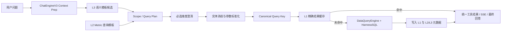

# ChatEngineV3 Cache 服务集成实施计划

> 状态：实施设计，尚未改动业务代码  
> 日期：2026-07-15  
> 依据：[ChatEngineV3_Cache_Service_Design.md](ChatEngineV3_Cache_Service_Design.md) 与 [ChatEngineV3_Cache_Integration_Analysis.md](ChatEngineV3_Cache_Integration_Analysis.md)  
> 目标：在不绕过本体治理、实体消歧、必选维度澄清与 SQL Harness 的前提下，为 `ChatEngineV3` 接入可灰度、可失效、可审计的查询缓存。

---

## 1. 最终决策

### 1.1 缓存对象与边界

本项目的缓存主对象必须是**已校验、已实体标准化的结构化查询参数及其结果**，而不是用户原问题、最终自然语言回答或原始 SQL。



必须遵守以下规则：

1. **L1 精确结果缓存**：只有在当前请求完成 Scope/Metric 校验、必选维度检查以及实体消歧后，规范化查询键完全一致时，才可以跳过物理 SQL 执行。
2. **L2 Metric 模板缓存**：同 Metric 但时间、实体筛选、维度或排序不同，只能复用“模板骨架”，改写后仍必须重新校验、实体标准化和执行。
3. **L3 语义缓存**：只能返回规划候选，不能直接返回历史结果，不能直接跳过路由、澄清和结构化计划验证。
4. **原始 SQL**：可保留在 `provenance` 用于审计和问题排查，不能作为语义改写输入，也不能成为唯一缓存键。
5. **缓存服务故障**：必须 fail-open；即任何读取、序列化、版本判断或存储异常都记录日志并回退到现有无缓存执行路径。

### 1.2 实施顺序

不要同时开发三层缓存。按以下顺序实施并上线：

| 阶段 | 范围 | 是否可返回缓存结果 | 交付目标 |
|---|---|---:|---|
| P0 | 鉴权、版本、缓存开关、存储表、可观测性 | 否 | 具备安全实施前提 |
| P1 | L1 精确结果缓存 | `observe`：否；`result_enabled`：是 | 减少重复 SQL 执行 |
| P2 | L2 Metric 模板索引 | 否 | 减少规划与 Metric 解析重复 |
| P3 | L3 语义模板候选 | 否 | 减少近似问题的规划成本 |
| P4 | 管理、失效 API、压测和灰度 | 取决于模式 | 可运营、可回滚 |

**首个可部署版本仅实现 P0 + P1。** Redis、GPTCache/向量数据库不是 P1 的前置依赖。第一期使用现有业务数据库实现持久化 L1；服务接口保持不变，后续可将热数据切换到 Redis。

---

## 2. 当前代码中的真实集成位置

### 2.1 ChatEngineV3 的两条受控查询路径

| 路径 | 当前函数 | 参数已经通过哪些检查 | L1 最终查找点 |
|---|---|---|---|
| 单查询 | `ChatEngineV3._execute_validated_query_plan()` | Scope、Query Plan、必选维度 | 实体消歧后、`DataQueryEngine.execute_query()` 前 |
| Plan-Execute 子问题 | `ChatEngineV3._execute_metric_subquestion()` | 子问题 Scope、Query Plan、必选维度、请求内重复 fingerprint | 实体消歧后、每个子问题执行前 |

`_handle_query_plan()` 仅生成 `state.planned_query_args`；此时筛选值尚未经过 `EntityDisambiguatorAgent.prepare_query_ontology_data_args()` 处理。因此**不能**在 `_handle_query_plan()` 直接查 L1。

当前 `ToolExecutor.execute()` 内部流程是：

```text
原始结构化参数
  → prepare_query_ontology_data_args（实体消歧/筛选归一化）
  → DataQueryEngine.execute_query
  → 失败后 auto_correct_query_ontology_data_args
  → 最多一次重试
```

因此必须先拆分 `ToolExecutor`，否则 `ChatEngineV3` 无法获得可安全缓存的、最终标准化参数。

### 2.2 当前代码中必须先修复的前置问题

| 问题 | 现状 | P0 处理方式 |
|---|---|---|
| `/api/chat` 鉴权 | 路由没有接收 `Request`，未验证 JWT；`ChatRequest` 也没有用户/权限字段 | 在 Chat 路由验证 Token，并生成 `CacheRequestContext` |
| 会话所有权 | Chat 请求只携带 `session_id` 与 `agent_id`，未验证会话属于当前用户和场景 | 在访问缓存前校验 conversation 的 `user_id`、`scenario_id` |
| 运行时引擎失效 | Chat 使用 `agents/ontology_chatbi/prompt.py`，部分管理模块使用 `prompts/prompt.py`；两套全局引擎缓存彼此独立 | 统一 reset 入口，或 mutation 后同时 reset 两套缓存；长期目标是删除重复实现 |
| 数据新鲜度 | 外部数据库连接没有数据快照版本；CSV 上传/删除后没有版本递增 | 引入 `data_revision`，并定义外部 ETL 刷新事件 |
| 多活跃数据连接 | `get_active_connection()` 使用 `LIMIT 1`，并不保证确定性 | P0 禁止多条活跃连接，或新增 `priority` 并使用稳定排序 |
| `SSE_CACHE_TTL_SECONDS` | 已定义、未使用 | 用新的明确缓存配置替代，避免误认为已有缓存 |

没有完成这些 P0 项目前，不允许开启跨用户共享的 L1 结果命中。

---

## 3. 目标模块与文件清单

### 3.1 新增模块

在 [src/backend/core/ontology](../../src/backend/core/ontology) 下新增以下文件：

```text
core/ontology/
├── query_cache.py              # 唯一的缓存门面与存储访问
├── query_cache_models.py       # dataclass：上下文、规范键、命中结果
├── query_cache_canonicalizer.py# 结构化参数的确定性规范化与哈希
├── query_cache_revisions.py    # 场景版本读取/递增
└── query_cache_invalidation.py # 语义化失效入口
```

不建议在首期建立独立顶级 `cache/` 包；缓存语义属于受治理的 Ontology Query 执行链，放在 `core/ontology` 能避免它被误用于通用 LLM 文本缓存。

### 3.2 需要修改的现有文件

| 文件 | P0/P1 修改内容 |
|---|---|
| [agents/ontology_chatbi/views.py](../../src/backend/agents/ontology_chatbi/views.py) | 注入 `Request`，验证 JWT，建立请求缓存上下文 |
| [agents/ontology_chatbi/state.py](../../src/backend/agents/ontology_chatbi/state.py) | 增加 `cache_context`、`cache_events`，但不保存 token 或原始连接串 |
| [agents/ontology_chatbi/engine.py](../../src/backend/agents/ontology_chatbi/engine.py) | 两条执行路径接入 L1；统一记录命中/未命中 SSE 与工具步骤 |
| [agents/ontology_chatbi/node/tool_executor.py](../../src/backend/agents/ontology_chatbi/node/tool_executor.py) | 拆分“准备参数”和“执行已准备参数”；对自动修正参数重新查缓存 |
| [agents/ontology_chatbi/prompt.py](../../src/backend/agents/ontology_chatbi/prompt.py) | `reset_engine()` 调用场景缓存版本失效入口 |
| [prompts/prompt.py](../../src/backend/prompts/prompt.py) | 与 agent-local reset 协调，避免管理端更新后 ChatEngineV3 继续使用旧元数据 |
| [core/db/db_provider.py](../../src/backend/core/db/db_provider.py) | 增加缓存表、索引与迁移兼容 |
| [core/db/sqlite_db.py](../../src/backend/core/db/sqlite_db.py) | 同步增加 SQLite 初始化表 |
| [configs/global_config.py](../../src/backend/configs/global_config.py) | 新增缓存模式、TTL、大小限制、相似度阈值配置 |
| Schema、Metric、Glossary、数据连接、文件上传、优化模块 | 成功提交后调用场景版本递增/引擎 reset |

---

## 4. P0：安全与基础设施实施步骤

### Step P0-1：定义缓存配置

在 `Cfg` 中增加以下配置。所有开关默认安全关闭：

```python
class Cfg:
    # disabled | observe | result_enabled | template_enabled
    query_cache_mode = os.getenv("QUERY_CACHE_MODE", "disabled")
    query_cache_result_ttl_seconds = int(os.getenv("QUERY_CACHE_RESULT_TTL_SECONDS", "300"))
    query_cache_relative_time_ttl_seconds = int(os.getenv("QUERY_CACHE_RELATIVE_TIME_TTL_SECONDS", "60"))
    query_cache_max_rows = int(os.getenv("QUERY_CACHE_MAX_ROWS", "500"))
    query_cache_max_payload_bytes = int(os.getenv("QUERY_CACHE_MAX_PAYLOAD_BYTES", "262144"))
    query_cache_template_ttl_seconds = int(os.getenv("QUERY_CACHE_TEMPLATE_TTL_SECONDS", "2592000"))
    query_cache_semantic_high_threshold = float(os.getenv("QUERY_CACHE_SEMANTIC_HIGH_THRESHOLD", "0.95"))
```

模式定义：

| 模式 | 读取 | 写入 | 返回 L1 结果 | 适用阶段 |
|---|---:|---:|---:|---|
| `disabled` | 否 | 否 | 否 | 默认/紧急回退 |
| `observe` | 是 | 是 | 否 | 上线前验证命中准确性 |
| `result_enabled` | 是 | 是 | 是 | P1 验收后 |
| `template_enabled` | 是 | 是 | 仅 L1；L2 可作为候选 | P2 |

### Step P0-2：增加请求级授权缓存上下文

新增 `CacheRequestContext`：

```python
@dataclass(frozen=True)
class CacheRequestContext:
    scenario_id: str
    user_id: str
    role: str
    permission_hash: str
    connection_fingerprint: str
```

实现要求：

1. `views.chat_v3()` 接受 `request: Request`。
2. 用 `verify_token(request, Cfg.jwt_secret)` 获取用户身份。
3. 校验 `req.agent_id` 对应合法场景；若 `req.session_id` 已存在，校验该会话的 `user_id` 与 `scenario_id` 均一致。
4. 初期没有细粒度行级权限时，`permission_hash = SHA256(user_id + role + scenario_id + policy_revision)`；不能只使用 `role`。
5. `connection_fingerprint` 使用活跃连接的非敏感身份：`SHA256(connection_id + db_type + masked authority/database)`；禁止把完整 `connection_url` 写入日志或缓存。
6. 将上下文传入 `ChatEngineV3.stream_chat()`，再写入 `AgentState.cache_context`。

> 如果短期内不能改造 `/api/chat` 鉴权，则 P1 只能实施为“每个 session 私有的 observe 缓存”，禁止 `result_enabled`。

### Step P0-3：创建缓存版本表与缓存实体表

使用现有业务数据库，不依赖 Redis。新增两张表。

#### `scenario_cache_revisions`

```sql
CREATE TABLE IF NOT EXISTS scenario_cache_revisions (
    scenario_id TEXT PRIMARY KEY,
    ontology_revision INTEGER NOT NULL DEFAULT 1,
    data_revision INTEGER NOT NULL DEFAULT 1,
    policy_revision INTEGER NOT NULL DEFAULT 1,
    updated_at TIMESTAMP DEFAULT CURRENT_TIMESTAMP
);
```

#### `query_cache_entries`

```sql
CREATE TABLE IF NOT EXISTS query_cache_entries (
    cache_key TEXT PRIMARY KEY,
    scenario_id TEXT NOT NULL,
    cache_kind TEXT NOT NULL,                 -- result | metric_template | semantic_template
    permission_hash TEXT NOT NULL,
    ontology_revision INTEGER NOT NULL,
    data_revision INTEGER NOT NULL,
    policy_revision INTEGER NOT NULL,
    connection_fingerprint TEXT NOT NULL,
    metric_signature TEXT DEFAULT '',
    question_fingerprint TEXT DEFAULT '',
    canonical_arguments TEXT NOT NULL,
    template_slots TEXT DEFAULT '[]',
    result_payload TEXT DEFAULT '',
    result_summary TEXT DEFAULT '',
    row_count INTEGER DEFAULT 0,
    payload_bytes INTEGER DEFAULT 0,
    provenance TEXT DEFAULT '{}',
    created_at TIMESTAMP DEFAULT CURRENT_TIMESTAMP,
    expires_at TIMESTAMP NOT NULL,
    last_hit_at TIMESTAMP DEFAULT CURRENT_TIMESTAMP,
    hit_count INTEGER NOT NULL DEFAULT 0
);

CREATE INDEX idx_query_cache_exact_lookup
ON query_cache_entries (
    scenario_id, cache_kind, permission_hash,
    ontology_revision, data_revision, policy_revision, expires_at
);

CREATE INDEX idx_query_cache_metric_lookup
ON query_cache_entries (scenario_id, metric_signature, cache_kind, expires_at);
```

实施要求：

- 为 SQLite、PostgreSQL、MySQL 使用当前 `db_provider.py` 已有的方言适配方式，不能只在 SQLite 生效。
- `expires_at` 使用 UTC；读取时同时在 SQL 条件中判定未过期。
- 每个场景在首次读取时用 upsert/insert-ignore 初始化版本行。
- 不要求在 P1 删除过期记录；提供惰性删除与后续定时清理即可。

### Step P0-4：实现版本服务与失效服务

`query_cache_revisions.py` 需要提供：

```python
class CacheRevisionService:
    def get(self, scenario_id: str) -> CacheRevisions: ...
    def bump_ontology(self, scenario_id: str) -> CacheRevisions: ...
    def bump_data(self, scenario_id: str) -> CacheRevisions: ...
    def bump_policy(self, scenario_id: str) -> CacheRevisions: ...
```

原则：**优先递增版本，不扫描并删除所有缓存键。** 缓存记录即使仍存在，只要版本不匹配便不能命中。这样对多数据库方言和未来多进程部署更安全。

`query_cache_invalidation.py` 暴露语义化入口：

```python
invalidate_ontology(scenario_id, reason: str, metric_id: str | None = None)
invalidate_data(scenario_id, reason: str)
invalidate_policy(scenario_id, reason: str)
```

P1 允许 `metric_id` 只写入审计字段，实际采用 Scenario 级 `ontology_revision` 失效。P4 再增加 Metric 级索引和精准物理清理，避免一开始引入不可靠的 SQL/Redis key 扫描。

### Step P0-5：统一运行时引擎 reset

当前存在两份引擎缓存：

- `agents/ontology_chatbi/prompt.py`：`ChatEngineV3` 实际使用；
- `prompts/prompt.py`：部分管理与提取模块使用。

新增一个共享的 `reset_scenario_runtime(scenario_id, reason)` 服务，按顺序执行：

```text
1. bump ontology/data revision（按变更类型）
2. 清理 agent-local OntologyEngine / DataQueryEngine / prompt 缓存
3. 清理 legacy prompts 模块的对应缓存
4. 记录 audit/logger 事件
```

每个 mutation endpoint 只调用共享入口，不要分别手写 `reset_engine()`。否则会继续出现“管理端修改后 ChatEngineV3 warm engine 没有更新”的问题。

### Step P0-6：接入变更钩子

以下操作**数据库 commit 成功且文件同步成功后**调用失效服务：

| 变更域 | 相关模块 | 版本递增 |
|---|---|---|
| Class、字段映射、Relationship | `modules/schema.py` | `ontology_revision` |
| Metric、Metric V2 outputs、Metric 维度绑定 | `modules/metrics.py` | `ontology_revision` |
| Concept、DimensionGroup、Glossary | 对应管理模块 | `ontology_revision`；Glossary 同时标记 L3/L2 候选过期 |
| Schema 优化成功应用 | `core/ontology/schema_optimizer.py` / `modules/schema_optimization.py` | `ontology_revision` |
| CSV 上传、替换、删除、重新提取 | `modules/knowledge_files.py` | `data_revision`；必要时同时 bump ontology |
| 外部数据连接新增、更新、激活、删除 | `modules/data_connections.py` | `data_revision` + reset QueryEngine |
| 外部 ETL 完成 | 新增 webhook/API 或调度事件 | `data_revision` |
| 权限/角色/行级策略变化 | 用户/策略管理模块 | `policy_revision` |

注意：CSV `upload_file()` 当前只写文件、不刷新运行时引擎；外部 connection CRUD 当前也不会重建当前 `DataQueryEngine`。这些都必须纳入共享 reset。

---

## 5. P1：L1 精确结果缓存的可执行实现

### Step P1-1：拆分 ToolExecutor 的准备与执行

将当前 `ToolExecutor.execute()` 拆分为以下三个公开方法：

```python
async def prepare_query_arguments(self, arguments, query_engine, engine) -> dict:
    """只做实体消歧与筛选值归一化；不执行 SQL。"""

async def execute_prepared_query(self, prepared_arguments, query_engine, engine) -> dict:
    """只执行 DataQueryEngine；不再次做实体消歧。"""

async def correct_prepared_query_arguments(self, prepared_arguments, query_engine, engine) -> dict:
    """仅在首次 SQL 失败后生成一次受控修正参数。"""
```

保留原 `execute()` 作为兼容包装器，避免影响其他工具调用：

```text
prepare → execute_prepared → 如需要则 correct → execute_prepared
```

原因：L1 的 key 必须使用实体标准化后的参数。例如用户输入“江苏”和本体实际枚举值 `Jiangsu` 必须产生相同 key；预处理前查缓存会降低命中率，甚至会缓存错误过滤值。

### Step P1-2：定义 canonical query

`query_cache_canonicalizer.py` 的输入为**已验证且已准备的** `prepared_arguments`，输出为 `CanonicalQuery`。

必须进入 L1 key 的字段：

```json
{
  "scenario_id": "state.agent_id",
  "permission_hash": "来自认证上下文",
  "revisions": {
    "ontology": 4,
    "data": 12,
    "policy": 2
  },
  "connection_fingerprint": "sha256(...) ",
  "query": {
    "target_class": "...",
    "join_classes": ["..."],
    "metrics": ["parent_metric_id", "parent_metric_id:output_id"],
    "dimensions": ["..."],
    "filters": [{"field": "...", "operator": "=", "value": "..."}],
    "having": [{"metric": "...", "operator": ">", "value": 10}],
    "order_by": "..."
  }
}
```

规范化规则：

1. 删除运行时字段：`user_question`、glossary 上下文、重试计数、显示文本、缓存元数据。
2. 统一空值：缺少 `join_classes`、`dimensions`、`filters`、`having` 时统一为 `[]`；`order_by` 统一为 `""`。
3. Metric 必须使用校验后的 parent Metric ID 和 V2 output ID；不能只使用显示名称。
4. `join_classes`、无顺序语义的 Metric/Dimension 集合按稳定排序；Join 路径若有顺序语义，必须保存完整路径而非只排序类名。
5. `filters` 使用 `(field, operator, normalized_value)` 排序；`IN`/`NOT IN` 的值集合排序去重。
6. 保留 `order_by` 的优先级和方向，不能排序改变语义。
7. 时间必须以实体消歧后的绝对值参加 key；若当前实现不能可靠解析“本月/上周”，把原始时间表达式与短 TTL 一起加入 key，禁止长 TTL。
8. 使用 `json.dumps(..., sort_keys=True, separators=(",", ":"), ensure_ascii=False)` 再做 SHA-256。

不要复用现有 `_metric_query_fingerprint()` 作为 L1 key；它只覆盖部分字段，没有版本、权限、连接、实体标准值和相对时间防护。可保留它用于当前请求内子问题去重。

### Step P1-3：定义结果可缓存判定

仅满足全部条件的执行结果可写入 L1：

```python
def is_cacheable_result(result: dict, prepared_args: dict, config: CacheConfig) -> bool:
    return (
        not result.get("error")
        and result.get("harness", {}).get("ok", True)
        and not result.get("unsafe_join_fallback")
        and int(result.get("row_count") or 0) <= config.max_rows
        and serialized_size(result) <= config.max_payload_bytes
    )
```

实现时应使用当前实际的 Harness 字段名；若 Harness 返回结构中没有可验证状态，先补充该状态再允许缓存。不得缓存：

- SQL/Harness 报错；
- 经过不可信 Join 回退的结果；
- 自动修正仍未成功的结果；
- 行数或字节数超限结果；
- 含未澄清实体歧义或待确认操作的结果；
- `python_analyze` 结果、Action 执行结果、最终自然语言回答。

### Step P1-4：在单查询路径接入 L1

在 `_execute_validated_query_plan()` 中按以下固定顺序实现：

```text
1. 读取 planned_query_args
2. 调用 executor.prepare_query_arguments(...)
3. 参数准备失败：沿用现有错误处理，不读/不写缓存
4. 读取 scenario revisions 与 CacheRequestContext
5. canonicalize(prepared_arguments)
6. lookup_result(canonical)
7. observe：记录 would_hit，但继续执行 SQL
8. result_enabled 命中：使用缓存 result，跳过 SQL
9. 未命中：execute_prepared_query(...)
10. 如 SQL 失败：一次自动修正参数 → 重新 canonicalize → 再查 L1 → 必要时执行
11. 成功且可缓存：store_result(...)
12. 无论命中或未命中，都复用现有 ToolCallRecord / all_tool_results / SSE / 最终回答路径
```

不要在 L1 命中后直接 `return State.FINAL_STREAM`。当前 `_execute_validated_query_plan()` 根据结果大小决定 `FINAL_STREAM` 或进入 `LLM_CALL`，并重建工具结果上下文、限制下一轮工具为 `python_analyze`。命中路径必须保留该行为，保证答案质量和前端协议一致。

### Step P1-5：在 Plan-Execute 子问题路径接入 L1

在 `_execute_metric_subquestion()` 中：

```text
query_validation 成功
  → 必选维度检查成功
  → 生成 arguments 和当前 request-local fingerprint
  → prepare_query_arguments
  → canonicalize + L1 lookup
  → 命中：子问题写入 result/status=completed
  → 未命中：执行、必要时自动修正、写入 L1
  → 始终写 tool_call_records / all_tool_results / SSE
```

每个子问题独立使用 L1 key。禁止给整个 `metric_plan` 建一个“大结果缓存”；原因是子问题组合、顺序、失败/澄清状态和最大查询次数都可能变化，整体缓存难以安全复用。

### Step P1-6：统一缓存可观测性

在工具结果中添加以下字段，不改变现有顶层 SSE 类型：

```json
"cache": {
  "mode": "observe",
  "status": "miss | would_hit | hit | bypass | write_skipped | write_success",
  "layer": "L1",
  "key_prefix": "l1:3f91a8",
  "reason": "exact_match | expired | revision_mismatch | payload_too_large",
  "age_seconds": 83,
  "execution_saved": false
}
```

要求：

- `cache_key` 仅记录前缀或不可逆 hash，不暴露筛选值、连接串、token；
- 工具步骤持久化时保留 `cache` 字段；
- 日志记录 `query_id`、`session_id`、`scenario_id`、layer、status、耗时；
- P1 增加最小指标：`lookup_total`、`hit_total`、`would_hit_total`、`write_total`、`write_skipped_total`、`db_execution_saved_total`、`cache_failure_total`。

---

## 6. P2：L2 Metric 查询模板缓存

P2 的目标不是直接返回数据，而是降低“同 Metric 但参数变化”场景下的规划成本。

### 6.1 Metric signature

模板索引必须基于下列内容构造 `metric_signature`：

```text
scenario_id
+ parent Metric ID
+ V2 output ID/name（如适用）
+ Metric definition hash
+ anchor/source Class
+ fixed Metric filters
+ required_dimensions / dimension_group bindings
+ ontology_revision
```

不得仅以 Metric 名称作为模板 key。

### 6.2 允许模板化的槽位

首期仅允许以下四类槽位：

| 槽位 | 允许操作 | 额外校验 |
|---|---|---|
| `time_range` | 替换/增加已有时间筛选 | 转绝对时间或短 TTL |
| `filter_values` | 替换已有筛选字段的值 | 必经实体消歧与字段类型校验 |
| `dimensions` | 在模板允许白名单内增加/替换 | 必经 Scope/Metric/必选维度校验 |
| `order_by` | 修改排序方向/字段 | 仅允许已选择 Metric 或 Dimension |

禁止模板自动改变：Metric 定义、固定过滤、Class、Join 键、关系路径、聚合算法、从单查询切换为归因型 Plan-Execute。

### 6.3 接入位置与流程

在 `_handle_query_plan()` 取得 `validation["query_plan"]` 后：

```text
1. 计算当前 Metric signature
2. lookup_metric_template(scenario, signature, ontology_revision, permission_hash)
3. 命中时只将模板作为 planner 的受约束候选/调试信息
4. 当前 Query Plan 仍必须完成既有 validation
5. ClarifyAgent 仍必须执行
6. 最终仍由 P1 的实体标准化 + L1 决定是否可复用结果
```

P2 初期可先在“Query Plan 成功后的结果”中写模板，不必让 LLM 直接跳过规划。验证模板命中质量后，再将候选注入 `OntologyAgent.plan_query_details()` 的 prompt/参数。

---

## 7. P3：L3 语义模板候选

### 7.1 接入原则

L3 只优化“问题→受控计划”的候选选择，不直接优化“问题→最终回答”。

位置：`_handle_context_prep()` 内，Glossary 匹配和 Schema/Metric 检索完成后、`decide_execution_mode()` 前。

```text
当前问题 + 当前上下文
  → L3 候选召回（同 scenario、同 permission、同 ontology revision）
  → 使用当前 Schema/Metric candidates 过滤候选
  → 高置信候选提供给路由/规划器
  → 当前请求仍运行执行模式决策、Scope、Query Plan、Clarify
  → P1 L1 决定是否复用结果
```

不能在 `stream_chat()` 入口直接从 L3 返回，因为此时未处理：会话追问、相对时间、当前 Schema 版本、Metric 可用性、必选维度和实体标准化。

### 7.2 技术选型

- 先定义 `SemanticTemplateStore` 接口；P3 前不安装 GPTCache。
- P3 的最小实现可使用数据库中的规范化问题 hash + 词项 Top-K 召回。
- 向量检索成为瓶颈后，再接入 GPTCache 或 Redis Vector；它们只能实现 embedding、Top-K 和相似度，不替代本项目的权限、版本、模板槽位和失效逻辑。
- 相似度 `>= 0.95` 且意图类型、Metric 集合、时间类型一致时，才能标为 high candidate；仍需重放校验。

---

## 8. TTL 与失效策略

| 条件 | L1 TTL | 处理 |
|---|---:|---|
| 数据源未知新鲜度 / 外部实时库 | 60–300 秒 | 默认短 TTL |
| 历史静态聚合数据 | 1–24 小时 | 仍必须包含 data revision |
| 含“今天/本周/本月/当前”等表达 | 60 秒或更短 | key 中纳入绝对解析值 |
| L2 模板 | 7–30 天 | ontology revision 不同即失效 |
| L3 模板 | 7–30 天 | ontology/Glossary revision 不同即失效 |

版本失效优先级高于 TTL。任意 `ontology_revision`、`data_revision`、`policy_revision`、`connection_fingerprint`、`permission_hash` 不匹配时，结果必须视为未命中。

---

## 9. 测试与上线门禁

### 9.1 单元测试

新增 `src/backend/tests/test_query_cache.py`，覆盖：

1. 相同 canonical query 产生相同 hash；
2. `IN` 值的不同排列产生相同 hash；
3. `order_by` 改变产生不同 hash；
4. 时间、权限、连接、三类 revision 任一变化都不命中；
5. 实体别名标准化后产生相同 hash；
6. 超行数、超字节、错误结果、风险 Join 结果不写缓存；
7. 缓存读取异常时仍调用执行器；
8. `observe` 永不跳过 SQL；
9. Plan-Execute 两个子问题独立命中/未命中；
10. 自动修正后的参数重新使用新的 canonical key。

### 9.2 集成测试

1. 同用户、同场景、同参数连续请求两次：第二次在 `result_enabled` 模式下不执行数据库查询，但仍产生 `tools` SSE 与同等最终回答流程。
2. 不同用户或角色：即使参数相同也不得复用结果。
3. Metric 修改、关系修改、数据连接更新、CSV 替换后：旧缓存不得命中。
4. “本月”和“上月”：不得相互命中。
5. “江苏”与其实体标准值：应命中同一规范参数。
6. 缺少必选维度：必须进入 `CLARIFY`，不能返回缓存。
7. 缓存表不可用：Chat 正常降级，不返回 500。

### 9.3 灰度标准

1. 部署后先运行 `QUERY_CACHE_MODE=observe` 至少 5 个工作日；
2. 对每个 `would_hit` 抽样比较数据库实时结果，确认无权限、版本和时间误命中；
3. 满足以下条件再对内部用户开启 `result_enabled`：
   - 缓存错误命中 = 0；
   - 缓存异常自动回退成功率 = 100%；
   - 结果 payload 超限写入 = 0；
   - L1 命中样本的 SQL 结果一致率 = 100%；
4. 任意异常时设置 `QUERY_CACHE_MODE=disabled` 立即回退，不需要数据库迁移回滚。

---

## 10. 推荐实施任务拆分

| 任务 | 前置 | 预计产出 |
|---|---|---|
| 1. 路由鉴权与会话/场景校验 | 无 | `CacheRequestContext` 可安全生成 |
| 2. 缓存配置、表、revision service | 1 可并行 | P0 存储与开关 |
| 3. 统一 scenario runtime reset | 2 | 管理变更不会留下 warm engine |
| 4. ToolExecutor 准备/执行拆分 | 无 | 标准化参数可被 Engine 读取 |
| 5. Canonicalizer 与 L1 repository | 2、4 | 可查/写精确结果 |
| 6. 单查询 L1 接入 | 5 | 单查询 observe/result hit |
| 7. Plan-Execute 子问题 L1 接入 | 5 | 子问题独立命中 |
| 8. 失效钩子接入各 mutation | 3 | 本体/数据变更安全失效 |
| 9. 单元、集成、SSE 回归测试 | 6、7、8 | P1 上线门禁 |
| 10. L2 模板索引 | P1 稳定 | 可控的同 Metric 复用 |
| 11. L3 语义召回 | L2 稳定 | 语义模板候选 |

P0 + P1 应先作为一个独立功能分支或一组可回滚提交完成；不要与 Metric、Schema 优化或前端主题改造混合提交。

---

## 11. 实施完成后的预期行为

- 相同用户在相同场景内再次询问完全相同、数据版本未变的已解析查询：命中 L1，省去 SQL 执行，但前端仍收到正常的工具步骤与最终回答。
- 同 Metric 但“江苏→浙江”“本月→上月”“总计→按省份”：P1 不错误返回旧结果；P2/P3 可加速规划，最终仍重新验证并执行。
- Schema、Metric、关系、数据文件、连接或权限变更：版本变化使旧结果自然失效；重置运行时 Ontology/DataQueryEngine。
- 缓存数据库、向量服务或 Redis 不可用：请求继续使用当前 ChatEngineV3 查询链路，不降低正确性。

这套顺序把“结果复用”严格放在当前治理链路完成之后，把“近似问题复用”严格限制为模板候选，从而能取得性能收益，同时不破坏 ChatEngineV3 的安全和可解释性边界。
