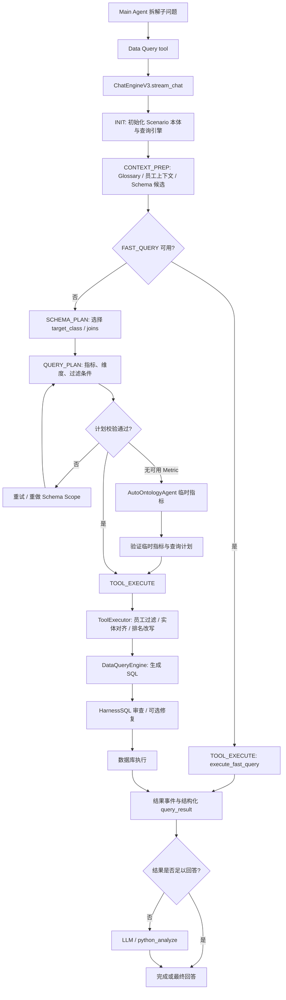
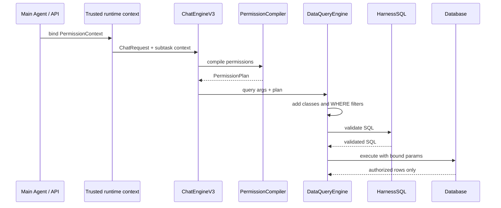

# `ChatEngineV3` 工作流程、缓存与权限控制审查

> 审查日期：2026-07-21
> 范围：`ChatEngineV3` 作为 Main Agent 下游的 Data Query SubAgent；重点覆盖查询规划、SQL 执行、缓存与行级权限。
> 结论：当前分阶段规划与受控 SQL 执行的总体方向正确，但在**子问题上下文传递、权限强制执行、快速查询旁路、缓存隔离及临时指标审计**方面仍有必须补齐的缺口。上线敏感数据查询前，应先完成本文 P0 项。

---

## 1. 当前工作流梳理



### 1.1 现有优点

1. **两阶段规划**：先确定 Schema Scope，再确定指标、维度、过滤条件；避免模型直接生成 SQL。核心流程位于 [app/agents/data_query/engine.py](../../app/agents/data_query/engine.py#L310-L445)。
2. **执行前参数处理**：标准本体查询在执行前经过员工筛选、实体对齐与排名语义改写，位于 [app/agents/data_query/node/tool_executor.py](../../app/agents/data_query/node/tool_executor.py#L64-L97)。
3. **SQL 构建集中化**：字段映射、JOIN、WHERE、HAVING、ORDER BY 和 HarnessSQL 均由 `DataQueryEngine` 处理，降低 LLM 直接拼 SQL 的风险，位于 [app/core/ontology/data_query.py](../../app/core/ontology/data_query.py#L1352-L2042)。
4. **临时指标是请求作用域的**：`AutoOntologyAgent` 不修改共享本体；`DataQueryEngine` 使用 `ContextVar` 在单次 `execute_query()` 内注册并在 `finally` 中重置，避免跨请求泄漏，位于 [app/core/ontology/data_query.py](../../app/core/ontology/data_query.py#L28-L32) 和 [app/core/ontology/data_query.py](../../app/core/ontology/data_query.py#L1352-L1397)。
5. **本体加载已具备版本失效能力**：Scenario 连接地址或 ontology version 变化时会重新加载引擎，位于 [app/agents/data_query/prompt.py](../../app/agents/data_query/prompt.py#L696-L733)。这可作为计划缓存和结果缓存的核心失效维度。

---

## 2. 流程审查结论与缺陷

### P0：SQL 层权限没有接入当前 `ChatEngineV3` 执行链路

**现状**

- `ChatRequest` 只有会话、Scenario、消息和通用 `options`，没有受信任的用户/角色/数据范围字段：[app/agents/data_query/models.py](../../app/agents/data_query/models.py#L9-L16)。
- `DataQueryEngine.execute_query()` 没有权限上下文或权限谓词参数；WHERE 仅由普通 `filters` 构建：[app/core/ontology/data_query.py](../../app/core/ontology/data_query.py#L1352-L1397) 与 [app/core/ontology/data_query.py](../../app/core/ontology/data_query.py#L1788-L1820)。
- 已有语义契约包含 `permission_clause` 与 `row_level_security_resolved`，但该能力没有成为 `ChatEngineV3` 的强制门禁：[app/agents/contracts.py](../../app/agents/contracts.py#L375-L381)。

**风险**

Main Agent 即使已经鉴权，子问题提交到 `ChatEngineV3` 后也没有强制把用户的数据范围转化为 SQL 约束。模型生成的过滤条件、员工姓名上下文或 HarnessSQL 元数据都不能替代真正的行级权限。

**结论**：这是上线前必须解决的 P0。

### P0：快速查询路径绕过标准查询安全链

**现状**

`FAST_QUERY` 会直接构造物理表查询参数：[app/agents/data_query/engine.py](../../app/agents/data_query/engine.py#L275-L307)。随后 `_execute_validated_query_plan()` 直接调用 `execute_fast_query()`，没有经过 `ToolExecutor`：[app/agents/data_query/engine.py](../../app/agents/data_query/engine.py#L808-L824)。

**影响**

快速查询跳过员工过滤规范化、实体对齐、自动纠错，也会跳过未来若只接在 `ToolExecutor` 的权限注入。物理表查询比本体查询更应采用严格权限控制。

**建议**

- 将权限门禁置于 `DataQueryEngine`，而不是只置于 `ToolExecutor`。
- 快速查询单独走 `PermissionCompiler.compile_fast_query()`；无法为该表解析权限规则时应**拒绝执行**。
- 在敏感环境中默认关闭 `FAST_QUERY`，仅对明确允许的只读数据集启用。

### P0：HarnessSQL 改写后缺少权限不变量校验

**现状**

SQL 在执行前会交由 HarnessSQL 预处理；执行失败时还会触发 repair。当前执行路径在 [app/core/ontology/data_query.py](../../app/core/ontology/data_query.py#L1948-L2042)。

**风险**

即使初始 SQL 包含权限谓词，任何 SQL rewrite/repair 若不验证“权限条件仍然存在且语义未变”，都可能扩大数据范围。

**建议**

- 对权限谓词生成结构化 `PermissionAudit`，包含 `policy_version`、逻辑字段、操作符、许可值摘要和预期 SQL AST 片段。
- 每次 HarnessSQL `prepare` 或 `repair_after_error` 返回 SQL 后，执行 `assert_permission_invariants()`。
- 对含权限谓词的查询，关闭语义优化改写；只允许语法级修复，并且修复后必须通过不变量验证。

### P1：Main Agent 子问题的上下文隔离过强，且 `query_args` 未进入 `ChatEngineV3`

**现状**

- Data Query 工具为每次调用生成随机 `session_id` 和 `query_id`：[app/agents/data_query/tools.py](../../app/agents/data_query/tools.py#L1154-L1188)。
- `ChatEngineV3.stream_chat()` 初始化时将 `history_messages` 固定为空：[app/agents/data_query/engine.py](../../app/agents/data_query/engine.py#L91-L112)。
- `_query_with_chatengine_v3()` 的 `query_args` 仅用于后续结果标准化；没有传入 `ChatRequest` 或 `ChatEngineV3`：[app/agents/data_query/tools.py](../../app/agents/data_query/tools.py#L1154-L1192)。

**影响**

1. Main Agent 已经完成的子任务约束、用户身份、权限范围、已确认实体、上游口径无法稳定传入。
2. 子问题会重新规划，可能偏离 Main Agent 给出的 `query_args`。
3. 虽然文件中有 `_load_conversation_history()`，但当前 `stream_chat()` 并未使用它：[app/agents/data_query/engine.py](../../app/agents/data_query/engine.py#L1620-L1677)。

**建议**

将 Main Agent 提供的信息拆分为两种输入：

- `trusted_execution_context`：服务端生成，只能由 Main Agent/运行时注入；包含用户、权限、Scenario、租户、数据策略版本、父任务/子任务 ID。
- `subtask_context`：Main Agent 的拆解结果；包含子问题、已确认实体、允许的目标数据集、可复用的已验证计划摘要。

不要把不受信任的任意 `options` 直接当成权限或 SQL 条件。

### P1：临时指标流程可用，但存在能力和可观测性缺口

**现状**

- 仅当错误以“指标或字段不存在于当前 Schema Scope”开头时，才触发临时指标：[app/agents/data_query/engine.py](../../app/agents/data_query/engine.py#L370-L438)。
- 自动构建的计划会将 `metrics` 强制覆盖为单一临时指标。[app/agents/data_query/node/auto_ontology_agent.py](../../app/agents/data_query/node/auto_ontology_agent.py) 中 `plan_temporary_metric()` 的 `query_payload["metrics"]` 赋值。
- 本体识别 SSE 事件只从持久化本体的 `engine.list_metrics()` 汇总，临时指标不在其中，因此前端会显示“无”或缺失指标定义：[app/agents/data_query/engine.py](../../app/agents/data_query/engine.py#L925-L1029)。

**影响与建议**

- 混合“已有指标 + 临时指标”的问题不能被正确表达；应明确限制为单指标问题，或扩展契约为 `temporary_metrics` 与已有指标可共存。
- 在 `AgentState` 中显式保存 `temporary_metrics`，并在 SSE、审计、查询结果中返回 `temporary_metric_ids`、定义摘要、策略校验结果。
- 新增指标单位、领域、可组合 class、算术组合的策略校验；不能只验证字段存在。

### P1：错误重试具有重复成本，部分错误不应重试

`ToolExecutor` 对所有异常仅重试一次：[app/agents/data_query/node/tool_executor.py](../../app/agents/data_query/node/tool_executor.py#L100-L123)。数据库权限拒绝、Schema 不存在、参数形状错误等确定性错误重试没有收益，且会增加延迟和日志噪声。

**建议**：基于异常/错误码分类。

| 错误类别 | 建议 |
| --- | --- |
| 网络超时、连接池暂时故障 | 有退避的有限重试 |
| 字段不存在、权限拒绝、SQL Guard 阻断、输入校验失败 | 不重试，直接返回结构化错误 |
| 实体值不匹配 | 只执行一次受控自动纠正 |
| 临时指标验证失败 | 不再重复调用同一 Agent；返回澄清或上报 Main Agent |

### P2：SSE 缓存代码处于半启用状态

`_cache_sse_payload()` 已实现，但写缓存语句被注释：[app/agents/data_query/engine.py](../../app/agents/data_query/engine.py#L1078-L1099)。API 层已有 query-run 和事件缓存实现。[app/api/routes/agents.py](../../app/api/routes/agents.py#L140-L159)。

建议二选一：

1. 由 API 层统一负责事件持久化，删除 Engine 内无调用的缓存代码；或
2. 由 Engine 写入统一命名空间和统一 TTL 的可回放事件流，并明确 API 层只消费该流。

不要维持两套潜在事件缓存。

---

## 3. 缓存设计建议

### 3.1 缓存原则

1. **权限隔离优先于命中率**：不同数据权限绝不共享计划、SQL 或结果缓存。
2. **版本化失效**：至少绑定 `scenario_id`、`ontology_version`、数据连接标识、`permission_policy_version`。
3. **结果缓存只存受控结果**：只能缓存完成权限注入并通过 HarnessSQL 的结果。
4. **缓存不可替代审计**：缓存命中也要返回 `cache_hit`、缓存键摘要、策略版本、数据快照/TTL 信息。
5. **不要缓存敏感明文上下文**：键使用 `SHA-256` 摘要；缓存值根据数据分级决定是否只保存计划或结果摘要。

### 3.2 推荐缓存层次

| 层 | 接入点 | 建议键组成 | 值 | 失效/TTL |
| --- | --- | --- | --- | --- |
| 本体运行时缓存 | `init_prompt()` | Scenario + DB URL fingerprint + ontology version | `OntologyEngine`、`DataQueryEngine` | 已存在；版本或连接变化失效 |
| 语义上下文缓存 | `_handle_context_prep()` 后 | Scenario + ontology version + normalized question + glossary catalog version | Schema/metric candidates、Glossary matches | 5–30 分钟；本体/词表变更失效 |
| 查询计划缓存 | `QUERY_PLAN` 校验成功后 | Scenario + ontology version + subquestion hash + `permission_scope_hash` + employee context hash | 已验证 `query_scope`、`query_plan`、临时指标摘要 | 5–15 分钟；权限/本体变更失效 |
| SQL/结果缓存 | 权限注入、HarnessSQL 成功后、实际执行前 | Scenario + connection fingerprint + ontology version + **normalized authorized SQL** + parameter hash + `permission_scope_hash` | 行、列、SQL Guard 审计、数据来源 | 按数据时效 30 秒–5 分钟；权限策略/数据版本变更失效 |
| SSE 回放缓存 | 每个规范化事件发出后 | query ID / subtask ID | 脱敏事件序列 | 短 TTL，例如 15–60 分钟 |

### 3.3 在当前代码中的建议接入位置

#### A. 上下文缓存

在 [_handle_context_prep()](../../app/agents/data_query/engine.py#L237-L272) 中：

1. 先计算 `context_cache_key`。
2. 命中时恢复 `glossary_matches`、`employee_context`、`schema_context`、`metric_context` 和 `metric_candidates`。
3. 未命中时运行现有 Agents，再写入缓存。

注意：`employee_context` 可能与用户身份和权限关联，必须包含 `user_scope_hash`，且缓存值应做脱敏。

#### B. 计划缓存

在 [_handle_query_plan()](../../app/agents/data_query/engine.py#L355-L445) 中：

- 在调用 `plan_query_details()` 前查缓存。
- 只读取“已通过 `OntologyAgent.validate_query_plan()`”的计划。
- 缓存中必须包含所有 `join_paths`、`temporary_metrics` 及其策略审核结果。
- 缓存命中后仍要运行**权限编译**，因为权限属于执行时强制约束，不能仅复用旧 SQL。

#### C. 查询结果缓存

推荐在 `DataQueryEngine.execute_query()` 内，**权限条件已编译且 HarnessSQL 已完成权限不变量校验之后**、真正连接数据库之前接入。

这样可确保：

- 无论调用方来自标准查询、快速查询还是未来的直接调用，均遵守相同规则。
- 缓存键使用最终 SQL + bind parameters + permission scope hash，天然避免跨用户串数据。

不要在 `ChatEngineV3` 刚收到原始用户问题时直接缓存最终结果：相同自然语言在不同用户权限、不同本体版本、不同时间窗口下可能对应不同结果。

### 3.4 推荐缓存键示例

```text
plan:v2:{scenario}:{ontology_version}:{question_hash}:{glossary_version}:{permission_scope_hash}
result:v2:{scenario}:{connection_hash}:{ontology_version}:{authorized_sql_hash}:{bind_hash}:{permission_scope_hash}:{policy_version}
events:v1:{query_id}
```

其中：

- `permission_scope_hash = sha256(canonical_json({tenant, user_id, roles, allowed_scopes, policy_version}))`
- `authorized_sql_hash` 必须来自**权限注入后的 SQL**。
- `canonical_json` 必须排序 key 和列表元素，以避免同语义、不同顺序造成无效缓存未命中。

---

## 4. 权限控制设计：在哪里接入、如何接入

### 4.1 结论：不要“把用户信息直接拼在 SQL 后面”

不建议将用户信息或原始 `permission_clause` 字符串直接追加到 SQL 尾部。原因：

- SQL 可出现/不存在 WHERE、GROUP BY、HAVING、ORDER BY，简单追加很容易生成错误 SQL。
- 直接拼接用户输入会产生 SQL 注入风险。
- 权限常需要 JOIN 到组织、区域、人员映射表；必须先参与 JOIN 依赖推导。
- HarnessSQL 改写后还需要验证权限条件没有被删改。

应使用**结构化权限上下文 → 权限策略编译器 → 参数化/受控 SQL 谓词**的模式。

### 4.2 推荐优先级

1. **首选：数据库原生 RLS / 受限 View**
   - PostgreSQL 可用 Row-Level Security，应用使用受限数据库角色，并通过事务级 session variable 设置用户/租户上下文。
   - MySQL 或现有数据库可使用按角色受限的 View 或存储过程。
   - 优点：即使应用代码出现遗漏、绕过 `ChatEngineV3` 或缓存误用，数据库仍是最终防线。

2. **应用层强制谓词：本项目必须具备**
   - 即使已有数据库 RLS，也保留应用层权限编译与审计，便于提供明确的“无权限”错误、减少无效查询并支持不同数据源。

3. **提示词/LLM 约束：只能是辅助**
   - 可以让模型理解角色范围，但绝不能作为授权机制。

### 4.3 新增受信任数据结构

建议新增如下模型（示意）：

```python
@dataclass(frozen=True)
class PermissionContext:
    user_id: str
    tenant_id: str
    roles: tuple[str, ...]
    allowed_territories: tuple[str, ...]
    allowed_entities: tuple[str, ...]
    policy_version: str
    request_id: str
```

并新增 `PermissionPlan`：

```python
@dataclass(frozen=True)
class PermissionPlan:
    required_classes: tuple[str, ...]
    predicates: tuple[PermissionPredicate, ...]
    bind_values: Mapping[str, object]
    policy_version: str
    scope_hash: str
    audit_summary: Mapping[str, object]
```

`PermissionPredicate` 使用逻辑字段、目标 class、操作符和值的结构化表达；不要使用来自客户端的原始 SQL 文本。

### 4.4 上下文传递路径




当前已有 Scenario 与原始问题的 trusted context 机制，可在 [app/agents/data_query/context.py](../../app/agents/data_query/context.py#L1-L40) 的模式上扩展 `trusted_permission_context`。但 `PermissionContext` 必须由服务端认证结果构造，绝不能由 tool 参数或 LLM 输出构造。

### 4.5 精确接入点

#### 入口：Main Agent / API

- Main Agent 获得经认证的用户信息后构造 `PermissionContext`。
- 将其绑定到 async `ContextVar` 或作为显式参数传递。
- 将父任务 ID、子任务 ID、权限策略版本一起传入；用于审计、缓存和 SSE 关联。

#### `ChatEngineV3`

建议将 `ChatRequest` 扩展为显式、只读的服务端字段，或将执行上下文作为 `stream_chat()` 的 keyword-only 参数：

```python
async def stream_chat(
    self,
    req: ChatRequest,
    *,
    execution_context: TrustedExecutionContext,
    output_mode: StreamOutputMode = "query_only",
) -> AsyncGenerator[str, None]:
```

在 `AgentState` 中保存不含敏感明文的审计摘要，例如 `permission_scope_hash`、`policy_version` 和 `parent_query_id`；完整权限数据保留在不可被 LLM 读取的执行上下文中。

#### `DataQueryEngine.execute_query()`：应用层权限的关键位置

在 [execute_query()](../../app/core/ontology/data_query.py#L1352-L1397) 的 SQL 构建入口添加 `permission_plan` 参数。

正确顺序：

1. 接收已验证的业务查询计划。
2. `PermissionCompiler` 根据 target class、已知 join classes、用户权限生成 `PermissionPlan`。
3. 将 `required_classes` 并入 `discovered_classes`，使权限关联表能安全建立 JOIN。
4. 建立 `alias_map` 后，根据 alias 渲染权限谓词。
5. 将权限谓词加入 `where_parts`，使用 AND 与业务过滤条件组合。
6. 将权限审计摘要和策略版本写入 `harness_context`。
7. HarnessSQL 返回后验证权限谓词不变量。
8. 使用参数绑定执行，而不是把用户值拼接到 SQL 字符串。

#### `DataQueryEngine.execute_fast_query()`

同样必须接受 `permission_plan`。快速查询采用物理字段，因此其权限策略应显式配置“表 → 权限字段/受限 View”；无法解析规则时 fail closed。

#### `ToolExecutor`

`ToolExecutor` 可负责把 `execution_context.permission_plan` 传给查询引擎、记录审计元数据，但不应成为唯一注入点；否则 `execute_fast_query()` 或其他直接调用仍可能绕过权限。

### 4.6 最小改造清单

1. 定义 `PermissionContext`、`PermissionPlan`、`PermissionCompiler` 和结构化谓词类型。
2. 在认证/API/Main Agent 入口创建可信上下文；在 `data_query.context` 增加 bind/reset 方法。
3. 扩展 `ChatRequest`/`stream_chat()` 和 `AgentState`，传递权限审计摘要与父子任务 ID。
4. 为 `execute_query()`、`execute_fast_query()` 添加 `permission_plan` 参数并 fail closed。
5. 在 JOIN 推导之前合并权限所需 class；在 WHERE 渲染阶段合并权限谓词。
6. 为 HarnessSQL 增加权限不变量校验。
7. 结果和 SSE 中返回脱敏权限审计字段：`policy_version`、`scope_hash`、`applied_predicate_count`、`permission_enforced=True`。
8. 把 `permission_scope_hash` 与 `policy_version` 加入所有计划/结果缓存键。

---

## 5. 建议的落地顺序

### Phase 0：先堵住权限绕过

- [ ] 实现 `PermissionContext` 和 `PermissionCompiler`。
- [ ] 标准查询与快速查询均必须接收 `PermissionPlan`。
- [ ] 策略无法解析时拒绝查询，返回结构化 `permission_denied` 或 `permission_policy_unavailable`。
- [ ] HarnessSQL 改写后增加权限不变量校验。
- [ ] 禁止将用户原始信息或原始 SQL 片段直接拼接。

### Phase 1：统一 Main Agent → SubAgent 契约

- [ ] 传递父任务 ID、子任务 ID、可信权限上下文和已确认实体。
- [ ] 明确 `query_args` 是“建议计划”还是“已验证计划”；若已验证，应直接进入受控执行，避免重新 LLM 规划。
- [ ] 对需要延续性的拆解任务使用稳定的子任务 session key；对独立子任务使用显式隔离策略。

### Phase 2：缓存与可观测性

- [ ] 建立上下文、计划、结果三层缓存。
- [ ] 以权限范围哈希、本体版本、策略版本隔离缓存。
- [ ] 统一 API 层与 Engine 层的 SSE 回放策略。
- [ ] 将临时指标定义摘要、缓存命中和权限审计写入事件及查询结果。

### Phase 3：稳定性和治理

- [ ] 按错误类型重试，取消确定性错误的重试。
- [ ] 对临时指标实施单位、算术、领域和 class 组合策略校验。
- [ ] 增加集成测试：跨用户缓存隔离、快速查询权限拒绝、HarnessSQL 改写不移除权限、临时指标权限约束、Main Agent 子问题上下文传递。

---

## 6. 建议验收测试

1. **行级权限**：同一问题由两个不同 Region 的用户查询，SQL 和结果均只包含各自可访问范围。
2. **缓存隔离**：用户 A 的结果缓存存在时，用户 B 使用相同问题不得命中该结果。
3. **策略变更失效**：提高/收回用户权限或变更 `policy_version` 后，旧计划/结果缓存不得使用。
4. **快速查询**：无 `PermissionPlan` 的快速查询被拒绝；有规则时其 SQL 含受控范围。
5. **HarnessSQL**：对 prepare/repair 模拟改写，若删除或变更权限谓词，执行必须被拒绝。
6. **Main Agent 子问题**：父任务提供的已确认实体和权限范围能到达 `ChatEngineV3`；LLM/tool 参数不能覆盖它们。
7. **临时指标**：临时指标与普通指标均受相同权限谓词；SSE 与结果包含临时指标审计摘要。
8. **权限策略不可用**：权限服务超时、Scope 不完整、映射缺失时 fail closed，不执行 SQL。

---

## 最终结论

`ChatEngineV3` 的“检索本体 → 受控规划 → 参数对齐 → SQL Guard → 查询结果”主框架是合理的，适合作为 Main Agent 的数据查询执行子代理。但当前它仍是一个**面向查询能力的执行器**，不是一个已完成权限边界的多租户数据访问层。

后续设计应把权限视为 SQL 构建的不可绕过输入：由可信服务端上下文提供，经结构化策略编译，在 `DataQueryEngine` 中与业务过滤条件一起生成，并在任何 SQL 改写和缓存命中时持续验证。缓存也必须以权限范围、本体版本和策略版本为硬隔离维度。
