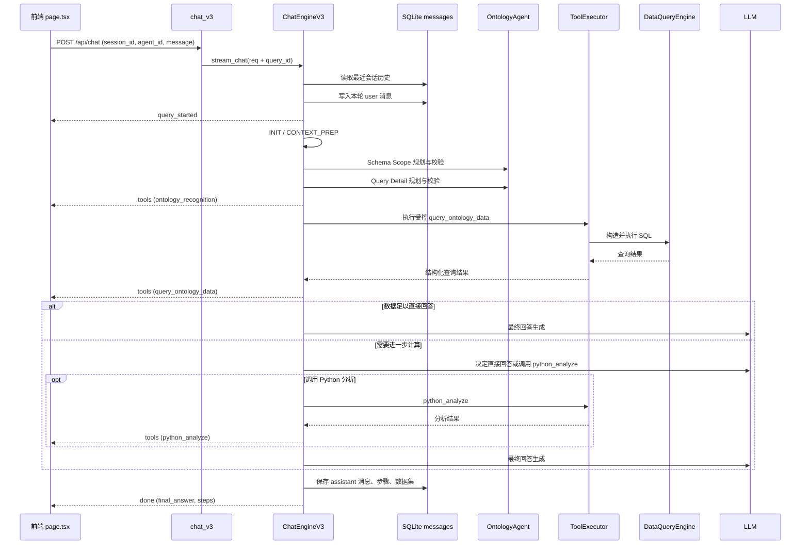
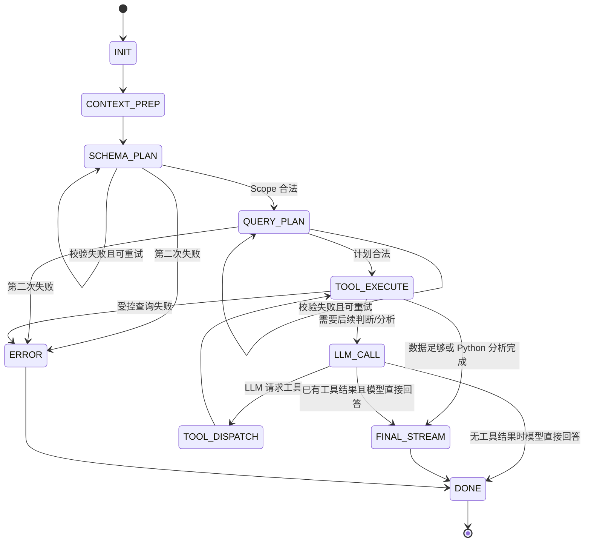

# Chat V3 完整逻辑报告

> 范围：本文梳理 `chat_v3` 从 HTTP 请求进入、两阶段本体规划、受控查询、可选 Python 分析、最终回答、SSE 推送到会话持久化及前端恢复的完整路径。
>
> 入口实现：[views.py](../src/backend/agents/ontology_chatbi/views.py)。

## 1. 设计目标与核心原则

Chat V3 是面向本体数据查询的状态机编排器。它将“理解问题、确定查询范围、生成查询参数、执行查询、分析结果、生成最终回答”拆成明确阶段，以降低通用 Function Calling 直接生成 SQL/查询参数时的越界和不确定性。

核心原则：

1. **主控有状态，子 Agent 无状态**：`ChatEngineV3` 持有会话状态；Schema 检索、术语匹配、实体消歧和工具执行器只接收输入并返回输出。
2. **先约束 Schema，再规划查询细节**：先锁定目标实体与关联路径，后生成指标、维度、过滤条件和排序，避免模型在完整本体中自由猜测。
3. **受控查询优先**：第一条 `query_ontology_data` 由已验证计划直接执行，而非交给通用模型临场决定。
4. **完整数据优先，分析后置**：查询阶段不人为截断；数据较大或需要比较、占比、聚合、排序等计算时，才交由 `python_analyze`。
5. **运行态与历史态一致**：工具步骤通过统一 `ToolStep` 数据结构推送并持久化，页面刷新/重新进入会话后应保持相同的工具执行路径。

---

## 2. 入口、请求与路由

### 2.1 后端入口：`chat_v3`

`POST /api/chat` 定义在 `agents/ontology_chatbi/views.py` 中：

1. 接收 `ChatRequest`。
2. 写入请求日志（场景、会话、问题长度、语言）。
3. 生成 `chat_<shortuuid>` 格式的 `query_id`，并复制回请求对象。
4. 创建 `ChatEngineV3`，将 `stream_chat(req)` 作为 `StreamingResponse` 的异步生成器。
5. 以 `text/event-stream; charset=utf-8` 返回，并设置 `Cache-Control: no-cache` 与 `X-Accel-Buffering: no`，避免代理缓存流式内容。

`ChatRequest` 的字段如下：

| 字段 | 必填 | 说明 |
| --- | --- | --- |
| `session_id` | 是 | 会话 ID，用于加载与保存历史 |
| `agent_id` | 是 | 场景/智能体 ID，用于定位本体与数据目录 |
| `message` | 是 | 用户问题 |
| `query_id` | 否 | 服务端在入口处生成 |
| `language` | 否 | 客户端语言信息 |
| `options` | 否 | 调用附加选项 |

### 2.2 实际注册与前端访问

虽然入口模块的注释描述为本地调试路由，但 `main.py` 已注册对应 `chat_router`，因此该接口会随 FastAPI 应用启动。

前端项目的 Next.js 重写规则将 `/api/:path*` 转发至 `http://localhost:8000/api/:path*`。页面通过 `fetch('/api/chat')` 发送 JSON 请求并携带 Bearer Token。

> 注意：当前 `chat_v3` 函数本身没有调用鉴权校验逻辑。前端虽携带 Token，但是否真正受保护取决于上游中间件或后续改造。

---

## 3. 总体时序



---

## 4. `ChatEngineV3.stream_chat` 主控流程

### 4.1 初始化状态

引擎实例构造时创建以下无状态协作组件：

- `SchemaRetrieverAgent`：检索候选实体、指标和关系上下文。
- `GlossaryMatcherAgent`：将用户词汇匹配到业务术语、别名或标准名。
- `ContextCompressorAgent`：保留为上下文压缩能力（当前主链路未作为关键阶段使用）。
- `EntityDisambiguatorAgent`：处理过滤值、字段和值域的消歧与自动纠正。
- `OntologyAgent`：调用 LLM 进行两阶段规划与校验。
- `AnalysisOrganizerTool`：用于组织分析过程；当前主循环中调用位置被注释，未进入主输出链路。

`stream_chat` 会：

1. 补齐 `query_id`、`session_id`、`agent_id` 和用户问题。
2. 从 `messages` 表加载同一会话最近 20 条 user/assistant 消息，构造 LLM 对话上下文。
3. 创建 `AgentState`，并立即持久化本轮用户消息。
4. 首先发送 `query_started` SSE 事件。
5. 通过状态路由表顺序调度处理器；单次请求最多允许 50 次状态转移，超过上限进入错误路径。
6. 每个状态处理器执行完后，统一发送积累在 `state.sse_events` 中的事件。
7. 成功完成时构造最终答案、支持数据集与标准化步骤，持久化助手消息后发送 `done`。

### 4.2 状态机



状态含义：

| 状态 | 处理器职责 | 常见下一状态 |
| --- | --- | --- |
| `INIT` | 初始化场景本体、查询引擎、系统工具定义 | `CONTEXT_PREP` |
| `CONTEXT_PREP` | 术语匹配、Schema/Metric 候选检索 | `SCHEMA_PLAN` |
| `SCHEMA_PLAN` | 规划并校验目标实体、关联实体与 Join 路径 | `QUERY_PLAN` / 重试 / `ERROR` |
| `QUERY_PLAN` | 在受控 Scope 内规划指标、维度、筛选、Having、排序 | `TOOL_EXECUTE` / 重试 / `ERROR` |
| `LLM_CALL` | 规划后阶段的 Function Calling 或直接草拟回答 | `TOOL_DISPATCH` / `FINAL_STREAM` / `DONE` |
| `TOOL_DISPATCH` | 当前仅作为路由过渡，直接转执行 | `TOOL_EXECUTE` |
| `TOOL_EXECUTE` | 执行受控查询或后续工具调用 | `LLM_CALL` / `FINAL_STREAM` / `ERROR` |
| `FINAL_STREAM` | 以完整工具上下文生成最终 Markdown 答案 | `DONE` |
| `ERROR` | 汇总错误事件 | `DONE` |

> `State` 枚举中还声明了 `ACTION_CONFIRM`、`ACTION_EXECUTE` 和 `CLARIFY`。当前处理器映射未完整接入前两者；若运行时进入未注册状态，会按未知状态进入错误路径。

---

## 5. 预处理与两阶段规划

### 5.1 `INIT`：场景资源初始化

`init_prompt(agent_id)` 使用全局异步锁和按场景缓存：

- 初始化 `OntologyEngine`，加载对应场景的 ontology/data 资源。
- 初始化 `DataQueryEngine`；如存在活动数据连接，传入该连接 URL。
- 构建并缓存场景系统 Prompt。
- 构建可用工具定义：`query_ontology_data`、`python_analyze`。

随后，系统工具定义写入 `state.tools`。

### 5.2 `CONTEXT_PREP`：缩小候选空间

该阶段不把全量本体直接送入规划模型，而是：

1. 用 `GlossaryMatcherAgent.match()` 匹配内部术语、别名和标准名。
2. 用 `SchemaRetrieverAgent.retrieve()` 检索与用户问题相关的 Schema 上下文、指标上下文和候选指标 ID。
3. 将检索到的 Schema 摘要写入 `state.schema_context`，候选指标写入 `state.metric_candidates`。

结果是后续规划只面对与问题相关的候选范围，减少本体信息噪声和 Prompt 体积。

### 5.3 `SCHEMA_PLAN`：先校验实体范围

`OntologyAgent.plan_schema_scope()` 只负责识别：

- `target_class`：主查询实体。
- `join_classes`：显式关联实体。
- `join_paths`：实体间可达的关联路径。

校验要求包括：

- 主实体存在于本体中。
- 所有关联实体存在。
- 主实体到关联实体之间存在可用 Join 路径。

若失败，错误信息会作为下一次规划的 `feedback` 回传给模型；最多再规划一次。连续两次失败会写入 `state.error` 并进入 `ERROR`。

### 5.4 `QUERY_PLAN`：规划查询细节

`OntologyAgent.plan_query_details()` 仅能在已通过验证的 Scope 内输出：

- `metrics`
- `dimensions`
- `filters`
- `having`
- `order_by`
- 以及最终的 `query_scope`

该阶段会验证：

- 查询模式与字段结构是否合法。
- 过滤条件字段与指标字段是否被正确区分：明细行过滤进入 `filters`，聚合指标条件必须进入 `having`。
- 字段是否归属于允许访问的实体。
- 维度、指标和条件所依赖的 Join 实体是否齐全，并在需要时补齐关联依赖。

成功后，系统将用户问题和术语匹配结果注入 `planned_query_args`，生成受控 `query_ontology_data` 参数；同时记录一条 `ontology_recognition` 工具步骤并发送对应 SSE 事件。

---

## 6. 受控查询与工具执行

### 6.1 首次查询：绕过通用 LLM 工具决策

`QUERY_PLAN` 完成后会直接进入 `TOOL_EXECUTE`。只要存在 `state.planned_query_args` 且尚未执行查询，引擎调用 `_execute_validated_query_plan()`：

1. 读取并清空预先验证的查询参数，标记 `query_executed=True`。
2. 使用 `ToolExecutor.execute('query_ontology_data', ...)` 执行。
3. 保存标准化工具调用记录、耗时与结果。
4. 发送含权威 `step` 的 `tools` 事件。
5. 查询失败则立即进入 `ERROR`；成功则根据结果复杂度决定直接最终回答或进入后续分析阶段。

这种设计确保第一条查询完全受两阶段规划约束。

### 6.2 `ToolExecutor` 分发规则

`ToolExecutor.execute()` 是工具执行的统一入口：

| 工具 | 前置处理 | 实际执行 |
| --- | --- | --- |
| `query_ontology_data` | 调用实体消歧处理参数 | `DataQueryEngine.execute_query()` |
| `python_analyze` | 注入查询历史与最近查询结果 | 调用 Python 分析函数 |
| 其他名称 | 无 | 返回“未知工具”错误 |

对 `query_ontology_data`，工具执行器具备两层失败防线：

1. 查询前由 `EntityDisambiguatorAgent.prepare_query_ontology_data_args()` 做类型和值域处理。
2. 查询结果带 `error` 时，使用 `auto_correct_query_ontology_data_args()` 尝试纠正参数并递归重试。

每次工具调用最多重试一次；最终失败返回结构化 `error`，避免无限重试。

### 6.3 实体消歧与参数纠正

实体消歧用于降低自然语言条件与真实字段/枚举值不匹配导致的查询失败，典型能力包括：

- 数字、布尔值和季度等条件归一化。
- 基于字段样本复核文本过滤值。
- 模糊匹配候选值。
- 候选不确定时利用 LLM 在备选项中选择。
- 查询报错后根据错误信息或候选字段重新修正参数。

### 6.4 `DataQueryEngine` 的 SQL 生成

查询引擎接收目标实体、指标、维度、过滤、关联实体、排序和 Having 条件后：

1. 推断各字段、指标、条件涉及的本体实体。
2. 根据本体关系查找 Join 路径，并构造 `LEFT JOIN`。
3. 将逻辑字段映射到物理列名。
4. 构造 `WHERE`、`GROUP BY`、`HAVING`、`ORDER BY` 等 SQL 子句。
5. 执行 SQL，返回行、列、行数、数据来源和表说明等结构化结果。

`ToolExecutor` 会忽略用户传入的 `limit`，统一传递 `limit=None`，避免因展示型截断导致后续分析使用不完整数据。

---

## 7. 查询结果后的决策

### 7.1 何时可直接生成最终回答

`_should_finalize_after_tool_execute()` 会检查最近一个工具结果。

对 `query_ontology_data`，通常需满足：

- 结果没有错误。
- 返回的是行列表或空结果。
- 行数小于 `FINAL_AFTER_TOOL_MAX_ROWS`。
- 用户问题不是需要归因解释的问题。
- 对比较问题，结果具备足够的对比证据。
- 对比例/贡献率问题，结果具备所需证据。

满足时直接进入 `FINAL_STREAM`，避免无意义的二次模型规划和 Python 执行。

### 7.2 何时需要 `python_analyze`

查询结果较大，或用户问题需要以下操作时，受控查询后的 LLM 只被允许：直接回答或调用 `python_analyze`。

- 聚合、筛选、排序、Top N。
- 比较、环比、同比、差值、变化率。
- 占比、贡献率和其他派生计算。
- 查询结果的再组织或统计归纳。

引擎会将上下文改写为“受控 SQL 已完成，禁止再次调用 `query_ontology_data`”，并将 `state.tools` 收缩为只剩 `python_analyze`。

若当前查询已是小规模聚合结果，且 Python 代码不包含复杂分析模式，`_build_direct_answer_result()` 会跳过 Python 实际执行，记录“建议直接回答”的工具结果。

### 7.3 通用 `LLM_CALL` 的行为

进入通用 LLM 调用时：

- 使用 `tool_choice='auto'`，温度为 `0.5`，最大输出为 2048 tokens。
- 最大工具调用轮次由 `state.max_rounds` 限制，默认 20 轮。
- 若模型不请求工具且已有工具结果，将其内容作为最终回答草稿并转 `FINAL_STREAM`。
- 若无工具结果，直接将模型回答作为最终消息。
- 若模型请求工具，会记录调用参数、规划文本和规划耗时，之后执行相应工具。

---

## 8. 最终回答生成

`FINAL_STREAM` 并非逐 token 向客户端推送，而是调用一次最终回答模型后一次性拿到 Markdown 内容。

最终 Prompt 包含：

- 用户问题。
- 术语匹配结果。
- 精简后的会话上下文。
- 前一阶段的助手草稿（如有）。
- 压缩后的工具结果：工具参数、数据来源、表说明、列、行数、样本行与分析数据。

最终回答的要求包括：

1. 先给结论，再给必要依据。
2. 根据 `data_sources` 和 `table_descriptions` 判断数据口径及来源，避免混用表或别名。
3. 使用业务术语匹配保持表达口径一致。
4. 不编造查询结果以外的数据；证据不足时明确说明。
5. 不泄露内部 Prompt、状态机或工具细节；非用户要求时不展示 SQL。

结果会做一次清洗：移除只有一层的 Markdown 代码围栏；若模型返回 JSON 包装，则优先提取 `final_answer`、`content` 或 `answer` 字段。

---

## 9. SSE 事件协议与前端消费

### 9.1 服务端事件封装

所有事件经 `_format_sse_event()` 编码为：

```text
data: <JSON>\n\n
```

其中每个事件都会被补充当前 `query_id`。

### 9.2 当前主链路事件

| 事件类型 | 时机 | 主要字段 | 前端处理 |
| --- | --- | --- | --- |
| `query_started` | 请求进入状态机 | `query_id`、`session_id`、`status` | 保持 AI 消息的加载状态 |
| `tools` | 本体识别完成、查询或 Python 分析完成 | `tool_name`、`description`、`payload`、`duration`、`step` | 将 `step` 加入工具步骤面板 |
| `done` | 正常/受控结束 | `final_answer`、`steps`、`total_duration_ms` | 更新 Markdown、数据集，使用服务端 `steps` 覆盖实时临时状态 |
| `error` | 进入错误处理或外层异常 | `content` | 显示错误文本 |

`step` 是标准化的 `ToolStep` 数据：

```json
{
  "name": "query_ontology_data",
  "description": "...",
  "args": {},
  "result": {},
  "status": "completed",
  "startedAt": 0,
  "planningFinishedAt": 0,
  "planningDurationMs": 0,
  "executionStartedAt": 0,
  "executionDurationMs": 0,
  "finishedAt": 0,
  "durationMs": 0
}
```

当前本体识别也以 `ontology_recognition` 作为工具步骤记录，因此在实时聊天与历史重载时均可见。

### 9.3 前端兼容逻辑

`page.tsx` 通过 `ReadableStream` 按空行切割 SSE block，提取每个 `data:` 行并解析 JSON。

页面保留了下列历史/扩展事件的兼容处理：`plan`、`text`、`tool`、`tool_result`、`clarification`、`drilldown`、`action_confirm`、`answer_datasets`。当前 Chat V3 主引擎主要输出 `query_started`、`tools`、`done`、`error`，因此其余事件分支并非该主链路的必经路径。

---

## 10. 会话持久化与历史恢复

### 10.1 写入逻辑

请求开始时，用户问题立即以 `role='user'` 写入 `messages` 表。

成功结束时，助手消息以 `role='assistant'` 写入，并持久化：

- `content`：最终 Markdown 回答。
- `visualization`：兼容旧客户端的首个查询结果。
- `answer_datasets`：规范化的查询数据集。
- `steps`：`_build_persisted_tool_steps()` 生成的完整工具路径。
- `action_confirm`：如存在则保存操作确认数据。

写入后更新 `conversations.updated_at`。

### 10.2 重新加载会话

`GET /api/conversations/{conv_id}/messages` 读取消息记录，并对 `visualization`、`answer_datasets`、`steps`、`action_confirm` 做 JSON 反序列化。

前端选择会话后：

1. 将消息映射为页面 `Message` 对象。
2. 将 `answer_datasets` 标准化为可视化/表格数据。
3. 将 `steps` 直接交给 `ToolStepsPanel`。
4. 因实时 `tools.step` 与落库 `steps` 使用相同结构，重载后工具名称、参数、结果、状态与时间字段保持一致。

---

## 11. 错误处理与防护

| 场景 | 处理方式 |
| --- | --- |
| 状态跳转超过 50 次 | 设置错误信息，转 `ERROR`，避免死循环 |
| 状态未注册 | 转 `ERROR`，记录未知状态 |
| Schema Scope 或 Query Detail 连续两次校验失败 | 结束规划并返回错误 |
| 工具执行异常 | 单次自动重试，最终返回结构化错误 |
| 受控查询结果含错误 | 转 `ERROR` |
| LLM 调用失败 | 写入错误并转 `ERROR` |
| 最终回答 LLM 失败 | 若已有草稿则降级使用草稿；否则转 `ERROR` |
| `stream_chat` 外层未捕获异常 | 记录堆栈、保存“智能体系统异常”消息并发送 `error` |

`ERROR` 状态会加入错误 SSE 事件；随后主流程仍会进入收尾逻辑，组装并发送最终 `done` 事件并保存消息。因此前端应同时处理 `error` 与后续 `done`，避免错误状态下残留加载动画。

---

## 12. 关键代码索引

| 模块 | 关键职责 |
| --- | --- |
| `src/backend/agents/ontology_chatbi/views.py` | `chat_v3` HTTP/SSE 入口 |
| `src/backend/agents/ontology_chatbi/engine.py` | `ChatEngineV3` 状态机、最终回答、SSE、持久化 |
| `src/backend/agents/ontology_chatbi/state.py` | 状态枚举、`AgentState`、工具调用记录 |
| `src/backend/agents/ontology_chatbi/prompt.py` | 场景引擎缓存、系统 Prompt、工具定义 |
| `src/backend/agents/ontology_chatbi/node/ontology_agent.py` | 两阶段 LLM 规划与校验 |
| `src/backend/agents/ontology_chatbi/node/schema_retriever.py` | 相关 Schema/Metric 上下文检索 |
| `src/backend/agents/ontology_chatbi/node/glossary_matcher.py` | 业务术语匹配 |
| `src/backend/agents/ontology_chatbi/node/entity_disambiguator.py` | 过滤条件和值域消歧、自动纠错 |
| `src/backend/agents/ontology_chatbi/node/tool_executor.py` | 工具分发、重试、查询/Python 分析执行 |
| `src/backend/core/ontology/data_query.py` | 本体驱动的 SQL 构造与执行 |
| `src/backend/modules/conversations.py` | 会话历史读取与 JSON 字段恢复 |
| `src/frontend/src/app/page.tsx` | SSE 消费、消息状态更新、历史加载 |
| `src/frontend/src/components/ToolStepsPanel.tsx` | 工具步骤时间线展示 |

---

## 13. 当前实现特征与后续关注点

1. **第一条数据查询已完全受控**：先规划、再校验、后执行，降低查询越界风险。
2. **最终文本不是真正 token 流式输出**：接口使用 SSE，但当前最终答案在完成后通过 `done.final_answer` 一次性下发；若需要逐字输出，需要调整 `FINAL_STREAM` 为流式模型调用并增加 `text` 事件。
3. **工具步骤已统一**：实时 `tools.step`、`done.steps` 与数据库 `messages.steps` 共享同一结构，修复了实时展示与历史展示的步骤遗漏/参数不一致问题。
4. **遗留状态和前端兼容分支仍存在**：`ACTION_CONFIRM`、`ACTION_EXECUTE` 等状态未完整接入；前端对多种旧事件保留兼容逻辑。后续可明确版本化事件协议并清理无效分支。
5. **接口鉴权应明确化**：当前前端发送 Token，但该入口未自行校验。若接口面向非受控网络，建议在路由或统一依赖中显式验证身份与会话访问权限。
