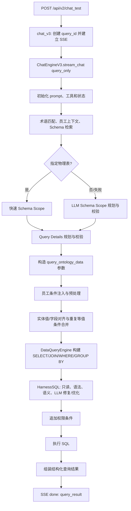
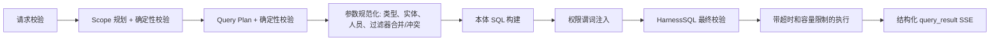

# `chat_v3` 单问题 SQL 生成与数据查询流程评审

**评审日期：** 2026-07-29  
**评审范围：** `POST /api/v2/chat_test` 的 `chat_v3`，仅覆盖“接收一个自然语言问题 → 生成受控 SQL → 查询数据 → 流式返回结果”。  
**不在范围：** 多轮会话记忆、跨问题研究、报告/洞察生成、订阅、知识库/RAG 管理、前端呈现。

---

## 1. 定位与当前实现的偏差

### 应有定位

`chat_v3` 应是一个**单问题、一次性、受控查询编排入口**：

1. 接收一个业务问题和可选的场景、权限、语言信息。
2. 在限定本体范围内识别目标实体、指标、维度和筛选条件。
3. 对齐字段、值、人员和时间条件。
4. 生成且校验只读 SQL。
5. 执行查询并返回 SQL、数据集、元数据及可诊断的错误信息。

### 当前定位

入口 [app/agents/data_query/views.py](../../app/agents/data_query/views.py#L19-L43) 从一个请求开始，并创建新的 `query_id`。它固定使用 `output_mode="query_only"`，在受控 SQL 查询完成后直接返回结构化 `query_result`；查询模式不会向模型暴露 `python_analyze`，且执行层会拒绝该工具调用。

面向用户的分析叙述仍应使用显式 `direct_report` 模式，与查询模式保持隔离。

---

## 2. 当前端到端流程



### 2.1 请求入口与 SSE

| 阶段 | 当前行为 | 评审 |
|---|---|---|
| 路由 | `chat_v3` 接收 `ChatRequest`，创建 `chat_*` 查询 ID，返回 `StreamingResponse`。见 [views.py](../../app/agents/data_query/views.py#L19-L43)。 | 入口轻量，符合流式查询。 |
| API 注册 | 路由实际注册在管理 API 的**公开**路由中。见 [app/api/router.py](../../app/api/router.py#L34-L42)。 | 与 [views.py](../../app/agents/data_query/views.py#L16) 中“未注册”的注释冲突，应修正。公开查询接口也需明确鉴权策略。 |
| 请求模型 | `message`、`scenario_id`、`session_id` 都可为空。见 [models.py](../../app/agents/data_query/models.py#L15-L28)。 | 空问题会进入后续多阶段规划，应该在边界快速拒绝。 |

### 2.2 查询规划

1. `stream_chat()` 建立 `AgentState`、SSE 开始事件和最大 50 次状态跳转熔断。见 [engine.py](../../app/agents/data_query/engine.py#L93-L256)。
2. 初始化本体 prompt 和工具定义。见 [engine.py](../../app/agents/data_query/engine.py#L277-L289)。
3. 预取术语、相关 Schema、指标候选；场景策略可在此阶段解析场景上下文。Pfizer 人员上下文通过 [scenario_policy.py](../../app/agents/data_query/scenario_policy.py) 的策略插件解析。见 [engine.py](../../app/agents/data_query/engine.py#L289-L346)。
4. 用户明确提及物理表时优先走轻量 Scope 选择；失败才使用完整 Schema Scope 规划。见 [engine.py](../../app/agents/data_query/engine.py#L348-L446)。
5. 在已校验 Scope 内规划指标、维度、过滤条件；字段出 Scope 时允许回退重规划一次；缺指标时可构造临时指标。见 [engine.py](../../app/agents/data_query/engine.py#L447-L693)。
6. 将计划转换为 `query_ontology_data` 参数，附加用户问题和术语上下文。见 [engine.py](../../app/agents/data_query/engine.py#L636-L682)。

**结论：** “先 Scope、后 Query Details、再执行”的分层是正确且必要的。当前缺点主要是 LLM 规划层数较多，缺少明确的每阶段耗时预算和可缓存的确定性结果。

### 2.3 查询参数对齐

计划参数在 `ToolExecutor` 中执行前经历以下处理：

1. 场景策略：在通用实体对齐前后执行场景特定的参数预处理与改写。Pfizer 人员筛选由场景策略插件处理。见 [node/tool_executor.py](../../app/agents/data_query/node/tool_executor.py#L67-L118)。
2. 通用：`prepare_query_ontology_data_args()` 进行字段类型推断、季度规范化、文本实体候选匹配、字段纠偏和类型转换。见 [node/entity_disambiguator.py](../../app/agents/data_query/node/entity_disambiguator.py#L326-L337) 与 [node/entity_disambiguator.py](../../app/agents/data_query/node/entity_disambiguator.py#L419-L489)。
3. 对齐后：同一字段、同一显式 `_class_id` 的多个 `=` 条件会合并为一个 `IN` 条件。见 [node/entity_disambiguator.py](../../app/agents/data_query/node/entity_disambiguator.py#L494-L541)。
4. Pfizer 人员策略：将排名型员工筛选改写为部门筛选；该逻辑已封装在场景插件中。

示例：

```json
[
  {"field": "apmonth", "operator": "=", "value": "2026AP01"},
  {"field": "apmonth", "operator": "=", "value": "2026AP02"},
  {"field": "apmonth", "operator": "=", "value": "2026AP03"}
]
```

在 SQL 构建**之前**被规范为：

```json
[
  {
    "field": "apmonth",
    "operator": "IN",
    "value": ["2026AP01", "2026AP02", "2026AP03"]
  }
]
```

随后 SQL 构建器直接输出：

```sql
t0.apmonth IN ('2026AP01', '2026AP02', '2026AP03')
```

这项行为已有测试 [tests/test_entity_disambiguator.py](../../tests/test_entity_disambiguator.py#L83-L125)。

### 2.4 本体 SQL 构建和执行

1. `ToolExecutor` 调用 `DataQueryEngine.execute_query()`。见 [node/tool_executor.py](../../app/agents/data_query/node/tool_executor.py#L152-L178)。
2. `DataQueryEngine` 根据指标、维度、过滤条件和排序自动推导关联类和 JOIN 路径。见 [data_query.py](../../app/core/ontology/data_query.py#L1197-L1438)。
3. 过滤器由 `_build_filter_clause()` 进行运算符白名单、类型处理和转义。`IN` 只接受列表。见 [data_query.py](../../app/core/ontology/data_query.py#L994-L1037)。
4. 组装 `SELECT`、`JOIN`、`WHERE`、`GROUP BY`、`HAVING` 和 `ORDER BY`。见 [data_query.py](../../app/core/ontology/data_query.py#L1599-L1779)。
5. SQL 交给 `HarnessSQL.prepare()`。见 [data_query.py](../../app/core/ontology/data_query.py#L1786-L1790)。
6. 成功后追加权限谓词并执行 SQL；执行失败时尝试一次 HarnessSQL LLM 修复并重试。见 [data_query.py](../../app/core/ontology/data_query.py#L1814-L1891)。

### 2.5 SQL Harness

`HarnessSQL` 是查询安全和可执行性的最后防线：

| 能力 | 当前实现 |
|---|---|
| 只读防护 | 仅允许 `SELECT`/`WITH`，阻止多语句、DML、DDL、`SELECT INTO` 和 `FOR UPDATE`。见 [harness_sql.py](../../app/core/harness/harness_sql.py#L607-L625)。 |
| 语法/计划校验 | 执行 `EXPLAIN`。见 [harness_sql.py](../../app/core/harness/harness_sql.py#L324-L336)。 |
| 语义校验 | 校验 AP month 上下界；拒绝未合并的同字段重复等值条件。见 [harness_sql.py](../../app/core/harness/harness_sql.py#L338-L358)。 |
| SQL 级兜底合并 | 顶层 `AND` 的简单等值条件再合并为 `IN`。见 [harness_sql.py](../../app/core/harness/harness_sql.py#L360-L421)。 |
| LLM 修复/优化 | 对语法/语义异常或优化机会调用 LLM，并以原顶层 WHERE 谓词保留校验保护过滤条件。见 [harness_sql.py](../../app/core/harness/harness_sql.py#L123-L211)、[harness_sql.py](../../app/core/harness/harness_sql.py#L422-L535)。 |
| 执行后修复 | 执行异常时请求一次 LLM 修复并重新走 `prepare()`。见 [harness_sql.py](../../app/core/harness/harness_sql.py#L266-L305)。 |

---

## 3. 缺漏与不足

按优先级排序。

### P0：安全与正确性

1. **权限谓词在 HarnessSQL 校验后追加，追加后的最终 SQL 未复核。**  
   `_append_user_permission_sql()` 在 [data_query.py](../../app/core/ontology/data_query.py#L975-L991)，而 `prepare()` 在其之前。权限追加逻辑若出现 SQL 拼接/子查询边界问题，HarnessSQL 不会发现。  
   **建议：** 把权限谓词纳入 HarnessSQL 输入（优先），或追加后再次执行只读、语法和语义校验；最终执行 SQL 必须是已验证 SQL。

### P1：查询质量与可预测性

4. **单问题查询接口固定 `direct_report`，并非查询优先。**  
   路由固定参数见 [views.py](../../app/agents/data_query/views.py#L41)。查询结果较大、比较/比例问题时，后续可能转入 `python_analyze` 和最终答复 LLM。见 [engine.py](../../app/agents/data_query/engine.py#L1097-L1146)、[engine.py](../../app/agents/data_query/engine.py#L1608-L1648)。  
   **影响：** 查询耗时、成本、失败面和不可重复性都扩大。  
   **建议：** 增加明确 `query_only` 模式或单独的 `/chat_query` 路由，固定在首次受控 SQL 成功后终止；报告功能另走显式模式。

5. **SQL 容量治理目前没有真正生效。**  
   `HarnessSQL.prepare()` 中基于行数加 `LIMIT` 的分支处于注释状态。见 [harness_sql.py](../../app/core/harness/harness_sql.py#L215-L221)。同时 Data Query 明确忽略传入 `limit`。见 [data_query.py](../../app/core/ontology/data_query.py#L1223-L1232)。  
   **影响：** 单问题明细查询可能产生过大结果，既拖慢数据库也压垮 SSE/LLM 上下文。  
   **建议：** 区分聚合查询和明细导出：默认安全上限、显式分页/游标、最大字节数和超限时可解释的“请缩小范围”响应；不要静默截断业务分析结果。

6. **重复等值条件合并的键仅使用原字段文本和 `_class_id`。**  
   见 [entity_disambiguator.py](../../app/agents/data_query/node/entity_disambiguator.py#L503-L537)。别名在对齐后通常已一致，但“同一物理列的不同逻辑别名”仍可能没有合并。  
   **建议：** 使用已解析的 `(class_id, physical_field)` 作为规范化键；保留原始过滤器审计信息，避免丢失 LLM 计划来源。

7. **过滤器冲突检测不足。**  
   当前仅合并多个 `=`。`IN` 与 `=`、`IN` 与 `NOT IN`、范围与等值、两个不相交 `IN` 的矛盾没有在参数层统一检测。  
   **建议：** 增加“过滤器规范化/冲突检测”模块，在 SQL 构建前输出以下三类结果：可合并、明确矛盾、需保留的复合逻辑。对明确矛盾返回结构化参数错误，而非空查询结果。

8. **自动修复链路不够一致。**  
   `auto_correct_query_ontology_data_args()` 定义在 [entity_disambiguator.py](../../app/agents/data_query/node/entity_disambiguator.py#L342-L417)，但当前执行路径调用的是 `prepare_query_ontology_data_args()`。见 [node/tool_executor.py](../../app/agents/data_query/node/tool_executor.py#L97-L103)。  
   **建议：** 删除死路径，或在可分类的 SQL/字段错误下明确调用一次参数级修复，并记录“初始参数 → 修复参数 → 最终 SQL”。

### P2：可观测性与可维护性

9. **缺少 route → SQL 的活跃端到端契约测试。**  
   当前覆盖主要分散在状态机、参数对齐和 Harness 层；`chat_test` 路由仅有存在性断言。见 [tests/test_data_query_subagent.py](../../tests/test_data_query_subagent.py#L958-L972)。  
   **建议：** 通过伪造的规划器、查询引擎和 SSE 消费器增加端到端测试，至少验证成功、空消息、过滤器合并、权限、Harness 拦截、执行失败修复、结果超限。

10. **会话 ID 在单问题路由中没有实际历史恢复语义。**  
    `stream_chat()` 每次将 `history_messages` 初始化为空。见 [engine.py](../../app/agents/data_query/engine.py#L109-L112)。  
    **建议：** 若接口定位是单问题，删除/标注 `session_id` 仅用于追踪；若要支持多轮，显式加载、裁剪、权限隔离历史。

---

## 4. 建议补充与加强的功能

### 4.1 必须补充

| 优先级 | 功能 | 交付标准 |
|---|---|---|
| P0 | 最终 SQL 复核 | 权限条件纳入或追加后重新通过 HarnessSQL；执行 SQL 与审计 SQL 一致。 |
| P1 | 查询专用模式 | `query_only` 跳过 `python_analyze` 与最终答复 LLM，done 事件固定返回 `query_result`。 |
| P1 | 结果容量协议 | 分页/游标或受控导出；限制行数、字节数、执行超时；超限必须可解释。 |
| P1 | 过滤器规范化器 | 将 `=`/`IN`/范围条件按物理字段归一化，合并可合并条件并报告冲突。 |
| P1 | SQL 执行预算 | DB statement timeout、总查询超时、取消传播、最大 JOIN 数及最大返回列数。 |

### 4.2 应加强

1. **规划的确定性校验。** 将目标类、字段、指标、JOIN、过滤器、排序的约束尽量移动到确定性代码；LLM 仅提出候选计划。
2. **SQL 可解释审计。** 每个查询返回：原始计划、规范化参数、生成 SQL、Harness actions、最终执行 SQL、数据源、耗时、行数。注意脱敏权限值和敏感实体值。
3. **错误分类。** 分为请求错误、本体范围错误、字段映射错误、无数据、SQL 校验错误、数据库错误、超时；不要将这些都包装为普通自然语言错误。
4. **缓存。** 对本体版本、Schema Scope、字段候选和术语结果使用以场景/本体版本为键的短时缓存；不得缓存带用户权限的数据结果。
5. **人员策略隔离。** Pfizer 人员规则已通过 [scenario_policy.py](../../app/agents/data_query/scenario_policy.py) 的场景策略接口注册；后续场景应复用同一生命周期钩子，避免向引擎或执行器增加条件分支。

---

## 5. 冗余、越界与需要收敛的代码

### 5.1 相对于“单问题 SQL 查询”越界或可拆分的部分

| 代码/能力 | 结论 | 原因与建议 |
|---|---|---|
| `python_analyze` 工具分支 | 仅限分析模式 | 它用于二次聚合、比较和比例计算。`chat_test` 的查询模式不向模型暴露该工具，并在执行层拒绝其调用；仅显式 `direct_report` 分析模式可使用。 |
| 最终答案 LLM | 越出纯查询核心 | `direct_report` 的最终答复和数据集包装是展示层。见 [engine.py](../../app/agents/data_query/engine.py#L1660-L1895)。应拆到 report 层或显式模式。 |
| 通用 LLM 工具循环 | 查询路径中的冗余复杂性 | 在确定性规划成功后已经直接执行计划；后续通用工具循环主要服务报告/分析。查询模式可在一次 SQL 后结束。 |
| `auto_correct_query_ontology_data_args()` | 疑似未接入 | 若不接入执行路径，应删除；若保留，明确触发条件和一次重试上限。 |
| 被注释的维度澄清逻辑 | 未完成能力 | [engine.py](../../app/agents/data_query/engine.py#L541-L558) 大段注释代码增加阅读成本。要么恢复为受测功能，要么删除。 |

### 5.2 必须保留且需要加强的部分

| 代码/能力 | 结论 | 加强方向 |
|---|---|---|
| Scope → Query Details 的两阶段规划 | 核心 | 收紧模型输出 schema；记录每次被拒绝原因；限制重试与总耗时。 |
| 实体/字段对齐 | 核心 | 物理字段级规范化、过滤器冲突检测、对齐决策审计。 |
| 人员条件处理 | 核心策略（场景特有） | 抽为场景策略插件；保证权限约束不可被后续 LLM 改写。 |
| DataQueryEngine SQL 构建 | 核心 | 使用参数绑定替代字符串值拼接；增加 JOIN 基数风险检测。 |
| HarnessSQL | 核心 | 最终 SQL 复核、容量限制、禁止不必要的 LLM 优化或使其显式可配置。 |
| SSE 事件 | 需要保留 | 为每个阶段统一事件 schema：开始、计划、规范化、SQL 已校验、数据返回、失败。 |

---

## 6. 推荐的目标流程

### 查询模式（建议作为 `chat_v3` 默认）



### 必须遵守的原则

1. LLM 不能直接决定最终 SQL；它只能提出通过本体验证的结构化计划。
2. 所有 SQL 变更（包括权限追加、修复和优化）后必须重新验证。
3. 参数层在 SQL 生成前完成规范化；HarnessSQL 的 SQL 级修复只做兜底。
4. 查询模式只执行一次受控查询，不自动进入二次 Python 分析或自然语言报告。
5. 返回内容必须区分“无数据”“参数矛盾”“查询被安全策略阻断”“数据库故障”。

---

## 7. 建议实施顺序

1. **第一批（安全/契约）：** 修正路由注册注释与鉴权，增加空消息验证，将权限谓词放入最终 HarnessSQL 校验链，新增对应测试。
2. **第二批（查询收敛）：** 为 `chat_v3` 增加或切换到 `query_only`，禁止查询模式进入 `python_analyze`/最终答复 LLM，明确结构化 SSE 合约。
3. **第三批（参数质量）：** 抽取过滤器规范化器，支持等值/集合/范围冲突检测，并用物理字段作为合并键。
4. **第四批（稳定性）：** 启用结果容量和执行超时治理，补齐 route 到 SQL 的端到端测试。
5. **第五批（清理）：** 删除未接入修复路径、死状态和长期注释代码；Pfizer 人员策略已迁移为场景策略插件，后续新增场景策略应通过同一注册机制接入。

---

## 8. 已验证的现有测试

- [tests/test_entity_disambiguator.py](../../tests/test_entity_disambiguator.py) 覆盖在参数对齐阶段将重复 `=` 过滤器合并为 `IN`。
- [tests/test_harness_sql.py](../../tests/test_harness_sql.py) 覆盖 SQL 级重复等值条件合并、语义拒绝和 `prepare()` 兜底。
- 本次评审时运行的聚焦测试：`test_entity_disambiguator.py` 与 `test_harness_sql.py`，结果为 **18 passed**。
