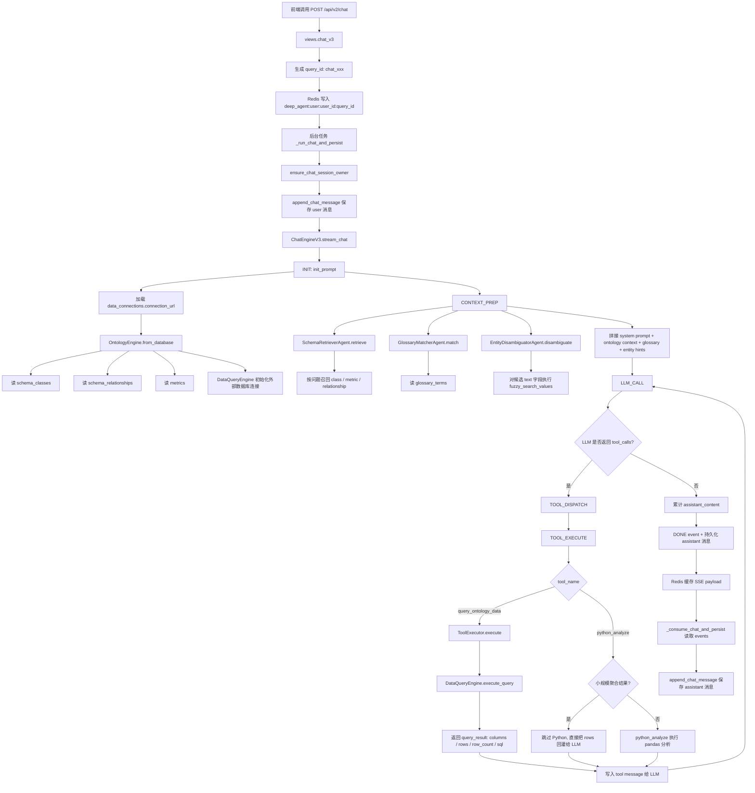
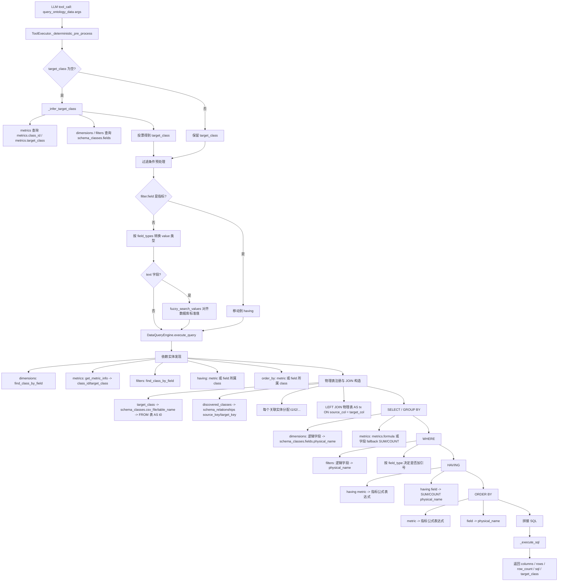
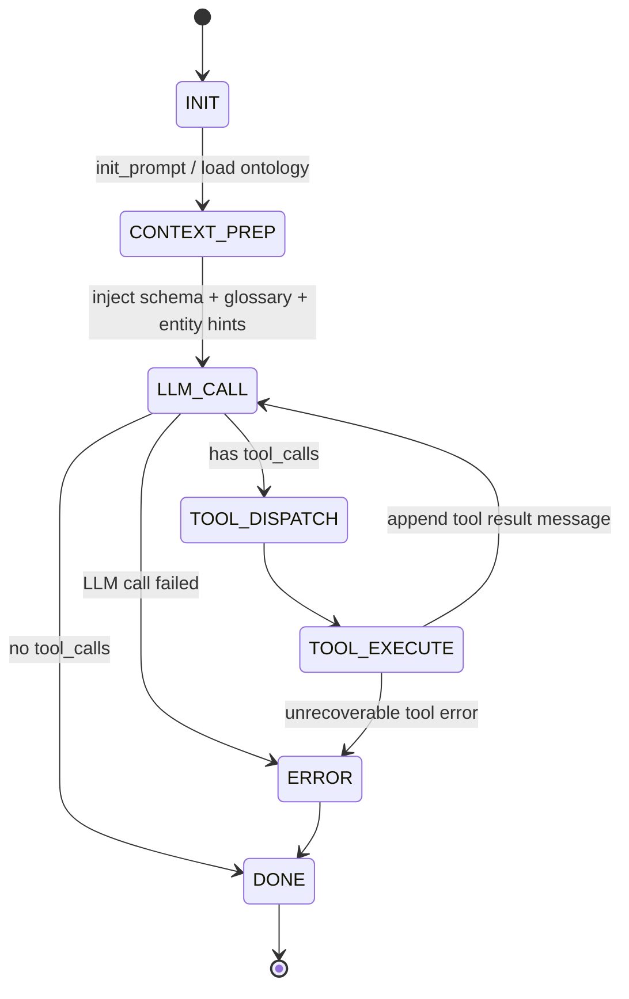
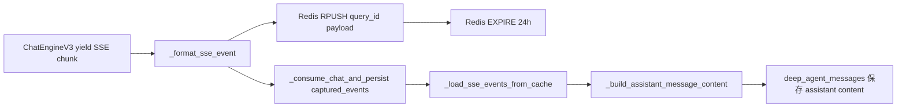

# Chat v3 技术流程图

本文基于当前 `app.agents.deep_agents` 的 `chat_v3` 接口实现整理，重点展开 `query_ontology_data` 如何从自然语言映射到具体物理表和字段。

## 1. Chat v3 总流程

接口入口：`POST /api/v2/chat`

核心代码路径：

- `app/agents/deep_agents/views.py::chat_v3`
- `app/agents/deep_agents/engine.py::ChatEngineV3.stream_chat`
- `app/agents/deep_agents/agents.py::ToolExecutor.execute`
- `app/core/ontology/data_query.py::DataQueryEngine.execute_query`



## 2. Ontology 元数据到物理表字段

`init_prompt(agent_id)` 会构建语义层，语义层来自管理库中的三类元数据表：

| 元数据表 | 关键字段 | 用途 |
| --- | --- | --- |
| `data_connections` | `scenario_id`, `connection_url`, `is_active` | 找到当前场景激活的数据源连接串 |
| `schema_classes` | `id`, `name_cn`, `properties`, `fields`, `csv_file`, `primary_key` | 定义实体 class、物理表、逻辑字段到物理列的映射 |
| `schema_relationships` | `source`, `target`, `source_key`, `target_key`, `join_key` | 定义实体之间 JOIN 路径和 JOIN 字段 |
| `metrics` | `id`, `name`, `class_id`, `target_class`, `formula`, `dimensions`, `required_dimensions` | 定义指标所属实体、计算公式和可用维度 |

`schema_classes.fields` 的字段映射规则：

```text
逻辑字段名 = field.name 或 field.logical_name 或 field.physical_name
物理字段名 = field.physical_name
字段类型 = field.type, 默认 text
```

`OntologyEngine._build_validated_class` 会把它整理成：

```text
engine.classes[class_id].table_name
engine.classes[class_id].field_map[逻辑字段名] = 物理字段名
engine.classes[class_id].field_types[逻辑字段名] = text / numeric / date / boolean
```

## 3. query_ontology_data 细化流程

工具入参来自 LLM 的 function call：

```json
{
  "target_class": "MainHospitalSales",
  "metrics": ["实际销售金额（全规格）", "目标销售金额（全规格）"],
  "dimensions": ["评估月份代码"],
  "filters": [{"field": "省份名称", "operator": "=", "value": "上海"}],
  "having": [],
  "order_by": "实际销售金额（全规格） DESC"
}
```

执行链路：



## 4. query_ontology_data 表字段映射细节

下面以 Pfizer 场景的 `MainHospitalSales` 为例。该实体在本体中的物理表配置为：

```text
class_id: MainHospitalSales
name_cn: 核心医院月度滚动销售
physical table: t_main_hospital_daily_tth_rolling_sales
primary_key: account_cd
```

常用逻辑字段到物理字段映射：

| 逻辑字段 | 物理表 | 物理字段 | 类型/用途 |
| --- | --- | --- | --- |
| `评估月份代码` | `t_main_hospital_daily_tth_rolling_sales` | `apmonth` | 维度 / 过滤 |
| `省份名称` | `t_main_hospital_daily_tth_rolling_sales` | `province_name` | 维度 / 过滤 |
| `核心医院代码` | `t_main_hospital_daily_tth_rolling_sales` | `account_cd` | 主键 / 维度 / JOIN key |
| `核心医院名称` | `t_main_hospital_daily_tth_rolling_sales` | `account_name` | 维度 / 过滤 |
| `实际销售数量（全规格等效100mg）` | `t_main_hospital_daily_tth_rolling_sales` | `actual_quantity` | numeric 指标字段 |
| `实际销售金额（全规格）` | `t_main_hospital_daily_tth_rolling_sales` | `actual_amount` | numeric 指标字段 |
| `目标销售金额（全规格）` | `t_main_hospital_daily_tth_rolling_sales` | `target_amount` | numeric 指标字段 |
| `当月总工作日数` | `t_main_hospital_daily_tth_rolling_sales` | `workdays_total` | numeric 进度字段 |
| `当月至今工作日数` | `t_main_hospital_daily_tth_rolling_sales` | `workdays_sofar` | numeric 进度字段 |
| `100mg规格实际销售金额` | `t_main_hospital_daily_tth_rolling_sales` | `actual_amount_100mg` | numeric 指标字段 |
| `100mg规格目标销售金额` | `t_main_hospital_daily_tth_rolling_sales` | `target_amount_100mg` | numeric 指标字段 |
| `200mg规格实际销售金额` | `t_main_hospital_daily_tth_rolling_sales` | `actual_amount_200mg` | numeric 指标字段 |
| `200mg规格目标销售金额` | `t_main_hospital_daily_tth_rolling_sales` | `target_amount_200mg` | numeric 指标字段 |
| `50mg规格实际销售金额` | `t_main_hospital_daily_tth_rolling_sales` | `actual_amount_50mg` | numeric 指标字段 |
| `50mg规格目标销售金额` | `t_main_hospital_daily_tth_rolling_sales` | `target_amount_50mg` | numeric 指标字段 |

### 字段进入 SQL 的规则

| query_ontology_data 参数 | 解析函数 | 表字段来源 | SQL 片段 |
| --- | --- | --- | --- |
| `target_class` | `_resolve_table_name(target_class)` | `schema_classes.csv_file/table_name` | `FROM {table_name} AS t0` |
| `dimensions[]` | `find_class_by_field` + `_ensure_query_field` | `schema_classes.fields.physical_name` | `SELECT tx.{physical_col} AS "逻辑字段"` + `GROUP BY tx.{physical_col}` |
| `metrics[]` 有 metric 定义 | `get_metric_info` + `_metric_expr` | `metrics.formula` 或 `metrics.field` + `schema_classes.field_map` | `SELECT SUM(tx.{physical_col}) AS "指标名"` 或公式表达式 |
| `metrics[]` 无 metric 定义 | `find_class_by_field` + `get_field_type` | `schema_classes.field_map` | numeric: `SUM(tx.{physical_col})`; 非 numeric: `COUNT(tx.{physical_col})` |
| `filters[]` | `_build_filter_clause` | `schema_classes.field_map` + `field_types` | `WHERE tx.{physical_col} {op} {value}` |
| `having[]` 是 metric | `_metric_expr` | `metrics.formula` 或 metric field | `HAVING {metric_expr} {op} {value}` |
| `having[]` 是 field | `_ensure_query_field` + `get_field_type` | `schema_classes.field_map` | `HAVING SUM/COUNT(tx.{physical_col}) {op} {value}` |
| `order_by` | metric 或 field 分支 | `metrics.formula` 或 `schema_classes.field_map` | `ORDER BY {expr} ASC/DESC` |
| `join_classes` / 自动发现实体 | `get_join_path` + `_build_join_condition` | `schema_relationships.source_key/target_key` + `field_map` | `LEFT JOIN {table} AS tx ON t0.{source_col}=tx.{target_col}` |

## 5. 例子：Daily TTH 进度查询如何落到表字段

用户问题：

```text
目前 Daily TTH 进度如何？和上个月相比有什么变化？
```

模型应优先选同一个实体 `MainHospitalSales` 下的配套字段/指标，例如：

```json
{
  "target_class": "MainHospitalSales",
  "metrics": [
    "实际销售金额（全规格）",
    "目标销售金额（全规格）",
    "当月至今工作日数",
    "当月总工作日数"
  ],
  "dimensions": ["评估月份代码"],
  "filters": [],
  "having": [],
  "order_by": "评估月份代码 ASC"
}
```

物理 SQL 构造会落到：

```sql
SELECT
  t0.apmonth AS "评估月份代码",
  SUM(t0.actual_amount) AS "实际销售金额（全规格）",
  SUM(t0.target_amount) AS "目标销售金额（全规格）",
  SUM(t0.workdays_sofar) AS "当月至今工作日数",
  SUM(t0.workdays_total) AS "当月总工作日数"
FROM "t_main_hospital_daily_tth_rolling_sales" AS t0
GROUP BY t0.apmonth
ORDER BY t0.apmonth ASC
```

如果过滤某省份：

```json
{"field": "省份名称", "operator": "=", "value": "上海"}
```

会映射为：

```sql
WHERE t0.province_name = '上海'
```

如果按核心医院看进度：

```json
"dimensions": ["核心医院代码", "核心医院名称"]
```

会映射为：

```sql
SELECT
  t0.account_cd AS "核心医院代码",
  t0.account_name AS "核心医院名称",
  ...
GROUP BY t0.account_cd, t0.account_name
```

## 6. 状态机与 SSE 输出



SSE / 缓存 / 持久化：


