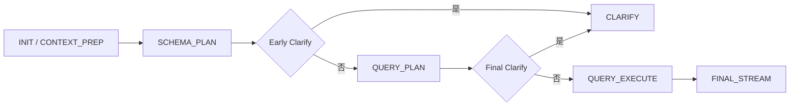
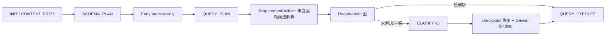
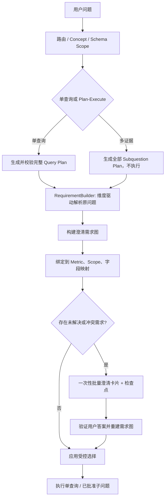
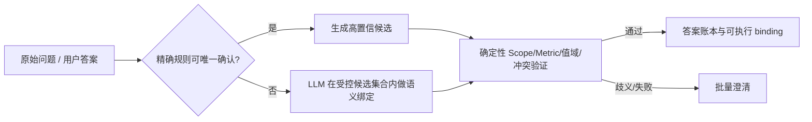

# ChatBI 澄清机制现状评估与改造方案

> 日期：2026-08-01  
> 范围：`ChatEngineV3`、Metric / DimensionGroup、单查询与 Plan-Execute 流程  
> 结论：当前“早期澄清”不应作为一个独立的阻断式业务决策阶段。应在查询计划或全部子问题计划完成后，由澄清需求构建器根据最终 Metric 所需维度直接解析原问题、构建一次**受作用域约束的澄清需求图**，批量向用户收集答案。不需要单独的通用 slot 提取阶段。

> **代码对齐更新（2026-08-01）**：本文第 1–8 节保留问题背景和目标设计；第 9、10、16 节记录当前代码的实际落地状态、已验证范围及未完成项。除非特别说明，“建议”不代表已上线行为。

---

## 1. 问题与触发日志

用户问题：

> `2026AP04 浙江省200mg 希必可销量`

日志显示：

1. 系统已从问题中识别 `2026AP04`，并将其路由为单查询；
2. Schema Scope 已选择 `MainHospitalMonthlyPerformance`；
3. 此时却进入了 `time_granularity` 的早期澄清；
4. 前端要求用户选择“按月 / 按季度 / 按年度”并再次填写期间。

这不是 AP 格式不能识别的问题，而是**澄清触发时机、上下文完整性和作用域绑定方式**的问题。

目前已加入 `YYYYAPnn`、`YYYYQn`、`YYYY` 的显式期间识别，用于避免该具体问题的重复询问。但该规则仅是短期防护，不能替代澄清架构改造：省份、城市、大区、医院层级、员工角色、渠道、产品规格等参数同样会出现“用户已表达、系统仍询问”或“系统过早错误确认”的问题。

---

## 2. 当前实现与事实依据

### 2.1 当前状态机

改造前的单查询关键路径为：



当前实现已经调整为：



- Schema Scope 完成后仍调用 `_prepare_early_dimension_group_clarification()`，但它只写入预检日志，固定返回 `False`，不再进入 `CLARIFY`。
- Query Detail Plan 完成后，`_prepare_required_dimension_clarification()` 应由最终 Metric 的 `dimension_group_ids`、当前 Scope 和 mapping 推导所需业务维度，并在构建 requirement 时直接解析原问题。仅此处可以阻断单查询。
- Plan-Execute 先把初始子问题规划为 `planned`，再由 `_prepare_metric_plan_clarification()` 汇总生成 `metric_batch` 澄清卡；只有 `bound` 子问题可进入执行。

相关实现：

- [engine.py](../../src/backend/agents/ontology_chatbi/engine.py)：`_handle_schema_plan()`、`_handle_query_plan()`、`_prepare_early_dimension_group_clarification()`、`_prepare_required_dimension_clarification()`。
- [clarify_agent.py](../../src/backend/agents/ontology_chatbi/node/clarify_agent.py)：`precheck_metric_candidates()`、`resolve_dimension_groups()`、`_resolve_group()`、`apply_resolved_selections()`。

### 2.2 当前澄清与 Metric 的关系

澄清不是完全独立于 Metric 的。当前关系是：

1. 每个 Metric 可关联多个 `dimension_group_ids`；
2. `ClarifyAgent.resolve_dimension_groups()` 收集当前 `query_plan.metrics` 对应的必填 DimensionGroup；
3. 相同 `group_id` 会被合并，保留 `metric_ids`、`metric_names`、`output_names` 作为来源；
4. 选择结果通过 `field_mappings` 转成物理字段过滤或维度；
5. 最终查询执行使用注入后的受控 `query_plan`。

这是正确的基本方向：**澄清应由业务语义（Metric / Concept / 分析任务）驱动，而不是由前端字段驱动。**

但当前早期预检使用的是“候选 Metric”的稳定交集，而不是已验证的 Metric 计划。候选集合可能很宽，例如日志中候选包含周、月度、当前月、MICS、主医院等多种指标。即使这些 Metric 恰好共享“时间粒度”组，也不能据此推导用户真正需要补充时间。

### 2.3 当前多 Metric 支持

原来的 `ClarifyAgent.resolve_dimension_groups()` 仍保留为兼容路径。单查询主路径已改为 `ClarificationRequirementBuilder`：它按 Group、semantic role 和当前 Scope 内 mapping 签名生成 v3 `requirement_id`，并在同一 requirement 的 `required_by` 中记录受影响的 Metric 与执行单元。

改造前，Plan-Execute 路径中的子问题可在执行过程中分别进入 `needs_clarification`。当前初始规划轮已避免这一行为；但扩展轮、复杂多值时间与完整 UI 表达仍需补齐，详见第 16 节。

1. 子问题 A 已执行；
2. 子问题 B 发现省份未明确；
3. 暂停并向用户询问；
4. 恢复后子问题 C 又发现渠道未明确；
5. 用户被连续打断多次。

现有账本能恢复待处理子问题，但“先完整规划、后一次性收集澄清”的能力不足。

---

## 3. 现有早期澄清是否合适

### 3.1 合理的初衷

早期澄清有三个合理目标：

- 在昂贵的 Query Detail Plan 之前尽早停止无效流程；
- 让用户尽快补充明确缺失的关键业务口径；
- 避免在缺少必填维度时生成不可执行的 SQL。

当前实现也有保护条件：只在候选 Metric 已解析、必填组集合一致、字段映射属于当前 Schema Scope 时触发。这比无条件提前询问更安全。

### 3.2 仍不适合作为阻断式主路径

即使上述条件成立，早期澄清仍存在结构性问题：

| 问题 | 原因 | 后果 |
|---|---|---|
| 语义上下文不足 | 此时尚未生成实际 Metric、过滤条件、维度和分析意图 | 用户已给出的 AP、省份等无法可靠映射 |
| 候选 Metric 过宽 | 候选不等于最终选择 | 可能为最终不会使用的 Metric 询问 |
| 区域参数不宜正则化决定 | “浙江”可能表示省份、销售大区、医院所在地、人员覆盖区域 | 过早绑定到错误字段 |
| 一组多映射风险 | 同一个 DimensionGroup option 可以映射多个类 / 字段 | 当前应用阶段取第一个映射，可能不是当前查询作用域 |
| 多任务计划不完整 | Plan-Execute 子问题尚未全部形成 | 无法一次收集全部必要答案 |
| 体验不可预测 | 一次问题可能先早期澄清，再最终澄清 | 用户无法理解为什么需要反复确认 |

因此，建议移除“早期澄清直接阻断”的默认行为。保留其能力，但把它降级为**非阻断的参数候选提取与风险标记**。

---

## 4. 无需独立候选提取阶段

### 4.1 requirement 构建时按已确定 Metric 维度解析原问题

不需要先定义一套与业务无关的“通用 slot”，也不需要引入独立的候选阶段。正确顺序是：最终 Query Plan / Subquestion Plan 的 Metric 先得到必填 `DimensionGroup`，`ClarificationRequirementBuilder` 再结合 Scope 内合法 mapping，直接在对应 requirement 内解析原问题。例如：

| Metric 所需业务维度 | 可从问题提取的候选 | 输出性质 |
|---|---|---|
| AP / 季度 / 年度时间口径 | `2026AP04`、`2026Q1`、`2026年` | 仅当 Metric 需要对应时间组时才成为候选 |
| 产品规格维度 | `200mg`、`50 mg` | 仅当 Metric 关联规格 DimensionGroup 时才解析 |
| 地理口径 | `浙江省`、`杭州市` | 仅当 Metric 需要医院所在地、覆盖区域等具体地理组时才解析 |
| 员工角色维度 | `BD`、`RM`、`MICS` | 仅当 Metric / Agent 插件声明对应角色组时才解析 |
| 比较时间 / 分析轴 | “同比”“环比”“趋势”“对比” | 仅当计划合同支持比较或趋势分析时才解析 |

产品/品牌名称不作为独立通用 slot：它们属于 glossary / Concept / Metric 识别证据。只有最终 Metric 的必需维度中明确存在产品维度时，才在该维度上下文中把原问题中的产品文本作为候选值。

若需要展示或审计解析结果，候选作为 requirement 的内部证据保存，带上原始文本片段、位置、解析规则和置信度。例如：

```json
{
  "requirement_id": "req:v3:...",
  "group_id": "time_granularity",
  "semantic_role": "business_accounting_period",
  "raw_text": "2026AP04",
  "normalized_value": "2026AP04",
  "candidate_granularity": "month",
  "source": "deterministic_parser",
  "confidence": "high"
}
```

它们不能直接变成 `apmonth = '2026AP04'`，因为在尚未确定目标 Class、Metric 与字段映射前，系统还不能确认该字段是否存在、是否表达同一业务时间口径、是否要应用在所有子问题上。

### 4.2 即使维度已知，也不应前置最终落字段决定

以下内容必须等到业务计划和 Schema Scope 已确定后，才能落到字段：

- “浙江”到底是省份、销售大区、医院所在省、客户归属省，还是员工覆盖省；
- “销量”是销售数量、出货量、处方量、DTP 销量，还是某种 Metric 输出；
- “200mg”是产品规格字段、产品名称文本、剂型字段还是固定 Metric 过滤；
- “负责人 / 张三”属于 BD、RM、SD、DM、MICS 还是医院联系人；
- “本月”应按自然月、AP 月、数据截止月还是滚动累计月解释；
- 多 Metric 问题中，同一“时间”是否对全部 Metric 共用，或某个 Metric 必须使用季度 / 周度口径。

因此推荐的原则是：

> **前置阶段只提取“用户表达了什么”；计划阶段才决定“它绑定到哪个业务槽位、哪个 Metric 和哪个物理字段”。**

---

## 5. 目标架构：澄清需求图与统一批量澄清

### 5.1 建议的新流程



### 5.2 澄清需求图（Clarification Requirement Graph）

在完整计划形成后，为每个执行单元构建需求节点：

```json
{
  "requirement_id": "scope:MainHospitalMonthlyPerformance|group:time_granularity|binding:month",
  "group_id": "time_granularity",
  "group_type": "time",
  "required_by": [
    {
      "execution_unit": "single_query",
      "metric_ref": "基于主医院的销售数量",
      "target_class": "MainHospitalMonthlyPerformance",
      "field_mapping": {"field_name": "apmonth", "option_value": "month"}
    }
  ],
  "candidate_values": [
    {
      "value": "2026AP04",
      "source": "raw_slot",
      "confidence": "high"
    }
  ],
  "resolution_status": "resolved | unresolved | conflict | invalid",
  "resolved_value": "2026AP04"
}
```

需求图需要支持以下操作：

1. **合并**：多个 Metric 要求同一个语义组，且可映射至同一作用域、同一值时，合并为一个问题；
2. **分裂**：同名 Group 在不同 Metric / Class 上语义或允许值不同，必须成为独立问题，不能用 `group_id` 粗暴覆盖；
3. **冲突**：同一用户表达被不同 Metric 解释为不同字段或不同粒度时，明确向用户解释并选择；
4. **消解**：用户原始文本、历史已确认答案、默认值、Query Plan 已有过滤条件按明确优先级合并；
5. **校验**：选择值必须同时满足 option、字段、当前 Scope、Metric 适用性及值域规则。

### 5.3 推荐的解析优先级

对于每个需求节点，建议按以下优先级求值：

1. 已验证的当前 Query / Subquestion Plan 中的受控过滤条件；
2. 当前轮前端提交、且与检查点版本和需求 ID 匹配的答案；
3. 用户问题中的高置信原始槽位候选；
4. 与当前 Scope 匹配的会话历史已确认选择；
5. 仅在配置允许且不改变业务口径时使用的 Group 默认值；
6. 未解决，进入批量澄清。

其中“当前计划过滤条件”不能无条件信任：必须已经通过字段属于 Scope、Metric 可用性及 value type 验证。

---

## 6. 多 Metric / 多子问题如何一次澄清完成

### 6.1 单查询、多个 Metric

对于单查询中存在多个 Metric：

1. 先生成完整 `query_plan`，获得最终 Metric 列表；
2. 针对每个 Metric 生成必填 DimensionGroup 需求；
3. 把需求放入澄清需求图；
4. 合并兼容需求，显式展示每个问题影响哪些 Metric；
5. 对冲突需求分组展示，而不是强制用户选一个全局时间。

示例：

| 需求 | 影响 Metric | 是否能合并 |
|---|---|---|
| AP 月 `2026AP04` | 月度销售数量、月度销售金额 | 能，使用一个“统计期间”问题或自动填充 |
| 季度 `2026Q2` | 季度达成率 | 不能与 AP 月共享，需说明季度口径 |
| 医院层级 | 销量、达成率 | 能，若两个 Metric 映射到同一维度组 |

### 6.2 Plan-Execute、多子问题

Plan-Execute 的原则应从“边规划边执行边澄清”调整为：

> **先完成有限且受控的子问题计划，再统一澄清，最后执行。**

建议分两轮：

- **计划轮**：生成全部初始子问题及其 Scope、Metric、预期证据和澄清需求；不执行数据查询；
- **执行轮**：用户一次性提交答案后，重新验证并执行所有已批准子问题；
- **扩展轮（例外）**：仅当覆盖判断发现新的、此前不可预见的业务问题时，生成“增量澄清卡片”。该卡片只包含新增需求，并明确说明其影响的后续证据，不重复已回答内容。

这样能避免“子问题 A 问时间、子问题 B 问省份、子问题 C 问渠道”的串行打断。

### 6.3 不能合并的情况

不要为了“一次澄清”而错误地把不同语义合并。必须分开的问题包括：

- 一个 Metric 的“省份”映射为医院所在地，另一个映射为员工覆盖区域；
- 一个 Metric 需要 AP 月，另一个只允许季度；
- 一个子问题要求 `BD`，另一个要求 `RM`，且同名人员不能替换角色；
- 不同 Class 对同一 DimensionGroup 存在不同选项、值域或数据粒度。

前端需要展示“该选择影响哪些分析项”，让用户理解同一问题为什么会出现多个相近选择。

---

## 7. 关键模型与接口调整

### 7.1 保持 requirement 图与答案账本可序列化

在 `AgentState` 中保存 requirement 图和答案账本，但不要存放插件、引擎或独立通用 slot：

```python
clarification_requirements: list[dict]
clarification_answers: list[dict]
clarification_version: int
```

维度驱动解析产生的证据只保存在对应 requirement 中；后续只允许补充证据和 binding 信息，不应由 LLM 直接覆盖原始值或扩展到未要求的维度。

### 7.2 由 `group_id` 升级为带作用域的 `requirement_id`

当前 `dimension_selections` 主要以 `group_id` 作为键。该方式对“一组多 Scope / 多 Metric / 多子问题”的情况不够表达。

建议：

- `group_id` 保留为配置标识；
- 前端提交答案使用 `requirement_id`；
- `requirement_id` 包含版本、Group、目标 Scope、绑定类型及必要的 Metric / 子问题边界；
- 会话答案仅在 Scope 和 Metric 兼容时才可复用；
- 检查点快照保存完整需求图与版本，恢复时不重新解释旧答案。

### 7.3 映射应用必须按当前 Scope 选择

当前 `apply_resolved_selections()` 对相同 option 的映射取第一个元素。应改为：

1. 优先 target class 的映射；
2. 再选择已验证 join class 的映射；
3. 允许配置 mapping priority；
4. 无唯一映射时，不注入字段，转换为 `mapping_ambiguous` 澄清或确定性错误；
5. 记录实际命中的 `class_id`、`field_name`、mapping ID，用于审计。

这是大区、省份、城市等参数正确性的前置条件。

### 7.4 澄清卡片与后端协议

澄清卡片应返回：

- `clarification_id` 与 `version`；
- 每个 `requirement_id`、展示名称、业务说明、影响 Metric / 子问题；
- `value_type`、受控 options、是否需要自由值、格式 / 值域约束；
- 已识别候选与建议值（允许用户确认或修改）；
- 冲突或歧义原因。

后端续跑时必须验证：

- checkpoint 未过期、未消费、版本匹配；
- `requirement_id` 属于该 checkpoint；
- option 与 value 格式合法；
- 所选值能映射到当前 Scope；
- 选择不突破 Metric、员工角色、固定过滤条件及父问题锁定条件。

---

## 8. 其他容易遗漏的风险

### 8.1 用户已表达但系统无法“唯一绑定”

不能把所有未自动填充都当成系统失败。例如“浙江销量”在多个字段都可成立时，系统应问“按医院所在地还是销售人员覆盖省份”，而不是只问“请选择省份”。

### 8.2 缺少与问题无关的强制组

DimensionGroup 的 `is_required` 不应理解为“某 Metric 出现时总是询问”。需要支持：

- `required_when` / applicability 条件；
- 是否已经由 Metric 固定过滤、Concept、默认业务口径或用户原始槽位满足；
- 是否在当前问题的分析意图中实际需要。

否则一个大而全的 Metric 候选集会触发与用户问题无关的强制澄清。

### 8.3 时间的 AP 语义与日期语义不同

`2026AP04` 不是普通自然月。其可用性必须由具体 Metric / Class 的时间字段和业务日历定义验证。禁止在缺少 AP 字段时把它静默转换为自然日期。

### 8.4 多值与比较意图

“对比 2026AP03 和 2026AP04”不应该仅因存在两个时间而直接要求用户重复选择；应识别为多值时间集合或比较轴，并由计划合同决定使用 `IN`、分组维度或多条受控子查询。当前“多个期间即未解决”是安全保守策略，但后续应具备明确建模能力。

### 8.5 计划与恢复的一致性

澄清回答后，不能仅在旧计划上盲目附加字段。应重建需求图、重新验证 Scope 与 Metric 适用性，并确保恢复不会改变已锁定的父过滤条件、员工角色策略或已完成子问题证据。

### 8.6 过期、重复提交和审计

检查点需要 TTL、版本和一次性消费语义；重复点击“继续查询”应保持幂等；回答、候选、映射命中和最终字段应全部可审计。

### 8.7 前端表达能力

前端不应只有“选项 + 文本框”。至少需要支持：

- 每个问题显示影响范围；
- 已识别值的确认 / 修改；
- 单值、多值、范围、层级选择；
- 冲突说明；
- 同类但不可合并需求的分组呈现；
- 已从原问题自动确认的参数摘要。

---

## 9. 分阶段改造建议

### Phase 0：立即止损（已完成）

目标：减少明显重复询问，不改变核心流程。

- 保留 AP / 季度 / 年度的显式时间候选识别；
- 增加日志：用户原文槽位、早期预检候选 Metric、最终 Metric、触发澄清原因；
- 对早期澄清增加开关，默认不阻断生产请求；
- 增加“用户已提供同类参数却触发澄清”的告警指标。

### Phase 1：无需单独实施（已并入 requirement 构建）

目标：不引入通用事实输入或独立 slot 生命周期；仅在构建 requirement 时按最终 Metric 所需维度解析原问题。

- `ClarificationRequirementBuilder` 以最终 Metric 的 `dimension_group_ids`、Scope 和合法 mapping 为输入；
- 仅对当前 requirement 所需的时间、规格、地域、角色或比较维度解析原问题；
- 解析证据附属在 requirement 内，用于自动消解、卡片说明与审计；
- 不生成独立 slot 状态，也不生成物理字段过滤条件。

通用 `SemanticSlotExtractor` 已移除；候选解析已内聚到 `ClarificationRequirementBuilder`。产品/品牌继续由 glossary / Concept / Metric 识别处理，而不是新增独立 slot。

### Phase 2：移除阻断式早期澄清（已完成）

目标：让 Query Plan 成为单查询澄清的唯一权威来源。

- `_prepare_early_dimension_group_clarification()` 改为非阻断预检；
- Schema 阶段继续收集风险与候选，不进入 `CLARIFY`；
- Query Plan 之后使用 Scope、Metric 和原问题统一生成需求图；
- 保留早期预检的稳定性判断，用于优化提示词和预加载，而不是阻断。

### Phase 3：引入统一需求图与批量澄清（核心实现完成）

目标：单查询和多 Metric 在一次卡片中完成必要澄清。

- 新建 `ClarificationRequirementBuilder`；
- 改造 `dimension_selections` 为作用域化需求答案；
- 使用 requirement 级别的映射验证；
- 前后端升级澄清协议，支持版本、影响范围与建议值；
- 对相同语义需求合并，对冲突需求拆分。

当前实现补充了受限 LLM 语义建议：模型只能返回 `requirement_id`、`slot_id`、`mapping_id`、置信度和原因。建议仅写入卡片展示/审计数据，不能自动创建 filter 或答案 binding。

### Phase 4：Plan-Execute 先计划后澄清（初始规划轮已完成）

目标：复杂任务避免多轮无谓打断。

- 将初始所有子问题规划与校验完成后再执行；
- 汇总所有子问题的需求图，构建一个批量澄清卡片；
- 用户回答后执行已批准子问题；
- 仅新增不可预见需求时发增量澄清。

### Phase 5：治理、可观测性与清理（部分完成）

目标：可安全上线并持续迭代。

- checkpoint 加 TTL、版本、幂等提交和清理任务；
- 记录 `clarification_reason`、未解决率、自动消解率、每会话澄清轮数、恢复失败率；
- 收紧无效字段处理：不再仅警告并放行，应进行确定性拒绝、重规划或澄清；
- 明确 Chat 端鉴权策略，并与会话 API 一致；
- 移除已失效的 legacy required-dimension 占位路径，或补齐其真实语义。

当前 checkpoint 已具备 v3 状态快照、一次性 `pending → consumed` 领取、30 分钟 TTL 判定、状态/时间索引和前端提交版本比对；答案账本与父计划过滤条件也已引入 provenance，v3 引擎路径已移除 group 级 `dimension_selections`。已增加不可变 answer event 审计表；定时清理、指标和无效字段的确定性拒绝仍未完成。

---

## 10. 验收标准与测试矩阵

### 10.1 必测场景

| 场景 | 预期 |
|---|---|
| `2026AP04 浙江省200mg 希必可销量` | 自动绑定 AP 月；不询问时间粒度；浙江 / 规格仅在无法唯一映射时澄清 |
| `2026Q2 浙江销量` | 自动绑定季度；若“浙江”多语义，询问作用域而非重复问时间 |
| `2026年销售额` | 自动绑定年度 |
| `2026AP03 与 2026AP04 销量对比` | 识别多值 / 比较意图；按两个独立受控查询执行后比较，不把两个月当作简单缺失 |
| 两个 Metric 共用 AP 月 | 合并成一个时间需求，答案影响两个 Metric |
| 两个 Metric 的“省份”语义不同 | 拆成两个有影响范围说明的需求 |
| 多子问题分别需要时间、渠道、医院层级 | 首轮计划后一次性展示三个（或合并后的）问题 |
| 子问题扩展产生新需求 | 仅显示增量澄清，不重复已回答项 |
| 相同 Group 多 Class 映射 | 命中当前 Scope 的 mapping，不依赖数组顺序 |
| 旧 checkpoint 重复提交 / 超时提交 | 幂等或明确拒绝，不重复执行查询 |
| 员工层级 BD / RM 同名 | 不替换已锁定角色字段，插件策略持续生效 |

### 10.2 关键指标

上线后至少观测：

- 用户问题中已有明确值却仍触发澄清的比例；
- 每个会话平均澄清轮数；
- 一次卡片解决全部需求的比例；
- 用户修改系统建议值的比例；
- 澄清后 Query Plan 重规划失败率；
- checkpoint 过期、重复提交与恢复失败率；
- Scope mapping 不唯一 / 不存在的比例。

### 10.3 当前验证记录与未覆盖项

已在后端运行并通过 39 个针对性回归测试，覆盖：按 requirement 解析 AP 与地理候选、AP 到季度的受控推导、多 Metric 合并、季度/年度格式校验、多期间冲突、target class 优先 mapping、requirement 配置 revision、越权 requirement 答案拒绝、checkpoint answer event 审计、早期预检不阻断、Plan-Execute 计划/复用、员工 BD/RM 锁定策略，以及 suggestion 不会直接注入 filter。

下表场景尚未形成端到端自动化验收，不能宣称已完成：真实 `2026AP04 浙江省200mg 希必可销量` 场景链路、`2026Q2 浙江销量` 的多语义地域解释、三个不同 required group 的批量卡片、扩展子问题的增量卡片、过期/重复 checkpoint 的数据库级测试、比较期间的执行建模和前端多值/范围交互。

---

## 11. 最终决策建议

1. **不要继续扩展“早期阻断澄清”的规则。** 显式时间识别可以保留，但它只是候选输入能力。
2. **将早期澄清改为非阻断的参数候选提取。** 不在候选 Metric 阶段要求用户做最终业务选择。
3. **以最终 Query Plan 或完整 Subquestion Plan 为澄清权威。** 澄清必须绑定 Metric、Scope、字段映射和执行单元。
4. **引入作用域化的澄清需求图。** 不再仅凭 `group_id` 合并或复用答案。
5. **Plan-Execute 先批量规划、后统一澄清、再执行。** 只有真正新增的不可预见需求才允许增量澄清。
6. **将“自动提取”与“自动落字段”严格分离。** 前者可早，后者必须经 Schema / Metric / 作用域验证。

按以上方案，`2026AP04 浙江省200mg 希必可销量` 会自然跳过重复时间询问；更重要的是，系统能在面对省份、城市、大区、员工角色和多 Metric 复杂分析时，保持受控、可解释、可恢复且一次性完成必要澄清。

---

## 12. 澄清答案在多个子问题中的复用：现状、风险与目标模型

### 12.1 当前实际复用方式

当前实现存在两套不同层面的“复用”，但它们都不能完整解决“用户一次澄清、多个子问题安全使用”的问题。

#### A. `dimension_selections` 的组级复用

用户提交的答案进入 `AgentState.dimension_selections`，键为 `group_id`：

```python
{
    "time_granularity": {
        "option_value": "month",
        "selection_value": "2026AP04"
    }
}
```

后续 `ClarifyAgent._resolve_group()` 会优先读取这一选择；`apply_resolved_selections()` 再把该选择写为维度或 filter。因此，同一个 `group_id` 在后续子问题中理论上可以再次使用。

但该机制目前有四项根本限制：

1. **没有作用域**：`time_granularity`、`province` 等组级答案没有绑定 `target_class`、字段映射、Metric 或子问题；
2. **没有语义角色**：同一个“浙江”无法区分“医院所在地省份”“销售人员覆盖省份”“大区归属省份”；
3. **没有值域上下文**：答案没有说明它已在哪些 Class / Metric 上验证；
4. **一组多映射不安全**：`apply_resolved_selections()` 当前取同一 option 的第一个 mapping，数组顺序可能决定写入哪个字段。

因此，现有的组级复用可用于单一 Scope 的简单时间选择，但不能作为多 Metric、多 Class、多子问题的通用复用模型。

#### B. 已完成子问题的父计划复用

Plan-Execute 中，后续子问题会调用 LLM 的 `decide_subquestion_reuse()` 选择前序已完成子问题作为语义父项。若选中：

- 使用父 Scope 作为当前 Scope 候选；
- 将父 Query Plan 作为新计划的 seed；
- 将父执行后的 filters 作为 `_locked_shared_filters`；
- 由 EntityDisambiguator 和员工插件保护锁定人员、时间、组织层级过滤条件。

这部分比简单复制 SQL 安全：当前子问题仍会经历新的 Query Detail Plan、Schema 验证、过滤字段校正和查询参数去重。

但它同样不适合承载用户澄清答案的全局复用：

1. 候选仅来自**已完成**子问题，未执行的兄弟子问题无法共享同一轮澄清；
2. 父项锁定的是父查询全部执行 filters，而非区分“用户确认的全局上下文”和“父子问题局部条件”；
3. 若父问题包含 `T40`、某特定医院或局部分析轴，直接锁定给子问题会过度收窄结果；
4. LLM 判断“是否复用”是语义建议，当前并没有一个可验证的“澄清答案适用范围契约”。

**结论：澄清答案的复用不能依赖父查询复用。** 两者必须分离。

### 12.2 目标：不可变的“澄清答案账本”与按子问题绑定

用户确认的答案应成为一个有来源、有版本、有适用边界的账本，而不是一个 `group_id -> value` 字典。推荐数据结构：

```json
{
  "answer_id": "answer-01",
  "requirement_id": "req:v1:time_granularity:MainHospitalMonthlyPerformance:month",
  "group_id": "time_granularity",
  "semantic_role": "business_accounting_period",
  "option_value": "month",
  "selection_value": "2026AP04",
  "provenance": "user_confirmed",
  "validated_scope": {
    "target_classes": ["MainHospitalMonthlyPerformance"],
    "metric_refs": ["基于主医院的销售数量"],
    "field_mappings": [{"class_id": "MainHospitalMonthlyPerformance", "field_name": "apmonth"}]
  },
  "clarification_version": 1
}
```

每个执行单元（单查询或子问题）在执行前执行 `bind_answers(execution_unit, answer_ledger)`：

1. 读取当前执行单元的 Scope、Metric、DimensionGroup 和可用 mapping；
2. 仅选择 semantic role、值域和 Scope 都兼容的答案；
3. 产生该执行单元自己的 `resolved_filters`，并记录 answer ID；
4. 将这些 filters 标记为 `provenance=clarification_answer`、`locked=true`；
5. 不兼容时不静默套用：生成新的 requirement 或标记冲突。

这意味着：

- 同一 `2026AP04` 可安全复用到多个都具有同一 AP 月业务语义的子问题；
- 一个季度 Metric 不会被错误写入 `apmonth=2026AP04`；
- “浙江”只有在同样的地理语义与可验证字段映射一致时才复用；
- 已确认 BD 角色不会被 RM、SD 等其他角色子问题重解释；
- 子问题局部条件不再被误认为共享用户上下文。

### 12.3 Filter 来源分层

每个最终 filter 必须带来源和继承策略。至少分为：

| 来源 | 例子 | 可跨子问题复用 | 锁定策略 |
|---|---|---:|---|
| `clarification_answer` | 用户确认 `2026AP04`、医院所在地浙江 | 是，但必须 Scope 兼容 | 强锁定 |
| `user_explicit` | 原问题的 `200mg`、产品别名 | 仅经业务绑定后 | 强锁定或等待确认 |
| `metric_fixed` | 指标定义中的固定业务条件 | 仅该 Metric | 不允许用户覆盖 |
| `subquestion_local` | “只看 T40”、某补充分析轴 | 否 | 只在本子问题锁定 |
| `parent_reuse` | 父计划的可共享范围 | 仅明确标记为共享时 | 受验证锁定 |
| `derived` | 由 `2026AP04` 推导的季度 | 必须记录推导规则 | 不能替代原始答案 |

现有 `_locked_shared_filters` 应演进为带 provenance 的结构，而不是“父 query 的所有完整 filter”。员工插件继续保护角色字段，但其输入应是已经分类的 filter，而不是靠字段名猜测全部继承语义。

---

## 13. 当前是否使用规则匹配，以及 LLM 与规则的正确分工

### 13.1 当前规则与模型的分布

当前系统并非“纯 LLM”，已经大量使用规则：

| 位置 | 现有机制 | 类型 |
|---|---|---|
| 澄清预检 | 已审核组、必填标识、候选 Metric 组集合一致、映射属于 Scope | 确定性规则 |
| 澄清解析 | 已确认答案、Query Plan filter、option alias、时间格式、默认值 | 确定性规则 |
| 显式时间 | `YYYYAPnn`、`YYYYQn`、`YYYY` 正则 | 确定性规则 |
| Concept 匹配 | 关键词及中文 n-gram 重叠排序 | 启发式规则 |
| 路由 | 无 Schema / Metric 证据时强制 single-query；候选 Class 词项匹配 fallback | 规则兜底 |
| 子问题接收 | 数量上限、重复 intent、SQL 关键字 / 特殊字符拒绝 | 安全规则 |
| 子问题复用 | LLM 选择候选父项；候选必须是最近已完成且结构完整的子问题 | LLM + 确定性校验 |
| 查询计划 | Metric、Scope、字段、过滤条件、数据类型与锁定过滤验证 | 确定性治理 |
| 员工处理 | Pfizer 员工角色锁定与精确姓名策略 | Agent 插件规则 |

当前主要问题不是“规则太多”，而是部分规则承担了**语义消歧**：例如仅靠 option alias 或正则去判断地理、组织、产品语义；同时规则结果又可能在缺少最终 Scope 时过早阻断。

### 13.2 不能采用“LLM 推理、规则仅托底”的安全边界

对于受控 ChatBI，以下事项不能把规则降级为事后托底：

- 能否使用的 Metric、Class、字段和字段 mapping；
- 用户答案是否属于当前 checkpoint 与 requirement；
- 时间、数值、多值、层级等格式和值域；
- 固定 Metric 条件、人员角色、父问题锁定条件；
- SQL / 查询预算 / 重复执行 / checkpoint 一次性消费；
- LLM 输出是否只引用允许的候选 ID。

这些必须始终由确定性验证器作为**硬门**。LLM 可以推荐，不能授权。

### 13.3 推荐的混合策略：精确规则快路径 + LLM 语义提议 + 规则裁决

推荐三层模型，而不是在“规则优先”与“LLM 优先”中二选一：



具体分工如下：

1. **规则快路径（只处理唯一、可验证事实）**
   - 已提交且版本匹配的 `requirement_id` 答案；
   - `2026AP04`、`2026Q2` 等严格格式时间；
   - option 的精确 ID / 标准 alias；
   - 已知 Metric 固定条件和锁定人员角色；
   - 字段、Scope、Mapping、值域、执行预算校验。

2. **LLM 语义提议（处理规则不能安全决定的含义）**
   - “浙江”是医院所在地还是销售覆盖省份；
   - “销量”应使用哪个已批准 Metric / 并列输出；
   - `200mg` 对应规格字段还是某产品名称属性；
   - 子问题是否共享“业务上下文”而不是只共享文本；
   - 多期间表达是对比轴、范围还是多个独立问题。

3. **规则裁决（LLM 后必经）**
   - LLM 只能从 `candidate_requirement_ids`、`candidate_semantic_roles`、`candidate_mapping_ids` 中选择；
   - 输出必须包含 `confidence`、`reason`、`used_slot_ids`；
   - 后端验证每个选择和当前 Scope / Metric / Group 的关系；
   - 低置信、多个合法绑定、或验证失败时不猜测，进入澄清；
   - 即使 LLM 不可用，也只能使用精确规则结果或澄清，不能放宽执行权限。

因此，对“规则快速匹配、大模型托底”的回答是：**可以，但规则快路径仅限唯一可验证事实；模型托底只能产生受限候选，不可直接写字段或执行查询。** 对“LLM 推理、规则托底”的回答是：**可用于语义匹配，但规则必须是最终裁决门，而非可绕过的 fallback。**

---

## 14. 可执行的代码改进路径（后续实现基线）

本节是后续代码改造的实施顺序。除 Phase 0 外，后续实现应以本节为准，避免继续在 `ClarifyAgent` 中堆叠特例正则。

### Phase 0：冻结当前早期阻断，保留短期修复

**目标**：避免新增错误澄清，同时不破坏已有查询。

1. 保留 [clarify_agent.py](../../src/backend/agents/ontology_chatbi/node/clarify_agent.py) 中对 `2026AP04` 等明确时间的候选识别；
2. 在 [engine.py](../../src/backend/agents/ontology_chatbi/engine.py) 的 `_handle_schema_plan()` 中，将 `_prepare_early_dimension_group_clarification()` 改为只写入预检日志 / telemetry，默认不再返回 `State.CLARIFY`；
3. 保留 `_prepare_early_dimension_group_clarification()`，但更名或标注为 `preview_dimension_group_requirements()`，用于后续 UI 预填和观测，而非执行控制；
4. 增加日志字段：`early_candidate_groups`、`final_requirement_ids`、`requirement_candidate_counts`、`auto_resolved_count`、`unresolved_count`。

**验收**：任何单查询都只允许在 Query Detail Plan 已通过后首次阻断澄清。

### Phase 1：将维度驱动解析内聚到 requirement builder

不新增 slot 文件、slot 状态或独立阶段。`ClarificationRequirementBuilder` 在按 Metric、Scope 和 mapping 生成 requirement 后，立即按 requirement 的 `group_type`、`semantic_role` 和合法 mapping 解析 `user_message`：时间组解析 AP / 季度 / 年度，规格组解析规格，具体地理组解析地域文本，角色组解析角色，比较合同解析范围/比较意图。

解析证据只作为 requirement 的 `candidate_values` / 审计信息保存。产品/品牌不新增独立 slot，继续作为 glossary / Concept / Metric 匹配证据；只有已确定的产品维度 requirement 需要值时，才可作为该 requirement 的候选。

**修改文件**：

- [clarification_requirement_builder.py](../../src/backend/agents/ontology_chatbi/node/clarification_requirement_builder.py)：接收 `user_message`，在构建 requirement 后完成受维度约束的候选解析与消解；
- [engine.py](../../src/backend/agents/ontology_chatbi/engine.py)：移除 `SemanticSlotExtractor` 初始化、`CONTEXT_PREP` 写入和 checkpoint 中的 `semantic_slots`；调用 builder 时传入原始问题；
- [state.py](../../src/backend/agents/ontology_chatbi/state.py)：移除 `semantic_slots`，保留 `clarification_requirements`、`clarification_answers`、`clarification_version`；
- [semantic_slot_extractor.py](../../src/backend/agents/ontology_chatbi/node/semantic_slot_extractor.py)：迁移完成后删除，避免继续形成通用 slot 依赖。

**验收**：当最终 Metric 同时需要 AP 时间、医院所在地和规格维度时，`2026AP04 浙江省200mg 希必可销量` 的对应 requirement 才记录候选；若 Metric 不需要规格或地域维度，则没有相关候选或解析行为。全程尚未产生 `apmonth`、省份或规格物理字段。

### Phase 2：建立澄清需求构建器与答案账本

**新增文件**：[clarification_requirement_builder.py](../../src/backend/agents/ontology_chatbi/node/clarification_requirement_builder.py)

建议职责拆分：

```python
class ClarificationRequirementBuilder:
  async def build(self, execution_units, user_message, answer_ledger, engine) -> list[dict]: ...
    def validate_answers(self, requirements, submitted_answers) -> list[dict]: ...
    def bind_answers(self, execution_unit, answer_ledger, engine) -> dict: ...
```

其中 `execution_unit` 是统一契约，单查询为一个 unit，Plan-Execute 每个子问题为一个 unit：

```json
{
  "unit_id": "single-query | sq-1",
  "query_scope": {"target_class": "...", "join_classes": []},
  "query_plan": {"metrics": [], "filters": [], "dimensions": []},
  "metric_refs": ["..."],
  "status": "planned"
}
```

要求：

1. 使用 `Metric.dimension_group_ids` 和 Scope 内 mappings 构建 requirement；
2. `requirement_id` 必须包括 schema / mapping 版本、semantic role、Scope 和 option，而不只包含 `group_id`；
3. 同义、同 Scope、同值域的 requirement 才能合并；
4. 同组不同语义必须拆分，并在卡片上声明影响的 Metric / 子问题；
5. 从 slots、已验证 Query Plan 和已有答案账本按既定优先级自动解析；
6. 输出 `resolved / unresolved / conflict / invalid` 和完整审计原因。

**修改文件**：

- [clarify_agent.py](../../src/backend/agents/ontology_chatbi/node/clarify_agent.py)：保留时间格式、option、受控选择等纯确定性工具；逐步移除“按 group ID 直接解析并落字段”的主流程；
- [engine.py](../../src/backend/agents/ontology_chatbi/engine.py)：用 requirement builder 替换 `_prepare_required_dimension_clarification()` 的主要逻辑；
- [state.py](../../src/backend/agents/ontology_chatbi/state.py)：checkpoint 保存完整 requirement 图和答案账本；
- [engine.py](../../src/backend/agents/ontology_chatbi/engine.py)：`stream_chat()` 只接收和校验 `requirement_id`，不再将原始提交转换为 group 级选择。

**验收**：同一个时间确认可以安全绑定多个 AP 月子问题；医院所在地浙江和人员覆盖浙江成为两个不同 requirement，绝不因 group 名相同而合并。

### Phase 3：LLM 语义绑定服务与硬验证器

**新增文件**：[clarification_semantic_resolver.py](../../src/backend/agents/ontology_chatbi/node/clarification_semantic_resolver.py)

职责：只在精确规则无法唯一绑定时调用 LLM。输入为已裁剪的 candidates：slot、requirement、Metric 摘要、Scope 摘要、合法 mapping ID；输出为受限 JSON。

**修改文件**：

- [services/prompt.py](../../src/backend/agents/ontology_chatbi/services/prompt.py)：新增 `get_clarification_semantic_binding_prompt()`；契约要求输出 `requirement_id`、`slot_id`、`mapping_id`、`confidence`、`reason`；禁止字段名、SQL、自由 Metric / Class ID；
- [clarification_requirement_builder.py](../../src/backend/agents/ontology_chatbi/node/clarification_requirement_builder.py)：验证 LLM 引用的 ID 均来自候选集合；未通过时转为 unresolved；
- [ontology_agent.py](../../src/backend/agents/ontology_chatbi/node/ontology_agent.py)：继续拥有 Query Plan 的 Scope / Metric / 字段验证，不将其下放给 semantic resolver。

**验收**：对“浙江销量”，LLM 可以建议语义绑定；若医院省份与销售区域都合法且无法唯一判断，后端必须生成解释性澄清，而非选第一个字段。

### Phase 4：Plan-Execute 改为“全计划、统一澄清、后执行”

**当前问题**：[engine.py](../../src/backend/agents/ontology_chatbi/engine.py) 的 `_execute_metric_subquestion()` 在单个子问题规划后会立即执行，或在第一个缺少澄清的子问题处暂停。因此多个子问题的需求无法汇总。

**重构方式**：

1. 将 `_execute_metric_subquestion()` 拆为：
   - `_plan_metric_subquestion()`：Schema、Metric、Query Detail、验证、生成 execution unit；禁止执行；
   - `_execute_planned_metric_subquestion()`：只接收已完成 answer binding 的受控 arguments 并执行；
2. 在 `_handle_metric_plan_execute()` 的初始轮中，先规划所有 `pending` 子问题，状态设为 `planned`；
3. 汇总所有 `planned` unit 调用 `ClarificationRequirementBuilder.build()`；
4. 有未解决需求时，生成一张 version 3 批量澄清卡，checkpoint 保存所有 unit、requirement、slots、answer ledger；
5. 用户提交后，先 `validate_answers()`，再对每个 unit 调用 `bind_answers()`，最后依次执行；
6. 证据评审扩展出的新子问题重复上述“计划 -> 汇总新增 requirement -> 仅增量澄清 -> 执行”过程；
7. 允许执行的状态只包括 `bound`，禁止 `planned` / `needs_clarification` 直接进入 ToolExecutor。

**验收**：三个子问题分别需要时间、渠道、医院层级时，用户收到一张包含三项（或可合并项）的卡片，而不是三轮连续中断。

### Phase 5：将“答案复用”与“父计划复用”解耦

**修改文件**：[engine.py](../../src/backend/agents/ontology_chatbi/engine.py)、[ontology_agent.py](../../src/backend/agents/ontology_chatbi/node/ontology_agent.py)、[entity_disambiguator.py](../../src/backend/agents/ontology_chatbi/node/entity_disambiguator.py)

1. 保留 `PlanExecuteAgent.decide_subquestion_reuse()` 用于判断 Scope / 计划 seed 的语义相似性；
2. 将可继承过滤条件从父 `arguments.filters` 改为按 provenance 过滤，仅允许 `clarification_answer`、已验证 `user_explicit` 和明确标识为 `shared_context` 的条件；
3. `subquestion_local`、子集条件、局部对比轴不得自动进入 `_locked_shared_filters`；
4. `bind_answers()` 才是跨子问题共享用户选择的唯一入口；
5. 员工插件在 binding 后校验角色语义；不允许从父子问题复用改变 `bd_employee_name` / `rm_employee_name` 等角色。

**验收**：父问题的 `hospital_segment=T40` 不会污染后续总览子问题；用户确认的 AP 月、医院省份可在兼容子问题中稳定继承。

### Phase 6：前端协议、checkpoint 与观测性

**修改文件**：

- [ClarificationCard.tsx](../../src/frontend/src/components/ClarificationCard.tsx)：由 `group_id` 状态键改为 `requirement_id`；展示影响 Metric / 子问题、候选值、冲突说明和自动解析来源；
- [types.ts](../../src/frontend/src/lib/types.ts)：增加 version 3 的 requirement / answer 类型；
- [engine.py](../../src/backend/agents/ontology_chatbi/engine.py)：checkpoint 加 `clarification_version`、schema / mapping revision、TTL 与答案版本校验；
- 数据库：为 `chat_clarification_checkpoints` 增加过期时间或建立定时清理任务；保留不可变 answers 审计记录。

**验收**：重复提交幂等、过期卡片可解释拒绝、旧版 group_id 客户端不能把答案写入多个不兼容 requirement。

---

## 15. 建议的实施顺序与决策点

建议按以下顺序实施，且每一步均保留 feature flag 与回归测试：

1. **先实施 Phase 0、1、2**：解决错误早期澄清和不安全组级复用；
2. **再实施 Phase 4、5**：解决 Plan-Execute 的多轮打断与父 filter 污染；
3. **最后实施 Phase 3**：只在需求图和候选边界已经存在时引入 LLM 语义绑定；
4. **Phase 6 随 Phase 2 启动**：前后端协议可版本化并平滑迁移。

在开始编码前，业务侧仍需确认三项产品策略；它们不是技术猜测可以替代的：

1. 已确认：“浙江”等地域歧义时仅要求用户确认地域业务口径；已确定的期间不重复澄清。
2. 已确认：季度专用 Metric 可由 AP 月按业务季度规则自动推导。
3. 仍需确认：用户确认的地域 / 人员范围是否默认作用于全部兼容子问题，还是仅作用于明确声明兼容的子问题？

在这些策略未确认前，系统应采用保守行为：不唯一绑定、不跨语义复用、以一次性批量澄清替代猜测。

---

## 16. 代码对齐复核与剩余改造清单（2026-08-01）

### 16.1 已对齐的关键行为

| 目标 | 当前代码状态 | 说明 |
|---|---|---|
| 早期澄清不阻断 | 已完成 | Schema 阶段仅保留 preview 日志，单查询首次阻断只能发生在最终 Query Plan 后。 |
| 维度驱动解析与物理字段分离 | 已完成 | `ClarificationRequirementBuilder` 仅为最终 Metric 所需 requirement 解析原问题；通用 `SemanticSlotExtractor` 已移除，解析不会直接写 query filter。 |
| Scope-aware requirement | 已完成 | `ClarificationRequirementBuilder` 只选择 target class 或 join class 内 mapping，并优先 target class。 |
| answer ledger 和受控绑定 | 已完成 | 前端提交 `requirement_id`；`validate_answers()` 校验 checkpoint 内 requirement、option 和时间格式；`bind_answers()` 才写入计划。 |
| 批量澄清 | 已完成（初始轮） | 所有 `pending` 子问题先被规划为 `planned`，随后汇总 requirement 并生成 `metric_batch` 卡片。 |
| LLM 受限建议 | 已完成 | Resolver 不返回字段、SQL、Metric 或自由值；suggestion 不会自动执行或落字段。 |
| 父计划过滤条件污染 | 已缓解 | 仅 `clarification_answer`、`user_explicit`、`parent_reuse` 可成为共享上下文；`subquestion_local` 如 `T40` 被排除。 |
| checkpoint 版本/一次性消费/TTL | 部分完成 | 已检查 30 分钟 TTL、`pending → consumed` 和提交版本，建有状态/时间索引及不可变 answer event 审计；尚无到期清理任务。 |

### 16.2 仍与目标设计存在差距的地方

1. **产品/品牌不应补成独立 slot。** “希必可 / Cibinqo”等应继续作为 glossary / Concept / Metric 匹配证据；只有某个已确定的产品维度 requirement 需要值时，才在该 requirement 下提取或引用产品候选。
2. **LLM suggestion 的 mapping 关联校验需收紧。** Resolver 已校验 mapping ID 必须属于同一 requirement，但这项校验仍应下沉到 builder 并补充直接单测。
3. **TTL 只有领取时判定，尚无定时清理。** 已过期 checkpoint 会在下次领取时被标记为 `expired`，已有状态/时间索引，但仍没有 `expires_at`、定时清理或数据库级到期/并发测试。
4. **无效字段仍存在“警告后继续”的遗留行为。** `EntityDisambiguatorAgent` 对部分无效字段仍保留 downstream handling。应按字段来源改为确定性拒绝、重新规划或新增 requirement，不能继续放行。
5. **比较期间只被识别为冲突，尚未建模执行。** 已确认采用“两条独立受控查询后比较”的合同；两个 AP 候选当前仍只会得到 `conflict`，尚未拆分为两个 execution unit。
6. **前端只完成协议最低支持。** v3 卡片以 `requirement_id` 为状态键并展示影响范围/建议提示，但未预填候选值、未展示 suggestion 的具体理由与置信度，也不支持多值、范围、层级选择或自动解析摘要。
7. **观测指标未落库或接入监控。** `clarification_reason` 已写入 state，但未统计未解决率、自动消解率、澄清轮数、恢复失败率、mapping 歧义率和用户修改建议比例。
8. **地域/人员跨子问题复用策略仍待确认。** 已确认地域歧义仅澄清业务口径、不重复澄清已确定期间；已确认 AP 可在季度专用 Metric 上推导季度。地域或人员范围是否可默认跨兼容子问题复用，仍必须由业务方定义；当前实现保持保守不复用。

### 16.3 建议的下一批实现与验收顺序

1. 补齐时间、规格、具体地理、角色和比较 requirement 的端到端测试；不要新增产品/品牌独立 slot。
2. 将 resolver 的 requirement-to-mapping 校验下沉到 builder，并补充直接单测；对重复、过期、并发继续提交增加数据库级测试与定时清理。
3. 将无效字段改为拒绝/重规划/澄清三选一；按已确认策略完成“两个期间 → 两个 execution unit → 比较”的执行合同与扩展子问题的增量卡片测试。
4. 最后补齐前端多值交互与指标采集，再按第 10 节的完整场景矩阵做端到端验收。
