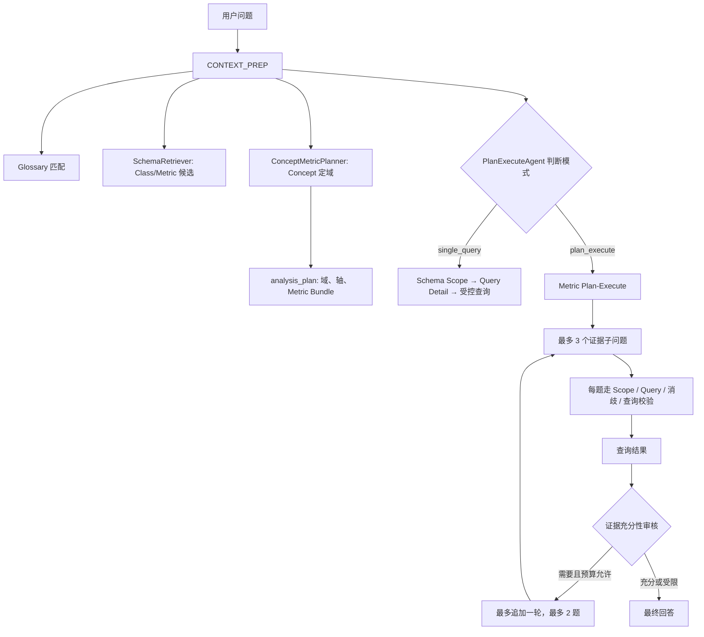

# Concept 问题深度分析现状与“温舜 2026Q1 销售趋势”配置方案

> 调研日期：2026-08-01  
> 范围：当前 ChatBI V3 运行时代码、Concept/Metric/DimensionGroup 数据模型，以及“分析一下 2026Q1 温舜的销售趋势”的目标分析需求。  
> 结论：当前系统已经具备 **Concept 定域 + Metric Bundle + Plan-Execute 多证据执行** 的首版能力；但它还不是“按 Concept 树自动递归归因”的 AnalysisAgent。要让简短的“销售趋势”问题稳定隐含“逐月达成率 + 医院层级（T40、T40-80、T80-100）拆解”，需要补齐可治理的分析蓝图（Blueprint）或扩展现有 `ConceptMetricPlanner` 的优先轴规则。

---

## 1. 结论摘要

1. **Concept 的当前作用是规划，不是直接查询。**
   - 用于命中业务主题、寻找上级主题域、识别可执行的分析轴；
   - 用于把候选 Metric 过滤、分组成兼容的 Bundle；
   - 不生成 SQL、不直接决定字段或过滤器；最终查询仍经过 Schema Scope、Query Detail、实体消歧、受控数据查询链路。

2. **当前深度分析的实际入口是 `metric_plan_execute`。**
   LLM 先判断用户问题是否必须使用多份独立证据；若需要，则按照“子问题 → 受控查询 → 证据充分性审核 → 可选追加”的有限循环执行。Concept 分析计划作为约束上下文注入这个过程。

3. **当前行为不能保证自动推导用户未说出的“医院层级拆解”。**
   目前 Concept 检索主要做问题文本与 Concept 的名称/描述/ID 的包含匹配；`销售趋势` 能命中销售和趋势相关资产，但不会天然命中未出现在问题中的 `T40`、`T40-80`、`T80-100`。因此，单靠增加 Concept 节点无法稳定实现该隐含分析意图。

4. **建议采用“销售趋势诊断 Blueprint”。**
   以销售主题域为边界，强制首轮证据覆盖：
   - 按月：实际销售额、目标销售额、加权达成率；
   - 按医院层级：同口径实际、目标、达成率，必要时同时按月 × 层级展开；
   - 结论方法：识别达成率拐点，并按层级计算对目标缺口和销售变化的贡献。

5. **“温舜”必须先确定人员角色字段。**
   当前主医院月度绩效事实包含 BD、SD、RM、DM 等多种人员字段。不能把“温舜”硬编码为某一职位字段；应先由实体消歧确定其在当前场景对应的角色字段，再将这一共同筛选条件复用到所有子查询。

---

## 2. 当前实现：从用户问题到深度分析结果

### 2.1 运行时主流程



### 2.2 `CONTEXT_PREP` 阶段

`ChatEngineV3._handle_context_prep()` 的顺序如下：

1. Glossary 匹配企业术语；
2. `SchemaRetrieverAgent` 从问题文本检索相关 Class、Metric、Relationship，形成 `schema_context` 和 `metric_context`；
3. `ConceptMetricPlanner.build_retrieval_context()` 从未被拒绝的 Concept 中检索候选 Concept，并取其祖先主题域及关联的已审核 DimensionGroup；
4. `ConceptMetricPlanner.build_analysis_plan()` 产生 `analysis_plan`；
5. `PlanExecuteAgent.decide_execution_mode()` 用问题、Schema 摘要、Glossary 语义判断选择单查询还是多证据执行。

值得注意的是，Concept 规划不会取代 Schema/Metric 检索：它使用的 `relevant_metric_ids` 正是 SchemaRetriever 已检索出的 Metric 候选。因此，Concept 的作用是约束和组织已有可执行指标，而不是绕过指标治理。

### 2.3 Concept 检索与定域规则

当前 `ConceptMetricPlanner` 的实现包含以下步骤：

| 步骤 | 当前规则 | 产物 |
| --- | --- | --- |
| 关键词切分 | 连续中文生成长度不少于 2 的子串；英文保留词元 | 用于 Concept 文本匹配 |
| Concept 排序 | 在 `id`、`name`、`description`、`concept_type`、`related_class` 中进行包含匹配，按命中数排序，最多保留 12 个 | `relevant_concepts` |
| 主题域回溯 | 顺着 `parent_id` 找祖先 | `relevant_subject_domains` |
| 维度组发现 | DimensionGroup 的 `concept_id` 位于命中 Concept 或祖先集合中 | `relevant_dimension_group_ids` |
| 分析类型 | 关键词规则：`趋势/走势/变化/环比/同比/上月/去年/增长/下降` → `trend`；另支持 attribution、health、comparison | `analysis_type` |

运行时 `OntologyEngine.list_dimension_groups()` 只返回状态为 `approved` 的 DimensionGroup；Metric 的 Concept 绑定也只加载状态为 `approved` 的记录。因此，DimensionGroup 与 Metric 绑定是当前真正的执行治理边界。

### 2.4 Metric Bundle 的构成与兼容性

对于 Concept 范围内的候选 Metric，规划器按以下签名分组：

$$
K(m) = (anchor\_class, fixed\_filters, dimension\_group\_ids, data\_source)
$$

其中固定筛选来自 Metric 定义的 `inputs` 和并列输出 `outputs[].inputs`。签名相同的 Metric 才会组成同一 Bundle；每个 Bundle 会输出：

- `anchor_class`：事实锚点；
- `metric_ids`：可共同考虑的候选指标；
- `compatible_dimension_group_ids`：共同可用维度组；
- `fixed_filter_signature`：指标内部固定口径；
- `data_source`：数据源；
- `roles`：Concept-Metric 绑定的业务角色；
- `merge_policy`：多指标时为 `single_query`，单指标时为 `single_metric`。

当前实现还会从已选 Concept 的可执行后代中挑选前两个分析轴为 `selected_axis_concept_ids`，其余放入 `deferred_axis_concept_ids`。不过这只是**规划建议**：最终是否按这些轴查询，仍由 Plan-Execute 的子问题规划和后续 Query Detail 校验决定。

### 2.5 多证据 Plan-Execute 如何执行

当路由选择 `plan_execute` 时：

1. LLM 根据用户问题、Glossary、候选 Metric 摘要和 `analysis_plan` 生成最多 3 个业务子问题；
2. 每个子问题可引用已验证的 `metric_ids` 和 `metric_bundle_ids`，但不允许直接输出 SQL、字段名或查询参数；
3. 每个子问题重新走 Schema 检索、Schema Scope 校验、Query Detail 校验、必要维度澄清、实体消歧和 `query_ontology_data`；
4. 后序子问题可语义化复用已完成子问题的实体范围、时间和共同过滤条件，避免人员/期间口径漂移；
5. 查询次数、首轮题数、迭代次数均受常量上限控制；
6. 证据审核器判断 `sufficient`、`add` 或 `limited`。只有存在明确缺口且尚有预算时，才追加最多 2 个子问题。

这意味着当前“深度”是**受控多证据的渐进展开**，而不是一次性扇出所有 Concept 节点。

---

## 3. 已具备的数据治理能力与现存边界

### 3.1 已实现能力

| 能力 | 状态 | 说明 |
| --- | --- | --- |
| Concept 树存储 | 已实现 | 有 `parent_id`、`level`、`concept_type`、`related_class`、审核状态 |
| DimensionGroup → Concept | 已实现 | `dimension_groups.concept_id` 关联分析轴 Concept |
| Metric → DimensionGroup | 已实现 | `metric_dimension_bindings` 关联可用分析维度组 |
| Metric → Concept 多对多 | 已实现 | `metric_concept_bindings`，角色包括 outcome、target、driver、risk、efficiency、diagnostic |
| Concept-Metric 运行时规划 | 已实现（首版） | 生成领域、事实组、轴、Bundle、证据角色 |
| 多证据执行与追加 | 已实现 | 多轮受控 Plan-Execute、复用、去重、预算限制 |
| 早期必要维度澄清 | 已实现 | 根据 Metric 关联的 required DimensionGroup 进行澄清 |

### 3.2 当前边界与风险

1. **Concept 匹配是词面匹配，未使用向量、别名、Metric 绑定反向召回或蓝图。**
   Concept 的命中依赖问题中是否出现相关文本。因此“销售趋势”不会自动带出“医院层级”这一隐含轴。

2. **Concept 审核语义与代码注释不完全一致。**
   `list_concepts()` 和规划器当前仅排除 `rejected`，`pending` Concept 仍可能参与候选；但 DimensionGroup 与 Metric-Concept binding 已明确要求 `approved`。正式投产前应将运行时 Concept 也收紧为 `approved`，或明确 pending 可读但不可驱动规划的策略。

3. **Metric Bundle 的兼容签名尚未覆盖所有业务语义。**
   当前主要校验锚点、固定筛选、维度组和数据源；未显式编码“月度流量 vs 累计值”“比率分母口径”“数据刷新周期/权限范围”“防重复汇总粒度”等更强约束。

4. **分析轴只是候选，不是强制的证据契约。**
   `selected_axis_concept_ids` 会传入 LLM 计划器，但当前子问题是否覆盖时间轴、医院层级轴仍由模型决定，不能保证隐含分析意图被覆盖。

5. **没有持久化的 `analysis_blueprints`。**
   当前设计文档已经建议 Blueprint，但运行时数据模型和规划器尚未读取此类资产。高频诊断方法论仍主要写在提示词或临时计划中。

6. **最终回答没有专门的“趋势/贡献度计算器”。**
   系统会把受控查询结果交给最终回答模型总结；没有一个强制、可审计的算子来统一计算环比、达成率差、缺口贡献和显著性。因此要保证方法论稳定，应将关键派生指标固化为 Metric 或确定性后处理。

---

## 4. 目标问题的业务语义与数据口径

### 4.1 目标问题

> 分析一下 2026Q1 温舜的销售趋势。

期望隐含语义：

1. 温舜在 2026Q1 内逐月销售额、目标额和达成率的变化；
2. 温舜负责医院按 T40、T40-80、T80-100 的达成情况；
3. 识别哪类医院在拉升或拖累趋势，并给出可行动结论。

### 4.2 推荐事实与字段口径

优先使用 **`MainHospitalMonthlyPerformance`（主医院月度绩效）**：其粒度为主医院 × 月份，适合历史完整月份、主医院层级、月度销售与目标达成分析。当前已知可用的关键字段/概念包括：

| 业务含义 | 推荐数据口径 |
| --- | --- |
| 时间 | `apmonth` 用于逐月展开；`quarter_cd = 2026Q1` 用于季度范围限定 |
| 人员范围 | 先在 BD/SD/RM/DM 等姓名字段中消歧出“温舜”的实际所属角色字段；后续所有证据继承同一人员过滤条件 |
| 医院层级 | `hospital_segment`，值为 T40、T40-80、T80-100 |
| 月度实际销售额 | `SUM(actual_amount)` |
| 月度目标销售额 | `SUM(target_amount)` |
| 月度达成率 | $\frac{\sum actual\_amount}{\sum target\_amount}$，禁止对医院行级达成率直接平均 |
| 季度累计达成率（可选） | $\frac{\sum actual\_amount_{Q1}}{\sum target\_amount_{Q1}}$；不要将单月/QTD 比率简单平均 |

> 注意：Q1 范围过滤与逐月分析并不冲突。使用 `quarter_cd = 2026Q1` 限定业务季度，同时以 `apmonth` 作为分组维度展示月度趋势。不要把 AP 编码误当自然月；现有全局规则定义 AP01–AP03 对应 Q1。

### 4.3 推荐的证据问题

| 优先级 | 证据角色 | 业务子问题 | 分组 | 目的 |
| --- | --- | --- | --- | --- |
| 1 | baseline / comparison | 温舜 2026Q1 每月实际销售、目标销售及加权达成率如何变化？ | `apmonth` | 建立趋势、找拐点、计算月间变化 |
| 2 | decomposition | 温舜 2026Q1 各医院层级的实际、目标、达成率与目标缺口如何？ | `hospital_segment` | 找到整体未达成或超额的结构来源 |
| 3 | decomposition（建议） | 温舜 2026Q1 每月 × 医院层级的实际、目标、达成率如何变化？ | `apmonth` × `hospital_segment` | 判断是哪一层级在哪个月发生变化，避免只看季度汇总造成误判 |

如果查询预算或用户目标只允许两份证据，优先保留第 1、3 项；第 3 项可以同时回答季度层级表现与月度层级走势。

---

## 5. 推荐 Concept、DimensionGroup 与 Metric 配置

### 5.1 建议的 Concept 树

建议采用以下稳定 ID。`analysis_axis` 和 `metric_topic` 如当前校验模型尚未放开，可临时使用兼容类型 `dimension_group`、`kpi`；但运行时规划器已经识别 `analysis_axis`，长期应扩展模型白名单并统一迁移。

```text
sales_performance_domain             subject_domain  销售业绩主题域
├─ sales_performance_fact_group      fact_group      销售结果与目标
│  ├─ monthly_sales_topic            metric_topic    月度销售额与目标
│  └─ achievement_rate_topic         metric_topic    销售额达成率
├─ time_month_axis                   analysis_axis   月度趋势
├─ sales_owner_axis                  analysis_axis   人员负责范围
└─ hospital_segment_axis             analysis_axis   医院战略分层
```

建议定义：

| Concept ID | 类型 | 父节点 | 关联 Class | 说明 |
| --- | --- | --- | --- | --- |
| `sales_performance_domain` | `subject_domain` | 无 | `MainHospitalMonthlyPerformance` | 销售额、目标、达成与趋势诊断的主题边界 |
| `sales_performance_fact_group` | `fact_group` | `sales_performance_domain` | `MainHospitalMonthlyPerformance` | 结果、目标、缺口与达成率的事实集合 |
| `monthly_sales_topic` | `metric_topic` | `sales_performance_fact_group` | `MainHospitalMonthlyPerformance` | 月度实际销售额与目标额 |
| `achievement_rate_topic` | `metric_topic` | `sales_performance_fact_group` | `MainHospitalMonthlyPerformance` | 加权销售额达成率 |
| `time_month_axis` | `analysis_axis` | `sales_performance_domain` | `MainHospitalMonthlyPerformance` | 以 AP 月为趋势粒度 |
| `sales_owner_axis` | `analysis_axis` | `sales_performance_domain` | `MainHospitalMonthlyPerformance` | 对应经消歧后的人员岗位字段 |
| `hospital_segment_axis` | `analysis_axis` | `sales_performance_domain` | `MainHospitalMonthlyPerformance` | 医院战略分群 T40/T40-80/T80-100 |

### 5.2 DimensionGroup 配置

| DimensionGroup ID | 绑定 Concept | 类型 | 映射与选项 | 建议策略 |
| --- | --- | --- | --- | --- |
| `month_granularity` | `time_month_axis` | `time` | 映射 `apmonth`；季度条件由 `quarter_cd` 承载 | 默认可推断为月度；趋势问题优先使用 |
| `sales_owner_scope` | `sales_owner_axis` | `hierarchy` 或 `categorical` | 允许映射 BD/SD/RM/DM 人员姓名、NT ID 等字段 | `ask_when_ambiguous`；姓名命中多个岗位时必须澄清 |
| `hospital_strategic_segment` | `hospital_segment_axis` | `categorical` | 映射 `hospital_segment`；固定选项为 `T40`、`T40-80`、`T80-100` | `auto_fill`；Blueprint 要求分解时不向用户询问，而是直接分组 |

关键约束：

- `hospital_strategic_segment` 必须状态为 `approved`，并回填 `concept_id = hospital_segment_axis`；
- 选项与原始数据值保持一致；若页面展示名称不同，使用 option label/alias 映射，不应在查询时猜测值；
- 人员维度不能把“温舜”作为固定的 DimensionGroup option。人员是动态实体，应由实体消歧处理“姓名 → 实际字段和值”；DimensionGroup 只治理角色/字段选择；
- 所有与该分析相关的 Metric 都要绑定上述可用维度组，否则规划器无法将这些轴识别为对该 Metric 可执行的拆解维度。

### 5.3 Metric 与 Concept 的绑定

建议创建或审核以下 Metric。实际 Metric ID 应以场景中已存在的主医院月度绩效指标为准；如果已有“基于主医院的销售金额”“基于主医院的销售额达成率”，应复用而非创建同义重复指标。

| Metric 语义 | Metric 计算 | 绑定 Concept | 角色 | DimensionGroup IDs |
| --- | --- | --- | --- | --- |
| 月度实际销售额 | `SUM(actual_amount)` | `monthly_sales_topic` | `outcome` | `month_granularity`, `sales_owner_scope`, `hospital_strategic_segment` |
| 月度目标销售额 | `SUM(target_amount)` | `monthly_sales_topic` | `target` | 同上 |
| 月度销售额达成率 | $\sum actual\_amount / \sum target\_amount$ | `achievement_rate_topic` | `outcome` | 同上 |
| 目标缺口（建议新增） | $\sum actual\_amount - \sum target\_amount$ | `sales_performance_fact_group` 或独立 topic | `diagnostic` | 同上 |
| 销售环比（可选） | 按月趋势数据确定性计算，或受治理的环比 Metric | `monthly_sales_topic` | `diagnostic` | `month_granularity`, `sales_owner_scope`, `hospital_strategic_segment` |

建议将“实际 + 目标 + 达成率 + 缺口”置于同一兼容 Metric Bundle。若达成率 Metric 的定义和其他 Metric 共用 `MainHospitalMonthlyPerformance`、相同人员/季度范围、相同维度组和数据源，则可一并查询；否则必须拆分。

### 5.4 目标 Bundle

```json
{
  "id": "main_hospital_monthly_sales_performance",
  "anchor_class": "MainHospitalMonthlyPerformance",
  "metric_ids": [
    "monthly_actual_sales",
    "monthly_sales_target",
    "monthly_sales_achievement_rate",
    "monthly_sales_gap"
  ],
  "compatible_dimension_group_ids": [
    "month_granularity",
    "sales_owner_scope",
    "hospital_strategic_segment"
  ],
  "required_context": ["sales_owner_scope"],
  "comparison_policy": "same_person_same_quarter_weighted_ratio",
  "merge_policy": "single_query"
}
```

其中 `monthly_actual_sales` 等是语义占位 ID，落库时需要替换为当前场景已审核 Metric 的真实 ID。`MetricBundle` 当前是运行时临时产物，尚未作为独立资产持久化。

---

## 6. 让隐含分析意图稳定生效：加入分析 Blueprint

### 6.1 为什么仅配置 Concept 不够

问题文本中不含“达成率”“医院层级”“T40”，所以当前的词面 Concept 检索没有足够信号选中 `hospital_segment_axis`。即使该轴被选中，当前 `analysis_plan` 也只把它作为 LLM 子问题规划的候选，不保证被执行。

因此需要一条经过治理的策略：当用户在销售主题域提出趋势分析时，默认将“月度趋势 + 医院战略分层”列为首轮必需证据，而不是等待模型临场猜测。

### 6.2 建议的 Blueprint 定义

建议新增 `analysis_blueprints` 资产；在资产尚未落库前，也可先以受控 Python 配置实现相同规则。

```json
{
  "id": "sales_trend_by_hospital_segment",
  "subject_domain_id": "sales_performance_domain",
  "analysis_type": "trend",
  "trigger_terms": ["销售趋势", "销售走势", "趋势", "走势"],
  "applicable_anchor_classes": ["MainHospitalMonthlyPerformance"],
  "required_metric_roles": ["outcome", "target"],
  "preferred_metric_topics": [
    "monthly_sales_topic",
    "achievement_rate_topic"
  ],
  "required_axis_concept_ids": [
    "time_month_axis",
    "hospital_segment_axis"
  ],
  "optional_axis_concept_ids": ["sales_owner_axis"],
  "evidence_templates": [
    {
      "role": "baseline",
      "intent": "按月查看实际销售额、目标销售额、加权达成率及环比变化",
      "dimensions": ["apmonth"]
    },
    {
      "role": "decomposition",
      "intent": "按月和医院战略分层查看实际、目标、加权达成率与目标缺口",
      "dimensions": ["apmonth", "hospital_segment"]
    }
  ],
  "max_axes": 2,
  "expansion_policy": "first_run_required_then_expand_on_anomaly",
  "status": "approved"
}
```

### 6.3 Blueprint 接入规则

推荐在 `ConceptMetricPlanner.build_analysis_plan()` 中增加以下优先级：

1. 根据 Concept 定域和 `analysis_type` 查找 `approved` Blueprint；
2. 校验 Blueprint 的事实类、Metric 绑定、DimensionGroup 映射与当前场景资产均可用；
3. 将 Blueprint 的 `required_axis_concept_ids` 放入 `selected_axis_concept_ids`，而不是仅按文本匹配排序；
4. 将 `evidence_templates` 作为 `PlanExecuteAgent.plan_metric_subquestions()` 的强约束输入；
5. 若用户显式缩小范围（例如“只看 T40”），保留时间趋势证据，但把医院层级改为过滤；
6. Blueprint 不可用时回退到现有通用 Concept-Metric 规划，且在结果中说明未启用标准诊断蓝图。

这样既保留当前受控 Scope/Query/消歧链路，也使业务方法论可审核、可版本化、可复用。

---

## 7. 推荐分析方法论与确定性指标

### 7.1 基础计算

对每个分析粒度 $g$（月、医院层级，或月 × 医院层级）：

$$
Actual_g = \sum_{i \in g} actual\_amount_i
$$

$$
Target_g = \sum_{i \in g} target\_amount_i
$$

$$
Achievement_g = \frac{Actual_g}{Target_g}
$$

$$
Gap_g = Actual_g - Target_g
$$

月度销售额环比：

$$
MoMActual_t = \frac{Actual_t - Actual_{t-1}}{Actual_{t-1}}
$$

达成率环比变化使用百分点而非百分比倍数，避免歧义：

$$
\Delta Achievement_t = Achievement_t - Achievement_{t-1}
$$

### 7.2 医院层级贡献分析

针对某个下降月或未达成月，以医院层级 $s$ 计算：

$$
GapContribution_s = \frac{Gap_s}{\sum_s |Gap_s|}
$$

或针对销售额月间变动：

$$
ChangeContribution_s = \frac{Actual_{s,t} - Actual_{s,t-1}}{Actual_t - Actual_{t-1}}
$$

使用时应遵守：

- 总变化接近 $0$ 时，不输出不稳定的贡献率，改输出绝对变动额；
- 贡献度适合解释“变化由谁造成”，缺口适合解释“离目标差多少”，两者不要混为同一个排名；
- 总达成率必须用汇总后的实际/目标重算，不得平均医院达成率或平均医院层级达成率；
- 若某医院层级目标为 $0$，达成率应标记为不可计算或按业务规则单独处理，不能除零。

### 7.3 建议的最终答复结构

1. **结论先行**：Q1 总体趋势（上升/下降/波动），Q1 累计达成，关键拐点月份；
2. **月度趋势表**：每月 Actual、Target、Achievement、Gap、销售额环比、达成率百分点变化；
3. **医院层级结构表**：T40、T40-80、T80-100 的 Actual、Target、Achievement、Gap；
4. **归因结论**：指出拖累/拉升最大的层级及发生月份；
5. **行动建议**：对低达成且高缺口的层级优先列出医院明细（作为下一步受控下钻，而非在没有数据时臆测）。

---

## 8. 实施优先级与验收标准

### P0：可立即配置并验证

1. 审核 `MainHospitalMonthlyPerformance` 的实际、目标、达成率 Metric 定义，确保比率使用“汇总后相除”；
2. 建立/审核 `sales_performance_domain`、事实组、时间轴、人员轴、医院层级轴；
3. 创建并审核 `month_granularity`、`sales_owner_scope`、`hospital_strategic_segment` DimensionGroup，回填 `concept_id` 与字段映射；
4. 为相关 Metric 配置 `metric_dimension_bindings` 和已审核 `metric_concept_bindings`；
5. 使用明确问题做端到端验证：

> 分析 2026Q1 温舜的销售趋势：请按月展示实际、目标和达成率，并按 T40、T40-80、T80-100 拆解。

此阶段即使没有 Blueprint，也能验证数据口径、人员消歧、维度映射、Plan-Execute 与最终汇总是否正确。

### P1：让简短问题自动使用方法论

1. 引入 `analysis_blueprints` 或等价的受控配置；
2. 在 `ConceptMetricPlanner` 中执行 Blueprint 匹配和可用性校验；
3. 将 Blueprint 证据模板强制写入子问题计划，而不是仅作为自由文本建议；
4. 增加确定性趋势/贡献度计算，避免最终回答模型自行解释公式；
5. 为“人员范围继承”“季度 + 月度分组”“医院层级分解”添加集成测试。

### P2：治理强化

1. 运行时只允许 `approved` Concept 驱动规划；
2. 扩展 Bundle 兼容签名，纳入粒度、时间语义、单位、权限、刷新周期；
3. 支持 Blueprint 版本、审批、回滚和命中审计；
4. 针对异常后下钻增加“医院明细 / 区域 / 产品规格”等受控扩展轴；
5. 记录每次分析使用的 Blueprint、Metric、轴、过滤条件和公式，形成可复盘证据链。

### 验收标准

| 场景 | 预期 |
| --- | --- |
| 输入简短问题“分析一下2026Q1温舜的销售趋势” | 命中销售趋势 Blueprint，进入多证据执行 |
| 人名存在于多个人员角色字段 | 返回人员角色澄清，不混用岗位字段 |
| 人员角色唯一 | 所有子问题继承同一人员、季度过滤条件 |
| 月度趋势 | 输出 Q1 月度 Actual、Target、加权 Achievement、Gap 与变化 |
| 医院层级 | 输出 T40、T40-80、T80-100，且为汇总后重算达成率 |
| 发现拐点或未达成 | 输出对应月份/层级的缺口或变化贡献；无数据时明确限制 |
| 无可用 Blueprint | 回退通用 Concept-Metric 规划，不生成虚构字段或指标 |

---

## 9. 关键代码与资产位置

| 位置 | 作用 |
| --- | --- |
| `src/backend/agents/ontology_chatbi/engine.py` | `CONTEXT_PREP`、模式路由、`METRIC_PLAN_EXECUTE`、子问题受控执行 |
| `src/backend/agents/ontology_chatbi/node/concept_metric_planner.py` | Concept 检索、主题域回溯、Metric Bundle、分析轴与证据角色 |
| `src/backend/agents/ontology_chatbi/node/plan_execute_agent.py` | LLM 路由、子问题计划、复用判定、证据充分性审核 |
| `src/backend/agents/ontology_chatbi/node/schema_retriever.py` | Class/Metric/Relationship 的初始文本检索 |
| `src/backend/agents/ontology_chatbi/prompt.py` | 路由、子问题、复用、证据审核等受控 JSON 契约 |
| `src/backend/core/ontology/ontology_engine.py` | 场景资产加载、审核过滤、Metric/Concept/DimensionGroup 运行时访问器 |
| `src/backend/modules/metrics.py` | Metric-Concept Binding 的校验与管理 API |
| `src/backend/tests/test_concept_metric_planner.py` | 当前 Concept-Metric Bundle 的单元测试 |
| `docs/Plan Execute/问题拆解方案改进路径_Concept_Metric.md` | 现有设计背景、边界和后续治理方向 |

---

## 10. 最终建议

对“温舜 2026Q1 销售趋势”这一类高频经营诊断，不建议依赖大模型从一句话临时猜出全部深层含义。推荐的最小闭环是：

1. 将销售、目标、达成率、时间、人员、医院层级建成可审核的 Concept/DimensionGroup/Metric 关联；
2. 用 `MainHospitalMonthlyPerformance` 统一事实口径，人员字段经消歧后复用；
3. 将逐月趋势与医院战略分层设为销售趋势 Blueprint 的必需证据；
4. 用汇总后重算的达成率、目标缺口和变化贡献生成结论；
5. 对低达成或贡献异常的层级，再按医院明细受控下钻。

这样可同时获得：稳定的数据获取路径、可审计的业务方法论、可复用的 Concept 配置，以及避免“平均达成率”“人员角色错配”“无依据全量下钻”等常见错误的治理边界。
