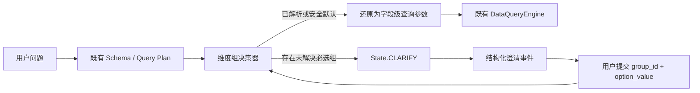

# 基于分析维度组的问题澄清 Agent：实施路径与技术方案

> **日期**：2026-07-27  
> **范围**：仅覆盖数据查询中的“基于维度”的问题澄清；不包含归因、根因分析、趋势分析或 Concept 驱动下钻。  
> **结论**：当前项目已具备维度组的治理模型、管理 API 和前端配置页，但运行时数据查询链路尚未将其载入、解析和交互式澄清打通。建议采用“后端确定性决策 + 业务级结构化交互 + 既有字段级查询执行”的增量实现。

---

## 1. 研究依据与边界

已阅读以下报告：

- `C:\work\ontology-v2\docs\dimension\ChatBI 维度抽象澄清与 Concept 深度追因分析技术方案报告(DP)_0713.md`
- `C:\work\ontology-v2\docs\dimension\ChatBI 维度抽象澄清与 Concept 深度追因分析技术方案报告_0713.md`
- `C:\work\ontology-v2\docs\dimension\ChatBI_DimensionGroup_ClarifyAgent_Implementation_Report_0714.md`
- `C:\work\ontology-v2\docs\dimension\ChatBI_Dimension_Clarity_Concept_Analysis_Design_0713.md`

上述报告在“DimensionGroup 是 Metric 与物理字段之间的业务语义层”“澄清应优先确定性自动解析，仅在无法安全决定时提问”两点上结论一致。本方案保留这两个原则，但严格限定在维度澄清。

### 明确不在本期范围内

1. 不新增 `AnalysisAgent`，不处理“为什么”“归因”“贡献度”等问题。
2. 不依赖或改造 Concept 树来生成查询下钻路径；本期的 `concept_id` 仅是维度组治理关联。
3. 不改写 `DataQueryEngine` 的 SQL 编译语义；执行前必须已经还原为既有的逻辑字段、`dimensions` 与 `filters` 参数。
4. 不让 LLM 决定或伪造维度组选项、物理字段、默认值和权限范围。

---

## 2. 当前项目现状与关键判断

### 2.1 已具备的基础能力

| 能力 | 当前实现 | 判断 |
|---|---|---|
| 维度组治理模型 | `DimensionGroupCreate` 已具备组选项、字段映射、默认项、澄清策略、Metric 绑定 | 可直接复用 |
| 管理 API | 已管理 `dimension_groups`、`dimension_group_options`、`dimension_field_mappings`、`metric_dimension_bindings` | 可直接复用 |
| 管理 UI | 已有维度组、Metric、Concept 管理组件 | 无需先建新工作台 |
| 查询状态机 | 已定义 `State.CLARIFY` | 可以作为唯一澄清出口 |
| 事件传输 | Data Query 事件可经既有事件缓存和聊天轮询链路上送 | 可扩展结构化澄清事件 |
| 查询执行 | `DataQueryEngine` 接收字段级 `dimensions`、`filters` 并校验查询范围 | 保持不变 |

### 2.2 当前缺口

1. `OntologyEngine.from_database()` 当前加载 Class、Relationship、Metric，但未读取维度组、选项、字段映射或 Metric—组绑定。因此运行时没有可信的维度组资产。
2. `Metric.dimension_group_ids` 已能在管理端写入和校验，但运行时的 Metric 未必获得该关系；必须在本体装载阶段显式合并。
3. `State.CLARIFY` 已定义，但状态处理映射中被注释；现有 `_handle_clarify()` 只是直接结束，不能输出维度澄清协议。
4. `AgentState` 没有保存待答问题、已解析选择、选择来源和可恢复执行计划的字段。
5. 当前前端事件标准化和渲染以工具、思考、告警、错误、完成为主，尚没有可提交 `group_id + option_value` 的澄清卡片。
6. 已存在 `required_dimensions` 字段级兼容逻辑，但它不能表达业务标签、选项可用范围、默认策略及跨表映射。

### 2.3 设计结论

不需要创建第二个“聊天澄清系统”，也不应把业务组 ID 下推到 SQL 编译器。应在 **查询计划已形成且校验通过、工具执行之前** 插入统一的维度决策步骤：



---

## 3. 目标架构与职责边界

### 3.1 三层职责

| 层 | 资产 / 组件 | 负责内容 | 不负责内容 |
|---|---|---|---|
| 治理层 | DimensionGroup、选项、字段映射、Metric 绑定 | 业务名称、可选项、别名、默认项、策略、状态、字段映射 | SQL 生成 |
| 决策层 | `ClarifyAgent` / `DimensionResolutionService` | 判断是否满足、自动解析、默认、合并多 Metric 约束、生成待答问题 | 直接执行数据库查询 |
| 执行层 | `OntologyEngine`、`DataQueryEngine`、实体消歧器 | 组资产读取、可达性校验、字段级参数校正、SQL 编译与执行 | 面向用户展示物理字段 |

`Concept` 仅保留为维度组的业务治理关联（`concept_id`）。本期既不通过 Concept 寻找维度，也不依据 Concept 扩展分析路径。

### 3.2 建议的运行时对象

在独立的 `app/agents/clarify/engine.py` 实现纯确定性服务，而不是引入 LLM 调用。推荐返回稳定的结构化结果：

```text
DimensionResolution
├── resolved: [
│   {group_id, option_value, field_mappings, source, confidence, audit_reason}
│ ]
├── unresolved: [
│   {group_id, name, group_type, metric_ids, options, question}
│ ]
├── effective_query_plan
└── audit
```

`source` 建议限定为：

- `explicit_plan`：Query Plan 已包含该组选项对应字段；
- `session_answer`：用户本轮或已确认会话答案；
- `user_semantics`：别名或确定性时间语义解析；
- `metric_default`：各相关 Metric 对该组一致的默认；
- `group_default`：维度组默认；
- `legacy_required_field`：未迁移 Metric 的字段级兼容路径。

### 3.3 数据模型：复用优先，补齐最小表达

当前治理模型基本覆盖需要。建议不新增与现有表重复的核心表，而对 `metric_dimension_bindings` 补齐每指标覆盖属性（迁移后）：

| 属性 | 当前状态 | 建议 |
|---|---|---|
| `group_id`、Metric 绑定 | 已有 | 保持 |
| 组选项、别名、默认项 | 已有 | 保持 |
| 字段映射与优先级 | 已有 | 保持 |
| `is_required`、`clarification_policy` | 组级已有 | 保持作为默认规则 |
| 指标级 `required` | 未确认有持久化表达 | P1 增加，覆盖组级默认 |
| 指标级 `default_option` | 未确认有持久化表达 | P1 增加，解决不同指标默认粒度差异 |
| `allowed_options` | 未确认有持久化表达 | P1 增加，限制 Metric 能使用的组选项 |
| 版本 / 审批状态 | 组级已有 `status` | 只允许 `approved` 组与选项进入运行时 |

### 3.4 物理字段解析原则

对于已选择的 `{group_id, option_value}`，解析器必须：

1. 只读取当前 `scenario_id` 的已批准资产；
2. 只接受该组现存、已批准、且被当前 Metric 允许的选项；
3. 依据 `target_class`、`join_classes`、Metric 来源类选择适用映射；
4. 校验字段存在、字段未废弃、映射 Class 在当前查询范围可达；
5. 将选择转为既有 Query Plan 中的逻辑字段；
6. 不信任客户端回传的 `field_name`、`class_id` 或 SQL 片段。

最终进入 `DataQueryEngine` 的仍是现有字段级参数。组选择额外保存在审计元数据中，不改变 SQL 执行器的公共契约。

---

## 4. 维度澄清决策策略

### 4.1 触发入口

将维度组决策放在 Query Plan 已通过基础结构校验后、调用 `EntityDisambiguatorAgent` 与 `DataQueryEngine` 前。原因：

- 已有候选 Metric、目标 Class 和 Join Scope，可验证映射可执行性；
- 避免先执行后发现口径缺失；
- 不将不确定的业务组 ID 暴露给实体值消歧逻辑；
- 单查询和未来的任意子查询可复用同一入口。

### 4.2 决策优先级

针对本次所有 Metric 的绑定组，按下面顺序逐组决策：

1. **Query Plan 显式覆盖**：`dimensions` 或 `filters` 已出现某组选项的映射字段时，反查为该选项。
2. **同会话确认答案**：复用会话内已确认的 `{group_id, option_value}`，但重新验证它对本次全部 Metric 与查询范围仍可用。
3. **用户语义命中**：用组选项 `aliases`、确定性时间解析器命中。例如“本季度”匹配季度选项；不使用自由 LLM 推断。
4. **Metric 默认**：所有相关 Metric 对该组给出相同、允许且可执行的默认时自动选用。
5. **组默认**：当 `clarification_policy=auto_fill` 或 `ask_when_ambiguous` 且没有冲突时，采用组级默认。
6. **生成澄清**：仅剩未解决且必选的组进入 `State.CLARIFY`。
7. **兼容回退**：Metric 没有组绑定时，沿用 `required_dimensions` 的字段级规则；但问题文案应尽可能从字段显示名生成，避免展示原始物理列名。

### 4.3 策略语义

| 策略 | 期望行为 |
|---|---|
| `auto_fill` | 无冲突时可用默认项；答案中需披露默认口径 |
| `ask_when_ambiguous` | 明确语义或唯一默认时自动；多个有效候选或冲突时提问 |
| `always_ask` | 对每次尚未显式选择的必选组提问；会话中已有明确答案可复用 |

### 4.4 必须阻止自动选择的情形

- 多个 Metric 对同一组的 `allowed_options` 无交集；
- 多个 Metric 的默认项不同，且用户语义未唯一命中；
- 一个字段同时映射到多个选项，无法反向唯一识别；
- 映射字段不在本轮 Class / Join Scope 内，或无法通过关系路径抵达；
- 组、选项或映射不是 `approved`；
- 用户一次表达“按月或按季度”这类多候选但未明确选择的语义；
- 前端答案的组或选项不属于本次待答集合。

以上情况必须进入结构化澄清或返回受控配置错误，禁止静默替换字段。

---

## 5. 会话、状态机与交互契约

### 5.1 `AgentState` 最小新增状态

建议增加以下数据，不改变现有工具结果结构：

```text
pending_dimension_clarification: dict | None
resolved_dimension_selections: list[dict]
dimension_resolution_audit: list[dict]
resume_query_plan: dict | None
```

会话级已确认答案应按 `scenario_id + group_id` 保存；复用时必须重新校验 Metric、选项状态与可达性。若当前会话持久化模型不适宜立即扩展，可先由前端把上一轮确认结果随续问请求显式带回，再在后端校验。

### 5.2 状态机改造

1. 启用当前被注释的 `State.CLARIFY` 路由。
2. 将 `_handle_clarify()` 由无操作结束改为：追加 `clarification` 事件、保存可恢复计划、终止本轮执行。
3. 用户回答进入新的“恢复查询”入口：先校验答案，再将其写入 `resolved_dimension_selections`，回到维度组决策步骤，而非让 LLM 重新生成整份计划。
4. 维度组决策结果已全部解决时，将选项映射回 `dimensions` / `filters`，再走现有实体消歧、工具执行和最终回答流程。

### 5.3 事件与回答契约

当前对外聊天以事件缓存和轮询为主；因此澄清应先作为既有事件流中的新事件类型，而不是为了本功能新建直连 SSE 通道。

建议事件载荷：

```json
{
  "type": "clarification",
  "query_id": "...",
  "data": {
    "version": 1,
    "reason": "missing_dimension_groups",
    "question": "为保证统计口径一致，请选择时间粒度。",
    "questions": [
      {
        "group_id": "time_granularity",
        "group_name": "时间粒度",
        "group_type": "time",
        "metric_ids": ["total_sales"],
        "required": true,
        "options": [
          {"value": "ap_month", "label": "按 AP 月（如 2026AP03）", "is_default": true},
          {"value": "quarter", "label": "按季度（如 2026Q1）", "is_default": false}
        ]
      }
    ],
    "resume_token": "opaque-server-token"
  }
}
```

前端回传只接受：

```json
{
  "resume_token": "opaque-server-token",
  "clarification_answers": [
    {"group_id": "time_granularity", "option_value": "quarter"}
  ]
}
```

不得让前端回传字段名、类名、过滤条件或 SQL。`resume_token` 应绑定 `query_id`、`scenario_id`、会话、待答组、计划摘要和过期时间，防止跨会话或过期答案恢复执行。

---

## 6. 分阶段实施路径

### P0：运行时可读性与配置健康检查

**目标**：让当前受治理资产确实进入数据查询运行时。

1. 扩展 `OntologyEngine.from_database()`，加载维度组、选项、映射、Metric—组绑定；只装载已批准资产。
2. 在内存本体中建立索引：`group_by_id`、`options_by_group`、`bindings_by_metric`、`mapping_by_group_option`。
3. 新增确定性查询方法：
   - `list_dimension_groups_for_metrics(metric_ids)`；
   - `get_dimension_group(group_id)`；
   - `resolve_dimension_option(group_id, option_value, query_scope, metric_ids)`；
   - `find_option_by_field(group_id, field_name, class_scope)`。
4. 将维度组及其绑定关系纳入本体版本更新触发范围；当前缓存版本只覆盖部分本体资产，必须避免配置更新后旧缓存继续服务。
5. 对现有组配置做健康扫描：选项唯一、默认项存在、映射字段存在、指标绑定有效、已批准项可执行。

**验收**：无需聊天改造即可在单元测试中从数据库加载一组时间维度，并将 `ap_month` 解析为当前目标 Class 的逻辑字段。

### P1：确定性维度决策服务

**目标**：完成不带 UI 的“识别、默认、拦截”闭环。

1. 在 `app/agents/clarify/engine.py` 实现无副作用的维度组决策器。
2. 输入 Query Plan、Metric、Query Scope、用户消息、会话答案；输出解析结果与审计记录。
3. 实现显式覆盖、会话复用、别名/时间解析、Metric 默认、组默认、冲突检测和旧字段回退。
4. 在 Query Plan 后、执行前接入；所有未解决必选组返回 `clarification_needed`，不得执行查询。
5. 回写解析出的字段级参数，再运行现有实体消歧和查询安全校验。

**验收**：后端可针对任意 Query Plan 返回“已解析”和“待澄清”两种稳定结果；没有 LLM 参与决策。

### P2：交互澄清与计划恢复

**目标**：用户可在聊天界面选择业务维度并恢复原计划。

1. 启用 `State.CLARIFY` 及事件发送。
2. 为 `AgentState` 和缓存增加待答状态、审计及可恢复计划。
3. 新增提交答案 / 恢复查询 API；校验 `resume_token`、会话和选项合法性。
4. 前端增加澄清卡片，按业务标签渲染单选或多选，不显示物理字段。
5. 答案披露自动选择，例如“已按默认 AP 月汇总”。

**验收**：用户在“销售额是多少？”后可收到“时间粒度”业务问题，选择季度后无需重复生成计划即可继续查询。

### P3：治理强化与可观测性

**目标**：让配置可维护、决策可解释、失败可定位。

1. 在 Metric—组绑定增加指标级 `required`、`default_option` 与 `allowed_options`。
2. 管理端增加影响分析：组选项、映射或状态变更影响哪些 Metric。
3. 为每次决策记录：候选、最终选择、来源、冲突、映射、是否执行和用户后续改选。
4. 指标化：自动填充率、澄清率、澄清完成率、默认后改选率、映射失败率、配置拒绝率。
5. 对历史字段级 `required_dimensions` 制定迁移清单；新 Metric 默认要求组绑定，老 Metric 保留兼容期。

---

## 7. 测试与验收矩阵

| 场景 | 期望结果 |
|---|---|
| Query Plan 已含映射字段 | 相应维度组被视为已满足，不重复提问 |
| `filters` 含映射字段 | 同样满足；不能只检查 `dimensions` |
| “本季度销售额” | 确定性命中季度选项及其字段，无澄清 |
| 无时间表达但可自动填充 | 采用唯一默认，记录来源，答案披露 |
| `always_ask` 且未显式选择 | 即使有默认也发起澄清 |
| 两 Metric 共用同组且默认一致 | 只生成一个合并问题或一次自动选择 |
| 两 Metric 默认冲突 | 不自动填充，生成一个合并问题 |
| 允许选项无交集 | 阻止执行，给出受控配置问题 |
| 映射字段不在 Query Scope 可达范围 | 不选择，不执行；记录配置错误 |
| 回传非法 `option_value` | 拒绝恢复，不改写查询计划 |
| 过期或跨会话 `resume_token` | 拒绝恢复 |
| 未迁移旧 Metric | `required_dimensions` 回退仍有效 |
| 用户再次修改已确认的组选择 | 新选择覆盖旧答案，重新解析并审计 |

测试应以单元测试为主：决策器不需要真实 LLM、数据库或 SSE。其次增加本体加载集成测试、事件协议测试、聊天恢复端到端测试。现有数据查询字段消歧测试仍需运行，确保维度解析在其之前写入的字段不会被错误替换。

---

## 8. 风险与控制

| 风险 | 控制措施 |
|---|---|
| 治理资产存在但运行时未装载 | P0 先补齐加载和健康检查，未批准资产一律不可用 |
| 默认选择改变业务口径 | 仅在策略允许且无冲突时自动；记录选择来源并在答案披露 |
| 多 Metric 维度规则不一致 | 用交集判定；无唯一解时只问一次，不静默任选 |
| 多表映射不可执行 | 强制按 Query Scope、Join 可达性和字段状态验证 |
| 客户端篡改字段或计划 | 只允许回传稳定的组 / 选项 ID；后端用令牌恢复已签名或缓存的计划 |
| 澄清造成重复 LLM 规划与对话漂移 | 恢复原计划，不要求 LLM 用用户的简短回答重新规划 |
| 过度澄清 | 最小必选原则；优先显式语义、会话复用和安全默认 |
| 缓存与本体配置不一致 | 将维度组相关表纳入版本失效机制，并为版本切换写集成测试 |

---

## 9. 需要产品、数据治理与研发共同确认的问题

以下问题需要在开始编码前形成明确决策；它们是本方案的实施前置条件。

### 9.1 业务语义与产品策略

1. 哪些维度组属于“缺失即改变指标解释”的必选组？时间粒度、统计期间、组织口径是否分别建组？
2. 对“销售额是多少？”这类未带期间的问题，默认是“当前可用期间”、最新 AP 月、按月汇总，还是必须追问？
3. `auto_fill` 是否允许用于时间以外的分组（如区域、渠道、品类）？允许的业务边界是什么？
4. 一个查询包含多个 Metric 时，产品是否接受只展示二者的选项交集？交集为空时的用户文案是什么？
5. 用户回答“按季度”时，系统是只改变聚合粒度，还是同时必须要求具体季度范围？两类选择应如何分开表达？
6. 是否需要支持“本月 / 上月 / 最近三个月 / 同比 / 环比”这类时间范围和“按月 / 按季度 / 按年”这类时间粒度的独立澄清？

### 9.2 数据治理与本体质量

1. 当前生产数据库中四类维度治理表是否均已存在且有明确 DDL 来源？若历史迁移缺失，谁负责补齐基线迁移？
2. 哪个状态才允许运行时使用：仅 `approved`，还是允许已审核但非 `approved` 的存量资产？
3. `option.value` 是否定义为发布后不可变的稳定 API ID？标签、别名和字段映射变更如何进行版本管理？
4. Metric—组绑定需要何种指标级覆盖：必选性、默认项、允许选项、适用 Class？是否需要审批？
5. 当同组选项在不同 Class 映射不同字段时，优先级规则是固定配置、按目标 Class，还是按最短 Join 路径？
6. 维度组选项的别名由谁维护、何时审核？自动抽取只允许产生草稿还是可直接发布？

### 9.3 技术与交互契约

1. 澄清答案的恢复入口使用独立 API，还是复用 `/chat/query` 并增加 `resume_token` / `clarification_answers`？
2. 会话内已确认选择的有效期是单次查询、整个 Session，还是按场景长期记忆？用户如何查看和覆盖已采用的默认？
3. 一个澄清事件允许同时展示多个组吗？如果允许，前端是一次提交全部答案，还是逐项引导？
4. `resume_token` 的存储介质、TTL、签名与失效策略是什么？缓存不可用时是否允许恢复？
5. 维度澄清事件是否需要同时兼容当前轮询聊天客户端和独立 Data Query SSE 调试端点？
6. 哪些字段必须进入审计日志，以支持定位“为何默认按季度”或“为何阻止查询”？

---

## 10. 建议的启动顺序

建议先选取一个时间维度组和 2–3 个高频 Metric 进行 P0/P1 验证。时间维度具备最清晰的选项、别名和业务价值，能够最小成本验证“治理资产加载 → 确定性解析 → 业务级澄清 → 字段级执行”的完整路径。

开始开发前，至少应先冻结以下决策：

1. 必选组及默认策略；
2. 时间粒度与时间范围是否分组；
3. 多 Metric 冲突的产品行为；
4. Metric—组绑定的指标级覆盖字段；
5. 澄清答案恢复 API 与会话有效期；
6. 运行时只使用 `approved` 资产的治理规则。

在这些问题得到确认前，不建议直接向 `engine.py` 编写业务判断，以免将未经治理的默认口径、物理字段选择或临时 UI 假设固化进主查询链路。
