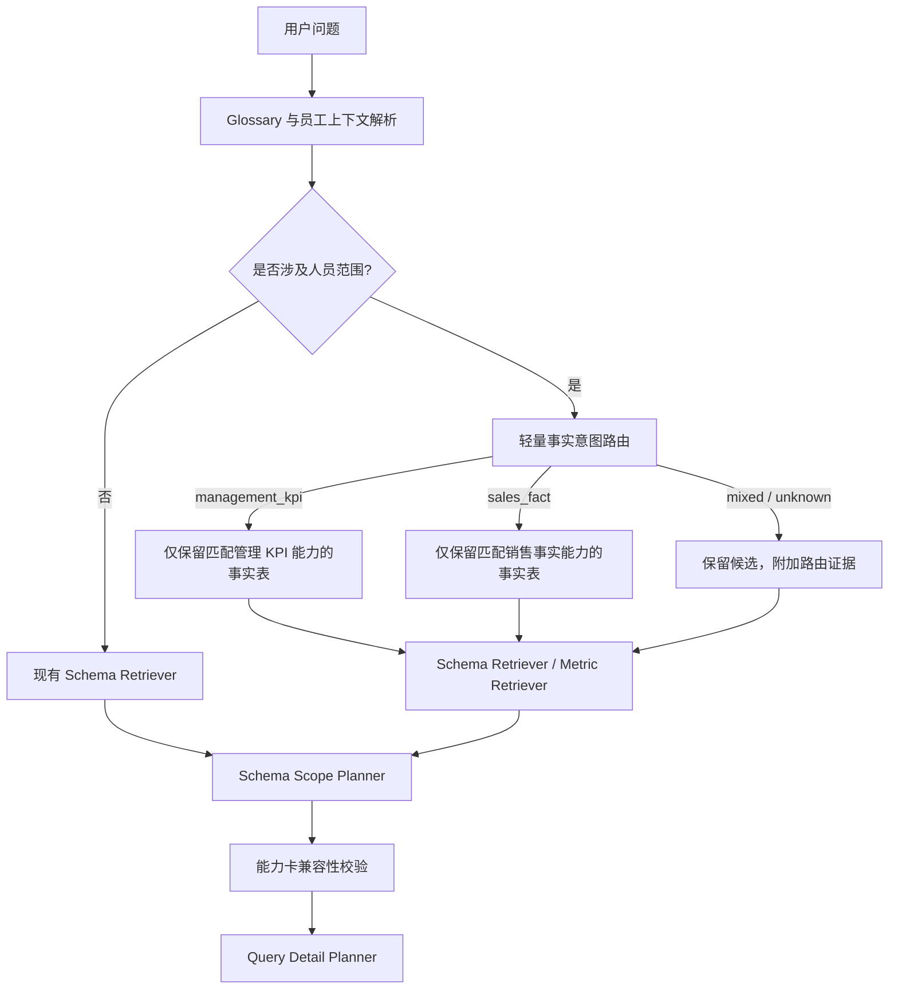

# 人员相关问题的 Scope 轻量路由设计

## 1. 背景与问题

当前人员相关请求在员工身份解析成功后，会将 `ManagerKpiEvaluation` 及其指标加入候选集；与此同时，Schema Retriever 仍会根据问题关键词、字段匹配和命中指标保留销售宽表及其指标。后续 Schema Scope 规划器需要在同一段候选上下文中判断：

- 人员管理 KPI（通常使用窄表 `ManagerKpiEvaluation`）；
- 人员负责范围内的销售事实（通常使用销售宽表）；
- 可能还包含人员维表或医院等关联维度。

这会将“事实类型 / 粒度”的判断交给 Scope LLM。虽然现有 Prompt 已规定“管理者绩效达成率看 `ManagerKpiEvaluation`，医院/MICS 负责医院的销售达成率看销售事实表”，但候选集合本身仍同时暴露宽表与窄表；当问题含有“人员”“业绩”“达成率”等重叠词时，LLM 可能选择错误的 `target_class`。

## 2. 现状梳理

### 2.1 当前请求流

1. `CONTEXT_PREP` 获取 glossary、场景上下文和员工身份上下文。
2. `SchemaRetrieverAgent.retrieve()` 根据关键词检索 class 与 metric。
3. 如果已成功识别员工，检索器会无条件追加 `ManagerKpiEvaluation` 及其指标候选。
4. 命中的 metric 会反向把其 target class 加入候选 class。
5. `SCHEMA_PLAN` 调用 LLM 从候选 Schema 中选出 `target_class` 和 `join_classes`。
6. `validate_query_scope()` 只验证 class 存在性、员工上下文权限、显式排除能力及 JOIN 路径；它不会根据“管理 KPI / 销售事实”语义否决选错的事实表。

### 2.2 已有控制能力

- 已验证员工上下文是 `ManagerKpiEvaluation` 可见的前置条件。
- `table_type` 已区分 `wide` 与 `narrow`。
- class `description` 中的“不适用于 / 不支持”等显式说明可以排除不兼容 class。
- Scope Prompt 已包含“管理者 KPI 与销售事实达成率不同”的提示。
- 窄表候选展示指标名称；宽表候选展示字段名称。

这些能力有助于 LLM 判断，但都不是针对事实类型的前置候选过滤。

## 3. 结论

**建议增加轻量路由，但不建议将其设计为对所有问题强制二选一。**

更稳妥的输出是一个可解释的 `fact_intent`：

| 路由结果 | 含义 | Scope 候选策略 |
| --- | --- | --- |
| `management_kpi` | 问人员管理/绩效/KPI 评价结果 | 选择符合能力卡的窄 KPI 事实表；排除销售宽事实表作为事实候选 |
| `sales_fact` | 问人员负责范围内的销量、销售额、销售达成等销售事实 | 选择销售宽事实表；排除管理 KPI 窄表作为事实候选 |
| `mixed` | 同时要求 KPI 评价与销售事实，且问题明确要求两类结果 | 不静默二选一；保留两类候选并要求 Scope Planner 识别是否存在可行关联，必要时澄清或拆分查询 |
| `unknown` | 问题没有足够语义信号 | 不排除任何事实表；保留当前检索结果，使用现有 Prompt 和能力卡辅助决策 |

这样可避免两个错误：

1. 将“人员”误判为管理 KPI，导致销售问题丢失销售宽表。
2. 对本身确实涉及两种事实的请求进行静默裁剪，导致回答不完整或产生错误 JOIN。

对于本次明确的管理 KPI / 销售事实冲突，`management_kpi` 与 `sales_fact` 应当成为**候选检索阶段的硬筛选偏好**，并在 Scope 校验阶段再次核验，形成“早过滤 + 晚防线”。

## 4. 推荐架构



### 4.1 最合适的插入点

路由应放在 `engine.py` 的 `_handle_context_prep()` 中：

- glossary 和 `employee_context` 已可用，路由可使用消歧后的人员信息；
- 尚未调用 `SchemaRetrieverAgent.retrieve()`，可在候选集合膨胀前施加过滤；
- 路由结果可同时传入 retriever、Prompt 和最终 validator；
- 不应放在 `validate_query_scope()` 作为唯一实现点，因为这会在 LLM 已被混合候选干扰后才拒绝结果。

路由结果建议存入 `AgentState`，而不只作为局部参数，以支持重试、审计、日志和观测。可记录如下最小结构：

```text
{
  "fact_intent": "management_kpi | sales_fact | mixed | unknown",
  "confidence": "high | medium | low",
  "evidence": ["管理者", "KPI", "绩效评价"],
  "applied": true
}
```

`evidence` 必须是从用户问题、术语匹配或受控词典中提取的短标签，不应存储模型自由生成的长推理。

### 4.2 路由器应保持轻量、受控和保守

第一阶段使用一次低 token、JSON-only 的 LLM 调用进行业务语义判断，并返回不超过 50 字的 `reason`。路由模型不选择具体表、指标、字段或 JOIN；只判断事实类型。推荐输入优先级为：

1. **显式事实对象词**：`KPI`、`绩效评价`、`考核`、`目标责任`、`管理者` 等；以及医院、渠道、产品、销量、销售额、负责医院等销售事实词。
2. **受控 glossary 语义标签**：如果 glossary 已能标注指标属于管理 KPI 或销售事实，应优先采用。
3. **能力卡字段**：根据命中 metric 或 class 的 `fact_type`、`supports_metrics` 判断候选支持哪一种语义。
4. **冲突处理**：两类高强度信号同时出现时输出 `mixed`；无高置信信号时输出 `unknown`。

路由器不应仅因为出现“达成率”“业绩”或人员姓名而判定为管理 KPI。这些词在销售事实问题中同样常见。人员姓名本身只表示需要人员范围或归属维度，不表示事实表类型。

## 5. 能力卡（Capability Card）设计

### 5.1 建议字段与语义

将能力卡作为 `schema_classes` 的结构化元数据。用户提出的字段是正确方向，建议补充最小规范和取值约束：

| 字段 | 建议类型 | 示例 | 用途 |
| --- | --- | --- | --- |
| `fact_type` | 枚举或字符串数组 | `management_kpi`、`sales_fact`、`dimension` | 路由和 Scope 选择的主语义标签 |
| `grain` | 字符串数组 | `manager_month`、`hospital_product_apmonth` | 判断请求粒度是否可由表支持 |
| `time_support` | 结构化对象 | `{"fields":["apmonth","quarter_cd"],"levels":["month","quarter"]}` | 避免在不支持的时间粒度上选表 |
| `supports_metrics` | 指标 ID/能力标签数组 | `['manager_kpi_rate','kpi_score']` | 窄表的指标发现和明确能力校验 |
| `supports_people_scope` | 枚举 | `none`、`employee`、`manager`、`territory_owner` | 区分“人员绩效”与“人员负责销售范围” |
| `hard_exclusions` | 结构化规则数组 | `[{"capability":"sales_fact","reason":"不含销售交易事实"}]` | 将自由文本否决规则转为可验证规则 |

建议另加：

| 字段 | 建议原因 |
| --- | --- |
| `fact_role` | 明确 `fact`、`dimension`、`bridge`、`snapshot`，避免将维表作为事实 `target_class` |
| `required_dimensions` | 描述回答该类事实至少需要的维度，例如销售事实的医院/产品/期间 |
| `default_priority` | 同一 `fact_type` 多张表均匹配时，提供稳定排序，不把选择完全交给 LLM |
| `capability_version` | 支持元数据演进与缓存/回放诊断 |

### 5.2 不要把能力卡只当 Prompt 文本

能力卡应同时服务三个层面：

1. **Retriever**：用 `fact_type`、`supports_people_scope` 和 `hard_exclusions` 过滤或排序 class/metric 候选。
2. **Scope Prompt**：将命中候选的卡片摘要给 LLM，使其可解释地选择 class。
3. **Validator**：确认最终 `target_class` 兼容路由结果，防止 LLM 忽略候选约束。

仅将能力卡拼入 Prompt 会改善理解，但无法保证候选裁剪或正确性；仅在 validator 中使用会发现得太晚。

### 5.3 元数据存储建议

当前 `schema_classes` 已有 `table_type`，但没有能力卡字段；运行时 `OntologyEngine.from_database()` 仅查询现有 class 列。

建议采用一个 JSONB 列（例如 `capabilities`）作为第一版持久化形式，而不是立即为每个字段单独建列：

- 能力字段仍需在应用层做 schema 校验和枚举约束；
- JSONB 更适合能力模型仍在收敛期的迭代；
- 查询频繁且语义稳定后，可再把 `fact_type`、`fact_role`、`supports_people_scope` 等高频字段提升为独立列或生成列并建立索引；
- ontology version 变更触发器必须覆盖能力卡变更，确保运行时缓存失效。

管理 API 的 Schema class 编辑模型、数据库迁移、Ontology Engine 加载和缓存版本机制需同步扩展；不建议只在某个 scenario 的代码中写死 `ManagerKpiEvaluation` 与销售表 ID。

## 6. 筛选规则

### 6.1 `management_kpi`

在员工上下文已验证的前提下：

- 事实候选必须满足 `fact_type` 包含 `management_kpi`；
- `supports_people_scope` 应支持 `employee` 或 `manager`；
- 所选 metric 必须属于该 class 的 `supports_metrics` 或其规范 target class；
- `sales_fact` class 不得作为事实 `target_class`，但可保留必要的维表或桥接表作为 `join_classes`；
- 如果没有可用 KPI 表，应返回可解释的“无匹配管理 KPI 数据能力”，而不是回退到销售宽表猜测回答。

### 6.2 `sales_fact`

- 事实候选必须满足 `fact_type` 包含 `sales_fact`；
- 人员范围的含义应由 `supports_people_scope` 说明，例如 `territory_owner` 或 `employee`；
- `management_kpi` class 不得作为事实 `target_class`；
- KPI 词仅在明确指“销售目标/医院销售达成”时可映射到销售事实指标；
- 如果人员与销售事实之间无可验证 JOIN 路径，应在 Scope 校验失败或发起澄清，不能凭名称推断关联。

### 6.3 `mixed` 与 `unknown`

- `mixed`：若不存在同粒度且可 JOIN 的组合，优先澄清“需要管理 KPI 还是负责范围销售事实”，或将其拆成两个受控子查询；不要让单一 `target_class` 伪装覆盖两类事实。
- `unknown`：保持现有候选策略，但把路由不确定性和能力卡摘要传给 Scope Planner；对于低置信且两张事实表均可选的情况，可在 Scope Planner 失败后触发澄清。

## 7. 与现有机制的集成边界

### 应保留

- 员工上下文对 `ManagerKpiEvaluation` 的访问限制；路由不是权限绕过机制。
- 当前 metric target class 的自动补全；但补全后仍应经过事实类型过滤，避免被不匹配 metric 重新把另一类表加入候选集。
- class description 中的显式排除逻辑；能力卡上线后可逐步迁移到 `hard_exclusions`，但要保留描述文本兼容旧数据。
- Scope 的 JOIN 路径验证和 Query Detail 的字段/metric 校验。

### 需要避免

- 不要按 `table_type=narrow` 直接推断管理 KPI。窄表可以承载其他业务指标。
- 不要按 `table_type=wide` 直接推断销售事实。宽表可能是其他主题域事实表。
- 不要因为员工上下文成功就无条件把所有管理 KPI metric 追加给每个请求。
- 不要让路由决定 `join_classes`；路由只限定事实候选类型，关联仍需基于字段需求和 JOIN 路径。
- 不要在 Prompt 之外以 class ID 的硬编码名单长期维持规则。

## 8. 分阶段落地建议

### Phase 0：建立基线和样本集

先收集并标注人员相关问题：

- 管理 KPI；
- 人员负责范围销售事实；
- 混合请求；
- 不明确请求；
- 无员工身份上下文；
- 同义词、缩写与负面样例。

每条样本记录期望 `fact_intent`、合法事实 class、禁止事实 class、是否需要澄清。该集将成为路由、检索和 Scope 验证的回归测试基础。

### Phase 1：只观测，不改变候选集

实现轻量 LLM 路由并将结果、置信度与简短判断理由写入 trace/log/state，但不影响 Schema Retriever：

- 比较路由结果与最终人工确认/正确 scope；
- 统计 `unknown`、`mixed`、路由与最终 target class 不一致率；
- 校准词典和置信度阈值。

### Phase 2：高置信硬筛选，低置信保守回退

仅对高置信的 `management_kpi` / `sales_fact` 执行事实候选过滤；`mixed` / `unknown` 维持当前行为。同步在 Scope 校验中加入兼容性校验，防止重试时恢复被排除的表。

### Phase 3：能力卡数据化

为关键宽表、窄表和关联维表补齐能力卡；替换基于 class ID 的特殊逻辑；管理端支持编辑、校验和审计能力卡。

### Phase 4：复杂请求治理

对 `mixed` 请求支持澄清或安全拆分为多个查询。只有在两个事实表的粒度、关联路径和指标口径已被明确验证时，才支持合并展示。

## 9. 验收标准

1. 高置信管理 KPI 人员问题的 Schema Context 不再出现销售事实表作为事实候选。
2. 高置信销售事实人员问题的 Schema Context 不再出现管理 KPI 窄表及其 metric 作为事实候选。
3. 未验证员工身份时，管理 KPI 资产仍不可见。
4. `mixed` / `unknown` 问题不因路由强制裁剪而丢失必要事实；必要时会澄清。
5. metric target class 扩展不会绕过路由筛选。
6. 最终 `target_class` 与 `fact_intent`、能力卡兼容；不兼容时返回明确的验证错误。
7. 路由决策、证据、候选过滤结果和最终 scope 可在观测链路中关联排查。
8. 回归测试覆盖 KPI、销售、混合、未知、无员工上下文、JOIN 不存在和能力卡硬排除等场景。

## 10. 最终建议

这个方案比单纯强化 Prompt 更容易稳定集成：它把最容易混淆的“管理 KPI vs 销售事实”在候选召回前变成受控、可审计的决策，并通过能力卡避免长期依赖表名或 class ID 硬编码。

实现时应坚持：**路由决定事实候选的类别，能力卡描述表实际能做什么，Scope Planner 决定具体表与 JOIN，Validator 负责最终兜底。**
