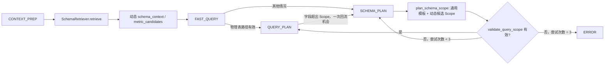
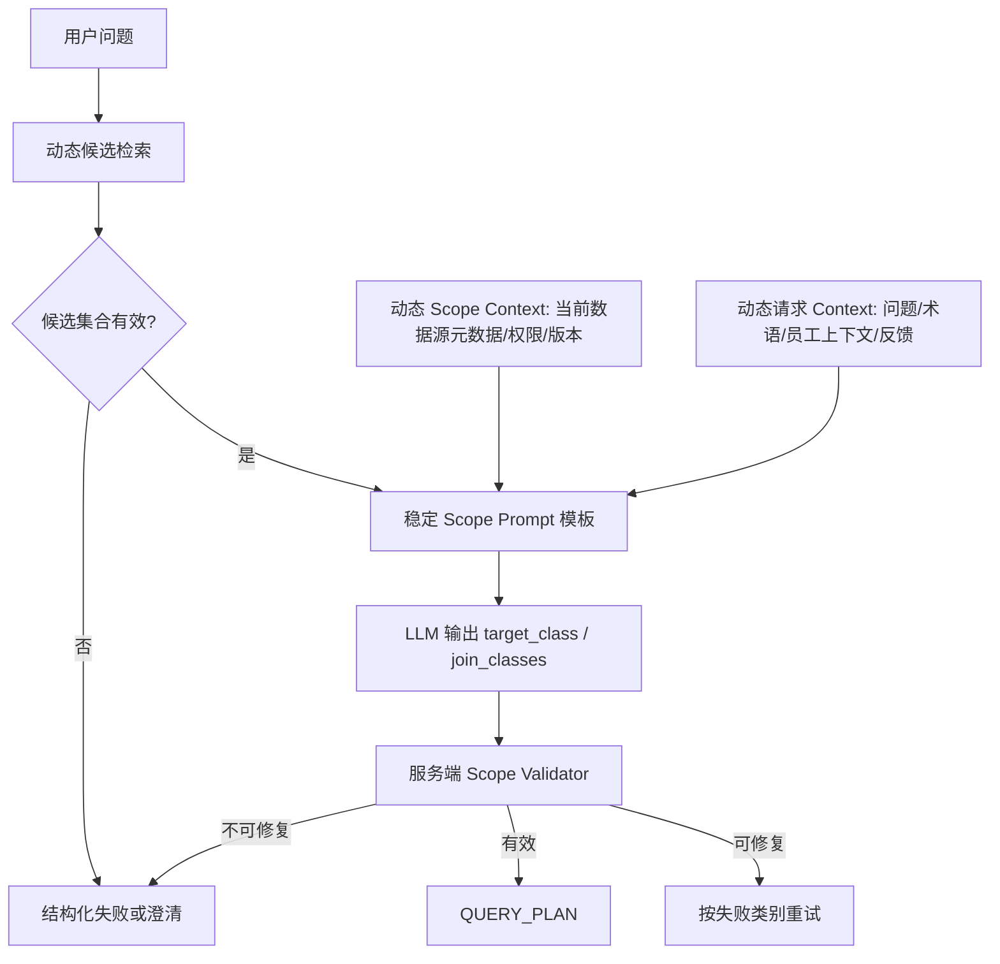

# `ChatEngineV3._handle_schema_plan` 实现审查报告

> 审查范围：`ChatEngineV3._handle_schema_plan` 及其直接上下游，包括 Schema 检索、Scope 规划/校验、重试、快速路径和二阶段查询规划。
>
> 约束：本报告仅分析，不修改代码。当前目标是稳定处理「识别出 `target_class`」或「三次后仍为 `<empty>`」；未来支持多个数据库环境。**具体 Schema Scope 可以在运行时动态注入 LLM 上下文，但不得把某个数据库的 Scope、表、字段、业务口径或特例固定写入通用 prompt 模板。**

## 1. 执行摘要

`_handle_schema_plan` 是一个职责相对清晰的状态机节点：调用 `OntologyAgent.plan_schema_scope()`，对输出做服务端校验，失败时最多尝试三次，成功后将已验证 Scope 写入 `state.query_scope` 并转入 `QUERY_PLAN`。

当前最需要澄清的架构边界如下：

- **合理且必要：** 将当前数据源的候选 Schema Scope 动态注入请求上下文，使模型能在本次可用候选中选择 `target_class` 和 `join_classes`。
- **不应发生：** 把 Pfizer/某一租户/某一数据库的 class ID、表名、字段、渠道规则、指标公式或固定候选列表写死在 `prompt.py` 的通用模板中。
- **关键要求：** 通用 prompt 只定义角色、输出契约、决策原则和安全边界；`schema_context`、员工上下文、术语匹配、候选指标和校验反馈必须由运行时服务动态构建并注入。

因此，本报告不建议将 Scope 选择完全移出 LLM，也不建议禁止 Schema Context 注入；建议将其规范为**“稳定模板 + 动态、结构化、受版本约束的 Scope Context + 服务端最终校验”**。这一模式能兼顾模型语义选择能力和多数据库扩展性。

当前主要问题包括：

1. `<empty>` 混合了空输出、JSON 解析失败、无候选、模型拒绝等不同失败原因，三次重试缺少针对性；
2. 上游候选集可能为空，导致 Scope Planner 在没有有效证据时仍被调用；
3. Scope 重规划时复用旧重试计数，可能提前耗尽新周期预算；
4. 通用 prompt 内含较多当前业务域专属的粒度和渠道规则，应分层，避免成为跨数据库模板的隐性特例；
5. 校验主要检查 ID 和 JOIN 路径，尚不足以完全验证事实粒度、JOIN 基数和聚合安全性。

---

## 2. 当前链路与行为

### 2.1 状态流



当前实现分工：

| 环节 | 当前职责 | 应保留的性质 |
| --- | --- | --- |
| `SchemaRetrieverAgent.retrieve()` | 根据用户问题、术语、员工上下文和事实意图检索相关 class、关系、指标 | 运行时、数据源相关 |
| `state.schema_context` | 承载本次候选 Schema 的动态上下文 | 不持久化进通用 prompt |
| `OntologyAgent.plan_schema_scope()` | 通过 LLM 生成 Scope JSON，并调用 validator | 模板稳定、输入动态 |
| `validate_query_scope()` | 校验 class、权限、JOIN 路径及局部限制 | 服务端最终裁决 |
| `_handle_schema_plan()` | 管理状态、重试、错误和 Scope 落库 | 不承载数据库特例 |

### 2.2 `_handle_schema_plan` 的细节

该函数的当前行为：

1. 获取当前场景的 `ontology_engine`；
2. 首次进入时记录 `ontology_planning_started_at_ms`；
3. 读取上一轮 `scope_validation.error` 作为 `feedback`；
4. 将用户问题、动态 `state.schema_context`、术语匹配、员工上下文、反馈交给 `plan_schema_scope()`；
5. 保存本轮 `scope_validation`；
6. 无效时递增 `planning_attempts["schema_scope"]`；第 1、2 次失败重新进入 `SCHEMA_PLAN`，第 3 次失败进入 `ERROR`；
7. 有效时通过 `_apply_validated_schema_scope()` 保存 `target_class`、`join_classes`、`join_paths` 和 `selection_reason`，再进入 `QUERY_PLAN`。

“三次重试”实际是最多三次 Scope Planner 调用，而不是失败后额外三次调用。

### 2.3 动态注入与固定模板的正确边界

应将最终 prompt 视为下列组合：

$$
\text{SchemaScopeRequest} = \text{StablePromptTemplate} + \text{RuntimeSchemaContext} + \text{RuntimeRequestContext}
$$

其中：

| 内容 | 应放位置 | 是否随数据源变化 |
| --- | --- | --- |
| 角色、JSON 输出格式、不得输出 SQL、先验证再选择等原则 | `prompt.py` 的通用模板 | 否 |
| 当前候选 class ID、名称、描述、字段能力、关系、可用指标 | `SchemaRetrieverAgent` 在请求时构建的 `schema_context` | 是 |
| 用户问题、术语匹配、员工身份/权限、事实意图 | 请求态上下文 | 是 |
| 上轮校验错误和本次 attempt 编号 | 重试态上下文 | 是 |
| 某客户的表名、字段名、渠道定义、特殊业务规则 | 该数据源的 ontology/metadata/policy | 是；不得写死在通用模板 |

动态 Scope Context 不等于硬编码。只要上下文来自当前已选数据连接的元数据、按请求检索、带有版本和权限边界，并且模板不依赖任何特定 ID，就能支持不同数据库环境。

---

## 3. 当前实现的优点

1. **动态候选输入已具备雏形。** `state.schema_context` 由运行时 `SchemaRetrieverAgent` 生成，而非在 `_handle_schema_plan` 内硬编码具体 Schema。
2. **先校验再落状态。** LLM 输出不会直接驱动执行，只有通过 `validate_query_scope()` 的 Scope 才会写入 `state.query_scope`。
3. **Scope 和查询详情解耦。** 第一阶段先约束实体范围，第二阶段才选择指标、维度和条件；字段不在 Scope 内时可回流调整。
4. **快速路径仍经过统一校验。** 用户提及物理表时，快速路径产出的 Scope 也需通过 validator，失败会退回标准路径。
5. **已有基础可观测性。** 规划阶段会记录 JSON 是否有效、校验结果及错误信息，可扩展为按数据源和元数据版本统计。

---

## 4. 主要不足与改进方向

### P0：需明确“模板通用、上下文动态”的契约，而非取消 Scope 注入

当前的风险不是 `schema_context` 被传给 LLM 本身，而是未来容易把当前库的业务知识逐步固化到通用 prompt。Scope 规划模板中已经存在事实粒度、渠道和业务对象等强规则；这些规则若只适用于某个数据域，新增数据库后会造成错误偏置。

**建议：**

- 保留 `get_schema_scope_planning_prompt(user_message, schema_context, ...)` 这种“模板参数化”的接口；
- `prompt.py` 只保留跨数据源成立的规则，例如：输出 JSON、只能选择候选 ID、不得捏造字段、选择必须覆盖核心事实、无可用候选时输出空目标；
- 将渠道、粒度、医学领域、客户口径等规则移动到当前数据源的 ontology 描述、capability metadata 或 scenario policy 中，再作为动态上下文附加；
- 为 `schema_context` 建立稳定的结构化格式和版本契约，避免模型依赖自然语言排列顺序或当前提示词措辞。

推荐的动态 Scope Context 结构（可先 JSON 化，再按需要渲染为文本）：

```json
{
  "metadata_version": "...",
  "data_source_id": "...",
  "candidates": [
    {
      "class_id": "...",
      "label": "...",
      "capabilities": ["..."],
      "grain": ["..."],
      "constraints": ["..."],
      "joinable_class_ids": ["..."]
    }
  ]
}
```

其中 `class_id` 允许动态注入并供 LLM 返回；它不是模板中的固定常量。

### P0：`<empty>` 不是可行动的失败分类

当前 `validate_query_scope()` 将以下情况折叠为 `target_class 不存在：<empty>`：缺失字段、`null`、空字符串和 JSON 解析为 `{}`。这不能区分模型格式问题、上游候选缺失、真正无法选择和权限限制。

建议在 `plan_schema_scope()` 和 handler 间传递结构化失败类别：

| 类别 | 典型来源 | 建议策略 |
| --- | --- | --- |
| `candidate_set_empty` | 检索后没有可见候选 | 不调用 LLM；立即返回受控失败或澄清 |
| `invalid_json` | LLM 输出无法解析 | 一次格式修复，不占业务选择预算 |
| `target_missing` | 可解析但未输出 `target_class` | 根据候选规模走一次针对性重试或澄清 |
| `unknown_target` | 输出 ID 不在当前候选/全量 class 中 | 回传允许候选 ID 后一次修复 |
| `policy_denied` | 员工上下文/权限拒绝 | 不重试，提示受限原因 |
| `join_unreachable` | 关联 class 无可用 JOIN 路径 | 反馈可达关系后一次修复 |

三次策略不应对所有类别一视同仁。特别是候选集为空或权限拒绝时，重复调用没有收益。

### P0：动态候选集可能为空或证据不足

`SchemaRetrieverAgent._build_schema_context()` 在无相关 `class_ids` 和关系时可能生成空内容；同时“其他候选实体”文本目前被注释。这会使 Scope Planner 在没有候选证据时产生空目标或幻觉 ID。

不建议通过向 prompt 注入整个数据库的详细 Schema 来解决问题，因为这会导致上下文膨胀和选择噪声。正确处理应为：

1. 检索结果为空时先走扩展检索策略，例如术语扩展、指标反查 target class、受限的语义召回；
2. 扩展后仍无候选时返回 `candidate_set_empty`；
3. 候选太多时使用服务端排序、分层检索或检索阈值，而不是将全部详细字段说明送入 prompt；
4. 将“候选列表非空”“候选 ID 唯一”“metadata version 一致”作为 Scope Planner 调用前置条件。

### P1：Scope 重试预算跨规划周期泄漏

`planning_attempts["schema_scope"]` 在成功后未清零。详情规划发现 out-of-scope 字段后会回到 Scope 规划，但可能继承上一个周期已消耗的计数。

建议按 Scope 规划周期维护状态，例如：

```json
{
  "scope_cycle": 2,
  "scope_attempt": 1,
  "retry_reason": "out_of_scope_field"
}
```

初次规划、字段越界回流、元数据版本更新后重新规划都应开始独立周期。这样既保留总跳转熔断，又能避免旧失败缩短新一轮的可用预算。

### P1：校验仍偏向“存在性”，缺少数据语义与聚合安全验证

当前服务端可检查 class 存在、权限限制、关联存在及 JOIN 路径，但难以证明 Scope 一定能安全回答问题。例如：

- 目标 class 是否覆盖实际所需事实、时间和维度粒度；
- JOIN 是否一对多、是否会放大度量；
- 两个事实 class 是否允许一起聚合；
- 指标可否在当前 Scope 和组合下计算。

应将这些信息作为数据源 ontology 的动态 metadata，而不是写入通用 prompt：

- fact grain、唯一键和可聚合性；
- 关系基数与重复计数风险；
- 可组合的事实/维度集合；
- 指标依赖、适用范围和时间粒度；
- 数据源特有约束及其结构化错误码。

`validate_query_scope()` 再基于当前数据源 metadata 进行确定性校验。LLM 负责提出候选组合，服务端负责确认其可执行和语义安全。

### P1：物理表快速路径应采用服务端动态解析

当前表名检测使用子串匹配，可能误命中短表名、无法正确处理同名表和不同数据库的限定名规则。用户明确指定表时，这是一个可以不经 LLM 猜测的强信号。

建议把物理表名规范化、catalog/schema 解析、大小写规则、歧义检测和权限检查收敛到数据源适配器/`OntologyEngine`。解析成功时动态绑定对应 class；解析不唯一时进入澄清；未命中时才回到常规 Schema 检索。不要把所有表名作为固定 prompt 内容。

### P1：错误码、审计信息和可观测性不足

Scope 三次失败仅写入普通 `state.error`，未显式设置 Scope 阶段错误码。建议记录：

- `data_source_id`、`metadata_version` 和候选数量；
- 每次 attempt、失败类别、是否附带反馈；
- LLM 原始输出是否可解析（注意敏感信息脱敏）；
- 最终选中/拒绝的 class、JOIN 和服务端证据；
- `SCHEMA_SCOPE_*` 专用错误码及 `State.SCHEMA_PLAN` 阶段标识。

这对识别“新数据库元数据不完整”“检索退化”“模型输出格式退化”至关重要。

### P2：`selection_reason` 不应成为执行成功的脆弱前置条件

`selection_reason` 目前为必填自由文本，但它不直接参与执行。其缺失会导致一个本可能正确的 Scope 失败。

建议保留该字段用于审计和前端展示，但将其从“Scope 有效性硬条件”调整为：

- 可选的模型解释；或
- 服务端根据命中能力、JOIN 路径和排除原因生成的 `selection_evidence`。

执行正确性应依赖确定性验证结果，不依赖模型文案质量。

---

## 5. 推荐目标架构：稳定模板 + 动态 Scope Context + 服务端校验



### 5.1 稳定模板的职责

通用 Scope Prompt 应只声明跨数据库不变的内容：

- 输入段落的语义和输出 JSON 契约；
- `target_class` / `join_classes` 只能来自本次候选；
- 不得输出 SQL、字段、过滤条件或未提供的实体；
- 先识别问题所需事实与维度，再比较候选的能力与约束；
- 无可靠候选时诚实输出空目标；
- 不得将“存在 JOIN 路径”误认为一定可以补足业务事实。

### 5.2 动态 Scope Context 的职责

每次请求按当前连接、权限和 ontology 版本构建，至少包含：

- 候选 class 的运行时 ID、显示名称、能力、粒度、限制；
- 与候选关联的可达关系及必要的关系语义；
- 被授权的指标/事实能力；
- 当前数据源/tenant 的特殊规则（如有）；
- metadata 版本和可审计的候选来源。

应优先传递**逻辑语义**（能力、粒度、约束），将物理表名和物理字段映射降到必要时才提供。若用户明确指定物理表，则应先由服务端绑定，再把绑定结果作为约束注入上下文。

### 5.3 服务端校验的职责

服务端必须保留最终控制权：

1. 输出 ID 是否属于当前动态候选、是否仍存在且可见；
2. 目标与关联实体是否满足权限；
3. 关系是否可达且满足允许的 JOIN/基数规则；
4. Scope 是否具备用户所需的最小事实能力；
5. 当前 metadata 版本是否在请求期间发生变化；
6. 将错误转换为可重试、可澄清、不可支持或基础设施失败。

---

## 6. 三次重试的建议策略

保留“三次上限”作为防止状态机循环的保护，但改为“有新信息的、按失败类别的修复尝试”，而不是同一输入重复调用：

| 情况 | 是否消耗 Scope 业务重试 | 建议动作 |
| --- | --- | --- |
| `candidate_set_empty` | 否 | 扩展检索一次；仍为空则澄清/失败 |
| `invalid_json` | 否或单独计数 | 一次仅格式修复 |
| `target_missing` | 是 | 回传候选摘要和“必须选择”的明确反馈 |
| `unknown_target` | 是 | 回传允许 ID；限制只修正 target/join |
| `join_unreachable` | 是 | 回传当前 target 的可达关联候选 |
| `policy_denied` | 否 | 直接返回权限/身份澄清 |
| 元数据版本变更 | 新周期 | 重新检索并重建动态 Scope Context |

每次 attempt 应记录输入的候选版本、候选数量和失败类别。没有新增候选、反馈或元数据变化时，不应机械重复调用。

---

## 7. 建议验收标准与测试清单

### 7.1 当前行为测试

1. 连续三次 `target_class` 为空：恰好三次 Scope Planner 调用，最终进入 `State.ERROR`，并带 Scope 专用错误码。
2. 第 1、2、3 次返回有效 Scope：均进入 `State.QUERY_PLAN`。
3. `invalid_json`、空 `target_class`、未知 ID、无 JOIN 路径、员工上下文/权限拒绝、候选集为空，必须形成不同失败类别。
4. 候选集为空时不会进行无信息的三次 LLM 调用。
5. 初次 Scope 成功后因字段越界回流时，启动新的 Scope 规划周期，不继承旧预算。
6. 物理表指定在多匹配、无匹配、大小写差异、带 catalog/schema 限定名时由服务端确定性处理。

### 7.2 多数据库兼容测试

1. 同一个稳定 prompt 模板可接收两个数据库产生的不同 `schema_context`，不修改模板代码。
2. 两个数据源使用不同 class ID、物理表和字段映射时，均能在其动态候选集中选出合法 Scope。
3. 新数据源通过注册 ontology/metadata/policy 即可接入，不要求在 `prompt.py` 添加其表名、字段名或业务特例。
4. 动态上下文携带的 metadata 版本变化后，检索、校验、缓存和审计记录一致。
5. 不同租户的权限裁剪会改变动态候选集，但不会改变通用输出契约或泄露不可见实体。

---

## 8. 优先级与落地顺序

| 优先级 | 事项 | 目标 |
| --- | --- | --- |
| P0 | 明确 Stable Prompt / Runtime Context 契约 | 允许动态 Scope 注入，禁止把具体 Schema 固化进模板 |
| P0 | 为 `<empty>` 和相关失败引入结构化分类 | 让重试、澄清和运营可行动 |
| P0 | 候选集为空时的前置处理 | 避免无信息 LLM 重试 |
| P1 | Scope 重试改为按规划周期计数 | 避免跨周期预算污染 |
| P1 | 丰富动态 metadata 与服务端语义校验 | 保障粒度、JOIN 和聚合安全 |
| P1 | 物理表名改为服务端精确绑定 | 降低多数据库适配和误匹配风险 |
| P1 | 补齐 `_handle_schema_plan` 状态机测试 | 固化三次上限和错误分流契约 |
| P2 | 用结构化 `selection_evidence` 补强/替代自由文本理由 | 提升审计性，降低文案对成功率的影响 |

---

## 9. 最终结论

`_handle_schema_plan` 的核心模式应继续是：**模型在本次动态候选 Scope 中做语义选择，服务端对选择做最终验证。** 对多数据库的正确要求不是“不把 Schema Scope 传给模型”，而是“不把任何一个数据库的具体 Scope 固定进通用 prompt”。

后续应优先建立稳定模板和动态上下文之间的明确契约，完善候选为空与 `<empty>` 的失败分流，并把各数据源特有的粒度、关系、指标和权限规则沉淀到运行时 ontology/metadata/policy。这样既能保持当前 `target_class` 选择能力，也能在新增数据库时只更换动态数据，而无需把新旧数据库特例持续累积到 prompt 模板中。