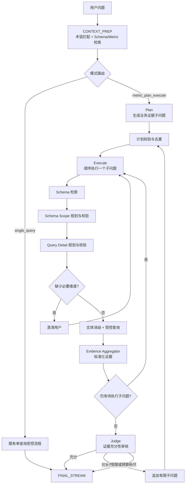

# 当前问题拆解（Plan-Execute）方案梳理

> 更新时间：2026-07-24  
> 范围：Chat V3 中针对复杂指标问题的受控多证据拆解与执行链路。

## 1. 要解决的问题

当前普通查询链路以“一次受控查询”为中心，适合回答单指标、单时间范围、单分组等问题；但它无法可靠地直接回答需要**多份相互补充证据**的问题，例如：

- 某区域本月业绩未达目标的原因及主要影响品类；
- GMV 同比下滑是价格、销量还是渠道结构导致；
- 库存周转是否健康，需要结合库存、销售、缺货、补货周期判断；
- 哪些区域拉低整体利润率，并与去年同期比较变化。

这类问题的核心风险是：如果只给模型一条查询结果，模型容易把“原因、贡献、诊断”等结论当作自然语言推理，缺少可验证数据支撑。

因此，当前方案将复杂问题拆成有限个**业务证据子问题**，每个子问题仍通过既有本体校验、查询计划校验、实体消歧和受控查询链路执行；最终答案只能基于汇总后的证据作答，并明确未补齐的证据缺口。

## 2. 核心设计原则

1. **LLM 只做业务层决策，不直接生成 SQL。**
   - 路由器决定单查询或多证据模式；
   - 计划器拆分“需要哪些业务事实”；
   - 审核器判断证据是否足够；
   - 实际的 Schema Scope、指标、维度、过滤条件和执行参数仍由既有受控流程生成并校验。

2. **Plan-Execute 是编排层，不替代查询治理层。**
   子问题必须复用既有 `SCHEMA_PLAN → QUERY_PLAN → TOOL_EXECUTE` 能力，不能绕过本体范围校验、查询参数校验或实体消歧。

3. **证据优先于结论。**
   每个子问题必须声明它补充的预期证据；最终回答以结果证据包为输入，不以模型自行推断的因果链为输入。

4. **有界执行。**
   当前实现限制首轮子问题数、增量迭代次数与总查询次数，避免“不断补查”的成本和延迟失控。

5. **可追踪、可降级。**
   路由、计划、每个子问题、查询、审核和结束原因都会写入执行状态和工具步骤；任何环节无法安全继续时，系统应转为单查询或带局限说明的最终答复。

## 3. 总体架构



入口位于 `CONTEXT_PREP`：系统先得到 Glossary 匹配、相关 Schema 摘要、Metric 摘要及候选指标，然后再判定是否进入多证据执行模式。状态定义与执行账本见 [state.py](../src/backend/agents/ontology_chatbi/state.py)，主编排逻辑见 [engine.py](../src/backend/agents/ontology_chatbi/engine.py)，语义路由、计划及审核能力见 [plan_execute_agent.py](../src/backend/agents/ontology_chatbi/node/plan_execute_agent.py)。

## 4. 当前状态流转

| 阶段 | 状态/组件 | 输入 | 输出 | 主要责任 |
| --- | --- | --- | --- | --- |
| 上下文准备 | `CONTEXT_PREP` | 用户问题 | Glossary、Schema/Metric 上下文、候选指标 | 缩小后续规划可见范围 |
| 模式路由 | `PlanExecuteAgent.decide_execution_mode()` | 问题、上下文、证据可用性 | `single_query` 或 `plan_execute` | 判断一条受控查询是否足够 |
| 首轮计划 | `METRIC_PLAN_EXECUTE` | 原问题、术语、Metric 摘要 | 最多 3 个业务子问题 | 定义要取得的互补证据 |
| 子问题执行 | `_execute_metric_subquestion()` | 单个子问题 | 成功、失败、跳过或待澄清的执行记录 | 在既有治理边界内获得证据 |
| 证据汇总 | `_build_metric_evidence_packet()` | 全部子问题记录 | 紧凑证据包 | 保留来源、状态、查询范围与结果摘要 |
| 充分性审核 | `judge_metric_evidence()` | 计划、证据包、剩余预算 | `sufficient`、`add` 或 `limited` | 判断是否可回答、是否需要补证据 |
| 最终回答 | `FINAL_STREAM` | 计划、判断、工具结果 | 带证据和局限的答复 | 不编造缺失数据 |

## 5. 路由与问题识别

### 5.1 路由规则

路由采用“确定性规则优先，LLM 兜底”的方式：

1. **证据不足时强制单查询**：若没有 Schema 证据或 Metric 证据，不安全地拆成多查询，直接走 `single_query`。
2. **比较类问题优先进入 Plan-Execute**：检测到“相比、对比、环比、同比、去年、上月”等词时，要求分别获得当前期间和对比期间的同口径证据。
3. **诊断/归因类问题优先进入 Plan-Execute**：检测到“为什么、原因、归因、驱动、影响因素、诊断、健康度、构成、拆解”等词时，要求先验证目标结果，再取得用于解释原因、构成或驱动的补充证据。
4. **其他情况交给受约束的 LLM 路由器**：只返回模式、理由、是否单查询足够、所需证据及置信度；禁止返回 SQL、表/字段名、指标 ID、公式和查询参数。

### 5.2 路由输出契约

```json
{
  "mode": "single_query | plan_execute",
  "reason": "简短业务原因",
  "single_query_sufficient": true,
  "required_evidence": ["回答所需的一项独立业务证据"],
  "confidence": "high | medium | low"
}
```

> 说明：`METRIC_PLAN_COMPLEX_KEYWORDS` 已定义在常量中，但当前实际路由主要使用比较关键词、诊断关键词和 LLM 兜底，尚未直接消费该常量。后续应避免维护两套语义触发来源。

## 6. 子问题拆解方案

### 6.1 拆解单位

一个子问题不是“如何查询”，而是“为了回答原题，需要验证的一个业务事实”。例如：

| 原始诉求 | 合理子问题 | 预期证据 |
| --- | --- | --- |
| 华东销售达成为什么落后 | 查询华东本月实际、目标及差额 | 确认缺口规模 |
| 华东销售达成为什么落后 | 比较本月与可比期间的销售变化 | 确认变化方向与幅度 |
| 华东销售达成为什么落后 | 按品类或渠道拆分缺口贡献 | 定位主要负向贡献来源 |

### 6.2 计划输出契约

```json
{
  "objective": "本轮要回答的业务目标",
  "coverage_requirements": ["最终回答必须具备的证据"],
  "subquestions": [
    {
      "id": "sq-简短唯一标识",
      "intent": "自然语言业务子问题",
      "metric_ids": ["候选指标 ID"],
      "expected_evidence": "该问题补充的证据",
      "priority": 1
    }
  ]
}
```

当前约束：

- 首轮最多 3 个子问题；
- 子问题必须与 Glossary 标准术语和候选指标口径一致；
- `metric_ids` 只能使用候选 Metric 的 ID，用于后续优先确定指标锚点类；
- 禁止输出 SQL、表名、字段名、Class ID、Join、公式、过滤器和查询参数；
- 子问题要互补，不能仅改写同一个问题。

### 6.3 程序化校验与去重

计划器的输出不会直接执行，而是经过以下检查：

- 输入必须为列表，数量受限；
- `intent` 不能为空，且长度不超过 300 字符；
- 按规范化后的 `intent` 去重；
- 拒绝包含明显 SQL 关键字或结构字符的文本；
- `metric_ids` 与当前可用候选指标求交集；
- 子问题完成受控查询规划后，基于 `target_class`、关联类、指标、维度、过滤条件、Having 和排序生成查询指纹；若指纹重复则跳过，避免执行等价查询。

## 7. 子问题执行边界

每个子问题顺序执行，执行过程如下：

1. 使用“原始问题 + 本次需补充的业务证据”重新检索相关 Schema 与 Metric；
2. 执行 `Schema Scope` 规划与校验，确定主实体及必要关联实体；
3. 执行 `Query Detail` 规划与校验，确定指标、维度、过滤条件、Having 和排序；
4. 检查必要维度，若缺失则进入澄清流程，而不是擅自假设；
5. 对实体条件进行消歧；
6. 调用既有 `query_ontology_data` 完成受控查询；
7. 记录执行状态、查询范围、查询计划、结果或错误。

其中 Scope 和 Query Detail 两个规划阶段各最多允许一次基于校验反馈的修正。该机制确保拆解层无法绕开底层查询治理。

## 8. 证据包与充分性审核

### 8.1 证据包

证据包为每个子问题保留以下紧凑信息：

- `subquestion_id`、`intent`、`metric_ids`、`expected_evidence`；
- 状态与错误信息；
- 已验证的查询范围与查询计划；
- 结果摘要：列、行数、指标、维度、来源、采样行及必要错误信息。

它的目标是让审核器和最终回答模型能够追溯“哪个结论来自哪个查询”，同时避免将完整大结果集直接塞入上下文。

### 8.2 审核器输出

```json
{
  "decision": "sufficient | add | limited",
  "coverage": [
    {
      "requirement": "计划中的证据要求",
      "status": "covered | missing",
      "evidence_ids": ["sq-id"]
    }
  ],
  "missing_evidence": ["尚未覆盖的业务证据"],
  "additional_subquestions": [],
  "limitation": "数据不足或无法安全补齐时的说明"
}
```

处理规则：

- `sufficient`：现有证据足以回答，进入最终答复；
- `add`：仅在有明确、可查询缺口且仍有预算时接受新增子问题；
- `limited`：无法安全补齐或不允许继续扩展，带着局限进入最终答复；
- 非法决策会被归为 `limited`。

## 9. 当前执行预算与停止条件

| 约束 | 当前值 | 作用 |
| --- | ---: | --- |
| 首轮子问题数 | 3 | 控制首轮扇出 |
| 增量迭代次数 | 1 | 最多再追加一轮 |
| 总子问题查询尝试 | 5 | 控制数据库与工具成本 |
| 单个子问题意图长度 | 300 字符 | 限制异常/注入式计划内容 |

当前终止原因：

- `sufficient`：审核认为证据已覆盖；
- `budget_exhausted`：无剩余迭代或查询预算；
- `limited`：证据不足但无法生成有效的补充计划，或审核给出受限结论。

降级策略：

- 路由失败：降级为单查询；
- 首轮计划没有可接受子问题：降级为单查询；
- 子问题失败、重复或被预算跳过：保留失败证据，继续审核；
- 证据不完整：最终回答必须说明局限，而不能补造事实。

## 10. 可观测性与状态账本

`AgentState` 已维护下列 Plan-Execute 账本字段：

- `execution_mode`：单查询或多证据模式；
- `metric_plan`、`metric_plan_phase`：计划与当前阶段；
- `metric_plan_iteration`：增量轮次；
- `metric_subquestions`：子问题及执行状态；
- `metric_plan_judgments`：每轮证据审核结果；
- `metric_plan_terminal_reason`：结束原因；
- `metric_query_attempts`：查询预算使用情况。

同时，计划、子问题 Scope、Query Plan、查询执行、证据审核和完成事件会写入工具结果与 SSE 步骤，便于前端按过程展示。语义阶段会记录耗时与 JSON 有效性日志。

## 11. 当前不足与风险

### P0：应优先补齐

1. **缺少完整预算模型**
   - 当前只限制子问题数、扩展轮数和查询次数；
   - 尚未显式限制 Plan-Execute 的总耗时、LLM 调用次数和上下文体积；
   - 风险是复杂场景的延迟、成本及长上下文压力不可预测。

2. **缺少跨子问题口径兼容性的确定性校验**
   - 当前保留了查询范围、指标和维度来源，但最终跨查询汇总主要依赖提示约束；
   - 若不同子问题的时间粒度、筛选口径或聚合粒度不一致，仍可能产生不严谨比较；
   - 应在最终回答前显式校验时间、实体范围、指标口径和分组粒度的可比性。

3. **没有独立的自动化测试覆盖核心编排逻辑**
   - 子问题接收、去重、预算、查询指纹、证据包和停止条件应优先补齐单元测试；
   - 再增加“比较、归因、证据不足、澄清、重复查询”端到端回归案例。

### P1：提升可靠性与可维护性

4. **增量子问题与证据缺口的映射缺少硬校验**
   - 审核器提示中要求新增问题直接对应 `missing_evidence`；
   - 当前主要依赖 LLM 遵守提示与通用子问题校验；
   - 应记录每个新增子问题关联的缺口 ID，并拒绝没有关联或重复覆盖的追加项。

5. **终止原因粒度不够**
   - 当前主要为 `sufficient`、`budget_exhausted`、`limited`；
   - 建议增加 `no_progress`、`duplicate_coverage`、`clarification_blocked`、`validation_failed` 等原因，便于定位为何没有获得新证据。

6. **路由规则偏宽**
   - “原因、构成、健康度”等关键词会直接走多证据模式；
   - 这能提高稳健性，但可能让可由单条受控查询回答的问题付出额外时延和成本；
   - 建议基于历史命中率、查询可合并性和路由置信度增加更细粒度的开关与评估。

7. **执行记录的长期分析能力有限**
   - 当前过程信息主要保存在会话工具结果和内存状态；
   - 建议持久化结构化的计划、子问题、判断、预算和状态跳变记录，支持离线质量分析与问题重放。

8. **历史 Code Review 中的个别结论已过期**
   - 2026-07-12 的评审曾将 `CLARIFY` 标记为空壳；
   - 当前 `engine.py` 已包含必要维度澄清准备和恢复 Plan-Execute 子问题的处理；
   - 后续评审应以当前代码为准，避免直接沿用历史结论。

## 12. 建议的下一步演进

### 第一阶段：补强正确性与可控性

1. 增加 `execution_budget`：总耗时、LLM 调用数、上下文字符数、查询次数；
2. 在证据审核后执行口径兼容性检查，输出可比较/不可比较的明确结果；
3. 为增量子问题增加 `gap_id`，建立“缺口 → 补充查询 → 覆盖证据”的可验证链路；
4. 扩展终止原因，记录无进展与重复覆盖。

### 第二阶段：建立质量闭环

1. 编写核心单元测试与端到端场景测试；
2. 采集路由命中率、子问题成功率、重复查询率、补充轮次、证据覆盖率、最终受限率、P95 时延和单会话 LLM/查询成本；
3. 基于指标优化路由规则和默认预算；
4. 持久化结构化执行账本，用于回放、审计和离线标注。

### 第三阶段：逐步优化效率

1. 对互不依赖且资源允许的子问题探索受限并行；
2. 在计划阶段提前识别可由同一受控查询合并的证据需求；
3. 建立历史证据复用/缓存机制，但缓存命中必须校验场景、时间、口径和权限。

## 13. 结论

当前实现已经形成了一个可工作的、受治理的复杂问题拆解机制：**先识别是否确实需要多份独立证据，再用有限数量的业务子问题驱动既有受控查询链路，最后由证据审核器决定补查或收敛。**

其关键价值不在于“把问题拆得更多”，而在于把复杂诊断、比较和归因问题转化为可验证、可追溯、可限制成本的数据证据链。下一步应优先补强预算、口径兼容性、缺口映射和测试覆盖，使该链路从“已具备核心能力”提升为“可稳定评估和持续优化的生产能力”。
