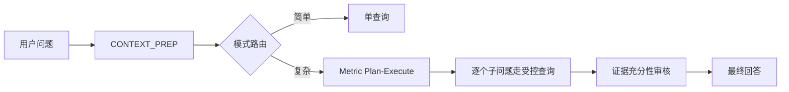
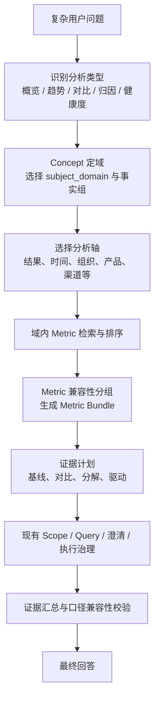

# 问题拆解方案改进路径：Concept 定域、Metric 成组、受控证据执行

> 更新时间：2026-07-24  
> 目标：在现有 Plan-Execute 机制上，引入“先按 Concept 定义分析空间、再按 Metric 组织可执行证据”的两层拆解方式，提升复杂经营分析的完整性、可解释性和执行效率。

> 实施状态（2026-07-24）：已完成首版运行时接入：新增受审核的 Metric-Concept 绑定、运行时 Concept/DimensionGroup 访问器、Concept 定域与 Metric Bundle 规划器，并将已验证的 Bundle 注入 Plan-Execute 子问题计划。Concept 树规范化、试点数据回填、跨 Bundle 口径校验、分析蓝图持久化和管理端可视化仍按第 8 节分阶段推进。

## 1. 结论先行

提出的两个方向均合理，但不建议将其理解为“所有问题都先按 Concept 树拆开，再把每个 Metric 单独查询”。推荐采用如下原则：

1. **Metric 是最小可执行证据单元，Concept 是分析空间与拆解策略单元。**
   Metric 决定可计算什么、基于哪个锚点类、带有哪些固定口径；Concept 决定复杂问题应从哪些业务主题、事实组和分析维度观察。

2. **同一 Class 下的多个 Metric 可以归入同一个证据问题，但必须先通过“查询兼容性”检查。**
   “同 Class”只是必要条件，不是充分条件。只有指标锚点、固定筛选、时间口径、所需维度组、粒度和聚合语义兼容时，才可以共用一次受控查询。

3. **Concept-first 适合复杂的诊断、趋势、归因和综合评价；不适合所有请求。**
   它应作为复杂问题的“候选分析蓝图生成器”，不能取代现有的 Metric/Schema 校验，也不应对简单指标查询增加不必要的分支。

4. **当前 Concept 数据可以作为基础，但不能直接驱动生产拆解。**
   当前树已支持主题域、事实组和维度组等层次，却混合了主题、实体、KPI 与维度概念；此外，DimensionGroup 到 Concept 的 `concept_id` 在现有 Pfizer 示例中大多为空，Metric 也没有直接的 Concept 绑定。因此需要先补齐概念治理和绑定关系，再把它接入运行时。

推荐的目标模式是：

```text
复杂用户问题
  → 意图和分析类型识别
  → Concept 定域并选择分析蓝图
  → 在域内检索、筛选和分组成兼容的 Metric Bundle
  → 生成“基线 / 对比 / 分解 / 驱动”证据问题
  → 复用现有受控查询链路执行
  → 校验跨证据口径并输出结论或限制
```

## 2. 对现有方案的定位调整

现有方案已经具备“受控多证据”的主骨架：



它的主要不足不是缺少执行能力，而是**计划层目前只看到 Schema 和 Metric 候选，尚未看到业务 Concept 的结构**：

- `SchemaRetrieverAgent` 当前只检索 Class、Metric 和 Relationship；
- `PlanExecuteAgent` 基于问题、Glossary 和 Metric 摘要生成自然语言子问题；
- 子问题之间的互补性主要由提示约束和后续查询指纹去重保证；
- 已有 Concept 树没有参与检索、分析维度选择或子问题规划。

因此，本次改进不重写 `SCHEMA_PLAN → QUERY_PLAN → TOOL_EXECUTE`，而是在 `CONTEXT_PREP` 与 `METRIC_PLAN_EXECUTE` 之间增加一个**Concept-Metric 分析规划层**。

## 3. 设计原则与职责边界

| 对象 | 在新方案中的职责 | 不负责的内容 |
| --- | --- | --- |
| Concept | 定义主题域、事实组、分析维度与推荐分析路径 | 直接编译 SQL、替代 Metric 计算定义 |
| Metric | 定义受治理的计算、锚点类、固定筛选与可用维度组 | 决定所有复杂问题的业务拆法 |
| Metric Bundle | 将可以共用同一查询口径的多个 Metric 组成一个证据单元 | 跨越不兼容筛选或粒度强行合并 |
| DimensionGroup | 将业务维度选择翻译为字段、分组或过滤条件 | 仅因名称相似就作为归因维度 |
| Analysis Blueprint | 定义某类复杂问题应采用的证据结构和优先分析轴 | 直接生成未校验的查询参数 |
| Plan-Execute | 在预算内调度、执行、审核证据 | 绕过本体、Metric、维度与权限治理 |

核心约束是：**Concept 用于缩小和组织“该分析什么”，Metric 用于决定“能够安全执行什么”。**

## 4. 对想法一的落地：Metric 驱动，但不强制单指标

### 4.1 可合并的正确判断标准

同一个 Class 下的指标可以归入同一个问题或同一次查询，但必须同时通过以下兼容性判断：

| 维度 | 必须满足的条件 | 不满足时的处理 |
| --- | --- | --- |
| 锚点 | `target_class` / `definition.anchor_class` 相同，或已验证可在同一主粒度 Join | 拆成不同 Bundle |
| 固定业务口径 | 指标内部固定筛选不冲突，例如长表 KPI 的 `kpi_name` 等限定 | 拆开；禁止覆盖或合并固定条件 |
| 时间口径 | 当前期、对比期、累计/当期、自然月/财年等可共同表达 | 拆开或先要求澄清 |
| 维度组 | 可使用同一批 DimensionGroup，且映射到同一查询范围 | 拆开或只保留共享维度 |
| 粒度 | 指标能够在同一分组粒度下聚合，且不会引入重复计数 | 拆开，并在最终层并列展示 |
| 聚合与单位 | 加总、平均、比率、库存快照等语义可共同呈现 | 允许同查询，但禁止直接相加或比较 |
| 权限与数据源 | 数据源、权限范围、刷新周期相容 | 拆开或拒绝跨源合并 |

可将一个 Metric 的查询兼容性抽象为：

$$
K(m) = (A, F, T, D, G, S, P)
$$

其中：$A$ 为锚点与关联路径，$F$ 为固定筛选，$T$ 为时间语义，$D$ 为可用维度组，$G$ 为允许的聚合粒度，$S$ 为数据源/刷新语义，$P$ 为权限范围。只有关键字段相容的 Metric 才进入同一 Bundle。

### 4.2 Metric Bundle 的建议结构

不要仅按 `class_id` 将指标硬分组；建议在运行时生成 `MetricBundle`：

```json
{
  "id": "sales_performance_overview",
  "purpose": "回答销售业绩总体表现",
  "anchor_class": "SalesFact",
  "metric_ids": ["actual_sales", "sales_target", "achievement_rate"],
  "compatible_dimension_group_ids": ["time_granularity", "region", "product_specification"],
  "required_context": ["time_granularity"],
  "fixed_filter_signature": "...",
  "grain_signature": "month × region",
  "comparison_policy": "same_period_basis",
  "query_mode": "aggregate",
  "merge_policy": "single_query"
}
```

`MetricBundle` 是规划期的临时对象，可先不入库；待规则稳定后，再将高频、经验证的 Bundle 作为可治理资产保存。

### 4.3 哪些 Metric 应归为一个问题

以“业绩如何”为例，理想的首个证据问题不是分别查询“销售额”“目标”“达成率”，而是：

> 在相同时间、区域、产品等业务口径下，查询实际销售、目标销售和达成率，确认当前业绩水平及差距。

这三个指标如果锚点、时间与筛选兼容，应作为一个 Bundle 执行。这样既减少查询次数，也避免不同查询采用不同时间/区域范围而产生伪差异。

但以下情况必须拆开：

- 实际销售来自销售事实表，目标来自计划表，二者无安全的统一关联粒度；
- 一个 KPI 固定筛选“医院类型 = A”，另一个 KPI 固定筛选“医院类型 = B”；
- 一个指标是月度流量，另一个是期末库存快照；
- 一个指标按产品规格可分解，另一个只能按大区汇总；
- 一个是金额，另一个是比率；它们可以同表展示，但不得在最终答案中进行不具备业务定义的加减。

### 4.4 建议的子问题粒度

子问题应从“单 Metric”升级为“一个可验证的证据目标”，每个目标携带一个或多个兼容 Metric：

```json
{
  "id": "baseline_performance",
  "intent": "确认本期业绩水平、目标差距和达成状态",
  "metric_bundle_ids": ["sales_performance_overview"],
  "metric_ids": ["actual_sales", "sales_target", "achievement_rate"],
  "analysis_role": "baseline",
  "expected_evidence": "同口径实际、目标、差额和达成率",
  "dimension_context": ["time_granularity", "region"],
  "priority": 1
}
```

这保留现有 `metric_ids` 的兼容性，并让计划器明确“这些指标为什么需要一起查”。

## 5. 对想法二的落地：Concept-first，再 Metric-first

### 5.1 是否可行

可行，尤其适用于以下问题：

- “业绩如何”“销售趋势怎样”“库存健康吗”等开放式经营诊断；
- “为什么下降”“哪些因素拉低”“结构变化在哪里”等归因问题；
- 同时涉及结果、目标、趋势、结构和行动建议的综合问题。

但应限定为：**Concept-first 用于选择分析域和分析轴，Metric-first 用于选择可执行指标与查询口径。**

不能让 Concept 树直接生成字段、过滤器或 SQL。原因是同一个业务概念可能关联多个 Class、多个不同口径的 Metric，只有 Metric 和 DimensionGroup 才携带可执行治理信息。

### 5.2 建议的两层规划流程



建议新增的中间输出：

```json
{
  "analysis_type": "performance_diagnosis",
  "selected_subject_domain_ids": ["sales_performance_domain"],
  "selected_fact_group_ids": ["sales_fact_group"],
  "selected_analysis_axis_ids": ["time_granularity", "region", "product_specification"],
  "candidate_metric_ids": ["actual_sales", "sales_target", "achievement_rate"],
  "excluded_axis_ids": ["hospital_segment"],
  "selection_reason": "用户要求评估业绩并解释变化，优先需要结果、时间对比和可贡献拆分维度"
}
```

### 5.3 从 Concept 树生成大类问题

Concept-first 不应简单地“遍历树的全部子节点”。应根据分析类型选择有限的标准证据角色：

| 分析类型 | 必需证据角色 | 从 Concept 中选择的内容 | 典型 Metric Bundle |
| --- | --- | --- | --- |
| 业绩概览 | 基线、目标/阈值 | 事实组、目标概念 | 实际、目标、达成率 |
| 趋势分析 | 时序、变化幅度 | 时间维度组、事实组 | 本期、历史期、环比/同比 |
| 对比分析 | 当前对象、对比对象 | 组织/区域/产品等比较轴 | 同口径当前与对比值 |
| 归因分析 | 基线、可分解驱动 | 事实组 + 优先归因维度组 | 指标按区域/产品/渠道分解 |
| 健康度 | 核心结果、风险、效率 | 多个事实组及阈值 | 库存、销售、缺货、周转 |

例如“销售趋势如何”：

1. Concept 定域到“销售主题域”和“销售事实组”；
2. 选择“时间”作为必需分析轴；
3. 将“区域、产品、渠道”作为按异常程度或用户显式要求再展开的候选轴；
4. 在域内选择兼容的销售 Metric Bundle；
5. 首轮只生成“趋势基线”和“异常分解”两类问题，而不是把所有维度都查一遍。

例如“业绩如何”：

1. 选择业绩事实组；
2. 先取得“实际 + 目标 + 达成率”的基线 Bundle；
3. 只有发现未达成、显著波动，或用户要求解释时，再按 Concept 推荐的优先维度执行区域/产品/渠道分解；
4. 若仅是常规状态查询，可在首轮基线后直接收敛，而不强制进入全量归因。

这是一种**证据驱动的渐进展开**，而不是树驱动的全量扇出。

## 6. 当前 Concept 是否需要调整

需要调整，但重点是完善**语义角色、绑定关系和质量约束**，不是单纯增加节点数量。

### 6.1 当前基础与主要缺口

当前数据模型已经有：

- Concept 的 `parent_id`、`level`、`concept_type`、`related_class`；
- DimensionGroup 的 `concept_id`；
- Metric 的 `target_class`、结构化定义、`dimension_group_ids`。

这足以形成 `Concept → DimensionGroup → Metric` 的基础路径。但目前存在以下问题：

1. Concept 主要与 Class 关联，缺少直接的 Metric 多对多关联；
2. 现有树混合主题域、事实组、维度组、实体和 KPI 节点，节点职责不够严格；
3. DimensionGroup 虽有 `concept_id`，现有样例中多数尚未回填，Concept 无法可靠找到可执行分析轴；
4. 当前运行时检索不读取 Concept；
5. Concept 校验只验证父节点和关联 Class 存在，尚未充分校验循环、层级、类型与实际可执行资产的一致性；
6. Concept 只描述“有什么”，没有描述“何时应该用它做分析”。

### 6.2 推荐的 Concept 树规范

建议固定为四层业务语义，不再把执行细节写进 Concept：

```text
L1 subject_domain      主题域，例如：销售业绩、库存健康、客户经营
  ├─ L2 fact_group     结果/事实组，例如：销售结果、销售目标、库存效率
  │    └─ L3 metric_topic / KPI topic
  │         └─ 通过 MetricConceptBinding 关联多个 Metric
  └─ L2 analysis_axis  分析轴，例如：时间、区域、产品、渠道、客户层级
       └─ 通过 DimensionGroup.concept_id 关联可执行维度组
```

建议的类型集合：

| `concept_type` | 用途 | 是否可直接产生子问题 |
| --- | --- | --- |
| `subject_domain` | 选择业务主题边界 | 否，仅用于定域 |
| `fact_group` | 定义结果、目标、驱动或风险事实集合 | 是，生成基线/健康度类证据角色 |
| `metric_topic` | 将多个业务含义相近的 Metric 归为主题 | 是，经 Metric 绑定后生成 Bundle |
| `analysis_axis` | 定义可用于比较、分解、归因的业务轴 | 是，但必须映射到 DimensionGroup |
| `entity` | 描述业务对象，如客户、医院、产品 | 否，主要帮助检索与范围限定 |

为兼容已有资产，可以将当前 `dimension_group` 类型逐步迁移为 `analysis_axis`，并保留旧值的兼容读取。

### 6.3 必须补齐的绑定关系

#### A. Concept 与 DimensionGroup：直接复用现有 `concept_id`

每个可执行 DimensionGroup 应绑定一个 `analysis_axis` Concept，例如：

```text
销售主题域
├─ 区域分析轴  ← region DimensionGroup.concept_id
├─ 产品分析轴  ← product_specification DimensionGroup.concept_id
├─ 渠道分析轴  ← sales_channel DimensionGroup.concept_id
└─ 时间分析轴  ← time_granularity DimensionGroup.concept_id
```

该关系是 Concept-first 能找到“可执行拆分维度”的前提。只有被批准且映射有效的 DimensionGroup 才能作为候选分析轴。

#### B. Concept 与 Metric：新增显式多对多绑定

不建议仅用 `related_class` 推断 Metric 所属主题：一个 Class 上可能有销售、目标、库存、客户等多种业务含义的 Metric。

建议新增 `metric_concept_bindings`：

| 字段 | 含义 |
| --- | --- |
| `scenario_id` | 场景隔离键 |
| `metric_id` | Metric ID |
| `concept_id` | `fact_group` 或 `metric_topic` Concept |
| `role` | `outcome` / `target` / `driver` / `risk` / `efficiency` / `diagnostic` |
| `priority` | 在同类分析中的默认优先级 |
| `is_primary` | 是否为该 Concept 的主指标 |
| `status` | 是否已审核可用于运行时 |

这使一个 Metric 可以同时属于“销售结果”和“区域销售分析”等不同业务主题，而无需复制 Metric。

#### C. 分析蓝图：新增可选治理层

对于高频复杂问题，建议新增 `analysis_blueprints`，避免每次临时让模型从树上猜路径：

```json
{
  "id": "sales_performance_diagnosis",
  "subject_domain_id": "sales_domain",
  "analysis_type": "performance_diagnosis",
  "required_roles": ["outcome", "target"],
  "optional_roles": ["driver", "efficiency"],
  "default_axis_concept_ids": ["time_axis", "region_axis", "product_axis"],
  "max_axes": 2,
  "expansion_policy": "expand_on_gap_or_anomaly",
  "compatibility_policy": "same_period_basis"
}
```

它不是 SQL 模板，而是受审核的拆解策略。对于没有蓝图的新领域，可回退到 Concept + Metric 的通用规则，或继续使用现有 Plan-Execute。

### 6.4 必须增加的数据质量校验

将 Concept 接入运行时前，至少增加：

1. `parent_id` 无环、`level` 与父节点一致；
2. 根节点只能是 `subject_domain`；
3. `fact_group`、`metric_topic` 必须至少有一个已审核的 Metric 绑定，否则不进入运行时候选；
4. `analysis_axis` 必须至少关联一个已审核、可映射的 DimensionGroup；
5. 一个 DimensionGroup 的 `concept_id` 只能指向允许作为分析轴的 Concept；
6. 每个运行时 Concept 都必须在当前场景中可追溯到 Class、Metric 或 DimensionGroup，拒绝悬挂概念；
7. 绑定的 Metric 与轴必须经过可用性检查：目标 Metric 的锚点类或合法关联路径能够使用该 DimensionGroup 的字段映射；
8. 版本与审核状态必须向下游传播：未审核的 Concept、Metric、DimensionGroup 或绑定不参与规划。

## 7. 改造后的问题拆解契约

### 7.1 Context Prep 的扩展输出

在当前 Schema/Metric 检索结果中增加 Concept 摘要和候选分析轴：

```json
{
  "schema_context": "...",
  "metric_context": "...",
  "concept_context": "...",
  "relevant_classes": ["..."],
  "relevant_metrics": ["..."],
  "relevant_subject_domains": ["sales_domain"],
  "relevant_fact_groups": ["sales_fact_group"],
  "relevant_axis_concepts": ["time_axis", "region_axis", "product_axis"],
  "relevant_dimension_group_ids": ["time_granularity", "region", "product_specification"]
}
```

Concept 检索应基于名称、描述、Glossary 标准术语、关联 Class、Metric 绑定和父子路径综合排序；不能只做名称包含匹配。

### 7.2 Concept-Metric 分析计划

在现有 `metric_plan` 前增加 `analysis_plan`：

```json
{
  "analysis_type": "trend_diagnosis",
  "domain_id": "sales_domain",
  "fact_group_ids": ["sales_fact_group", "sales_target_group"],
  "selected_axis_concept_ids": ["time_axis", "region_axis"],
  "metric_bundle_ids": ["sales_performance_overview", "sales_trend_by_region"],
  "required_evidence_roles": ["baseline", "comparison", "decomposition"],
  "deferred_axis_concept_ids": ["product_axis", "channel_axis"],
  "budget": {"max_bundles": 3, "max_axes": 2}
}
```

随后现有 `metric_plan` 的子问题引用 `metric_bundle_ids`、`analysis_role` 和 `axis_concept_ids`。LLM 只能建议业务证据角色与优先级；Metric Bundle 与可执行维度必须由程序根据已审核绑定生成或验证。

### 7.3 扩展计划的规则

- 首轮必须先取得基线证据；
- 只有用户显式要求比较，或分析类型需要比较时，才取得对比证据；
- 只有基线异常、存在显著变化、用户明确要求解释，或审核器发现缺口时，才展开归因轴；
- 每一轮最多新增有限数量的轴和 Bundle；
- 新增证据必须说明对应的 `gap_id`、`analysis_role` 与 `axis_concept_id`；
- 不允许因为 Concept 树中存在一个节点，就无条件执行该节点下的全部 Metric 或 DimensionGroup。

## 8. 分阶段实施路径

### 阶段 0：建立基线与治理清单

**目的**：先验证已有资产是否足以支持 Concept-first，不改变运行时行为。

1. 导出现有 Concept、DimensionGroup、Metric、Metric 维度绑定和 Glossary；
2. 为 Concept 树标注主题域、事实组、分析轴、实体等角色；
3. 审核每个 DimensionGroup 是否应绑定 `concept_id`；
4. 梳理 Metric 的业务角色：结果、目标、驱动、风险、效率、诊断；
5. 选择一个主题域试点，例如销售业绩；
6. 产出资产覆盖率报表：
   - 有效 `analysis_axis → DimensionGroup` 覆盖率；
   - 有效 `fact_group → Metric` 覆盖率；
   - Metric 与轴的可执行兼容率；
   - 未审核、悬挂、循环或跨域歧义资产数量。

**验收条件**：试点主题域至少能得到一个事实组、两个已绑定分析轴和一组可执行的核心 Metric。

### 阶段 1：完善 Concept 与绑定关系

**目的**：让 Concept 能可靠地定位可执行资产。

1. 规范 `concept_type`，完成现有节点归类；
2. 回填 DimensionGroup 的 `concept_id`，优先处理时间、区域、产品、渠道等高频维度；
3. 新增并维护 `metric_concept_bindings`；
4. 新增树完整性、绑定完整性和 Metric-轴可执行性校验；
5. 在后台增加可视化：从主题域查看事实组、指标主题、分析轴、Metric 与 DimensionGroup；
6. 对绑定和蓝图引入审核状态，不允许未审核资产进入运行时。

**验收条件**：销售主题域可从 Concept 路径稳定找到“业绩 Metric Bundle”与“时间/区域/产品”等可执行轴。

### 阶段 2：实现 Metric Bundle 与兼容性校验

**目的**：实现“同 Class 可一起查，但不盲目合并”。

1. 提取 Metric 兼容性签名：锚点、固定筛选、时间语义、维度组、粒度、数据源、权限；
2. 在计划期按签名建立临时 Bundle；
3. 对比例、快照、累计指标增加特殊语义标记，禁止不当合并和计算；
4. 将 Bundle、拆分原因和不兼容原因写入执行账本；
5. 用实际问题验证：实际/目标/达成率可合并，月度流量/库存快照不可错误合并。

**验收条件**：同 Class 的兼容 Metric 能减少查询次数；不兼容 Metric 会被明确拆开并可解释原因。

### 阶段 3：接入 Concept-first 检索和分析计划

**目的**：只为复杂问题增加 Concept-Metric 规划，不影响普通查询。

1. 扩展 `SchemaRetrieverAgent`：加入 Concept、事实组和分析轴检索；
2. 在 `CONTEXT_PREP` 后识别分析类型；
3. 对命中且资产完整的主题域生成 `analysis_plan`；
4. 将 `analysis_plan` 转换为现有 `metric_plan` 子问题；
5. 未命中 Concept、绑定不完整或置信度低时，回退到当前 Metric-first Plan-Execute；
6. 给 SSE 增加“已选择分析域 / 已选择分析轴 / 已合并指标 Bundle”的可解释步骤。

**验收条件**：复杂销售趋势和业绩诊断问题优先使用已审核的 Concept 蓝图；简单查询的路径和响应成本不变。

### 阶段 4：渐进展开、证据校验与评估

**目的**：保证 Concept-first 不演变成无界多查询。

1. 先执行基线 Bundle，再根据异常、用户意图和证据缺口选择最多 $N$ 个分析轴；
2. 在证据汇总后校验跨 Bundle 的时间、筛选、粒度、单位和数据刷新时间；
3. 为每个新增子问题记录 `gap_id`、`axis_concept_id`、`bundle_id` 与预期贡献；
4. 增加 `no_progress`、`incompatible_basis`、`axis_not_executable` 等结束原因；
5. 持久化分析计划、Bundle 和兼容性判定，支持离线复盘；
6. 建立评估集，覆盖概览、趋势、对比、归因、健康度、维度缺失和跨口径不兼容场景。

**验收指标**：

| 指标 | 目标方向 |
| --- | --- |
| 首轮基线证据完成率 | 提升 |
| 不必要子问题数 | 降低 |
| 同口径 Metric 合并率 | 提升，但不以牺牲正确性为代价 |
| 跨证据口径不一致率 | 降低 |
| 归因问题的证据覆盖率 | 提升 |
| `limited` / `no_progress` 发生率 | 可解释且持续下降 |
| P95 时延与单会话成本 | 受预算控制 |

## 9. 推荐的试点：销售业绩主题域

建议先不要对全库 Concept 一次性改造，而是在“销售业绩”主题域完成闭环：

```text
销售业绩主题域
├─ 销售结果事实组
│  ├─ 销售额主题 → actual_sales
│  ├─ 销售量主题 → sales_volume
│  └─ 销售趋势主题 → sales_trend / growth_rate
├─ 目标与达成事实组
│  ├─ 销售目标主题 → sales_target
│  └─ 业绩达成主题 → achievement_rate
└─ 分析轴
   ├─ 时间 → time_granularity
   ├─ 区域 → region
   ├─ 产品 → product_specification
   └─ 渠道 → sales_channel
```

对应的高频蓝图：

| 用户问题 | 首轮 Bundle | 可按条件展开的轴 |
| --- | --- | --- |
| 业绩如何 | 实际 + 目标 + 达成率 | 时间、区域 |
| 销售趋势如何 | 销售额/销量 + 时间序列 | 区域、产品 |
| 为什么业绩下降 | 基线 + 当前/对比期 | 区域、产品、渠道 |
| 哪些区域拖累业绩 | 基线 + 区域分解 | 产品、渠道 |

这样可以先验证三件最重要的事：Concept 定域是否准确、Metric Bundle 是否安全、分析轴是否能带来有效证据，而不是一开始追求完整树遍历。

## 10. 与当前代码和数据的对应关系

实施时可沿用现有资产和边界：

- Concept 已有 `parent_id`、`level`、`concept_type`、`related_class` 等基础字段；
- DimensionGroup 已有 `concept_id`，可作为 Concept 到可执行分析轴的桥梁；
- Metric 已有 `target_class`、结构化 `definition` 与 `dimension_group_ids`，可用于构造兼容性签名；
- `SchemaRetrieverAgent` 是扩展 Concept 检索的首要入口；
- `CONTEXT_PREP` 是生成 `analysis_plan` 的合适位置；
- `PlanExecuteAgent` 可保留“业务证据规划与审核”的职责，但其输入应增加由程序筛选的 Concept、Bundle 和轴摘要；
- `_execute_metric_subquestion()` 继续复用当前 Schema Scope、Query Detail、DimensionGroup 澄清、实体消歧与受控查询，不应被 Concept 逻辑替代。

当前应特别注意：现有 Concept 树虽已具备层级，但运行时尚未使用；DimensionGroup 的 `concept_id` 在样例场景中尚未充分绑定。因此阶段 1 的数据治理是阶段 3 接入运行时的前置条件。

## 11. 最终建议

将现有方案从“LLM 根据候选 Metric 自由拆业务子问题”演进为：

> **Concept 限定分析边界和可选分析轴；Metric Bundle 限定可执行且口径兼容的证据集合；Plan-Execute 在预算内按基线、比较、分解、驱动的证据角色逐步展开。**

这既吸收“同一 Class 下 Metric 可合并”的效率优势，又避免把同 Class 误认为同口径；也能发挥 Concept 树在复杂经营问题中的组织能力，同时保留既有本体、Metric、DimensionGroup 和查询执行的安全边界。
