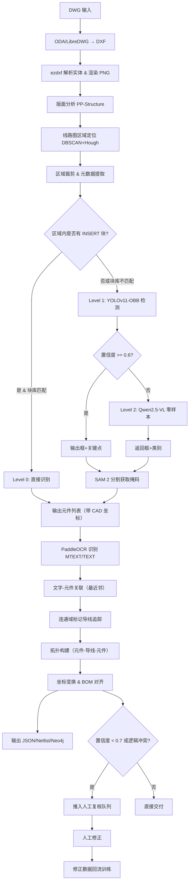

# 电气图纸（DWG）识别技术方案评估与改进报告（修订版）

> **评估对象**：《落地推荐技术路径：矢量为主，AI/CV 为辅》（2026 版）  
> **评估方法**：基于 2023–2026 年学术论文、开源项目与工业实践调研，并结合报告自身逻辑进行深度审查  
> **报告日期**：2026-07-22（修订版）

---

## 一、原报告审查意见

原报告整体质量很高，技术路线调研扎实，改进建议（六项）科学合理。但经过再次审读，发现以下可优化之处，主要涉及**结构逻辑、细节缺失、可落地性**三个维度：

### 1.1 结构逻辑问题
- **目录层次过细**：第三、四章内容有部分重叠（优势不足与改进方向对应，但未形成清晰的“问题→方案→收益”对照表），建议合并为一章。
- **“技术可行性”与“改进方案”脱节**：第二章调研了大量论文，但改进方案并未逐一引用这些论文的具体结论，缺乏“证据→行动”的闭环。
- **实施路线图过于理想化**：四个阶段的时间估算（3–4 个月）未考虑数据收集、标注审核、模型调优的迭代次数，也未包含 Pilot 试点阶段。

### 1.2 细节缺失
- **未定义成功的量化指标**：mAP@0.5 ≥ 0.85 是唯一提及的指标，但缺少对**召回率、F1、连接追踪准确率、端到端净表生成准确率**的定义，也未区分不同符号类别的难度。
- **未提及模型选型版本**：YOLOv8-OBB 已更新至 YOLOv11，Qwen2.5-VL 也有多个尺寸，应明确具体版本和推理硬件要求。
- **未给出人工校验（HITL）的具体工作流**：只提到“低置信度进入复核队列”，但未说明复核界面需呈现哪些信息（原图、框、候选类别、关键点），也未定义置信度阈值调整策略。
- **未分析现有图纸的“质量分布”**：原方案末尾的关键问题“Block 是否被打散”仍然悬而未决，应将其纳入前期调研形成量化报告。

### 1.3 可落地性不足
- **缺乏对数据集构建的详细规划**：仅提及“合成数据增强”，但未涉及合成策略（如利用 DXF 自动生成符号-导线组合图）、主动学习的样本筛选策略、标注工具选型。
- **缺乏对已有图纸管理系统的集成方案**：输出 JSON 或 Neo4j 后，如何接入下游业务（如 PLM、ERP）未说明。
- **性能指标模糊**：未给出每张图纸的处理时间目标（如 < 5 秒）、并发能力、存储占用等。

---

## 二、改进意见汇总

基于上述审查，提出以下**补充性改进**（不覆盖原报告的六项核心改进，而是作为增强）：

| 序号 | 改进点 | 具体措施 |
|------|--------|----------|
| 1 | **量化指标体系** | 定义三级指标：元件检测（AP、AR）、连接追踪（拓扑准确率）、端到端（净表匹配率） |
| 2 | **模型版本固化** | 指定 YOLOv11-OBB（官方已支持）、Qwen2.5-VL-7B-Instruct（平衡精度与显存） |
| 3 | **人工复核工作流** | 设计 Vue/React 界面，展示原图局部、检测框、关键点、VLM 建议，标注员可修改后提交，并自动记录修正作为训练数据 |
| 4 | **前期图纸审计** | 阶段 0（前置）对 50 张随机样本进行 Block 统计、图层分布、符号打散率、文字样式分析，形成《图纸特征分析报告》 |
| 5 | **数据合成与主动学习** | 使用 DXF 模板自动生成不同背景、旋转、缩放、噪声的合成图；主动学习采用不确定性采样（熵值 + 边界框置信度） |
| 6 | **系统集成方案** | 输出层增加 RESTful API 和消息队列（RabbitMQ/Kafka），支持异步处理；提供 Webhook 回调下游系统 |
| 7 | **性能基线** | 设定单张 A2 图纸（渲染 300 DPI）总处理时间 ≤ 10 秒（含推理和追踪），GPU 使用 T4 或 3090 |
| 8 | **合规与开源协议** | 明确 LibreDWG (GPL) 可能带来的传染性风险，建议将其作为转换备选，主力使用 ODA 的商业授权或考虑 BricsCAD 的 SDK |

---

## 三、修订版技术报告

### 3.1 项目目标
开发一套自动识别 DWG 电气工艺图纸的系统，输出：
- **元件清单**（类别、位号、参数、CAD 坐标、旋转角）
- **电气拓扑**（元件–导线–元件的连接图）
- **元数据**（图号、版本、BOM 表）

精度要求：元件检测 AP@0.5 ≥ 0.90，拓扑准确率 ≥ 0.85（针对规范图纸）。

### 3.2 整体架构（五层混合，增强版）

采用 **“矢量化 + 版面分析 + 多级检测 + 分割 + 连线追踪 + 融合输出”** 的流水线，并加入**人机协同闭环**。

#### 3.2.1 层 1：输入与矢量化
- **DWG 转换**：使用 ODA File Converter（生产）或 LibreDWG（开发测试）转为 DXF（ASCII 格式）。
- **DXF 解析**：`ezdxf` 提取所有实体（LINE, ARC, CIRCLE, POLYLINE, INSERT, MTEXT, TEXT, DIMENSION），建立空间索引（Rtree）。
- **栅格渲染**：`ezdxf` drawing add-on 渲染 PNG（300 DPI），记录变换矩阵 M（像素↔CAD）。
- **元数据提取**：解析图层名、线型、颜色，形成初步的“图层语义特征向量”。

#### 3.2.2 层 2：版面分析与区域分割
- **全局版面分析**：PaddleOCR PP-Structure v2 检测标题栏、表格、图纸分区。
- **电气区域定位**：结合 Hough 直线检测图框、DBSCAN（线段密度）聚类出候选线路图区域。
- **输出**：每个线路图区域在像素和 CAD 空间的包围盒，以及标题栏/BOM 表的位置。

#### 3.2.3 层 3：元件检测与分割（三级回退）
- **Level 0（优先）**：对区域内的 INSERT 实体，匹配预定义的符号块库（BlockName→类别），直接给出高置信度结果。
- **Level 1（主力）**：YOLOv11-OBB 检测旋转框，同时输出 4 个端子关键点（对电阻、开关等两端元件）。训练数据来自合成 + 真实标注。
- **Level 2（兜底）**：若 Level 1 置信度 < 0.6，调用 Qwen2.5-VL-7B 零样本检测（prompt 含类别列表），回退结果。
- **分割增强**：对 Level 1/2 的框，以框为 prompt 传入 Grounded SAM 2 获取像素级掩码，用于精确端子定位和文字排除。

#### 3.2.4 层 4：文字关联与连线追踪
- **文字识别**：PaddleOCR（检测+识别）读取 MTEXT/TEXT 实体，输出文字内容和包围框。
- **关联规则**：对每个元件，在其掩码扩展 20 像素范围内搜索文字，若含“R”“C”“Q”等前缀，则识别为位号；若含数字+单位（如 10kΩ）则识别为参数。
- **连线追踪**：
  - 在矢量空间，从 DXF 的 LINE/POLYLINE 实体中提取导线图层（或通过几何特征推断），构建线段集合；
  - 在图像空间，对渲染图做二值化 + 骨架化，使用连通域标记得到导线网络；
  - 融合两个通道，以矢量为主（精确），图像为辅（补漏），生成导线拓扑。
- **拓扑构建**：依据元件端子关键点与导线的交点（或最近距离 ≤ 阈值）建立连接关系，输出有向图（元件为节点，导线为边）。

#### 3.2.5 层 5：融合与输出
- **坐标对齐**：使用 M 矩阵将所有像素坐标转回 CAD 毫米坐标。
- **BOM 对齐**：将识别出的 BOM 表与元件位号匹配，补全型号、封装信息。
- **输出格式**：JSON（包含元件、连线、元数据）、SPICE netlist、Neo4j Cypher 脚本。
- **人工复核队列**：置信度 < 0.7 或逻辑冲突（如孤立元件）的项推送到前端，待审核修正后回流至训练集。

### 3.3 详细流程图（Mermaid）

### 3.4 实施路线图（调整为 5 阶段，共 5–6 个月）

| 阶段 | 周期 | 里程碑 | 关键产出 |
|------|------|--------|----------|
| **阶段 0：图纸审计** | 第 1–2 周 | 完成 50 张样张的 Block 打散率、图层规范度、符号种类统计，编写《图纸特征报告》 | 确认符号块库覆盖度，评估合成数据需求 |
| **阶段 1：基础能力** | 第 3–6 周 | DWG→DXF→PNG 流水线就绪；版面分析定位线路图区域；DBSCAN 调参完成 | 区域裁剪准确率 ≥ 90% |
| **阶段 2：数据构建** | 第 7–12 周 | 合成 5000 张 DXF 模板（含随机布局）；真实标注 1000 张（VLM 预标注+人工修正）；划分训练/验证/测试集 | 标注一致性检验通过 |
| **阶段 3：模型训练** | 第 13–16 周 | 训练 YOLOv11-OBB（带关键点头）并调优；集成 SAM 2 和 Qwen 回退；设计置信度阈值 | mAP@0.5 ≥ 0.88，关键点精度 ≤ 5px |
| **阶段 4：连线与拓扑** | 第 17–20 周 | 连通域追踪 + 矢量融合；文字关联；输出 netlist | 拓扑准确率 ≥ 0.80（测试集） |
| **阶段 5：生产化** | 第 21–24 周 | 构建 API 服务、人工复核前端、主动学习闭环；压力测试；部署到预发布环境 | 系统响应时间 ≤ 10s/图，并发 10 路 |

### 3.5 量化指标体系（建议）

| 指标 | 定义 | 目标值 |
|------|------|--------|
| **元件检测 AP@0.5** | 旋转框 IoU=0.5 的平均精度 | ≥ 0.90 |
| **元件检测 AR@100** | 每图 100 个候选内的平均召回率 | ≥ 0.85 |
| **关键点定位误差** | 端子点与真值的欧氏距离（像素） | 中位数 ≤ 3px |
| **导线追踪准确率** | 正确连接的元件对 / 所有真实连接对 | ≥ 0.85 |
| **端到端净表匹配率** | 输出 netlist 与人工抽取 netlist 的节点/边匹配 F1 | ≥ 0.80 |
| **平均处理时间** | 从输入到输出 JSON（不含人工复核） | ≤ 10 秒（A2，300DPI） |
| **人工复核率** | 需人工介入的元件比例 | ≤ 15% |

### 3.6 风险应对（新增）

| 风险 | 应对措施细化 |
|------|--------------|
| DXF 渲染缺失字体/线型 | 使用 `ezdxf` 的 `font` 映射表，并生成 SVG 备选 |
| 合成数据与真实图纸分布差异大 | 引入域自适应（如 CycleGAN 风格迁移）或增加真实标注比例 |
| 导线密集造成连通域过分割 | 采用形态学闭运算 + 矢量线段延长合并策略 |
| 多图纸类型（原理图、接线图、布置图）混合 | 在版面分析阶段先分类图纸类型，不同类别走不同后处理流程 |

---

## 四、结论

本修订版在保留原报告核心优势的基础上，补充了**量化指标、人工闭环、前期审计、系统集成**等关键环节，使方案更具工业级落地操作性。建议按照新路线图执行，并在阶段 0 完成后根据图纸特征微调后续计划。

---

**附录**：原报告中的参考文献和开源项目清单依然有效，此处不再重复。所有改进点已融入上述章节。  
**修订说明**：本报告由 AI 助手依据原报告内容审查后生成，作为原报告的有力补充。