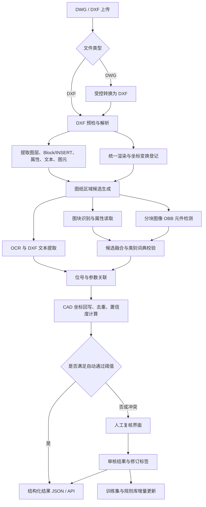

# 电气图纸元件识别可行技术方案

> **版本**：V1.0  
> **日期**：2026-07-23  
> **目标**：从 DWG/DXF 电气图纸中识别电阻、开关及可扩展电气元件，输出元件类别、位号/参数、方向、图纸位置和可追溯证据；对不确定结果提供人工复核闭环。

---

## 1. 结论与范围

三份输入报告中，Gemini 版给出了正确的基础方向，GLM 版补充了重要的工程能力；DeepSeek 版文件当前为空，无法作为可评审依据。

建议采用**“DXF 矢量解析优先 + 渲染图像检测兜底 + OCR/文本实体关联 + 置信度复核”**的混合路线。它保留 CAD 原始坐标的可追溯性，并兼容图块与由基本图元打散的符号。

第一期只交付**元件信息与位置识别**，不以自动生成完整 netlist 为验收目标。连线追踪、BOM 一致性校验和图数据库在元件检测稳定后作为第二期能力逐步加入。这样能控制数据标注、导线交叉判定与跨页连接等高风险问题。

### 1.1 第一期输入与输出

**输入**

- DWG 或 DXF 文件；优先支持模型空间中的二维原理图。
- 可选：图框、BOM、既有图块命名规范和符号标准样本。

**输出**

```json
{
  "drawing_id": "B电气图",
  "components": [
    {
      "id": "cmp_001",
      "type": "resistor",
      "reference": "R1",
      "value": "10kΩ",
      "cad_center": {"x": 1250.30, "y": 846.10},
      "cad_bbox": [[1238.2, 840.0], [1262.4, 852.2]],
      "rotation_deg": 90,
      "source": "block|vision|fusion",
      "confidence": 0.98,
      "evidence": {"block_name": "RESISTOR", "text_ids": ["txt_013"]},
      "review_status": "approved|pending|rejected"
    }
  ]
}
```

坐标单位、坐标系、DXF 版本、转换工具版本与原文件哈希必须进入任务元数据，保证结果可复现。

### 1.2 第一阶段支持的元件类别

从高频、清晰、易标注的类别开始：`resistor`、`switch`（常开/常闭需单独类别）、`fuse`、`relay`、`connector`、`capacitor`、`diode`、`terminal`。类别字典必须由项目样本图纸和采用的电气制图标准确认后冻结；未知符号统一输出为 `unknown_symbol` 并进入复核。

---

## 2. 三份报告的评审结论

| 来源 | 可采用内容 | 需要调整或暂缓内容 |
|---|---|---|
| Gemini 版 | DWG 先转换为 DXF；提取图层、Block/INSERT、文字及图元；图块优先、视觉兜底；图像到 CAD 的坐标映射；文本邻近关联。 | 图层名不可作为主判定条件，只能作为弱特征；“Block 精度 100%”应改为“坐标精确、语义依赖图块词典与属性完整性”；DBSCAN 不能单独承担版面划分。 |
| GLM 版 | OBB/端子方向的重要性；VLM 适合冷启动和疑难复核；低置信度人工复核；BOM/标题栏有后续价值；建议按阶段落地。 | 当前目标只是元件及位置，不应把连线追踪、SAM、Neo4j、SPICE netlist 都放进 MVP；YOLOv8-OBB 与关键点检测通常需要独立模型或自定义多任务实现，不能表述为开箱即用的单一能力；“3–4 个月达到 99%+”没有数据集和验收定义支撑；引用、许可证与模型可用性需在选型实施时逐项核验。 |
| DeepSeek 版 | 无。 | 文件为空，需补充内容后才能纳入后续评审。 |

### 2.1 关键技术判断

1. **矢量通道是定位与审计的主通道。** DXF 内 `INSERT`、`ATTRIB`、`TEXT`、`MTEXT` 的坐标比视觉模型稳定；`LINE`、`LWPOLYLINE`、`ARC` 等图元也能为视觉结果提供校验。
2. **视觉通道解决“未打块/非标准画法”。** 使用高分辨率分块渲染后的 OBB 检测模型，而不是让通用 VLM 承担批量精确检测。
3. **VLM 是辅助，不是生产主路径。** 用于少样本预标注、图层/区域语义辅助、YOLO 低置信度复核和人工审核说明；其输出必须受 JSON Schema、裁剪区域和规则校验约束。
4. **先做元件，再做拓扑。** 导线交叉、跳线、跨页连接、端子和符号内部线会使连通性恢复显著复杂。需先以“元件识别准确率、位号关联准确率、CAD 坐标误差”为核心指标。
5. **人机协同是生产能力的一部分。** 自动通过高置信度结果，低置信度、冲突和未知类别进入复核队列，修订结果沉淀为下一轮训练集。

---

## 3. 总体架构



### 3.1 模块职责

| 模块 | 第一阶段实现 | 关键约束 |
|---|---|---|
| 文件接入 | 文件哈希、格式白名单、DWG 转 DXF、任务记录 | DWG 转换器要隔离运行；商用授权、部署方式和可支持 DWG 版本在选型时确认。 |
| DXF 解析 | 使用 `ezdxf` 读取实体、块定义、属性、布局、单位和范围 | `ezdxf` 解析 DXF，不直接承担 DWG 解析；转换失败应返回明确状态。 |
| 坐标服务 | 记录 CAD 范围、渲染尺寸、缩放、Y 轴翻转和裁剪偏移 | 不假设单一仿射参数覆盖所有布局；分块结果先回写至整图像坐标，再映射 CAD。 |
| 图块识别 | `INSERT` + Block 名称词典 + `ATTRIB` 属性解析 | 未知 Block 不直接映射到业务类别；保留原始名称与证据。 |
| 图像检测 | 切片、重叠、OBB 检测、跨切片去重 | 图纸通常超大，不能直接等比缩小整图后检测；训练/推理需使用相同 DPI 和切片策略。 |
| 文字关联 | DXF 原生文字优先，OCR 补充；距离、方向、引线与规则评分 | 不以“最近文本”作为唯一规则，避免将相邻元件位号错误绑定。 |
| 融合与复核 | 证据保留、置信度融合、冲突入队、审核回写 | 不用不同来源的置信度直接相加；需用标注验证集校准阈值。 |

---

## 4. 识别流程设计

### 4.1 预处理与坐标映射

1. 对上传文件计算 SHA-256，创建识别任务和不可变输入记录。
2. DWG 通过已批准的转换器转换为 DXF；保留原 DWG、DXF 和转换日志。
3. 解析 DXF 的模型空间与布局，记录 `$INSUNITS`、实体范围、图层、文字、Block 和 INSERT。
4. 分布局渲染高 DPI 图像，并将渲染参数写入 `CoordinateTransform`：

$$
X_{cad}=X_{min}+\frac{x_{px}}{s_x},\qquad
Y_{cad}=Y_{max}-\frac{y_{px}}{s_y}
$$

其中 $s_x,s_y$ 是像素/图纸单位缩放比例。若渲染时发生裁剪、旋转或非等比缩放，则记录完整仿射矩阵并使用矩阵逆变换，不能只套用上式。

5. 依据图框、实体密度、文字/表格区域和可配置图层权重形成候选区域；图层名称与 DBSCAN 都仅作候选特征，不作为硬编码前提。

### 4.2 元件候选生成与融合

**路径 A：矢量图块识别（优先）**

- 遍历 `INSERT`；将 Block 名称经可版本化的别名词典映射至标准类别。
- 读取 `ATTRIB`、扩展属性及插入变换，计算插入点、外接范围和旋转方向。
- 将“已知词典命中 + 合法属性/几何”标为高置信度；仅名称模糊或块定义异常时进入复核。

**路径 B：图像 OBB 检测（兜底）**

- 以固定物理尺度或像素尺度切片，使用约 10%–20% 重叠避免边界漏检。
- 用 OBB 检测器输出类别、旋转框和置信度；通过旋转 IoU 和中心距离合并跨切片候选。
- 第一版只使用 OBB。端子关键点只有在后续确实要做连接关系、且已准备端子级标注时再以独立关键点模型实施。

**融合规则**

- 同位置图块与视觉类别一致：以图块的 CAD 几何为主，提升置信度。
- 图块存在但名称未知：保留为未知候选，允许视觉分类提供建议，不覆盖原始证据。
- 视觉候选未与图块重叠：作为非规范符号候选输出。
- 图块与视觉类别冲突：不自动决策，送人工复核。

### 4.3 位号与参数关联

优先级为：`ATTRIB` → DXF `TEXT/MTEXT` → OCR 文字。对每个元件在局部搜索窗口内计算文本关联评分：

$$
Score(c,t)=w_d\cdot f(\text{distance})+w_o\cdot f(\text{relative direction})+w_r\cdot f(\text{reference pattern})+w_l\cdot f(\text{leader relation})
$$

- `reference pattern` 由元件类别限定，如电阻优先匹配 `R\d+`，开关优先匹配 `S\d+`、`SA\d+` 等经业务确认的规则。
- 若最高分与次高分过近、文本被多个元件竞争或文本不符合格式，关联状态为 `pending`。
- 结果必须保存候选文本、评分和最终选择，供复核追溯。

### 4.4 置信度和审核策略

| 结果 | 条件示例 | 处理 |
|---|---|---|
| 自动通过 | 已知图块词典命中、属性有效、无视觉冲突；或视觉检测经校准后高置信且文本关联唯一 | 标记 `approved`，允许人工抽检。 |
| 待复核 | 视觉置信度中等、文字关联歧义、未知图块、相邻符号重叠 | 标记 `pending`，显示图纸裁剪、原始实体和所有证据。 |
| 冲突复核 | 图块和视觉类别不一致、同一位号重复、坐标映射越界 | 标记 `pending` 并标记冲突原因。 |
| 拒绝 | 人工确认不是目标元件或为重复检出 | 标记 `rejected`，保存原因用于规则和训练数据治理。 |

阈值不可写死。应使用独立验证集进行概率校准后，按类别分别配置自动通过阈值，并根据复核量和误识别成本调整。

---

## 5. 数据、模型与评测

### 5.1 数据建设路线

1. 收集覆盖实际来源、图框、比例、图层习惯、扫描质量和符号方向的代表性 DXF/DWG 样本；按“图纸”而非“切片”划分训练/验证/测试集，避免泄漏。
2. 先执行 Block 统计，确认规范块占比、块名称长尾、文本属性完整率和打散符号比例。这是评估标注成本的首要工作。
3. 用图块实例生成初始候选标注，用 VLM 只做非标符号预标注；由人工在原始 CAD/渲染图上校正。
4. 对视觉数据做旋转、缩放、线宽、噪点、压缩和局部遮挡增强，但不得改变位号与元件关系。
5. 采用主动学习：优先抽取低置信度、冲突、高业务价值和模型分歧样本进行审核和回流。

### 5.2 建议验收指标

| 指标 | 说明 | 第一阶段建议目标 |
|---|---|---|
| 元件检测召回率 | 测试图纸中目标元件被发现的比例 | 高频类别 ≥ 95% |
| 元件检测精确率 | 自动输出中真实目标元件比例 | 高频类别 ≥ 95% |
| 类别准确率 | 已匹配候选类别正确比例 | 高频类别 ≥ 95% |
| 位号关联准确率 | 元件绑定正确位号比例 | ≥ 90%，歧义项必须进入复核 |
| CAD 中心坐标误差 | 与人工/矢量真值的距离 | 图块路径为 0 或接近数值误差；视觉路径按图纸单位另行约定阈值 |
| 自动通过错误率 | `approved` 结果中错误比例 | ≤ 1%，以独立测试集和抽检计算 |
| 复核率 | 进入人工复核的输出比例 | 初期允许较高，随模型迭代下降；不能以压低复核率牺牲错误率 |

“99% 准确率”必须明确到类别、指标、测试集范围和自动通过/人工修订口径，不能作为未定义的总体承诺。

---

## 6. 分期实施计划

### P0：样本审计与技术验证（1–2 周）

- 解析现有样本图纸，输出 Block、图层、文字实体、实体类型与布局统计。
- 验证选定转换器对样本 DWG 的版本兼容性、许可和可部署性。
- 完成 DXF 渲染及像素/CAD 坐标往返校验。
- 交付：样本审计报告、元件词典草案、风险清单、最小 JSON Schema。

**准入条件**：能稳定解析样本；明确规范块占比和至少 6 类目标元件的标注定义。

### P1：矢量优先 MVP（2–3 周）

- 实现上传、转换、DXF 解析、Block/属性识别、文字关联、结果查询和任务进度。
- 将未知 Block、缺属性和冲突结果纳入审核队列。
- 交付：可处理规范图块图纸的端到端服务与审核数据模型。

### P2：非标准符号视觉兜底（4–6 周）

- 建立标注规范、首批训练集和独立测试集。
- 训练/评测 OBB 检测器，接入切片推理、去重和坐标回写。
- 接入 OCR 补充路径，并用融合规则输出证据与置信度。
- 交付：支持打散符号的检测能力及基线评测报告。

### P3：复核闭环与生产化（2–4 周）

- 在管理端增加图纸叠加标注、属性编辑、通过/拒绝/冲突处理和审核留痕。
- 使用审核结果建立数据版本和再训练流程；监控处理耗时、失败率、复核率和自动通过错误率。
- 交付：可运营的识别、审核与迭代闭环。

### P4：可选增强（后续）

- BOM/标题栏结构化与一致性校验。
- 元件端子关键点、矢量导线追踪、跨页连接和拓扑图。
- 在拓扑准确率达到独立验收门槛后，才考虑 Netlist 或图数据库输出。

---

## 7. 项目落地边界与代码组织建议

当前工作区已有后端 FastAPI、管理端 Next.js、上传、后台任务、SSE 进度及审核状态模式；这些应复用，但识别领域代码应独立于本体抽取逻辑。

建议新建如下逻辑边界（具体目录会在代码实施时按既有项目约定落定）：

```text
src/drawing_recognition/
  ingest/          # 文件校验、转换器适配、任务输入
  cad/             # DXF 实体解析、图块与坐标变换
  rendering/       # 渲染、切片、叠加可视化
  recognition/     # 图块规则、检测器、OCR 适配器
  fusion/          # 候选去重、文字关联、置信度与证据
  domain/          # Pydantic 领域模型与 JSON Schema
  evaluation/      # 数据集、指标和回归评测
  data/            # 样本与受控数据索引，不提交大模型权重

src/backend/modules/
  drawing_recognition.py  # 上传、任务、查询、审核 API 适配层

src/admin/src/components/
  DrawingRecognitionManager.tsx
  DrawingReviewWorkspace.tsx
```

- 上传、任务进度和 SSE 可以沿用现有后端模块模式；大图转换和模型推理不得长期依赖 FastAPI 进程内后台任务，P1/P2 先抽象任务接口，生产负载增加后切换独立 Worker/队列。
- 管理端负责上传、任务监控和人工复核；用户侧前端不承载重型标注管理。
- 模型权重、原始图纸和转换产物应使用对象存储或受控文件存储，不进入代码仓库。

---

## 8. 主要风险与控制

| 风险 | 控制措施 |
|---|---|
| DWG 兼容性与商业许可 | 在 P0 用真实样本验证转换器；法务确认转换器和模型许可证；保留可替换适配层。 |
| 图纸规范参差不齐 | Block 统计先行；不依赖固定图层名；非规范图纸走视觉与人工复核。 |
| 超大图纸导致漏检 | 固定尺度切片、重叠推理、跨片去重；保存切片与坐标变换证据。 |
| 文字错配 | 原生 DXF 文本优先、多特征评分、类别正则约束、歧义不自动通过。 |
| 模型数据不足 | 图块弱监督、人工校正、主动学习；按图纸来源拆分测试集。 |
| 坐标失真 | 进行至少四个已知锚点的往返校验；每次渲染都记录矩阵和裁剪参数。 |
| 一期范围膨胀 | 将拓扑、SAM、VLM 深度集成、Neo4j 与 Netlist 设为 P4，不阻塞元件识别 MVP。 |

---

## 9. 下一步

1. 对现有 [样本 DWG](../data/B电气图.dwg) 执行 P0 图纸审计，确认其 Block、文字、图层和可转换性。
2. 与业务方确认首批元件类别、位号命名规则、坐标单位、验收测试集及复核责任人。
3. 基于本方案先实现 P1 矢量优先 MVP，再根据 P0 的打散符号比例决定 P2 标注和模型训练规模。
